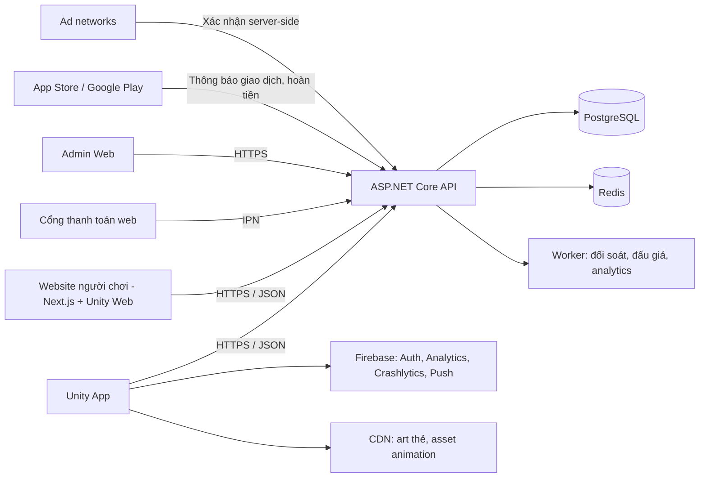

# ANIMA: Echoes of the Heart
## Master Document — Dự án App Thẻ bài Số hóa

**Version:** 1.2
**Ngày tạo:** 2026-10-05
**Cập nhật:** 2026-10-06 — v1.1: thêm mục 9 Kiến trúc & Tech Stack. v1.2: mô hình tài sản số (mục 2.4, 5.7) theo CR-002
**Trạng thái:** Concept & Design Phase

---

## MỤC LỤC

1. [Tổng quan dự án](#1-tổng-quan-dự-án)
2. [Mô hình kinh doanh](#2-mô-hình-kinh-doanh)
3. [Tính năng chính (Feature Set)](#3-tính-năng-chính-feature-set)
4. [Thiết kế Animation Mở Pack](#4-thiết-kế-animation-mở-pack)
5. [Hệ thống Kinh tế & Nhiệm vụ](#5-hệ-thống-kinh-tế--nhiệm-vụ)
6. [Tổng hợp BRD](#6-tổng-hợp-brd)
7. [Thiết kế IP & Câu chuyện](#7-thiết-kế-ip--câu-chuyện)
8. [Roadmap & Next Steps](#8-roadmap--next-steps)
9. [Kiến trúc & Tech Stack](#9-kiến-trúc--tech-stack)

---

# 1. TỔNG QUAN DỰ ÁN

## 1.1. Tên dự án
**ANIMA: Echoes of the Heart**

## 1.2. Mô tả ngắn
Nền tảng mobile cho phép người dùng mua, mở, sưu tầm và giao dịch thẻ bài kỹ thuật số. Trải nghiệm mở pack được thiết kế để tái tạo cảm giác hồi hộp của việc mở thẻ bài vật lý, kết hợp với lợi thế của số hóa: xác thực tức thì, giao dịch toàn cầu, không lo hỏng/mất.

## 1.3. Điểm khác biệt cốt lõi
- **IP gốc** — Không phụ thuộc bản quyền bên thứ ba
- **Hệ thống cảm xúc** thay vì hệ nguyên tố vật lý
- **Câu chuyện sâu sắc** — Không chỉ dành cho trẻ em
- **Kinh tế F2P bền vững** — User có thể kiếm tiền qua quảng cáo và nhiệm vụ
- **Trải nghiệm mở pack cinematic** — Đầu tư mạnh vào animation và cảm xúc

## 1.4. Đối tượng người dùng
- Người sưu tầm thẻ bài (Millennials, Gen Z)
- Người chơi free muốn trải nghiệm không trả phí
- Nhà đầu tư thẻ bài kỹ thuật số

---

# 2. MÔ HÌNH KINH DOANH

## 2.1. Nguồn thu

| Nguồn thu | Mô tả | Tỷ lệ doanh thu dự kiến |
|---|---|---|
| Bán pack | Gem/Coin | 60% |
| Quảng cáo | Rewarded video | 25% |
| Phí giao dịch | 5-10% mỗi giao dịch | 10% |
| Battle Pass | Theo mùa | 5% |
| Phí rèn (CR-002) | 2 thẻ + phí → 1 thẻ chưa lật | Chưa ước tính |
| Royalty bán lại NFT, phí rút NFT (CR-002, R2) | 5% mỗi lần NFT đổi chủ ở sàn hỗ trợ ERC-2981; phí khi rút | Chưa ước tính |

## 2.2. Chia sẻ doanh thu quảng cáo
- 40-50% cho user (dưới dạng tiền trong app)
- 50-60% app giữ (server, phát triển, lợi nhuận)

## 2.3. Nguyên tắc tài chính
- User **không thể rút tiền ra** — tránh bị coi là cờ bạc
- Tiền trong app chỉ dùng để mua pack
- Công khai tỷ lệ rơi thẻ (minh bạch)
- (CR-002) **Công ty không mua lại thẻ** bằng tiền thật hay tiền mã hóa, không cam kết giá, không hứa lợi nhuận

## 2.4. Mô hình tài sản số (CR-002)

| Thành phần | Mô tả | Release |
|---|---|---|
| Thẻ là tài sản duy nhất | Mỗi thẻ có serial duy nhất và số thứ tự trong edition (`#37/100`) | R1 |
| Số lượng phát hành giới hạn theo mùa | Độ hiếm đến từ số bản có hạn; mùa đóng thì set đóng vĩnh viễn; không hạ tỷ lệ ngầm | R1 |
| Kiểm chứng công bằng (commit–reveal) | Người chơi tự tính lại được kết quả mở pack và lật thẻ rèn | R1 |
| Lò rèn | 2 thẻ bất kỳ + phí (Coin hoặc Gem) → 1 thẻ chưa lật, tỷ lệ công khai, không có yếu tố tác động | R1 |
| Quy đổi Gem ↔ Coin | Hai chiều, có phí và hạn mức | R1 |
| NFT | Rút thẻ về ví riêng (ERC-721), bán ở sàn ngoài, công ty nhận royalty; nạp lại để chơi | R2, sau gate pháp lý |

Giá: **1 pack 5 thẻ = $1** (100 Gem hoặc 1,000 Coin). Chi tiết quy tắc ở BRD mục 10.12 → 10.15.

---

# 3. TÍNH NĂNG CHÍNH (FEATURE SET)

## 3.1. Module Tài khoản & Xác thực

| ID | Tính năng | Mô tả | Ưu tiên |
|---|---|---|---|
| FR-01 | Đăng ký | Email, SĐT, hoặc social login | Must |
| FR-02 | Đăng nhập | Email/password, OTP, social login | Must |
| FR-03 | Quên mật khẩu | Reset qua email/SĐT | Must |
| FR-04 | Xác thực SĐT | OTP — chống multi-account | Must |
| FR-05 | Profile cá nhân | Avatar, tên, bio, bộ sưu tập công khai | Should |
| FR-06 | Quản lý thiết bị | Giới hạn 1 tài khoản/thiết bị | Must |

## 3.2. Module Ví & Tiền tệ

| ID | Tính năng | Mô tả | Ưu tiên |
|---|---|---|---|
| FR-07 | Ví trong app | Hiển thị số dư Gem + Coin | Must |
| FR-08 | Nạp tiền (Gem) | Qua IAP, thẻ cào, ví điện tử | Must |
| FR-09 | Lịch sử giao dịch | Xem toàn bộ giao dịch | Must |
| FR-10 | Chuyển đổi Gem ↔ Coin | Tỷ lệ cố định, có phí | Should |

## 3.3. Module Mở Pack (Core Feature)

| ID | Tính năng | Mô tả | Ưu tiên |
|---|---|---|---|
| FR-11 | Mua pack | Bằng Gem hoặc Coin | Must |
| FR-12 | Mở pack — animation | 6 giai đoạn | Must |
| FR-13 | Animation theo rarity | Common → Secret Rare | Must |
| FR-14 | Slow-mo cho Epic+ | Time scale 0.3 trong 0.5s | Must |
| FR-15 | Screen flash + shake | Cho Legendary+ | Must |
| FR-16 | Particle system | 6 loại particle theo rarity | Must |
| FR-17 | Sound design | Layer system, 20+ sound | Must |
| FR-18 | Haptic feedback | Pattern riêng cho từng rarity | Should |
| FR-19 | Skip / Fast mode | Cho người dùng mở nhiều pack | Must |
| FR-20 | Auto-reveal | Tự động lật thẻ | Should |
| FR-21 | Share kết quả | Chia sẻ lên MXH, lưu video | Should |

## 3.4. Module Bộ sưu tập

| ID | Tính năng | Mô tả | Ưu tiên |
|---|---|---|---|
| FR-22 | Album/Binder số | Trưng bày thẻ | Must |
| FR-23 | Tiến độ hoàn thành set | "45/100 thẻ" | Must |
| FR-24 | Tìm kiếm & lọc | Theo tên, hệ, rarity, giá trị | Must |
| FR-25 | Thẻ 3D/AR | Xem hologram qua camera | Could |
| FR-26 | Profile công khai | Link chia sẻ bộ sưu tập | Should |

## 3.5. Module Chợ giao dịch

| ID | Tính năng | Mô tả | Ưu tiên |
|---|---|---|---|
| FR-27 | Đăng bán thẻ | Đặt giá, thời gian bán | Must |
| FR-28 | Mua thẻ P2P | Mua bằng Gem/Coin | Must |
| FR-29 | Đấu giá | Phiên đấu giá cho thẻ hiếm | Should |
| FR-30 | Định giá tự động | Gợi ý giá | Should |
| FR-31 | Lịch sử giao dịch | Minh bạch | Must |
| FR-32 | Phí giao dịch | 5-10% mỗi giao dịch | Must |
| FR-33 | Chống gian lận | Detect bot, multi-account | Must |

## 3.6. Module Nhiệm vụ & Kiếm tiền

| ID | Tính năng | Mô tả | Ưu tiên |
|---|---|---|---|
| FR-34 | Điểm danh hàng ngày | Streak 7/14/30/100 ngày | Must |
| FR-35 | Xem quảng cáo rewarded | Tối đa 10 ads/ngày | Must |
| FR-36 | Nhiệm vụ hàng ngày | Mở pack, mua thẻ, chia sẻ | Should |
| FR-37 | Referral | Mời bạn bè | Should |
| FR-38 | Achievement | Thành tựu dài hạn | Could |
| FR-39 | Battle Pass | Theo mùa | Should |

## 3.7. Module Cộng đồng

| ID | Tính năng | Mô tả | Ưu tiên |
|---|---|---|---|
| FR-40 | Feed | Xem hoạt động người khác | Should |
| FR-41 | Follow | Theo dõi người sưu tầm | Should |
| FR-42 | Chat/DM | Trao đổi | Could |
| FR-43 | Leaderboard | Top sưu tầm | Should |
| FR-44 | Sự kiện & giải đấu | "Tuần lễ thẻ rồng" | Could |

## 3.8. Module Quảng cáo & Doanh thu

| ID | Tính năng | Mô tả | Ưu tiên |
|---|---|---|---|
| FR-45 | Tích hợp ad network | AdMob, Unity Ads, AppLovin | Must |
| FR-46 | Rewarded video | User xem → nhận tiền | Must |
| FR-47 | Ad mediation | Tối ưu eCPM | Should |
| FR-48 | Chống gian lận ad | Detect bot, emulator, VPN | Must |
| FR-49 | Báo cáo doanh thu | Dashboard admin | Must |

## 3.9. Module Admin

| ID | Tính năng | Mô tả | Ưu tiên |
|---|---|---|---|
| FR-50 | Quản lý người dùng | Xem, khóa, ban | Must |
| FR-51 | Quản lý thẻ | Thêm/sửa/xóa thẻ | Must |
| FR-52 | Quản lý pack | Tạo pack, cấu hình drop rate | Must |
| FR-53 | Quản lý giao dịch | Xử lý tranh chấp | Must |
| FR-54 | Dashboard | DAU, MAU, doanh thu | Must |
| FR-55 | Cấu hình kinh tế | Điều chỉnh tỷ lệ thưởng | Must |

## 3.10. Non-Functional Requirements

| ID | Yêu cầu | Tiêu chuẩn |
|---|---|---|
| NFR-01 | Hiệu năng | 60fps tầm trung, 120fps flagship |
| NFR-02 | Thời gian tải | Khởi động < 3s, mở pack < 1s |
| NFR-03 | Bảo mật | AES-256, HTTPS |
| NFR-04 | Khả năng mở rộng | 100,000 CCU |
| NFR-05 | Uptime | 99.9% |
| NFR-06 | Tương thích | iOS 14+, Android 8+ |
| NFR-07 | Kích thước app | < 200MB |
| NFR-08 | Ngôn ngữ | Tiếng Việt, Anh |
| NFR-09 | Accessibility | Screen reader, font size |
| NFR-10 | Offline mode | Xem bộ sưu tập offline |

---

# 4. THIẾT KẾ ANIMATION MỞ PACK

## 4.1. Nguyên tắc tâm lý cốt lõi

| Nguyên tắc | Ứng dụng |
|---|---|
| Variable Reward | Người dùng không biết nhận gì → dopamine tăng |
| Anticipation > Payoff | Kéo dài khoảnh khắc trước khi lật thẻ |
| Near-miss effect | Suýt trúng thẻ hiếm cũng gây hưng phấn |
| Peak-End Rule | Nhớ nhất khoảnh khắc cao trào và kết thúc |
| Juice (game feel) | Mọi tương tác có phản hồi: hình, tiếng, rung |

**Thời lượng mục tiêu:**
- Pack thường: 15–40 giây
- Pack cao cấp: 60–90 giây

## 4.2. Cấu trúc 6 giai đoạn

### Giai đoạn 0 — Entry (2 giây)
- Pack bay từ dưới lên giữa màn hình (ease-out-back)
- Xoay 360° trong lúc bay
- Particle bụi sáng bay xung quanh
- Background gradient tối theo theme set thẻ
- Audio: whoosh + ting
- Haptic: light impact khi pack dừng

### Giai đoạn 1 — Presentation (3–5 giây)
- Pack đứng yên, nghiêng -5°
- Idle animation: nhấp nhô ±4px, 2s loop
- Shimmer chạy qua mỗi 1.5s
- Glow theo rarity cao nhất có thể có
- Audio: hum trầm + tiếng giấy bạc
- Tương tác: **Swipe to tear** (khuyên dùng) hoặc Tap

### Giai đoạn 2 — Tearing (2–4 giây)

| Thời điểm | Sự kiện |
|---|---|
| 0.0s | Mép pack rách |
| 0.0–0.3s | Vết rách lan, ánh sáng lóe |
| 0.3–0.8s | Ánh sáng mạnh dần, màu theo rarity |
| 0.8–1.5s | Pack tách đôi, thẻ trượt ra |
| 1.5–2.5s | Thẻ bay ra, xếp hàng ngang, úp mặt |

**Màu ánh sáng:**
- Common → trắng nhạt
- Rare → xanh dương
- Epic → tím
- Legendary → vàng gold
- Secret Rare → rainbow

### Giai đoạn 3 — Reveal (10–25 giây)
Lật từng lá, từ thấp đến cao.

| Rarity | Animation | Thời gian | Hiệu ứng |
|---|---|---|---|
| Common | Lật nhanh | 0.4s | Particle nhỏ |
| Uncommon | Lật hơi chậm | 0.6s | Particle xanh lá |
| Rare | Lật chậm, glow | 1.0s | Particle xanh dương |
| Epic | Slow-mo 0.5s, dim | 1.5s | Tia sét, tím |
| Legendary | Full cinematic | 3–5s | Particle vàng, screen shake |
| Secret Rare | Cinematic + cutscene | 5–8s | Rainbow, full screen |

### Giai đoạn 4 — Climax (5–15 giây)
Chỉ kích hoạt nếu có Epic trở lên.

**5 bước:**
1. Freeze (0.5s) — màn hình tối, chỉ thẻ sáng
2. Zoom (1s) — camera zoom 1→2.5
3. Showcase (3–5s) — thẻ phóng to, background đổi theme
4. Explosion (0.5s) — 300 particle, screen flash, shake
5. Return (1s) — thu nhỏ về bình thường

### Giai đoạn 5 — Summary (5 giây)
- Tất cả thẻ xếp hàng ngang
- Thẻ hiếm nhất highlight
- Nút: Add All, Open Another, Share, Sell
- Audio: nhạc chính trở lại
- Haptic: rung nhẹ khi tap

## 4.3. Bảng màu Rarity

| Rarity | Màu chính | Hex | Glow | Particle |
|---|---|---|---|---|
| Common | Xám | #9CA3AF | Không | Xám nhạt |
| Uncommon | Xanh lá | #22C55E | Nhẹ | Xanh lá |
| Rare | Xanh dương | #3B82F6 | Vừa | Xanh dương |
| Epic | Tím | #A855F7 | Mạnh | Tím + tia sét |
| Legendary | Vàng gold | #F59E0B | Rất mạnh | Vàng + tia sáng |
| Secret Rare | Rainbow | Gradient | Cực mạnh | Rainbow |

## 4.4. Thông số kỹ thuật

### Timing & Easing

| Animation | Duration | Easing |
|---|---|---|
| Pack bay lên | 0.8s | ease-out-back |
| Pack idle | 2s loop | ease-in-out |
| Shimmer | 1.5s loop | linear |
| Flip thẻ | 0.4–1.5s | ease-out-back |
| Slow-mo | 0.5s | time scale 0.3 |
| Screen shake | 0.3s | ease-out |
| Particle explosion | 0.5s | ease-out |
| Zoom | 1s | ease-in-out |

### Performance
- Target FPS: 60fps tầm trung, 120fps flagship
- Particle tối đa: 200 cùng lúc (object pooling)
- Texture thẻ: 1024x1536
- Preload toàn bộ asset trước giai đoạn 0
- Fallback cho máy yếu: giảm particle, tắt shake, giảm glow

## 4.5. Timeline Legendary Frame-by-Frame

**Thông số:**
- FPS: 60fps
- Tổng thời lượng: 360 frames = 6.0 giây

### Giai đoạn A — Tease (f0 → f30 / 0.0s → 0.5s)

| Frame | Time | Visual | Camera | Audio | Haptic |
|---|---|---|---|---|---|
| f0 | 0.00s | Thẻ úp, scale 1.0 | Static | Nhạc anticipation | — |
| f0–f5 | 0–0.08s | Rung ±2px, 10Hz | Static | Tick nhẹ | Light tap |
| f5–f15 | 0.08–0.25s | Tia vàng lóe mép thẻ | Static | Hum to dần | — |
| f15–f22 | 0.25–0.37s | Tia lan, rung ±4px | Zoom 1.0→1.05 | Whoosh nhẹ | 2 light taps |
| f22–f30 | 0.37–0.50s | Glow vàng bao quanh | Zoom 1.05 | Nhạc cao trào | — |

### Giai đoạn B — Flip + Slow-mo (f30 → f90 / 0.5s → 1.5s)

| Frame | Time | Visual | Camera | Audio | Haptic |
|---|---|---|---|---|---|
| f30–f35 | 0.50–0.58s | RotateY 0→30° | Zoom 1.05→1.10 | Whoosh to | Medium impact |
| f35–f45 | 0.58–0.75s | RotateY 30→90°, scale 1→1.15 | Zoom 1.10→1.20 | Whoosh + ding | Medium impact |
| f45–f50 | 0.75–0.83s | **Slow-mo bắt đầu** | Zoom 1.20 | Nhạc chậm | Heavy impact |
| f50–f60 | 0.83–1.00s | RotateY 90→150° | Zoom 1.20→1.30 | Trống dồn | Rung theo nhịp |
| f60–f70 | 1.00–1.17s | RotateY 150→180° | Zoom 1.30 | Build up | Rung theo nhịp |
| f70–f80 | 1.17–1.33s | **Mặt thẻ lộ ra** | Zoom 1.30→1.40 | DING lớn | Heavy impact |
| f80–f90 | 1.33–1.50s | Settle, scale 1.15→1.0 | Zoom 1.40→1.35 | Fanfare | 2 light taps |

### Giai đoạn C — Flash + Zoom (f90 → f150 / 1.5s → 2.5s)

| Frame | Time | Visual | Camera | Audio | Haptic |
|---|---|---|---|---|---|
| f90–f95 | 1.50–1.58s | **Flash trắng** | Zoom 1.35 | Boom trầm | Heavy impact |
| f95–f100 | 1.58–1.67s | Overlay trắng giữ | Zoom 1.35 | Im lặng 0.1s | — |
| f100–f110 | 1.67–1.83s | Overlay mờ, thẻ hiện | Zoom 1.35→1.50 | Fanfare to | — |
| f110–f120 | 1.83–2.00s | Xoay 3D nhẹ | Zoom 1.50 | Nhạc epic | Rung nhẹ |
| f120–f135 | 2.00–2.25s | Particle 50 hạt | Zoom 1.50 | Sparkle | — |
| f135–f150 | 2.25–2.50s | Particle 150 hạt | Zoom 1.50→1.60 | Build up | Rung nhẹ |

### Giai đoạn D — Showcase (f150 → f270 / 2.5s → 4.5s)

| Frame | Time | Visual | Camera | Audio | Haptic |
|---|---|---|---|---|---|
| f150–f165 | 2.50–2.75s | Background theme | Zoom 1.60 | Nhạc to nhất | Rung theo nhịp |
| f165–f180 | 2.75–3.00s | Scale 1→1.3, holographic | Zoom 1.60→1.80 | Shimmer | Rung nhẹ |
| f180–f195 | 3.00–3.25s | Art animation | Zoom 1.80 | Nhạc tiếp | — |
| f195–f210 | 3.25–3.50s | Particle xoay quỹ đạo | Zoom 1.80 | Whoosh | — |
| f210–f225 | 3.50–3.75s | Tên thẻ typewriter | Zoom 1.80 | Ting mỗi ký tự | Rung mỗi ký tự |
| f225–f240 | 3.75–4.00s | "LEGENDARY" glow | Zoom 1.80 | Fanfare đỉnh | Medium impact |
| f240–f255 | 4.00–4.25s | Thu nhỏ 1.3→1.0 | Zoom 1.80→1.60 | Nhạc giảm | — |
| f255–f270 | 4.25–4.50s | Particle giảm 150→50 | Zoom 1.60→1.50 | Nhạc giảm | — |

### Giai đoạn E — Explosion (f270 → f300 / 4.5s → 5.0s)

| Frame | Time | Visual | Camera | Audio | Haptic |
|---|---|---|---|---|---|
| f270–f275 | 4.50–4.58s | Particle tích tụ | Zoom 1.50 | Nhạc ngưng | — |
| f275–f280 | 4.58–4.67s | **Explosion 300 hạt** | Zoom 1.50 | BOOM lớn | Heavy impact |
| f280–f285 | 4.67–4.75s | Screen shake ±10px | Zoom + shake | Tiếng vang | Rung mạnh |
| f285–f290 | 4.75–4.83s | Shake ±5px | Zoom + shake | Vang nhỏ | Rung vừa |
| f290–f300 | 4.83–5.00s | Particle tan, về bình thường | Zoom 1.50→1.20 | Nhạc nhẹ | — |

### Giai đoạn F — Return (f300 → f360 / 5.0s → 6.0s)

| Frame | Time | Visual | Camera | Audio | Haptic |
|---|---|---|---|---|---|
| f300–f310 | 5.00–5.17s | Overlay mờ, thẻ khác hiện | Zoom 1.20→1.05 | Nhạc chính | — |
| f310–f320 | 5.17–5.33s | Legendary về vị trí | Zoom 1.05→1.00 | Whoosh nhẹ | — |
| f320–f330 | 5.33–5.50s | Highlight glow | Static | Ting | Light tap |
| f330–f340 | 5.50–5.67s | Các thẻ khác hiện | Static | — | — |
| f340–f350 | 5.67–5.83s | Nút hiện fade-in | Static | Pop nhẹ | — |
| f350–f360 | 5.83–6.00s | Ổn định, user tương tác | Static | Nhạc chính | — |

### 5 điểm nhấn (Peak Moments)

| # | Frame | Time | Sự kiện | Cảm xúc |
|---|---|---|---|---|
| 1 | f45 | 0.75s | Slow-mo bắt đầu | Hồi hộp tột độ |
| 2 | f70 | 1.17s | Mặt thẻ lộ + DING | Vỡ òa |
| 3 | f90 | 1.50s | Flash trắng | Choáng ngợp |
| 4 | f150 | 2.50s | Background đổi theme | Kinh ngạc |
| 5 | f275 | 4.58s | Explosion | Phê |

## 4.6. Sound Design — Layer

| Layer | Mô tả | Volume |
|---|---|---|
| L1 — Nhạc nền | Anticipation → epic | -12dB |
| L2 — Flip | Whoosh, tick | -6dB |
| L3 — Rarity | Ding, sparkle | -3dB |
| L4 — Climax | Boom, fanfare | 0dB |
| L5 — Ambient | Crowd cheer, hum | -18dB |

**Mẹo:** Dùng sidechain compression để nhạc nền tự giảm khi có DING/BOOM.

## 4.7. Haptic Pattern

| Thời điểm | Pattern | Cường độ |
|---|---|---|
| f0–f5 | 1 light tap | 30% |
| f30–f35 | 1 medium impact | 60% |
| f45–f50 | 1 heavy impact | 90% |
| f50–f70 | Rung theo nhịp trống (5 lần) | 50% |
| f70–f80 | 1 heavy impact | 90% |
| f90–f95 | 1 heavy impact | 100% |
| f150–f270 | Rung nhẹ theo nhạc | 20% |
| f275–f285 | 1 heavy impact + shake | 100% |

---

# 5. HỆ THỐNG KINH TẾ & NHIỆM VỤ

## 5.1. Kiến trúc tổng thể

**Điểm mấu chốt:** User **không bao giờ rút tiền ra được**.

## 5.2. Điểm danh hàng ngày (Daily Check-in)

### Streak system

| Ngày | Thưởng |
|---|---|
| Ngày 1 | $0.02 |
| Ngày 2 | $0.03 |
| Ngày 3 | $0.04 |
| Ngày 4 | $0.05 |
| Ngày 5 | $0.06 |
| Ngày 6 | $0.08 |
| Ngày 7 | $0.15 |
| **Tổng tuần 1** | **$0.43** |

### Milestone rewards
- Streak 14 ngày: +$0.20 bonus
- Streak 30 ngày: +$1.00 (= 1 pack miễn phí)
- Streak 100 ngày: +$5.00 + thẻ độc quyền

### Nếu mất streak
- Quên 1 ngày → reset về ngày 1
- Có thể dùng "Streak Freeze" (mua bằng token hoặc xem 3 ads)

## 5.3. Xem quảng cáo (Rewarded Video Ads)

**Giới hạn:**
- Tối đa 10 ads/ngày
- Cooldown 60 giây giữa các ads
- Reset 00:00 giờ địa phương

### Thưởng

| Loại ad | Thời lượng | Thưởng |
|---|---|---|
| Rewarded Video | 15-30s | $0.008 |
| Rewarded Playable | 30-60s | $0.015 |
| Survey | 2-5 phút | $0.05-$0.20 |

**Bonus:**
- Xem 5 ads liên tiếp → +$0.01
- Xem 10 ads (full ngày) → +$0.02
- **Tổng tối đa/ngày: ~$0.10**

## 5.4. Nhiệm vụ khác

| Nhiệm vụ | Thưởng | Tần suất |
|---|---|---|
| Mở 1 pack | $0.01 | Daily |
| Mua thẻ trên chợ | $0.01 | Daily |
| Chia sẻ bộ sưu tập | $0.02 | Daily |
| Mời bạn bè (referral) | $0.50 | 1 lần/bạn |
| Đăng nhập lần đầu | $0.10 | 1 lần |
| Hoàn thành tutorial | $0.20 | 1 lần |

## 5.5. Unit Economics

### Doanh thu từ quảng cáo (eCPM)

| Khu vực | eCPM | Doanh thu/view |
|---|---|---|
| Tier 1 (US, EU, JP) | $10–$25 | $0.010–$0.025 |
| Tier 2 (VN, TH, ID) | $1–$4 | $0.001–$0.004 |
| Tier 3 (Ấn Độ, Châu Phi) | $0.3–$1 | $0.0003–$0.001 |

### Chia cho User
- Chia 40-50% doanh thu ad
- **Cross-subsidy:** Dùng doanh thu Tier 1 bù cho Tier 2/3

### Mục tiêu
- User active hàng ngày: **~$0.15/ngày** → **~$1/tuần** → **1 pack miễn phí/tuần**

### Bảng cân bằng F2P vs P2W

| Loại user | Thu nhập/tuần | Pack/tuần |
|---|---|---|
| Free (chỉ check-in) | $0.43 | 0.4 pack |
| Free (check-in + 5 ads/ngày) | $0.70 | 0.7 pack |
| Free (check-in + 10 ads/ngày) | $1.05 | 1 pack |
| Trả phí nhẹ ($5/tháng) | $1.25 + pack mua | 1.25 + mua |
| Trả phí cao ($50/tháng) | Nhiều | Nhiều |

## 5.6. Chống lạm dụng (Anti-Abuse)

| Hình thức gian lận | Cách chống |
|---|---|
| Bot xem ads | Detect emulator, root, jailbreak |
| Multi-account | Verify SĐT/email, 1 tài khoản/thiết bị |
| VPN để giả Tier 1 | Detect VPN, device fingerprint |
| Auto-click check-in | Random hóa vị trí nút, captcha |
| Farm ads bằng script | Cooldown, giới hạn ngày |
| Referral fraud | Chỉ thưởng khi referral đạt level |
| Farm Coin quảng cáo → rèn → rút thẻ hiếm (CR-002) | Giới hạn lượt rèn, hạn mức đổi Coin → Gem, KYC và thời gian chờ khi rút NFT |

## 5.7. Vòng lặp kinh tế sau CR-002

```
Nạp tiền ──► Gem ──┐                       ┌──► Giữ, đọc story
Xem quảng cáo ──► Coin ──┤ (đổi qua lại) ├──► Mở pack (commit–reveal) ──► Thẻ #n/N ──┼──► Chợ trong app (phí 5–10%)
                                                                                     ├──► Lò rèn: 2 thẻ + phí → 1 thẻ chưa lật (thẻ cũ bị hủy)
                                                                                     └──► Rút về ví NFT (R2) ──► sàn ngoài (royalty 5%) ──► nạp lại
```

Ví dụ con số: 1 slot thẻ ≈ 200 Coin. Rèn tốn 2 thẻ + 50 Coin, nên thẻ thường có giá sàn tự nhiên khoảng (200 − 50) ÷ 2 ≈ 75 Coin trên chợ.

---

# 6. TỔNG HỢP BRD

> Bản BRD đầy đủ (quy tắc nghiệp vụ, trạng thái, phân quyền, dữ liệu, câu hỏi mở) nằm ở [BRD_ANIMA.md](BRD_ANIMA.md). Mục này giữ bản tóm tắt ban đầu.

## 6.1. Business Objectives

| # | Mục tiêu | KPI | Thời hạn |
|---|---|---|---|
| 1 | Người dùng active | 10,000 DAU | 6 tháng |
| 2 | Retention | D1>40%, D7>20%, D30>10% | Liên tục |
| 3 | Doanh thu | $10,000 MRR | 12 tháng |
| 4 | Chuyển đổi trả phí | >5% | 12 tháng |
| 5 | Xem quảng cáo | >60% user xem 1 ad/ngày | 6 tháng |

## 6.2. Scope

### In Scope
- App mobile iOS + Android
- Hệ thống tài khoản, ví, tiền tệ
- Mở pack với animation
- Bộ sưu tập, chợ P2P
- Nhiệm vụ, quảng cáo
- Cộng đồng, backend

### Out of Scope (giai đoạn đầu)
- Chơi game đối kháng
- Blockchain/NFT
- Livestream trong app
- AR/3D
- Hợp tác thương hiệu bên thứ ba

## 6.3. Stakeholders

| Vai trò | Trách nhiệm |
|---|---|
| Product Owner | Định hướng sản phẩm |
| Business Analyst | Viết BRD |
| UI/UX Designer | Thiết kế trải nghiệm |
| Mobile Developer | Phát triển app |
| Backend Developer | API, database |
| Artist | Thiết kế thẻ, pack |
| Sound Designer | Âm thanh, nhạc |
| QA/Tester | Kiểm thử |
| Marketing | Tăng trưởng |
| Legal Advisor | Tư vấn pháp lý |

## 6.4. Business Rules

| ID | Quy tắc | Mô tả |
|---|---|---|
| BR-01 | Tỷ lệ rơi thẻ | Common 60%, Rare 25%, Epic 10%, Legendary 4%, Secret 1% |
| BR-02 | Pity system | Sau 50 pack không Legendary → đảm bảo có |
| BR-03 | Giới hạn ads | 10 ads/ngày, cooldown 60s |
| BR-04 | Streak | Mất 1 ngày → reset |
| BR-05 | Phí giao dịch | 5% thường, 10% đấu giá |
| BR-06 | Không rút tiền | Tiền chỉ dùng mua pack |
| BR-07 | Tuổi tối thiểu | 13+ |
| BR-08 | Giới hạn thiết bị | 1 tài khoản/thiết bị |

## 6.5. User Flows

### Luồng mở pack

### Luồng kiếm tiền F2P

### Luồng giao dịch

## 6.6. Risks & Mitigation

| # | Rủi ro | Mức độ | Giảm thiểu |
|---|---|---|---|
| 1 | Vi phạm bản quyền IP | Rất cao | Dùng IP gốc |
| 2 | Bị coi là cờ bạc | Cao | Công khai tỷ lệ, không rút tiền |
| 3 | User churn | Cao | Core loop hấp dẫn |
| 4 | Gian lận, bot | Trung bình | Đầu tư chống gian lận |
| 5 | Cạnh tranh | Trung bình | Tập trung trải nghiệm mở pack |
| 6 | Ad network thay đổi | Trung bình | Đa dạng hóa |
| 7 | Vấn đề pháp lý tài chính | Cao | Tư vấn luật sư |

## 6.7. Success Metrics

| Nhóm | Chỉ số | Mục tiêu |
|---|---|---|
| Tăng trưởng | DAU, MAU | 10K DAU, 50K MAU/6 tháng |
| Tương tác | Retention D1/D7/D30 | 40%/20%/10% |
| Doanh thu | MRR, ARPU | $10K MRR, $1 ARPU |
| Chuyển đổi | % user trả phí | >5% |
| Quảng cáo | % user xem ad | >60% |
| Chất lượng | Crash rate | <1% |
| Hài lòng | App rating | >4.5 sao |

---

# 7. THIẾT KẾ IP & CÂU CHUYỆN

## 7.1. Tổng quan IP

**Tên IP:** ANIMA: Echoes of the Heart
**Thể loại:** Fantasy, Emotional Adventure, Collection
**Tone:** Sâu sắc, huyền bí, có chiều sâu cảm xúc
**Đối tượng:** 13+

**Logline:**
> Trong một thế giới nơi cảm xúc con người kết tinh thành những sinh thể sống gọi là Anima, một Keeper trẻ tuổi phát hiện ra một Anima không nên tồn tại — và hành trình tìm ra sự thật về vết nứt đã chia cắt thực tại.

## 7.2. Thế giới Aethra

### Bối cảnh
Aethra là thế giới không có phép thuật. Chỉ có **cảm xúc** — năng lượng nguyên thủy của vũ trụ. Mọi thứ để lại dấu vết trên thực tại, và đôi khi kết tinh thành sinh thể sống.

### The Fracture (Vết Nứt)
**1,000 năm trước**, một người mẹ mất con. Nỗi đau của bà xé toạc ranh giới giữa thực tại và cõi cảm xúc. Sự kiện này gọi là **The Fracture**.

Từ vết nứt, cảm xúc con người bắt đầu rò rỉ vào thực tại và kết tinh thành **Anima**.

### Xã hội Aethra
- **Keepers** — Người có khả năng kết nối với Anima (~5% dân số)
- **Citizens** — Người dân thường
- **The Hollow Order** — Tổ chức bí mật tin cảm xúc là điểm yếu

## 7.3. Anima — Những Sinh thể Cảm xúc

### Định nghĩa
Anima **không phải** thú cưng. Họ là **mảnh ghép linh hồn** — mảnh cảm xúc bị tách ra khi cảm xúc đủ mạnh.

Mỗi Anima mang:
- **Ký ức** của cảm xúc sinh ra nó
- **Cá tính** riêng
- **Khát vọng** — tìm lại người sinh ra mình

### Phân loại theo 8 hệ cảm xúc

| Hệ | Cảm xúc gốc | Đặc điểm | Ví dụ Anima |
|---|---|---|---|
| **Luminara** | Hy vọng, Niềm vui, Tình yêu | Ấm áp, chữa lành | Seraphel, the Hopebringer |
| **Umbryx** | Sợ hãi, Đau buồn, Cô đơn | Bí ẩn, u sầu | Nocturne, the Silent Tear |
| **Pyraxis** | Giận dữ, Đam mê | Mãnh liệt, trung thành | Emberfang, the Ragebound |
| **Aqualis** | Nỗi buồn, Hoài niệm | Điềm tĩnh, sâu sắc | Tidemourn, the Deep Sorrow |
| **Terrakin** | Kiên định, Bền bỉ | Mạnh mẽ, đáng tin | Stoneward, the Unyielding |
| **Ventara** | Tự do, Tò mò | Vui tươi, khó đoán | Zephyrion, the Freewind |
| **Voltaris** | Phấn khích, Hỗn loạn | Năng lượng, rực rỡ | Surgeflux, the Revelation |
| **Nihilum** | Tuyệt vọng, Trống rỗng | Hiếm, mạnh, bị sợ | **The Nameless** |

### Vòng đời Anima

## 7.4. Hệ thống Keeper

### Keeper là gì?
Người sinh ra với **The Empathy** — khả năng cảm nhận tần số cảm xúc của Anima.

Keeper **không phải** chiến binh. Họ là **người đồng hành**, **người chữa lành**.

### Cấp độ Keeper

| Cấp | Tên gọi | Khả năng |
|---|---|---|
| 1 | Listener | Cảm nhận cảm xúc Anima |
| 2 | Bonder | Kết nối với 1 Anima |
| 3 | Weaver | Kết nối nhiều Anima, thấy ký ức |
| 4 | Soulkeeper | Hiểu ngôn ngữ Anima |
| 5 | Heartweaver | Chữa lành Anima tổn thương |
| 6 | Echo | Bước vào cõi cảm xúc |

## 7.5. Nhân vật chính — Người chơi

### Xuất thân
Keeper trẻ ở **Thành phố Luminara**. Có khả năng **Heart-Song** — nghe thấy "bài ca trái tim" của Anima từ xa.

### Biến cố mở đầu
Nghe thấy Heart-Song kỳ lạ — giai điệu không nên tồn tại. Tìm thấy một **Nihilum** Anima bị thương. Nó thuần khiết, đang thì thầm:

> *"Mẹ... con đang ở đây..."*

Đây là **đứa con đã mất** của người mẹ trong The Fracture. Bị mắc kẹt 1,000 năm. Là chìa khóa để hiểu — hoặc phá hủy — The Fracture.

## 7.6. Phản diện — The Hollow Order

### Triết lý
Tin rằng **cảm xúc là điểm yếu**. Nếu loại bỏ cảm xúc, thế giới sẽ hoàn hảo.

Họ không phải "kẻ ác" — họ là người **đã bị tổn thương quá nhiều**.

### Phương pháp
- **Void Cages** — Lồng giam Anima, rút cạn cảm xúc
- **The Quieting** — Khí làm tê liệt cảm xúc
- **The Harvest** — Bắt cóc Anima để thử nghiệm

### The Hollow King
Không ai biết danh tính. Sự thật: **một Keeper đã mất Anima của mình**. Tin rằng loại bỏ cảm xúc sẽ hết đau.

## 7.7. Bí ẩn trung tâm — The Fracture

### Sự thật bị che giấu
The Fracture không phải tai nạn — là **sự lựa chọn**.

**Elara** — người mẹ — đã **hy sinh** con để cứu thế giới. Nhưng bà không chấp nhận. Nỗi đau xé toạc thực tại. Đứa con bị mắc kẹt.

Đứa con đó = **The Nameless** (Nihilum Anima). Không ác — chỉ là đứa trẻ bị mắc kẹt, chờ 1,000 năm để được giải thoát.

### Sự lựa chọn cuối cùng

**A — Hàn gắn The Fracture:**
- Đóng vết nứt → Anima không sinh ra nữa
- Thế giới bình thường → mất tất cả Anima

**B — Giữ The Fracture mở:**
- Anima tiếp tục sinh ra → thế giới hỗn loạn
- Giữ bạn bè → chấp nhận rủi ro

**C — (Bí mật) Trở thành Echo:**
- Bước vào The Fracture
- Trở thành người bảo vệ cõi cảm xúc
- Không quay lại → giúp được đứa trẻ

## 7.8. Hệ thống Thẻ bài — Kể chuyện qua thẻ

### Mỗi thẻ là một câu chuyện
Mỗi thẻ có **Story Fragment** — mẩu chuyện ngắn về Anima đó.

**Ví dụ:**

> **Seraphel, the Hopebringer** (Luminara, Legendary)
> *"Ta sinh ra từ nụ cười của một đứa trẻ lần đầu nhìn thấy mặt trời sau cơn bão. Ta không nhớ tên đứa trẻ đó. Nhưng ta nhớ cảm giác đó — cảm giác rằng mọi thứ sẽ ổn thôi."*

> **Nocturne, the Silent Tear** (Umbryx, Epic)
> *"Ta không khóc. Ta là nước mắt. Ta sinh ra từ người đàn ông đã khóc trong im lặng suốt 20 năm. Ông ấy không cho ai thấy. Nhưng ta thấy. Ta là tất cả những giọt nước mắt ông ấy không rơi."*

### Rarity và độ sâu câu chuyện

| Rarity | Loại Anima | Độ sâu Story |
|---|---|---|
| Common | Cảm xúc hàng ngày | 1-2 câu |
| Uncommon | Cảm xúc đáng nhớ | 2-3 câu |
| Rare | Cảm xúc thay đổi cuộc đời | 3-4 câu |
| Epic | Cảm xúc chấn thương | 4-5 câu |
| Legendary | Cảm xúc thay đổi thế giới | 5-7 câu |
| Secret Rare | Nihilum | Story đầy đủ |

### Set thẻ đầu tiên — "Awakening" (100 thẻ)

- Luminara: 15 thẻ
- Umbryx: 15 thẻ
- Pyraxis: 12 thẻ
- Aqualis: 12 thẻ
- Terrakin: 12 thẻ
- Ventara: 12 thẻ
- Voltaris: 12 thẻ
- Nihilum: 5 thẻ
- Secret Rare: 1 thẻ — **The Nameless**

## 7.9. Sự khác biệt cốt lõi với Pokémon

| Khía cạnh | Pokémon | ANIMA |
|---|---|---|
| Nguồn gốc | Sinh vật tự nhiên | Kết tinh từ cảm xúc |
| Cách thu phục | Ném Poké Ball | Kết nối qua đồng cảm |
| Mục tiêu | Trở thành vô địch | Giúp Anima tìm an bình |
| Tiến hóa | Lên cấp | Trưởng thành cảm xúc |
| Phản diện | Tổ chức thống trị | Tổ chức loại bỏ cảm xúc |
| Hệ thống | Lửa/Nước/Cỏ | 8 hệ cảm xúc |
| Tone | Nhẹ nhàng | Sâu sắc, tâm lý |
| Kết thúc | Trở thành vô địch | Lựa chọn đạo đức phức tạp |
| Bài học | Tình bạn, nỗ lực | Chấp nhận cảm xúc, chữa lành |
| Legendary | Thần thánh | Mảnh vỡ của The Fracture |

## 7.10. Hành trình cảm xúc — 4 Acts

### Act 1 — Awakening (Thức tỉnh)
- Phát hiện Heart-Song
- Tìm thấy The Nameless
- Học kết nối với Anima đầu tiên
- Khám phá Luminara

**Câu hỏi:** *"Tại sao ta nghe được Heart-Song?"*

### Act 2 — The Search (Tìm kiếm)
- Du hành khắp Aethra
- Thu thập Anima
- Phát hiện The Hollow Order
- Gặp The Hollow King lần đầu

**Câu hỏi:** *"Điều gì đã xảy ra với The Fracture?"*

### Act 3 — The Truth (Sự thật)
- Biết sự thật về Elara và đứa con
- The Hollow King tiết lộ danh tính
- Chọn phe
- Trận chiến cuối tại The Fracture

**Câu hỏi:** *"Ta sẽ làm gì với sự thật này?"*

### Act 4 — The Choice (Lựa chọn)
- Đưa ra quyết định cuối
- Kết thúc thay đổi theo lựa chọn
- Mở New Game+ với góc nhìn mới

**Câu hỏi:** *"Cảm xúc có đáng để đau đớn không?"*

## 7.11. Thông điệp cốt lõi

1. **Cảm xúc là sức mạnh, không phải điểm yếu**
2. **Kết nối cần thấu hiểu, không phải kiểm soát**
3. **Chữa lành cần thời gian**
4. **Mọi cảm xúc đều có lý do**
5. **Buông bỏ không phải là mất mát**

## 7.12. Ứng dụng vào App

### Cách kể chuyện
- **Card Story:** Mỗi thẻ có story fragment
- **Collection Journal:** Nhật ký hành trình
- **Lore Events:** Sự kiện giới hạn
- **Anima Dialogues:** Anima "nói" khi mở pack
- **Seasonal Story:** Mỗi mùa là một chương

### Tăng retention
- **Mystery:** Muốn biết sự thật về The Fracture
- **Collection:** Sưu tầm đủ bộ để đọc hết
- **Emotional connection:** Gắn bó với Anima yêu thích
- **Choice:** Lựa chọn cuối tạo tranh luận cộng đồng

### Kiếm tiền
- **Story Packs:** Pack đặc biệt chứa thẻ liên quan câu chuyện
- **Lore Events:** Sự kiện trả phí mở khóa chương mới
- **Anima Skins:** Phiên bản đặc biệt với câu chuyện riêng
- **Battle Pass:** Mùa mới = chương mới

## 7.13. Tóm tắt một câu

> **ANIMA: Echoes of the Heart** là câu chuyện về một thế giới nơi cảm xúc trở thành sinh thể sống, và hành trình của một Keeper trẻ tuổi để hiểu rằng: **điều duy nhất đáng sợ hơn việc cảm nhận quá nhiều — là không cảm nhận gì cả.**

---

# 8. ROADMAP & NEXT STEPS

## 8.1. Roadmap phát triển

### Giai đoạn 1 — MVP (3-6 tháng)
- Đăng ký/đăng nhập
- Mở pack với animation cơ bản
- Bộ sưu tập đơn giản
- 1-2 bộ thẻ gốc (Set "Awakening")
- Điểm danh + xem quảng cáo
- Chưa có chợ giao dịch

### Giai đoạn 2 — Social & Marketplace (6-12 tháng)
- Chợ giao dịch P2P
- Profile công khai, feed
- Hệ thống token hoàn chỉnh
- Nhiệm vụ hàng ngày
- Livestream mở pack

### Giai đoạn 3 — Mở rộng (12-18 tháng)
- AR/3D
- Battle Pass
- Hợp tác thương hiệu
- Blockchain (nếu cần)
- Chơi game đối kháng bằng thẻ

## 8.2. Việc cần làm tiếp theo

### Ưu tiên cao
- [ ] Thiết kế chi tiết 100 thẻ của Set 1 "Awakening" (tên, hệ, rarity, story)
- [ ] Thiết kế nhân vật phụ (bạn đồng hành, NPC, antagonist)
- [ ] Thiết kế cốt truyện chi tiết từng Act
- [ ] Thiết kế hệ thống Anima Evolution
- [ ] Thiết kế hệ thống Rarity & drop rate chi tiết
- [ ] Thiết kế chợ giao dịch P2P chi tiết
- [ ] Thiết kế hệ thống Token Economy chi tiết

### Ưu tiên trung bình
- [ ] Wireframe UI/UX
- [ ] Prototype mở pack (Figma/Unity)
- [ ] Kế hoạch tài chính (unit economics, break-even)
- [ ] Kế hoạch marketing
- [ ] Tư vấn pháp lý

### Ưu tiên thấp
- [ ] Thiết kế bộ kỹ năng từng hệ cảm xúc
- [ ] Thiết kế AR/3D
- [ ] Thiết kế Battle Pass
- [ ] Thiết kế hệ thống livestream

## 8.3. Công cụ

Bảng gợi ý ban đầu đã được thay bằng quyết định công nghệ ở [mục 9](#9-kiến-trúc--tech-stack). Điểm thay đổi chính: backend dùng **.NET** thay cho Node.js/Go; toàn bộ app dùng **Unity**.

| Thành phần | Công cụ đã chọn |
|---|---|
| App, animation | Unity 6 LTS + Timeline + Cinemachine + DOTween Pro |
| Particle | Unity Particle System (Shuriken) |
| Sound | FMOD Studio |
| Haptic | Nice Vibrations (bọc CoreHaptics và Vibrator) |
| Prototype | Figma; prototype mở pack làm trực tiếp trên Unity |
| Backend | ASP.NET Core (.NET 10), PostgreSQL, Redis |
| Ad network | AppLovin MAX (mediation) + AdMob + Unity Ads |

---

# 9. KIẾN TRÚC & TECH STACK

Chi tiết đầy đủ nằm ở [TECH_STACK.md](TECH_STACK.md) và [SOLUTION_DESIGN.md](SOLUTION_DESIGN.md); kế hoạch sprint ở [SPRINT_PLAN.md](SPRINT_PLAN.md). Mục này tóm tắt các quyết định và nguyên tắc để mọi tài liệu dự án dùng chung một nguồn.

## 9.1. Quyết định đã chốt

| Ngày | Quyết định | Trạng thái |
|---|---|---|
| 2026-10-06 | Unity cho toàn bộ app iOS và Android | Đã chốt |
| 2026-10-06 | Backend .NET (ASP.NET Core, .NET 10 LTS) | Đã chốt |
| 2026-10-06 | Nhà cung cấp cloud và region dữ liệu | Hoãn, quyết định sau |
| 2026-10-06 | Người chơi dùng cả website và app mobile; admin là website nội bộ (CR-001) | Đã chốt |

## 9.2. Tech stack theo lớp

| Lớp | Công nghệ | Lý do |
|---|---|---|
| App mobile | Unity 6 LTS (C#), URP, UI Toolkit, Addressables, Unity Localization | Mở pack cinematic là giá trị cốt lõi; sẵn lộ trình AR/3D và game đối kháng |
| Animation mở pack | Timeline, Cinemachine (zoom, shake), DOTween Pro, Shuriken, Shader Graph (thẻ holo) | Thực hiện được timeline từng frame ở mục 4.5 |
| Âm thanh, rung | FMOD Studio (5 layer, sidechain), Nice Vibrations | Theo mục 4.6 và 4.7 |
| Backend | ASP.NET Core (.NET 10), modular monolith, EF Core + Npgsql | Cùng C# với Unity, dùng chung contract; kiểu `decimal` cho tiền |
| Dữ liệu | PostgreSQL (ledger, thẻ, pack, chợ), Redis (cooldown, rate limit, leaderboard) | Giao dịch ACID cho tiền và chuyển thẻ |
| Realtime (R2) | SignalR + Redis backplane | Đấu giá, chat, feed |
| Website người chơi | Next.js + TypeScript; mở pack bằng Unity Web nhúng, có chế độ rút gọn | Cùng tài khoản, ví, bộ sưu tập với app |
| Admin web | React + TypeScript + Vite + Refine + Ant Design | Nhiều màn quản trị |
| Đăng nhập, OTP | Firebase Authentication | Email, SĐT, Google, Apple, Facebook |
| Thanh toán | Unity IAP + xác thực server với App Store và Google Play | Chỉ cộng Gem sau khi server xác thực |
| Quảng cáo | AppLovin MAX + AdMob + Unity Ads, bật server-side verification | Chỉ cộng thưởng khi có xác nhận từ ad network |
| Chống gian lận thiết bị | Play Integrity API, App Attest/DeviceCheck | Phát hiện root, emulator, app bị sửa |
| Analytics, crash | Firebase Analytics → BigQuery, Firebase Crashlytics | Funnel, retention, kinh tế |
| Giám sát backend | OpenTelemetry, Sentry | Không phụ thuộc cloud |
| CI/CD | GitHub Actions, GameCI, fastlane, Terraform | Build Unity, deploy backend, đẩy lên store |
| Hạ tầng | Container + PostgreSQL/Redis managed; cloud chưa chốt (GCP hoặc AWS, region Singapore là phương án tham khảo) | Chọn cloud sau không cần sửa code |

## 9.3. Kiến trúc tổng thể



Backend gồm các module: Identity, Wallet (ledger), Catalog (thẻ, pack, tỷ lệ rơi), Gacha (mua/mở pack, pity), Collection, Rewards (điểm danh, ads, nhiệm vụ), Marketplace (R2), Social (R2), Fraud, Admin.

## 9.4. Nguyên tắc kỹ thuật bắt buộc

| Nguyên tắc | Ý nghĩa | Liên quan |
|---|---|---|
| Server quyết định kết quả | Kết quả mở pack, số dư, phần thưởng đều do server tính và ghi trước; client chỉ trình diễn | BRD BR-PACK-02 |
| Ledger bất biến | Mọi biến động Gem/Coin là bút toán chỉ thêm; sửa sai bằng bút toán đảo | BRD BR-WAL-01 |
| Idempotency | Mua pack, nạp Gem, nhận thưởng ads, mua trên chợ đều chống xử lý trùng | BRD BR-WAL-02, BR-ADS-04 |
| Snapshot cấu hình | Tỷ lệ rơi, giá, thưởng có version; bản ghi cũ giữ giá trị đã chốt | BRD BR-ECO-03, BR-PACK-04 |
| Bộ quay an toàn | Dùng CSPRNG; kiểm định thống kê mỗi version tỷ lệ trong CI | BRD NFR-12 |
| Không phụ thuộc cloud | Container, PostgreSQL/Redis chuẩn, OpenTelemetry, Terraform | 9.1 |
| Fallback máy yếu | Profile chất lượng giảm particle, tắt shake, giảm glow | Mục 4.4 |

## 9.5. Đội ngũ tối thiểu cho MVP

2 Unity developer, 1 technical artist, 2 backend .NET developer, 2 frontend web (website người chơi + admin), 1 DevOps (bán thời gian), 1 QA.

## 9.6. Quyết định kỹ thuật còn mở

| # | Quyết định | Người quyết |
|---|---|---|
| T-02 | Cloud: GCP hay AWS | Tech Lead + Finance |
| T-03 | Region lưu dữ liệu (Singapore hay trong nước) | Legal |
| T-04 | Mediation quảng cáo cuối cùng | PO |
| T-05 | Phiên bản iOS tối thiểu theo yêu cầu của Unity 6 | Mobile Lead |
| T-06 | License Unity, FMOD, DOTween Pro | PO + Finance |

---

## GHI CHÚ CUỐI

Tài liệu này là **bản thiết kế tổng thể** cho dự án ANIMA: Echoes of the Heart.
Được tổng hợp từ các phiên làm việc về:
- Ý tưởng app thẻ bài số hóa
- Thiết kế animation mở pack
- Hệ thống kinh tế & nhiệm vụ
- Tổng hợp BRD
- Thiết kế IP & câu chuyện
- Kiến trúc & tech stack
- Mô hình tài sản số: NFT, Lò rèn, kiểm chứng công bằng (CR-002)

**Tài liệu chi tiết đi kèm:**
- [PRD_ANIMA.md](PRD_ANIMA.md) — yêu cầu sản phẩm, phạm vi MVP, đo lường, kế hoạch phát hành
- [BRD_ANIMA.md](BRD_ANIMA.md) — yêu cầu nghiệp vụ, business rules, phân quyền, dữ liệu
- [BDD_ANIMA.md](BDD_ANIMA.md) — kịch bản hành vi phủ mọi business rule
- [TECH_STACK.md](TECH_STACK.md) — chi tiết công nghệ và kiến trúc

**Phiên bản tiếp theo cần bổ sung:**
- Chi tiết 100 thẻ Set 1
- Nhân vật phụ & dialogue
- Cốt truyện chi tiết từng Act
- Hệ thống Evolution
- Wireframe UI/UX
- Kế hoạch tài chính

---

*End of Document*
