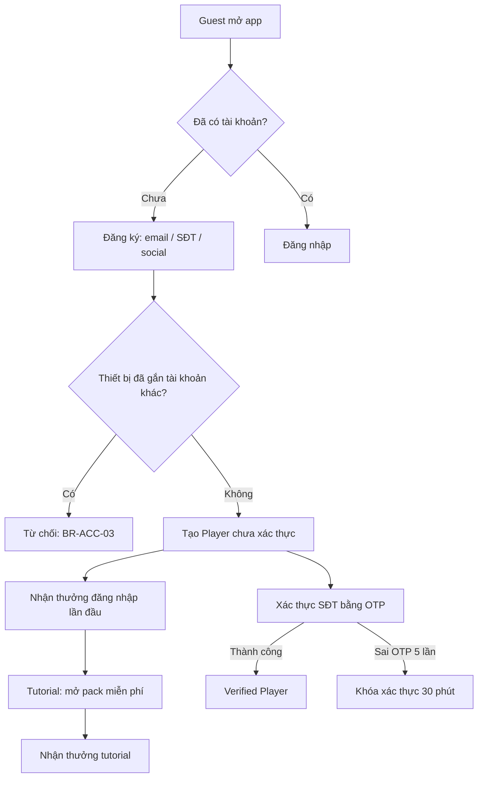
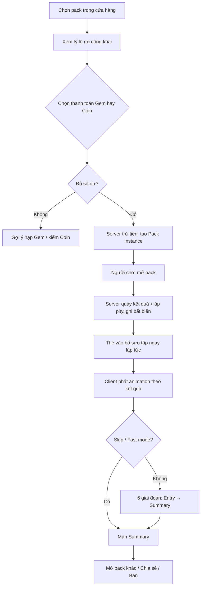
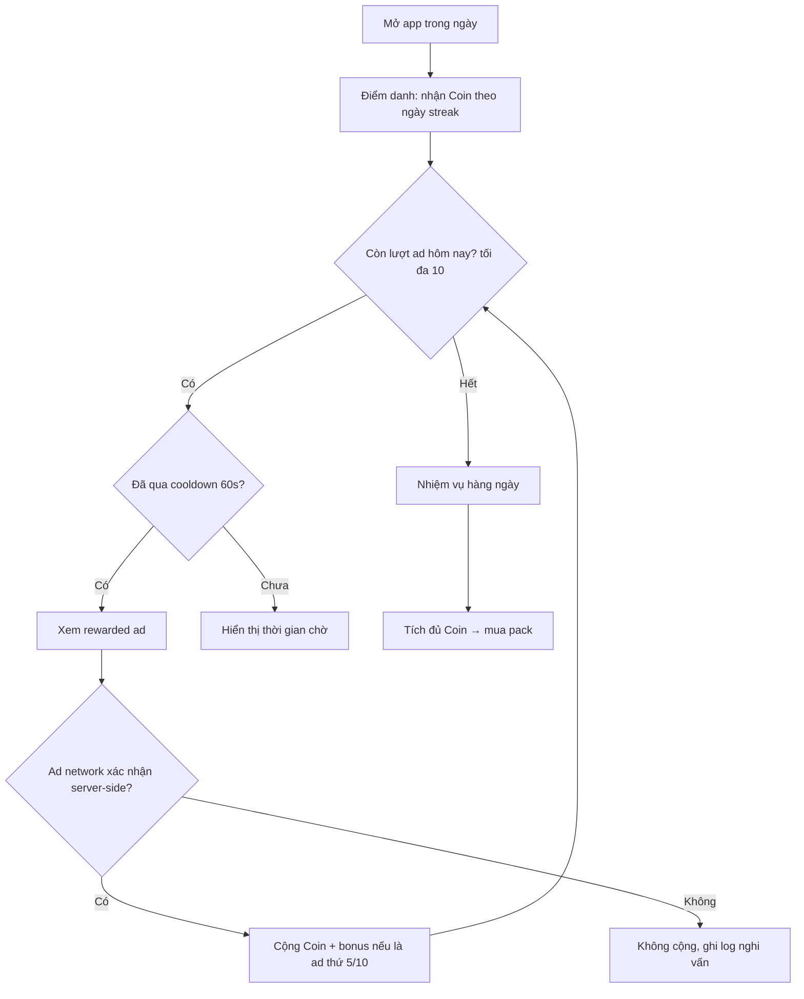
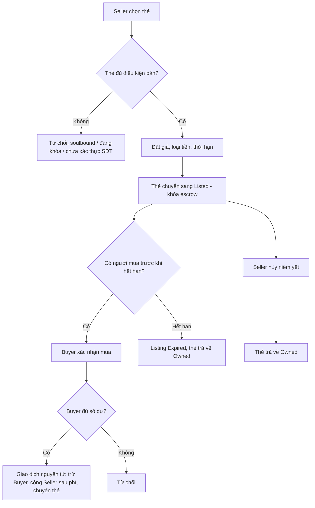
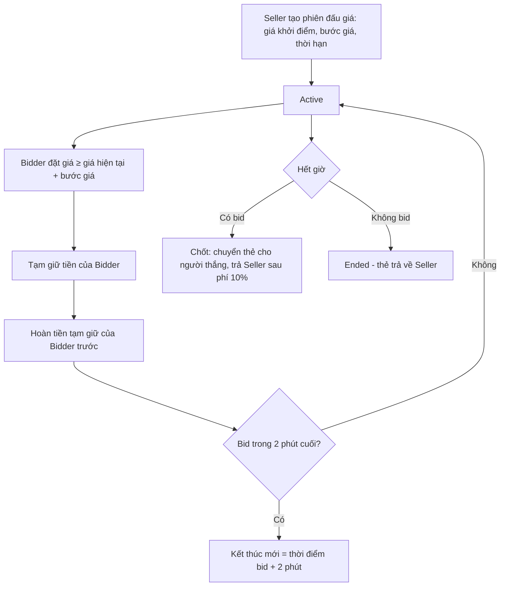
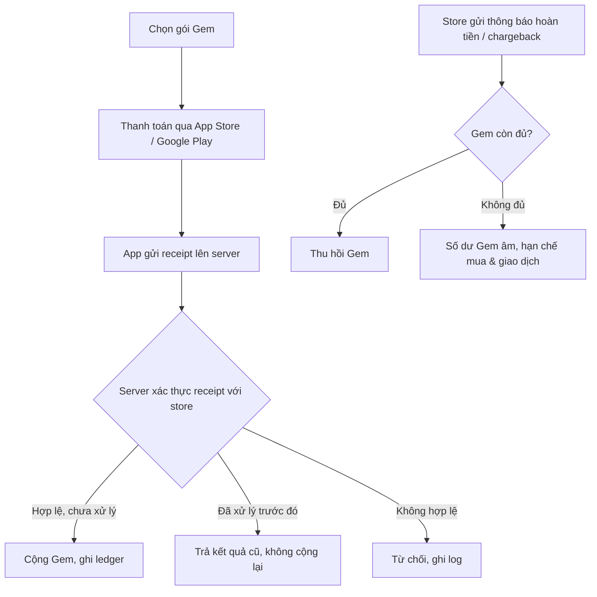

# BRD — ANIMA: Echoes of the Heart
## Business Requirements Document — App Thẻ bài Số hóa

| Thuộc tính | Giá trị |
|---|---|
| Mã tài liệu | BRD-ANIMA-001 |
| Phiên bản | 0.6 (Draft) |
| Ngày | 2026-10-06 |
| Nguồn | [ANIMA_Master_Document.md](ANIMA_Master_Document.md) v1.0 (2026-10-05) |
| Trạng thái | **DRAFT — Chờ Product Owner xác nhận** |
| Business owner | Product Owner (chưa định danh — xem Q-01) |
| Người soạn | Business Analyst |
| Tài liệu liên quan | [PRD](PRD_ANIMA.md), [BDD](BDD_ANIMA.md), [Tech Stack](TECH_STACK.md), [Solution Design](SOLUTION_DESIGN.md), [Sprint Plan](SPRINT_PLAN.md) |

**Thay đổi v0.6 (2026-10-06) — CR-004:** thêm chế độ **Đấu trường** (đấu bài giữa người chơi và với máy). Thẻ có chỉ số chiến đấu và 3 loại thẻ (BR-CARD), bộ bài 30 lá (BR-DECK), luật trận (BR-BTL), hệ theo nhân quả cảm xúc (BR-ELM), 8 sàn đấu (BR-ARN), Cộng minh và Hợp thể (BR-FUS), chế độ chơi và Arena Point (BR-PVP), người chơi mới (BR-NEW). Đã chốt Q-44 (không phát hành ở Trung Quốc đại lục) và Q-47 (giữ nguyên tên riêng). Câu hỏi mới Q-51 → Q-57, rủi ro RK-22 → RK-25.

**Thay đổi v0.5 (2026-10-06) — CR-003:** phát hành toàn cầu với 3 ngôn ngữ: tiếng Việt, tiếng Anh, tiếng Trung (đề xuất cả giản thể và phồn thể). Thêm mục 4.5 (thị trường, đợt phát hành, ngôn ngữ), nhóm quy tắc theo quốc gia BR-GEO và đa ngôn ngữ BR-I18N (mục 10.16, 10.17), sửa NFR-08, NFR-15, thêm NFR-17 → 19, câu hỏi Q-43 → Q-50, rủi ro RK-17 → RK-21.

**Thay đổi v0.4 (2026-10-06) — CR-002:** mô hình tài sản số. Thẻ là tài sản duy nhất, có thể rút về ví riêng dưới dạng NFT (R2, sau gate pháp lý). Thêm: số lượng phát hành giới hạn theo mùa (BR-SUP), mở pack và rèn có thể kiểm chứng bằng commit–reveal (BR-PF), Lò rèn 2 thẻ → 1 thẻ chưa lật (BR-FRG), NFT (BR-NFT), quy đổi Gem ↔ Coin hai chiều (BR-WAL-05 sửa). Sửa BR-ECO-01: Gem/Coin vẫn không rút ra tiền; **công ty không bao giờ mua lại thẻ bằng tiền thật hay tiền mã hóa**. Câu hỏi mới Q-36 → Q-42, rủi ro RK-13 → RK-16.

**Thay đổi v0.3 (2026-10-06) — CR-001:** người chơi dùng được cả **website** lẫn app mobile; admin vẫn là website nội bộ. Thêm mục 4.4 (ma trận tính năng theo nền tảng), nhóm quy tắc BR-WEB (mục 10.11), tích hợp cổng thanh toán web, câu hỏi Q-31 → Q-35 và rủi ro RK-12. Bỏ giả định AS-10 "chỉ có app mobile".

**Thay đổi v0.2 (2026-10-06):** tách lý do hạn chế tài khoản thành `FRAUD` và `NEGATIVE_GEM`. Tài khoản bị hạn chế vì số dư Gem âm được nạp bù và tự gỡ hạn chế khi số dư ≥ 0. Bản v0.1 chặn nạp với mọi tài khoản Restricted nên người chơi bị âm Gem không có cách thoát. Bộ kịch bản BDD đầy đủ chuyển sang [BDD_ANIMA.md](BDD_ANIMA.md).

> **Lưu ý trạng thái:** Tài liệu này **chưa đạt Analysis Ready**. Mục 15 có 8 điểm mâu thuẫn và mục 16 có 57 câu hỏi (2 đã chốt) cần PO, Legal và Finance quyết định. Không có approval nào được gắn sẵn. Mục 18 liệt kê các xác nhận còn thiếu.

### Quy ước ký hiệu

| Tiền tố | Ý nghĩa |
|---|---|
| BO | Business Objective |
| EP / US | Epic / User Story |
| FR | Functional Requirement (giữ ID từ Master Document) |
| BR | Business Rule |
| SC | Kịch bản BDD |
| NFR | Non-Functional Requirement |
| DT | Decision Table |
| AS | Assumption (giả định, cần xác nhận) |
| CF | Conflict (mâu thuẫn trong tài liệu nguồn) |
| Q | Open Question |
| RK | Risk |

Mỗi yêu cầu được đánh dấu nguồn: **[MD §x]** = lấy từ Master Document; **[BA]** = BA bổ sung, cần PO duyệt.

---

## MỤC LỤC

1. [Tóm tắt điều hành](#1-tóm-tắt-điều-hành)
2. [Bối cảnh, vấn đề và cơ hội](#2-bối-cảnh-vấn-đề-và-cơ-hội)
3. [Mục tiêu kinh doanh và chỉ số thành công](#3-mục-tiêu-kinh-doanh-và-chỉ-số-thành-công)
4. [Phạm vi](#4-phạm-vi)
5. [Stakeholder và Actor](#5-stakeholder-và-actor)
6. [Mô hình tiền tệ và tài sản số](#6-mô-hình-tiền-tệ-và-tài-sản-số)
7. [Quy trình nghiệp vụ (TO-BE)](#7-quy-trình-nghiệp-vụ-to-be)
8. [Vòng đời trạng thái](#8-vòng-đời-trạng-thái)
9. [Epic, Feature và User Story](#9-epic-feature-và-user-story)
10. [Business Rules](#10-business-rules)
11. [Kịch bản BDD trọng yếu](#11-kịch-bản-bdd-trọng-yếu)
12. [Ma trận phân quyền](#12-ma-trận-phân-quyền)
13. [Dữ liệu, tích hợp và audit](#13-dữ-liệu-tích-hợp-và-audit)
14. [Non-Functional Requirements](#14-non-functional-requirements)
15. [Mâu thuẫn trong tài liệu nguồn](#15-mâu-thuẫn-trong-tài-liệu-nguồn)
16. [Giả định và câu hỏi mở](#16-giả-định-và-câu-hỏi-mở)
17. [Rủi ro, ràng buộc và phụ thuộc](#17-rủi-ro-ràng-buộc-và-phụ-thuộc)
18. [Traceability và Analysis Ready checklist](#18-traceability-và-analysis-ready-checklist)

---

# 1. TÓM TẮT ĐIỀU HÀNH

ANIMA là app mobile (iOS, Android) cho phép người dùng mua, mở, sưu tầm và giao dịch thẻ bài số thuộc IP gốc "ANIMA: Echoes of the Heart". Giá trị cốt lõi:

1. **Trải nghiệm mở pack cinematic** — tái tạo cảm giác hồi hộp khi mở thẻ vật lý. [MD §4]
2. **IP gốc có chiều sâu cảm xúc** — 8 hệ cảm xúc, mỗi thẻ mang một Story Fragment. [MD §7]
3. **Kinh tế F2P bền vững** — người chơi free kiếm được khoảng 1 pack/tuần qua điểm danh, quảng cáo và nhiệm vụ. [MD §5]

Doanh thu đến từ bán pack (60%), quảng cáo rewarded (25%), phí giao dịch P2P (10%) và Battle Pass (5%). [MD §2.1]

Ràng buộc nền tảng: **tiền trong app không bao giờ rút ra được tiền thật**, tỷ lệ rơi thẻ được công khai. Mục đích là giảm rủi ro bị coi là cờ bạc. [MD §2.3]

**Ba vấn đề cần quyết định trước khi vào thiết kế chi tiết:**

| # | Vấn đề | Tham chiếu |
|---|---|---|
| 1 | Thưởng quảng cáo ở thị trường Tier 2 (Việt Nam) cao hơn doanh thu quảng cáo thu về ($0.008 trả cho user so với $0.001–0.004 thu được mỗi view). Mỗi lượt xem ở VN đang lỗ. | CF-04, RK-02 |
| 2 | Bảng tỷ lệ rơi thẻ BR-01 thiếu bậc Uncommon, trong khi animation và bảng màu có Uncommon. | CF-01 |
| 3 | Nạp Gem qua thẻ cào và ví điện tử cho hàng hóa số trên iOS/Android có thể vi phạm chính sách thanh toán của App Store và Google Play. | RK-05, Q-20 |

---

# 2. BỐI CẢNH, VẤN ĐỀ VÀ CƠ HỘI

## 2.1. AS-IS (hiện trạng thị trường, theo góc nhìn người dùng)

| # | Hiện trạng | Pain point |
|---|---|---|
| P-01 | Thẻ bài vật lý phải mua tại cửa hàng hoặc qua vận chuyển | Tốn chi phí, chờ đợi, giới hạn địa lý |
| P-02 | Thẻ vật lý dễ hỏng, mất, khó bảo quản | Mất giá trị sưu tầm |
| P-03 | Giao dịch thẻ giữa người sưu tầm qua mạng xã hội, chợ đen | Lừa đảo, không xác thực được thẻ thật/giả |
| P-04 | Các app thẻ bài số hiện có phần lớn phụ thuộc IP bên thứ ba | Chi phí bản quyền cao, rủi ro pháp lý |
| P-05 | Người chơi không trả phí ít có cách tham gia sưu tầm lâu dài | Retention thấp ở nhóm free |

## 2.2. TO-BE (giải pháp)

| Pain point | Giải pháp | Feature |
|---|---|---|
| P-01 | Mua pack trực tiếp trong app, mở tức thì | EP-03, EP-04 |
| P-02 | Thẻ lưu trên server, không hỏng/mất, xem offline | EP-05, NFR-10 |
| P-03 | Chợ P2P có escrow, lịch sử minh bạch, chống gian lận | EP-06 |
| P-04 | IP gốc ANIMA | Mục 7 Master Document |
| P-05 | Điểm danh, quảng cáo rewarded, nhiệm vụ đổi ra Coin mua pack | EP-07 |

---

# 3. MỤC TIÊU KINH DOANH VÀ CHỈ SỐ THÀNH CÔNG

## 3.1. Business Objectives [MD §6.1]

| ID | Mục tiêu | KPI | Cách đo | Thời hạn |
|---|---|---|---|---|
| BO-01 | Tăng người dùng active | 10,000 DAU; 50,000 MAU | Unique user đăng nhập trong ngày/30 ngày | 6 tháng sau launch |
| BO-02 | Giữ chân người dùng | D1 > 40%, D7 > 20%, D30 > 10% | Cohort theo ngày cài đặt | Liên tục |
| BO-03 | Doanh thu định kỳ | $10,000 MRR | Doanh thu thuần (sau phí store) trong tháng | 12 tháng |
| BO-04 | Chuyển đổi trả phí | > 5% MAU có ít nhất 1 giao dịch nạp | Paying users / MAU | 12 tháng |
| BO-05 | Tương tác quảng cáo | > 60% DAU xem ≥ 1 ad/ngày | User có ≥ 1 ad completion / DAU | 6 tháng |
| BO-06 | Chất lượng | Crash rate < 1%; rating > 4.5 | Crash-free sessions; store rating | Liên tục |
| BO-07 | Doanh thu trung bình | ARPU $1 | **Chưa rõ mẫu số (DAU hay MAU)** — xem Q-02 | 12 tháng |

## 3.2. Ngưỡng ra quyết định [BA]

Đề xuất PO xác nhận các ngưỡng để quyết định tiếp tục hoặc điều chỉnh sau MVP:

| Chỉ số | Ngưỡng cảnh báo | Hành động |
|---|---|---|
| D7 retention | < 12% sau 2 tháng | Rà lại core loop mở pack và nhiệm vụ |
| Chi phí thưởng ads / doanh thu ads | > 60% trong tháng | Giảm thưởng hoặc giới hạn theo tier (BR-ADS-06) |
| Tỷ lệ tài khoản gian lận bị phát hiện | > 5% DAU | Siết xác thực SĐT, giới hạn thiết bị |

---

# 4. PHẠM VI

## 4.1. Phạm vi theo release

Master Document có mâu thuẫn giữa "In Scope" (§6.2) và Roadmap (§8.1) — xem CF-02. Bảng dưới đây **đề xuất** chia theo Roadmap; PO cần xác nhận (Q-03).

| Hạng mục | Release 1 — MVP (3–6 tháng) | Release 2 (6–12 tháng) | Release 3 (12–18 tháng) |
|---|---|---|---|
| Tài khoản, xác thực, thiết bị | ✔ | | |
| Ví Gem/Coin, nạp IAP | ✔ | | |
| Mua và mở pack, animation 6 giai đoạn | ✔ (animation cơ bản theo rarity) | Nâng cấp cinematic đầy đủ | |
| Bộ sưu tập, tiến độ set | ✔ | Profile công khai | AR/3D |
| Set "Awakening" | ✔ | Set tiếp theo | |
| Điểm danh, quảng cáo rewarded | ✔ | | |
| Nhiệm vụ hàng ngày, referral | | ✔ | |
| Chợ P2P (mua bán giá cố định) | | ✔ | |
| Đấu giá | | ✔ | |
| Cộng đồng: feed, follow, leaderboard | | ✔ | |
| Livestream mở pack | | ✔ (CF-03) | |
| Battle Pass | | | ✔ |
| Admin: người dùng, thẻ, pack, kinh tế, dashboard | ✔ | Xử lý tranh chấp chợ | |
| Commit–reveal cho mở pack và rèn (CR-002) | ✔ | Neo cam kết lên blockchain | |
| Số lượng phát hành giới hạn, mùa (CR-002) | ✔ | | |
| Lò rèn 2 → 1 (CR-002) | ✔ | | |
| Quy đổi Gem ↔ Coin hai chiều (CR-002) | ✔ | | |
| NFT: rút thẻ về ví, nạp lại, royalty, KYC (CR-002) | | ✔ (sau gate pháp lý) | |
| Chỉ số chiến đấu và 3 loại thẻ trên thẻ; gói chào mừng; nhiệm vụ Tân thủ 7 ngày (CR-004) | ✔ | | |
| Đấu trường: trận hướng dẫn, cốt truyện Act 1, luyện tập, giao hữu, xây bộ bài (CR-004) | | ✔ | |
| Đấu trường: xếp hạng, thách đấu cược Arena Point, giải đấu, Draft (CR-004) | | | ✔ |

## 4.2. Out of Scope (toàn dự án giai đoạn đầu) [MD §6.2]

- ~~Chơi game đối kháng bằng thẻ~~ — **đưa vào phạm vi R2–R3 theo CR-004** (mục 10.18 → 10.25)
- Cược bằng Gem, Coin hoặc thẻ giữa người chơi — loại khỏi phạm vi vĩnh viễn (BR-PVP-03, 05)
- ~~Blockchain/NFT~~ — **đưa vào phạm vi R2 theo CR-002** (mục 10.15), có gate pháp lý
- **Công ty mua lại thẻ bằng tiền thật hoặc tiền mã hóa** — loại khỏi phạm vi vĩnh viễn (BR-ECO-01)
- Token/tiền mã hóa riêng của ANIMA; Gem/Coin không đưa lên blockchain
- AR/3D (đến Release 3)
- Hợp tác thương hiệu bên thứ ba
- **Rút tiền ra tiền thật dưới mọi hình thức** (BR-ECO-01)
- **Bán Gem/Coin/thẻ lấy tiền thật bên ngoài app** — cấm theo điều khoản sử dụng [BA]
- Ứng dụng desktop cài đặt (Windows/macOS). Website chạy trên trình duyệt **nằm trong phạm vi** (CR-001, mục 4.4)

## 4.3. Ràng buộc thiết kế UI (xem thêm 4.4)

`ui_required = true`. Toàn bộ EP-01 → EP-09 đều có giao diện người dùng; EP-10 (Admin) có giao diện web nội bộ. BA chỉ quy định ràng buộc nghiệp vụ; bố cục, component và interaction do Product Designer quyết định. Riêng animation mở pack, Master Document §4 đã có spec chi tiết đến từng frame — đây là **design input đã có**, Designer kế thừa và được điều chỉnh, ngoại trừ các ràng buộc nghiệp vụ tại BR-PACK-05 → BR-PACK-08.

## 4.4. Nền tảng và ma trận tính năng (CR-001)

| Nền tảng | Người dùng | Công nghệ (Solution Design) |
|---|---|---|
| App mobile iOS/Android | Người chơi | Unity |
| Website người chơi | Người chơi | Web app trên trình duyệt desktop và mobile; phần mở pack chạy bản Unity Web nhúng |
| Website admin | Nhân viên vận hành | Web nội bộ |

Một tài khoản dùng chung trên cả app và web (BR-WEB-01).

| Tính năng (R1 trừ khi ghi khác) | App mobile | Website người chơi |
|---|---|---|
| Đăng ký, đăng nhập, xác thực SĐT, xóa tài khoản | ✔ | ✔ |
| Ví, lịch sử giao dịch | ✔ | ✔ |
| Nạp Gem | IAP App Store / Google Play | Cổng thanh toán web (BR-WEB-04, Q-31) |
| Mua pack, xem tỷ lệ rơi, pity | ✔ | ✔ |
| Mở pack | Animation đầy đủ | Animation đầy đủ qua Unity Web; chế độ rút gọn nếu trình duyệt không hỗ trợ (BR-WEB-06) |
| Bộ sưu tập, Story Fragment | ✔ | ✔ |
| Điểm danh, rewarded ads | ✔ | ✘ ở R1 (BR-WEB-03, Q-32) |
| Profile công khai (R2) | ✔ | ✔ — link chia sẻ mở trên web |
| Chợ, đấu giá (R2) | ✔ | ✔ |
| Feed, chat, leaderboard (R2) | ✔ | ✔ |

## 4.5. Thị trường và ngôn ngữ (CR-003)

### 4.5.1. Ngôn ngữ

| Mã | Ngôn ngữ | Dùng cho | Trạng thái |
|---|---|---|---|
| `vi` | Tiếng Việt | Việt Nam | Bắt buộc từ R1 |
| `en` | Tiếng Anh | Mặc định quốc tế, ngôn ngữ dự phòng | Bắt buộc từ R1 |
| `zh-Hans` | Tiếng Trung giản thể | Singapore, Malaysia, cộng đồng Hoa ngữ | Bắt buộc từ R1 (Q-43) |
| `zh-Hant` | Tiếng Trung phồn thể | Đài Loan, Hồng Kông, Ma Cao | Đề xuất bắt buộc từ R1 (Q-43) |

### 4.5.2. Đợt phát hành đề xuất (Q-45)

| Đợt | Thị trường | Ngôn ngữ chính | Ghi chú |
|---|---|---|---|
| Soft launch | Việt Nam | vi | Như kế hoạch PRD mục 10 |
| Đợt 1 toàn cầu | Đông Nam Á (Singapore, Malaysia, Philippines, Thái Lan, Indonesia), Đài Loan, Hồng Kông | en, zh-Hans, zh-Hant | Thị trường gần, eCPM quảng cáo tốt hơn VN, cộng đồng Hoa ngữ lớn |
| Đợt 2 | Bắc Mỹ, châu Âu, Úc, Nhật, Hàn | en (+ ngôn ngữ mới nếu PO duyệt) | Cần rà luật loot box và tài sản số từng nước |
| Không phát hành (đề xuất) | Trung Quốc đại lục | — | Cần giấy phép phát hành game (ISBN), dịch vụ Google/Firebase không hoạt động, cấm giao dịch tài sản mã hóa (Q-44) |
| Chặn hoàn toàn | Quốc gia thuộc danh sách trừng phạt | — | BR-GEO-03 |

### 4.5.3. Tính năng có thể tắt theo quốc gia

Mua pack bằng tiền, Lò rèn, chợ P2P, NFT, rewarded ads, nạp qua web, quy đổi Coin → Gem. Bật/tắt theo ma trận Legal duyệt cho từng thị trường (BR-GEO-02).

---

# 5. STAKEHOLDER VÀ ACTOR

## 5.1. Stakeholder [MD §6.3]

| Vai trò | Trách nhiệm | Quyết định thuộc về |
|---|---|---|
| Product Owner | Định hướng sản phẩm, ưu tiên, MVP | Giá trị, phạm vi, business acceptance |
| Business Analyst | BRD, business rule, AC | Ràng buộc nghiệp vụ, phân quyền |
| UI/UX Designer | Thiết kế trải nghiệm | Trình bày, interaction, accessibility |
| Mobile Developer | App iOS/Android | Implementation phía client |
| Backend Developer | API, database | Implementation phía server |
| Artist | Thẻ, pack | Art direction |
| Sound Designer | Âm thanh, nhạc | Sound layer |
| QA/Tester | Kiểm thử | Chất lượng dựa trên bằng chứng |
| Marketing | Tăng trưởng | Kênh, chiến dịch |
| Legal Advisor | Pháp lý | Tuân thủ cờ bạc/loot box, dữ liệu cá nhân, thanh toán |
| Finance [BA] | Kế toán doanh thu, đối soát | Ghi nhận doanh thu, đối soát store/ad network |

## 5.2. Actor hệ thống

| Actor | Mô tả | Định danh |
|---|---|---|
| Guest | Đã cài app, chưa đăng ký | Device ID |
| Player (chưa xác thực) | Đã đăng ký, chưa xác thực SĐT | Account ID |
| Verified Player | Đã xác thực SĐT qua OTP | Account ID + SĐT |
| CS Agent | Nhân viên chăm sóc khách hàng | Tài khoản admin |
| Content Manager | Quản lý thẻ, set, pack, story | Tài khoản admin |
| Economy Manager | Cấu hình drop rate, thưởng, phí | Tài khoản admin |
| Fraud Analyst | Điều tra gian lận, khóa tài khoản | Tài khoản admin |
| Finance Viewer | Xem báo cáo doanh thu, đối soát | Tài khoản admin |
| Super Admin | Quản trị tài khoản admin, phân quyền | Tài khoản admin |
| Hệ thống (System) | Scheduler, kết thúc đấu giá, reset ngày | — |
| App Store / Google Play | Xử lý thanh toán IAP, hoàn tiền | Store transaction ID |
| Ad Network | AdMob, Unity Ads, AppLovin | Ad transaction ID |
| SMS/OTP Provider | Gửi OTP | Message ID |
| Cổng thanh toán web (CR-001) | Thanh toán nạp Gem trên website, gửi IPN/webhook, hoàn tiền | Gateway transaction ID |

---

# 6. MÔ HÌNH TIỀN TỆ VÀ TÀI SẢN SỐ

Master Document định giá mọi phần thưởng bằng "$" nhưng ví lại dùng Gem và Coin, và chưa nói Gem/Coin dùng vào việc gì. Phần này **đề xuất** một mô hình để thống nhất; tất cả đều là giả định chờ PO và Finance duyệt (AS-01 → AS-04).

## 6.1. Định nghĩa tiền tệ [BA]

| Tiền tệ | Nguồn có được | Dùng để | Rút ra tiền thật |
|---|---|---|---|
| **Gem** (hard currency) | Nạp bằng tiền thật (IAP, cổng web), đổi từ Coin | Mua pack, mua thẻ trên chợ, phí rèn, phí rút NFT, đổi sang Coin | Không |
| **Coin** (soft currency) | Điểm danh, quảng cáo, nhiệm vụ, referral, bán thẻ trên chợ, đổi từ Gem | Mua pack, mua thẻ trên chợ, phí rèn, phí rút NFT, Streak Freeze, đổi sang Gem | Không |

## 6.2. Quy đổi giá trị [BA — AS-02]

Để chuyển các con số "$" trong Master Document sang đơn vị trong app:

| Quy đổi | Giá trị đề xuất |
|---|---|
| 1 Coin | tương đương $0.001 |
| 1 pack tiêu chuẩn | 1,000 Coin hoặc 100 Gem (≈ $1.00) [MD §5.2: "30 ngày = $1.00 = 1 pack"] |
| Gem → Coin | 1 Gem = 9 Coin (phí 10%) |
| Coin → Gem | 11 Coin = 1 Gem (phí ≈ 10%) — **CR-002: PO cho phép hai chiều** |
| 1 slot thẻ trong pack | ≈ 200 Coin (1 pack / 5 thẻ) |
| Phí rèn | 50 Coin hoặc 5 Gem (≈ $0.05) |

Quy đổi hai chiều do PO quyết định (CR-002, trả lời Q-05). Rủi ro farm Coin bằng bot rồi đổi sang Gem được kiểm soát bằng BR-FRD-*, giới hạn quy đổi theo ngày (BR-WAL-06) và việc Gem/Coin không rút ra tiền thật. Tỷ lệ và phí là tham số kinh tế có version (BR-ECO-03).

## 6.3. Bảng quy đổi thưởng F2P sang Coin

| Nguồn | Master Document | Coin đề xuất |
|---|---|---|
| Điểm danh ngày 1 → 7 | $0.02, 0.03, 0.04, 0.05, 0.06, 0.08, 0.15 | 20, 30, 40, 50, 60, 80, 150 |
| Mốc streak 14 / 30 / 100 ngày | $0.20 / $1.00 / $5.00 + thẻ độc quyền | 200 / 1,000 / 5,000 + thẻ |
| Rewarded Video | $0.008 | 8 |
| Rewarded Playable | $0.015 | 15 |
| Survey | $0.05–$0.20 | 50–200 (theo offer) |
| Bonus ad thứ 5 / thứ 10 trong ngày | $0.01 / $0.02 | 10 / 20 |
| Nhiệm vụ: mở 1 pack / mua thẻ trên chợ / chia sẻ | $0.01 / $0.01 / $0.02 | 10 / 10 / 20 |
| Referral (mỗi bạn hợp lệ) | $0.50 | 500 |
| Đăng nhập lần đầu / hoàn thành tutorial | $0.10 / $0.20 | 100 / 200 |

## 6.4. Tài sản số

| Tài sản | Mô tả | Chuyển nhượng |
|---|---|---|
| Card Definition | Mẫu thẻ: tên, hệ, rarity, art, Story Fragment, set | — |
| Card Instance | Một bản thẻ cụ thể, serial duy nhất toàn hệ thống, thuộc một edition có số lượng giới hạn (BR-SUP) | Có, qua chợ P2P; rút về ví dưới dạng NFT (BR-NFT, R2) |
| Thẻ Anima, Tiếng vọng, Ký ức phong ấn (CR-004) | Ba loại thẻ; Anima có chỉ số chiến đấu (BR-CARD) | Như Card Instance |
| Bộ bài (CR-004) | 30 Card Instance do người chơi chọn và lưu (BR-DECK) | Không |
| Arena Point (CR-004) | Điểm thi đấu, chỉ đổi vật phẩm gắn chặt tài khoản (BR-PVP-03) | **Không** |
| Thẻ chưa lật (Sealed Card) | Kết quả của Lò rèn; lật ra thành một Card Instance theo tỷ lệ rèn công khai | Không |
| NFT | Card Instance đã rút về ví ngoài; token ID = serial thẻ | Tự do trên blockchain; công ty nhận royalty khi bán lại (BR-NFT-06) |
| Pack Definition | Loại pack: giá, số thẻ, bảng drop rate (có version) | — |
| Pack Instance | Một pack đã mua, chưa mở | **Không** [BA — AS-05] |
| Thẻ độc quyền (streak 100 ngày, sự kiện) | Card Instance gắn cờ "soulbound" | **Không** [BA — AS-06] |

---

# 7. QUY TRÌNH NGHIỆP VỤ (TO-BE)

Bổ sung các luồng còn trống tại Master Document §6.5.

## 7.1. Luồng đăng ký và xác thực



**Exception:** SĐT đã gắn với tài khoản khác → từ chối, thông báo "Số điện thoại đã được sử dụng". OTP hết hạn sau 5 phút → yêu cầu gửi lại (BR-ACC-05).

## 7.2. Luồng mua và mở pack



**Nguyên tắc then chốt (BR-PACK-02):** kết quả do server quyết định và ghi lại **trước** khi phát animation. Animation, skip, mất mạng hay thoát app giữa chừng không làm thay đổi kết quả. Lần mở app sau, pack đã mở nhưng chưa xem hết animation được phát lại ở màn Summary.

**Exception:**
- Mất mạng khi bấm mở → pack vẫn ở trạng thái "Chưa mở", không trừ gì thêm.
- Mất mạng sau khi server đã quay → kết quả đã ghi; client tải lại khi có mạng.
- Pack Definition bị ngừng bán sau khi user đã mua → Pack Instance vẫn mở được theo version drop rate tại thời điểm mua (BR-PACK-04).

## 7.3. Luồng kiếm Coin F2P



## 7.4. Luồng giao dịch P2P (giá cố định)



## 7.5. Luồng đấu giá



## 7.6. Luồng nạp Gem và hoàn tiền



---

# 8. VÒNG ĐỜI TRẠNG THÁI

## 8.1. Tài khoản

| Từ | Đến | Điều kiện / Actor |
|---|---|---|
| — | Unverified | Player đăng ký |
| Unverified | Verified | OTP thành công |
| Unverified / Verified | Restricted | Fraud Analyst hoặc hệ thống phát hiện nghi vấn; số dư Gem âm |
| Restricted (FRAUD) | Trạng thái trước đó (Unverified/Verified) | Fraud Analyst gỡ hạn chế; số dư Gem ≥ 0 |
| Restricted (NEGATIVE_GEM) | Trạng thái trước đó | Tự động khi số dư Gem ≥ 0 sau khi nạp bù |
| Bất kỳ (trừ Deleted) | Banned | Fraud Analyst, kèm lý do bắt buộc |
| Banned | Verified | Chỉ Super Admin, sau khi khiếu nại được chấp nhận |
| Bất kỳ (trừ Banned) | Pending Deletion | Player yêu cầu xóa tài khoản |
| Pending Deletion | Deleted | Sau 30 ngày không hủy yêu cầu |
| Pending Deletion | Trạng thái trước đó | Player đăng nhập lại và hủy yêu cầu |

Chuyển trạng thái bị từ chối: Banned → Pending Deletion (phải giữ dữ liệu phục vụ điều tra — Q-25); Deleted → bất kỳ.

**Restricted:** có hai lý do. `FRAUD` (do Fraud Analyst hoặc hệ thống phát hiện gian lận) và `NEGATIVE_GEM` (do thu hồi Gem khi hoàn tiền). Cả hai vẫn đăng nhập, xem bộ sưu tập, mở pack đã mua; **không** được mua pack, niêm yết, mua trên chợ, đấu giá, nhận thưởng ads. Riêng `NEGATIVE_GEM` **được nạp Gem** để bù số âm; `FRAUD` không được nạp.

## 8.2. Card Instance

| Từ | Đến | Điều kiện |
|---|---|---|
| — | Owned | Mở pack, mua trên chợ, thắng đấu giá, thưởng |
| Owned | Listed | Seller niêm yết (giá cố định) |
| Owned | In Auction | Seller tạo phiên đấu giá |
| Listed | Owned | Hủy niêm yết / hết hạn |
| Listed | Owned (chủ mới) | Giao dịch thành công |
| In Auction | Owned (chủ mới) | Đấu giá kết thúc có người thắng |
| In Auction | Owned | Đấu giá kết thúc không có bid; hủy khi chưa có bid |
| Owned / Listed / In Auction | Locked | Fraud Analyst khóa khi điều tra; listing/phiên đấu giá bị hủy và tiền tạm giữ được hoàn |
| Locked | Owned | Fraud Analyst mở khóa |
| Owned | Burned | Đưa vào Lò rèn (BR-FRG-01) — không đảo ngược |
| Owned | Withdrawing | Người chơi yêu cầu rút về ví (BR-NFT-02) |
| Withdrawing | In Wallet | Giao dịch mint/chuyển trên blockchain được xác nhận |
| Withdrawing | Owned | Giao dịch blockchain thất bại hoặc quá hạn |
| In Wallet | Owned (chủ mới hoặc cũ) | NFT được gửi vào ví lưu ký của ANIMA và ví gửi đã liên kết với tài khoản (BR-NFT-05) |

Chuyển bị từ chối (CR-002): Burned → bất kỳ; In Wallet → Listed/In Auction/Burned (phải nạp lại trước); Locked/soulbound → Withdrawing.

Chuyển bị từ chối: Listed → In Auction (phải hủy niêm yết trước); In Auction → Owned bởi Seller khi đã có bid; mọi chuyển đổi với thẻ soulbound sang Listed/In Auction.

## 8.3. Pack Instance

| Từ | Đến | Điều kiện |
|---|---|---|
| — | Unopened | Mua thành công |
| Unopened | Opened | Server quay kết quả thành công |
| Unopened | Revoked | Thanh toán gốc bị hoàn tiền (chỉ khi mua bằng Gem từ giao dịch bị hoàn — Q-12) |

Chuyển bị từ chối: Opened → bất kỳ trạng thái nào khác.

## 8.4. Listing và Auction

| Đối tượng | Trạng thái |
|---|---|
| Listing | Active → Sold / Cancelled / Expired / Removed (bởi admin) |
| Auction | Active → Ended-Sold → Settled; Active → Ended-NoBid; Active → Cancelled (chỉ khi chưa có bid, hoặc admin hủy) |

---

# 9. EPIC, FEATURE VÀ USER STORY

Mỗi Epic ánh xạ về FR trong Master Document. AC chi tiết dạng BDD ở mục 11; dưới đây liệt kê AC đo được ở mức story.

## EP-01 — Tài khoản & Xác thực (FR-01 → FR-06)

| ID | User Story | AC chính | FR | Release |
|---|---|---|---|---|
| US-01.1 | Là Guest, tôi muốn đăng ký bằng email, SĐT hoặc tài khoản social để bắt đầu sưu tầm | Tạo được tài khoản qua 3 phương thức; email/SĐT là duy nhất toàn hệ thống; người dùng xác nhận đủ 13 tuổi (BR-ACC-01) | FR-01 | R1 |
| US-01.2 | Là Player, tôi muốn đăng nhập bằng mật khẩu, OTP hoặc social | Sai mật khẩu 5 lần liên tiếp khóa đăng nhập 15 phút | FR-02 | R1 |
| US-01.3 | Là Player, tôi muốn đặt lại mật khẩu qua email/SĐT | Link/OTP reset hết hạn sau 15 phút, dùng một lần | FR-03 | R1 |
| US-01.4 | Là Player, tôi muốn xác thực SĐT để mở khóa đầy đủ tính năng | OTP 6 chữ số, hiệu lực 5 phút, tối đa 5 lần nhập sai | FR-04 | R1 |
| US-01.5 | Là Player, tôi muốn có profile với avatar, tên, bio | Tên hiển thị 3–20 ký tự, không trùng, qua bộ lọc từ cấm | FR-05 | R2 |
| US-01.6 | Là doanh nghiệp, tôi muốn mỗi thiết bị chỉ gắn 1 tài khoản để chống multi-account | Xem BR-ACC-03 | FR-06 | R1 |
| US-01.7 [BA] | Là Player, tôi muốn xóa tài khoản và dữ liệu cá nhân | Yêu cầu có hiệu lực sau 30 ngày; được hủy trong 30 ngày | — | R1 |

## EP-02 — Ví & Tiền tệ (FR-07 → FR-10)

| ID | User Story | AC chính | FR | Release |
|---|---|---|---|---|
| US-02.1 | Là Player, tôi muốn xem số dư Gem và Coin | Số dư khớp ledger; cập nhật ngay sau giao dịch | FR-07 | R1 |
| US-02.2 | Là Player, tôi muốn nạp Gem | Chỉ cộng Gem sau khi server xác thực receipt (BR-WAL-02) | FR-08 | R1 |
| US-02.3 | Là Player, tôi muốn xem lịch sử giao dịch | Hiển thị mọi biến động: thời gian, loại, số tiền, số dư sau; lưu ≥ 24 tháng hiển thị cho user | FR-09 | R1 |
| US-02.4 | Là Player, tôi muốn đổi Gem sang Coin | Theo tỷ lệ cấu hình, có phí; một chiều (Q-05) | FR-10 | R2 |

## EP-03 — Mua Pack (FR-11)

| ID | User Story | AC chính | FR | Release |
|---|---|---|---|---|
| US-03.1 | Là Player, tôi muốn mua pack bằng Gem hoặc Coin | Trừ tiền và tạo Pack Instance trong cùng một giao dịch; bấm mua 2 lần không trừ 2 lần (idempotency) | FR-11 | R1 |
| US-03.2 [BA] | Là Player, tôi muốn xem tỷ lệ rơi của pack trước khi mua | Tỷ lệ hiển thị đúng version đang bán; truy cập được trước khi xác nhận thanh toán (BR-PACK-01) | — | R1 |
| US-03.3 [BA] | Là Player, tôi muốn biết bộ đếm pity hiện tại | Hiển thị số pack đã mở liên tiếp không có Legendary+ của loại pack đó | — | R1 |

## EP-04 — Mở Pack & Animation (FR-12 → FR-21)

| ID | User Story | AC chính | FR | Release |
|---|---|---|---|---|
| US-04.1 | Là Player, tôi muốn mở pack với animation 6 giai đoạn | Thứ tự: Entry → Presentation → Tearing → Reveal → Climax (nếu có Epic+) → Summary | FR-12 | R1 |
| US-04.2 | Là Player, tôi muốn animation phản ánh độ hiếm | Thời lượng lật và hiệu ứng theo bảng Master Document §4.2 GĐ3; thẻ lật theo thứ tự rarity tăng dần | FR-13 | R1 |
| US-04.3 | Là Player, tôi muốn khoảnh khắc slow-mo khi ra Epic+ | Time scale 0.3 trong 0.5s | FR-14 | R1 |
| US-04.4 | Là Player, tôi muốn flash và rung màn hình khi ra Legendary+ | Theo timeline Master Document §4.5; tắt được khi bật chế độ giảm chuyển động | FR-15 | R1 |
| US-04.5 | Là Player, tôi muốn particle theo rarity | 6 loại particle; tối đa 200 hạt cùng lúc (300 tại explosion — CF-07) | FR-16 | R1 |
| US-04.6 | Là Player, tôi muốn âm thanh theo layer | 5 layer, ≥ 20 sound; tắt/giảm được âm lượng | FR-17 | R1 |
| US-04.7 | Là Player, tôi muốn rung haptic theo rarity | Pattern theo Master Document §4.7; tắt được trong cài đặt | FR-18 | R2 |
| US-04.8 | Là Player mở nhiều pack, tôi muốn skip hoặc fast mode | Skip đưa thẳng tới Summary; kết quả không đổi (BR-PACK-02) | FR-19 | R1 |
| US-04.9 | Là Player, tôi muốn thẻ tự lật | Auto-reveal lật lần lượt, vẫn giữ climax cho Epic+ trừ khi đã bật skip | FR-20 | R2 |
| US-04.10 | Là Player, tôi muốn chia sẻ kết quả | Chia sẻ ảnh/video lên MXH; ảnh không chứa thông tin cá nhân ngoài tên hiển thị | FR-21 | R2 |

## EP-05 — Bộ sưu tập (FR-22 → FR-26)

| ID | User Story | AC chính | FR | Release |
|---|---|---|---|---|
| US-05.1 | Là Player, tôi muốn xem album thẻ | Thẻ chưa sở hữu hiển thị dạng ẩn (silhouette); số lượng bản trùng hiển thị | FR-22 | R1 |
| US-05.2 | Là Player, tôi muốn xem tiến độ set | "X/Y thẻ", X = số Card Definition khác nhau đã sở hữu (bản trùng không cộng) | FR-23 | R1 |
| US-05.3 | Là Player, tôi muốn tìm kiếm, lọc thẻ | Lọc theo tên, hệ, rarity, giá trị tham khảo; kết hợp nhiều bộ lọc | FR-24 | R1 |
| US-05.4 | Là Player, tôi muốn đọc Story Fragment của thẻ đã sở hữu | Chỉ thẻ đã sở hữu (hiện tại hoặc từng sở hữu — Q-17) mới đọc được story | — | R1 |
| US-05.5 | Là Player, tôi muốn chia sẻ link bộ sưu tập công khai | Người chơi chọn công khai/riêng tư, mặc định riêng tư | FR-26 | R2 |
| US-05.6 | Là Player, tôi muốn xem bộ sưu tập khi offline | Dữ liệu đồng bộ lần cuối; không giao dịch được khi offline | NFR-10 | R1 |
| US-05.7 | Là Player, tôi muốn xem thẻ 3D/AR | — | FR-25 | R3 |

## EP-06 — Chợ giao dịch (FR-27 → FR-33)

| ID | User Story | AC chính | FR | Release |
|---|---|---|---|---|
| US-06.1 | Là Verified Player, tôi muốn niêm yết thẻ với giá và thời hạn | Giá trong khoảng sàn/trần theo rarity (BR-MKT-04); thời hạn 1, 3, 7 ngày | FR-27 | R2 |
| US-06.2 | Là Verified Player, tôi muốn mua thẻ bằng Gem/Coin | Giao dịch nguyên tử; hai người mua cùng lúc chỉ một người thành công | FR-28 | R2 |
| US-06.3 | Là Verified Player, tôi muốn đấu giá thẻ hiếm | Chỉ thẻ Epic trở lên; quy tắc theo BR-MKT-07 → BR-MKT-10 | FR-29 | R2 |
| US-06.4 | Là Seller, tôi muốn được gợi ý giá | Gợi ý = trung vị giá bán thành công 7 ngày gần nhất của cùng Card Definition; không đủ 3 giao dịch thì không gợi ý | FR-30 | R2 |
| US-06.5 | Là Player, tôi muốn xem lịch sử giao dịch của một thẻ | Hiển thị giá, thời gian; ẩn danh tính buyer/seller trừ khi profile công khai | FR-31 | R2 |
| US-06.6 | Là doanh nghiệp, tôi muốn thu phí giao dịch | 5% giá cố định, 10% đấu giá, thu từ phía Seller (BR-MKT-05) | FR-32 | R2 |
| US-06.7 | Là doanh nghiệp, tôi muốn chặn gian lận trên chợ | Phát hiện giao dịch vòng tròn, giá bất thường, tài khoản liên kết (BR-FRD-04) | FR-33 | R2 |

## EP-07 — Nhiệm vụ & Kiếm Coin (FR-34 → FR-39)

| ID | User Story | AC chính | FR | Release |
|---|---|---|---|---|
| US-07.1 | Là Player, tôi muốn điểm danh mỗi ngày để nhận Coin | Theo BR-CHK-01 → BR-CHK-06 | FR-34 | R1 |
| US-07.2 | Là Player, tôi muốn xem quảng cáo để nhận Coin | Theo BR-ADS-01 → BR-ADS-06 | FR-35 | R1 |
| US-07.3 | Là Player, tôi muốn làm nhiệm vụ hàng ngày | Mỗi nhiệm vụ nhận thưởng tối đa 1 lần/ngày | FR-36 | R2 |
| US-07.4 | Là Player, tôi muốn mời bạn để nhận thưởng | Theo BR-REF-01 → BR-REF-03 | FR-37 | R2 |
| US-07.5 | Là Player, tôi muốn đạt thành tựu dài hạn | — (cần thiết kế danh sách thành tựu — Q-28) | FR-38 | R2 |
| US-07.6 | Là Player, tôi muốn mua Battle Pass theo mùa | — (cần thiết kế riêng) | FR-39 | R3 |

## EP-08 — Cộng đồng (FR-40 → FR-44) — Release 2

| ID | User Story | AC chính | FR |
|---|---|---|---|
| US-08.1 | Là Player, tôi muốn xem feed hoạt động của người tôi follow | Chỉ hiển thị sự kiện từ profile công khai: mở được Epic+, hoàn thành set, bán thẻ | FR-40 |
| US-08.2 | Là Player, tôi muốn follow người sưu tầm khác | Follow một chiều, không cần chấp nhận; có thể chặn | FR-41 |
| US-08.3 | Là Player, tôi muốn nhắn tin với người khác | Chỉ giữa Verified Player; có báo cáo/chặn; lọc link ngoài (chống lừa đảo giao dịch ngoài app) | FR-42 |
| US-08.4 | Là Player, tôi muốn xem leaderboard | Xếp theo điểm bộ sưu tập (Q-29); loại tài khoản Restricted/Banned | FR-43 |
| US-08.5 | Là Player, tôi muốn tham gia sự kiện | Sự kiện có thời gian bắt đầu/kết thúc theo giờ server | FR-44 |

## EP-09 — Quảng cáo & Doanh thu (FR-45 → FR-49)

| ID | User Story | AC chính | FR | Release |
|---|---|---|---|---|
| US-09.1 | Là doanh nghiệp, tôi muốn tích hợp AdMob, Unity Ads, AppLovin | Ít nhất 2 network hoạt động khi launch để giảm phụ thuộc | FR-45 | R1 |
| US-09.2 | Là Player, tôi muốn xem rewarded video để nhận Coin | Chỉ cộng Coin khi có xác nhận server-side (BR-ADS-04) | FR-46 | R1 |
| US-09.3 | Là doanh nghiệp, tôi muốn mediation tối ưu eCPM | Waterfall/bidding cấu hình được bởi Economy Manager | FR-47 | R2 |
| US-09.4 | Là doanh nghiệp, tôi muốn chặn gian lận quảng cáo | Không cộng thưởng cho thiết bị emulator/root/jailbreak; VPN gắn cờ (BR-FRD-01, BR-FRD-02) | FR-48 | R1 |
| US-09.5 | Là Finance, tôi muốn xem báo cáo doanh thu | Doanh thu theo nguồn, quốc gia, network; chi phí thưởng ads; biên ads ròng | FR-49 | R1 |

## EP-10 — Admin (FR-50 → FR-55)

| ID | User Story | AC chính | FR | Release |
|---|---|---|---|---|
| US-10.1 | Là CS Agent / Fraud Analyst, tôi muốn tra cứu, khóa, ban người dùng | Khóa/ban bắt buộc nhập lý do; ghi audit log | FR-50 | R1 |
| US-10.2 | Là Content Manager, tôi muốn thêm/sửa thẻ | Không xóa cứng Card Definition đã có Card Instance; chỉ được ngừng phát hành | FR-51 | R1 |
| US-10.3 | Là Economy Manager, tôi muốn tạo pack và cấu hình drop rate | Tổng tỷ lệ = 100%; cần người thứ hai duyệt (BR-ADM-02) | FR-52 | R1 |
| US-10.4 | Là CS Agent, tôi muốn xử lý tranh chấp giao dịch | Theo BR-MKT-11 | FR-53 | R2 |
| US-10.5 | Là Finance Viewer / PO, tôi muốn dashboard DAU, MAU, doanh thu | Số liệu trễ tối đa 1 giờ (Q-30) | FR-54 | R1 |
| US-10.6 | Là Economy Manager, tôi muốn điều chỉnh tỷ lệ thưởng | Thay đổi có hiệu lực từ thời điểm áp dụng, không hồi tố; cần duyệt (BR-ADM-02) | FR-55 | R1 |
| US-10.7 | Là Content Manager, tôi muốn tạo mùa và đặt số lượng phát hành từng thẻ | Số lượng không đổi được sau khi mùa mở bán; cần Super Admin duyệt (BR-SUP-01, BR-ADM-02) | CR-002 | R1 |

## EP-11 — Lò rèn & Kiểm chứng công bằng (CR-002)

| ID | User Story | AC chính | Nguồn | Release |
|---|---|---|---|---|
| US-11.1 | Là Player, tôi muốn đưa 2 thẻ không cần vào Lò rèn để nhận 1 thẻ chưa lật | 2 thẻ bị hủy; trừ phí đúng loại tiền đã chọn; thẻ chưa lật xuất hiện ngay (BR-FRG-01, 02) | CR-002 | R1 |
| US-11.2 | Là Player, tôi muốn xem tỷ lệ rèn trước khi rèn | Bảng tỷ lệ rèn và số bản còn lại hiển thị trước khi xác nhận (BR-FRG-03, BR-SUP-01) | CR-002 | R1 |
| US-11.3 | Là Player, tôi muốn kiểm tra kết quả mở pack/lật thẻ rèn là công bằng | Xem mã băm seed trước khi quay; đổi seed để nhận seed cũ; công cụ kiểm tra tính lại đúng kết quả (BR-PF-*) | CR-002 | R1 |
| US-11.4 | Là Player, tôi muốn biết thẻ của tôi là bản số mấy trên tổng số bao nhiêu | Hiển thị `#37/100` và tổng đã hủy (BR-SUP-02, 06) | CR-002 | R1 |
| US-11.5 | Là Player, tôi muốn đổi Gem ↔ Coin | Theo tỷ lệ cấu hình, làm tròn xuống, có hạn mức (BR-WAL-05, 06) | CR-002 | R1 |

## EP-12 — NFT (CR-002, R2, sau gate pháp lý)

| ID | User Story | AC chính | Nguồn | Release |
|---|---|---|---|---|
| US-12.1 | Là Player đã KYC, tôi muốn liên kết ví blockchain với tài khoản | Ký thông điệp chứng minh quyền sở hữu; 1 ví ↔ 1 tài khoản; ví qua sàng lọc (BR-NFT-03, 10) | CR-002 | R2 |
| US-12.2 | Là Player, tôi muốn rút một thẻ về ví của mình dưới dạng NFT | Đủ điều kiện BR-NFT-02; trừ phí; thẻ chuyển Withdrawing → In Wallet khi chuỗi xác nhận | CR-002 | R2 |
| US-12.3 | Là Player, tôi muốn nạp NFT từ ví vào lại tài khoản để chơi, rèn hoặc bán trên chợ | Thẻ về Owned sau đủ xác nhận (BR-NFT-05) | CR-002 | R2 |
| US-12.4 | Là người mua ở sàn ngoài, tôi muốn kiểm chứng thẻ là thật và duy nhất | Token trên contract chính thức, metadata trên IPFS có mã băm (BR-NFT-07, 08) | CR-002 | R2 |

## EP-13 — Đấu trường (CR-004)

| ID | User Story | AC chính | Nguồn | Release |
|---|---|---|---|---|
| US-13.1 | Là Player, tôi muốn xem chỉ số chiến đấu, loại thẻ, mạch truyện và công thức Hợp thể trên mỗi thẻ | Hiển thị đủ BR-CARD-02 | CR-004 | R1 |
| US-13.2 | Là người mới, tôi muốn nhận gói chào mừng và làm nhiệm vụ Tân thủ để có đủ 30 lá | BR-NEW-01 → 05 | CR-004 | R1 |
| US-13.3 | Là người mới, tôi muốn chơi một trận hướng dẫn để hiểu luật ngay | BR-NEW-06 | CR-004 | R2 |
| US-13.4 | Là Player, tôi muốn xây và lưu tối đa 10 bộ bài 30 lá | Kiểm tra hợp lệ theo BR-DECK-01 → 04 khi lưu và khi vào trận | CR-004 | R2 |
| US-13.5 | Là Player, tôi muốn chơi cốt truyện Act 1 với máy | Mở khóa story theo tiến độ; phần thưởng do công ty cấp | CR-004 | R2 |
| US-13.6 | Là Player, tôi muốn đấu giao hữu với bạn và chọn sàn | BR-ARN-04 | CR-004 | R2 |
| US-13.7 | Là Player, tôi muốn đấu xếp hạng theo mùa | BR-PVP-06, 08 | CR-004 | R3 |
| US-13.8 | Là Player, tôi muốn thách đấu có cược bằng Arena Point | BR-PVP-03, 04 | CR-004 | R3 |
| US-13.9 | Là Player, tôi muốn tham gia giải đấu sự kiện | BR-PVP-05 | CR-004 | R3 |
| US-13.10 | Là Player, tôi muốn xem lại trận đã đấu | BR-BTL-10 | CR-004 | R3 |

---

# 10. BUSINESS RULES

## 10.1. Tài khoản (ACC)

| ID | Quy tắc | Nguồn |
|---|---|---|
| BR-ACC-01 | (Theo BR-GEO-04 từ CR-003: tuổi lấy theo ma trận quốc gia, mặc định như sau.) Người dùng phải từ 13 tuổi trở lên. Dưới 18 tuổi: cần cơ chế đồng ý của cha mẹ/người giám hộ cho việc nạp tiền và xử lý dữ liệu cá nhân (phạm vi chờ Legal — Q-21). | MD BR-07 + BA |
| BR-ACC-02 | Email và SĐT là duy nhất trong toàn hệ thống. Một SĐT chỉ xác thực cho 1 tài khoản. | MD FR-04 |
| BR-ACC-03 | Áp dụng cho **thiết bị mobile** (phiên web theo BR-WEB-02). Một thiết bị chỉ gắn với 1 tài khoản. Đăng nhập tài khoản khác trên thiết bị đã gắn bị từ chối. Đổi thiết bị: tài khoản được chuyển sang thiết bị mới tối đa 2 lần/30 ngày; thiết bị cũ bị gỡ gắn. | MD BR-08 + BA (Q-06) |
| BR-ACC-04 | Chỉ Verified Player được: niêm yết, mua trên chợ, đấu giá, nhắn tin, nhận thưởng referral. Player chưa xác thực được: mở pack, điểm danh, xem ads (Q-07). | BA |
| BR-ACC-05 | OTP gồm 6 chữ số, hiệu lực 5 phút, tối đa 5 lần nhập sai; vượt quá thì khóa xác thực 30 phút; tối đa 5 lần gửi OTP/SĐT/ngày. | BA |

## 10.2. Ví & Ledger (WAL)

| ID | Quy tắc | Nguồn |
|---|---|---|
| BR-WAL-01 | Mọi biến động Gem/Coin ghi thành bút toán ledger bất biến (append-only). Số dư = tổng bút toán. Không sửa/xóa bút toán; điều chỉnh bằng bút toán đảo. | BA |
| BR-WAL-02 | Gem chỉ được cộng sau khi server xác thực receipt với store. Mỗi store transaction ID chỉ được ghi nhận một lần. | BA |
| BR-WAL-03 | Số dư Coin không bao giờ âm. Số dư Gem chỉ có thể âm do thu hồi khi hoàn tiền (BR-WAL-04). | BA |
| BR-WAL-04 | Khi store thông báo hoàn tiền/chargeback: thu hồi đúng số Gem của giao dịch đó. Nếu số dư không đủ, số dư Gem âm và tài khoản chuyển sang Restricted với lý do `NEGATIVE_GEM`; tự gỡ khi nạp bù đến số dư ≥ 0. | BA |
| BR-WAL-05 | Quy đổi Gem ↔ Coin hai chiều với nền tảng theo tỷ lệ cấu hình (đề xuất 1 Gem → 9 Coin; 11 Coin → 1 Gem). Số đổi ra làm tròn xuống; số lẻ không đủ một đơn vị không bị trừ. | MD FR-10 + CR-002 |
| BR-WAL-06 | Giới hạn đổi Coin → Gem tối đa 1,000 Gem/ngày/tài khoản; tài khoản chưa xác thực SĐT không được đổi Coin → Gem. | CR-002 (Q-38) |

## 10.3. Kinh tế chung (ECO)

| ID | Quy tắc | Nguồn |
|---|---|---|
| BR-ECO-01 | (Sửa theo CR-002) Gem và Coin không bao giờ rút ra tiền thật, tiền mã hóa hay hàng hóa ngoài nền tảng. **Công ty không mua lại thẻ bằng tiền thật hay tiền mã hóa, không cam kết giá, không hứa lợi nhuận** dưới bất kỳ hình thức nào (giao diện, quảng cáo, điều khoản). Thẻ có thể rút về ví riêng dưới dạng NFT theo BR-NFT. | MD BR-06 + CR-002 |
| BR-ECO-02 | Gem/Coin không chuyển trực tiếp giữa các tài khoản. Người chơi giao dịch với nhau bằng cách mua bán thẻ trên chợ, thanh toán bằng Gem hoặc Coin. | BA + CR-002 (Q-36) |
| BR-ECO-03 | Mọi thay đổi tham số kinh tế (thưởng, phí, giá, drop rate) có version và thời điểm hiệu lực; bản ghi phát sinh trước thời điểm hiệu lực giữ nguyên giá trị cũ. | BA |
| BR-ECO-04 | Tổng phần thưởng F2P từ quảng cáo không vượt quá 50% doanh thu quảng cáo thực nhận trong tháng (tính theo toàn hệ thống). | MD §2.2 + BA (CF-04) |

## 10.4. Pack & Drop rate (PACK)

| ID | Quy tắc | Nguồn |
|---|---|---|
| BR-PACK-01 | Tỷ lệ rơi của mỗi Pack Definition được công khai trong app, trước khi thanh toán, khớp chính xác với tỷ lệ server dùng. | MD §2.3 |
| BR-PACK-02 | Kết quả mở pack do server quyết định bằng bộ sinh số ngẫu nhiên an toàn (CSPRNG) và ghi bất biến **trước** khi client phát animation. Skip, mất mạng hoặc thoát app không đổi kết quả. | BA |
| BR-PACK-03 | Tỷ lệ rơi mặc định mỗi slot thẻ: **chờ xác nhận** — xem DT-01 và CF-01. | MD BR-01 |
| BR-PACK-04 | Pack Instance được mở theo version drop rate tại thời điểm mua. | BA |
| BR-PACK-05 | **Pity:** mỗi tài khoản có một bộ đếm riêng cho từng Pack Definition. Bộ đếm tăng 1 khi mở pack không có thẻ Legendary hoặc Secret Rare; về 0 khi có. Khi bộ đếm = 49, pack mở kế tiếp (thứ 50) đảm bảo ít nhất 1 thẻ Legendary. | MD BR-02 + BA (Q-09) |
| BR-PACK-06 | Thẻ trong pack được lật theo thứ tự rarity tăng dần; thẻ hiếm nhất lật cuối. | MD §4.2 GĐ3 |
| BR-PACK-07 | Giai đoạn Climax chỉ kích hoạt khi pack có ít nhất 1 thẻ Epic trở lên. | MD §4.2 GĐ4 |
| BR-PACK-08 | Skip/Fast mode luôn khả dụng, kể cả khi pack có Legendary/Secret Rare. | MD FR-19 |
| BR-PACK-09 | Số thẻ mỗi pack: đề xuất 5 thẻ/pack tiêu chuẩn (AS-07, Q-08). | BA |

**DT-01 — Tỷ lệ rơi theo slot (đề xuất để PO chọn):**

| Rarity | MD BR-01 (gốc) | Phương án A — thêm Uncommon, giữ Legendary/Secret | Phương án B — giữ nguyên, bỏ Uncommon |
|---|---|---|---|
| Common | 60% | 45% | 60% |
| Uncommon | — | 25% | — |
| Rare | 25% | 18% | 25% |
| Epic | 10% | 7% | 10% |
| Legendary | 4% | 4% | 4% |
| Secret Rare | 1% | 1% | 1% |
| **Tổng** | 100% | 100% | 100% |

Lưu ý: với 5 thẻ/pack và 4% Legendary + 1% Secret mỗi slot, xác suất một pack có ít nhất 1 thẻ Legendary+ ≈ 1 − 0.95⁵ ≈ 22.6%. Xác suất 49 pack liên tiếp không có ≈ 0.774⁴⁹ ≈ 0.0004%. Pity 50 pack như vậy gần như không bao giờ kích hoạt — xem Q-09.

## 10.5. Điểm danh (CHK)

| ID | Quy tắc | Nguồn |
|---|---|---|
| BR-CHK-01 | Mỗi tài khoản điểm danh tối đa 1 lần/ngày. "Ngày" tính theo múi giờ cố định gắn với tài khoản khi đăng ký; người chơi không tự đổi được (chống gian lận đổi múi giờ). | MD §5.2 + BA (Q-14) |
| BR-CHK-02 | Thưởng ngày 1 → 7: 20, 30, 40, 50, 60, 80, 150 Coin. Sau ngày 7, chu kỳ lặp lại từ ngày 1 nhưng bộ đếm streak tổng vẫn tăng (AS-08, Q-13). | MD §5.2 |
| BR-CHK-03 | Mốc streak: 14 ngày +200 Coin; 30 ngày +1,000 Coin; 100 ngày +5,000 Coin + 1 thẻ độc quyền (soulbound). Mỗi mốc nhận 1 lần trên mỗi chuỗi streak. | MD §5.2 |
| BR-CHK-04 | Bỏ lỡ 1 ngày không điểm danh: streak về 0, lần điểm danh kế tiếp tính là ngày 1. | MD BR-04 |
| BR-CHK-05 | Streak Freeze bảo vệ streak cho đúng 1 ngày bị bỏ lỡ. Có được bằng 200 Coin hoặc xem 3 ads (3 ads này **tính vào** giới hạn 10 ads/ngày). Tối đa giữ 2 Streak Freeze. Tự động dùng khi có ngày bị bỏ lỡ. | MD §5.2 + BA (Q-15) |
| BR-CHK-06 | Bỏ lỡ 2 ngày liên tiếp cần 2 Streak Freeze; nếu chỉ có 1 thì streak vẫn reset và Freeze không bị trừ. | BA |

## 10.6. Quảng cáo (ADS)

| ID | Quy tắc | Nguồn |
|---|---|---|
| BR-ADS-01 | Tối đa 10 lượt rewarded ad có thưởng/ngày/tài khoản (gồm video và playable; survey tính riêng — Q-16). | MD BR-03 |
| BR-ADS-02 | Cooldown 60 giây tính từ thời điểm server ghi nhận lượt ad trước hoàn thành. | MD BR-03 |
| BR-ADS-03 | Giới hạn ngày reset lúc 00:00 theo múi giờ của tài khoản (cùng múi giờ với BR-CHK-01). | MD §5.3 |
| BR-ADS-04 | Chỉ cộng thưởng khi ad network gửi xác nhận server-side (SSV callback) hợp lệ. Mỗi ad transaction ID chỉ được cộng một lần. | BA |
| BR-ADS-05 | Bonus: hoàn thành lượt ad thứ 5 trong ngày +10 Coin; lượt thứ 10 +20 Coin. "Liên tiếp" trong Master Document được hiểu là tích lũy trong ngày (AS-09). | MD §5.3 |
| BR-ADS-06 | Economy Manager được cấu hình mức thưởng ads theo nhóm quốc gia (Tier 1/2/3). Mặc định áp dụng mức Master Document cho mọi tier cho đến khi PO quyết định Q-04. | BA (CF-04) |

**Ví dụ tính thưởng ads một ngày (10 video):** 10 × 8 + 10 + 20 = **110 Coin** (≈ $0.11). Master Document ghi "~$0.10".

## 10.7. Referral (REF)

| ID | Quy tắc | Nguồn |
|---|---|---|
| BR-REF-01 | Người mời nhận 500 Coin khi người được mời là Verified Player và đạt mốc hoạt động: điểm danh 7 ngày khác nhau và mở ≥ 3 pack (Q-18). | MD §5.6 |
| BR-REF-02 | Người mời nhận thưởng tối đa 20 lượt referral/tháng. | BA |
| BR-REF-03 | Không thưởng nếu người mời và người được mời chia sẻ thiết bị, SĐT hoặc cùng fingerprint nghi vấn. | BA |

## 10.8. Chợ giao dịch (MKT)

| ID | Quy tắc | Nguồn |
|---|---|---|
| BR-MKT-01 | Chỉ Verified Player, tài khoản không Restricted, mới được niêm yết/mua/đấu giá. | BA |
| BR-MKT-02 | Thẻ đang niêm yết hoặc đấu giá bị khóa: không niêm yết lần nữa, không dùng cho mục đích khác. | BA |
| BR-MKT-03 | Thẻ soulbound không được giao dịch. | BA |
| BR-MKT-04 | Giá niêm yết nằm trong khoảng sàn/trần cấu hình theo rarity (chống rửa giá trị qua giá cực cao/cực thấp). | BA (Q-19) |
| BR-MKT-05 | Phí thu từ Seller: 5% với giá cố định, 10% với đấu giá. Phí = làm tròn lên đến đơn vị nguyên. Seller nhận = Giá − Phí. | MD BR-05 + BA |
| BR-MKT-06 | Listing được định giá bằng đúng một loại tiền (Gem hoặc Coin) do Seller chọn; Buyer thanh toán và Seller nhận bằng chính loại tiền đó. | MD FR-28 + BA |
| BR-MKT-07 | Đấu giá chỉ áp dụng cho thẻ Epic trở lên; thời hạn 24h, 48h hoặc 72h. | MD FR-29 + BA |
| BR-MKT-08 | Bid hợp lệ ≥ giá hiện tại + bước giá (bước giá tối thiểu = max(5% giá hiện tại, 1 đơn vị)). Tiền bid được tạm giữ; khi bị vượt giá, tiền tạm giữ hoàn lại ngay. | BA |
| BR-MKT-09 | Bid hợp lệ đặt khi còn ≤ 2 phút: thời điểm kết thúc mới = thời điểm bid + 2 phút (chống bid phút chót). | BA |
| BR-MKT-10 | Seller không được bid phiên của mình; tài khoản liên kết với Seller (cùng thiết bị/fingerprint) không được bid. | BA |
| BR-MKT-11 | Tranh chấp: CS Agent chỉ được hủy giao dịch bằng bút toán đảo (hoàn tiền Buyer, trả thẻ Seller) khi có bằng chứng gian lận; quyết định hủy giao dịch giá trị > 10,000 Coin hoặc 1,000 Gem cần Fraud Analyst duyệt. | BA |

## 10.9. Chống gian lận (FRD)

| ID | Quy tắc | Nguồn |
|---|---|---|
| BR-FRD-01 | Thiết bị emulator, root, jailbreak: không nhận thưởng ads, điểm danh và referral; vẫn được dùng các tính năng khác. | MD §5.6 |
| BR-FRD-02 | Kết nối qua VPN/proxy: thưởng ads tính theo tier của quốc gia SĐT đã xác thực, không theo IP. | MD §5.6 + BA |
| BR-FRD-03 | Ẩn hoặc thay đổi vị trí nút điểm danh và áp captcha khi hệ thống phát hiện hành vi tự động. | MD §5.6 |
| BR-FRD-04 | Gắn cờ để Fraud Analyst xem xét: giao dịch qua lại giữa cùng một cặp tài khoản ≥ 3 lần/7 ngày; giá bán lệch > 300% so với giá gợi ý; tài khoản mới < 7 ngày mua thẻ Legendary. | BA |

## 10.10. Admin (ADM)

| ID | Quy tắc | Nguồn |
|---|---|---|
| BR-ADM-01 | Mọi hành động admin thay đổi dữ liệu được ghi audit log: người thực hiện, thời gian, đối tượng, giá trị trước/sau, lý do. | BA |
| BR-ADM-02 | Maker-checker: thay đổi drop rate, giá pack, tỷ lệ thưởng, phí giao dịch do một người tạo và một người khác duyệt; người tạo không tự duyệt. | BA |
| BR-ADM-03 | Không thay đổi drop rate của Pack Definition đang bán; phải tạo version mới có thời điểm hiệu lực. | BA |
| BR-ADM-04 | Admin không được cộng/trừ Gem trực tiếp. Bồi thường cho người chơi chỉ bằng Coin hoặc thẻ, qua maker-checker, kèm mã ticket. | BA |

## 10.11. Đa nền tảng — Website người chơi (WEB) — CR-001

| ID | Quy tắc | Nguồn |
|---|---|---|
| BR-WEB-01 | Một tài khoản dùng chung cho app và web. Ví, bộ sưu tập, Pack Instance, bộ đếm pity và streak là một bản duy nhất trên server; thay đổi ở nền tảng này hiện ở nền tảng kia ngay lần tải dữ liệu kế tiếp. | CR-001 |
| BR-WEB-02 | Phiên web không gắn thiết bị theo BR-ACC-03. Mỗi tài khoản có tối đa 3 phiên web đang hoạt động; đăng nhập phiên thứ 4 sẽ đăng xuất phiên cũ nhất. Tài khoản Verified đăng nhập từ trình duyệt chưa từng dùng phải nhập OTP gửi tới SĐT đã xác thực. | CR-001 (Q-35) |
| BR-WEB-03 | Ở R1, điểm danh và rewarded ads chỉ có trên app mobile, vì web không có cơ chế gắn thiết bị và kiểm tra toàn vẹn thiết bị để chống farm. | CR-001 (Q-32) |
| BR-WEB-04 | Nạp Gem trên web qua cổng thanh toán. Chỉ cộng Gem khi server nhận thông báo IPN/webhook có chữ ký hợp lệ hoặc tự truy vấn trạng thái từ cổng; trang trả về (return URL) trên trình duyệt không đủ để cộng. Mỗi gateway transaction ID chỉ được ghi nhận một lần. Hoàn tiền qua cổng xử lý như BR-WAL-04. | CR-001 (Q-31) |
| BR-WEB-05 | Bảng giá gói Gem trên web được công khai, có thể khác giá trong app (Q-33). Gem mua ở nền tảng nào cũng dùng được ở cả hai nền tảng (Q-34). | CR-001 |
| BR-WEB-06 | Mở pack trên web tuân theo BR-PACK-02. Nếu trình duyệt không chạy được bản Unity Web, dùng chế độ hiển thị rút gọn; kết quả và thứ tự lật không đổi. | CR-001 |
| BR-WEB-07 | Nạp Gem trên web áp dụng cùng điều kiện tuổi và đồng ý của người giám hộ như trên app (BR-ACC-01). | CR-001 |

## 10.12. Số lượng phát hành và mùa (SUP) — CR-002

| ID | Quy tắc | Nguồn |
|---|---|---|
| BR-SUP-01 | Mỗi Card Definition (cả Anima và bài hỗ trợ — CR-004) có **số lượng phát hành tối đa** (max supply) cố định trong một mùa, công khai trong app. Ví dụ đề xuất: Common 50,000; Uncommon 20,000; Rare 5,000; Epic 1,000; Legendary 300; Secret Rare 100. | CR-002 (Q-39) |
| BR-SUP-02 | Mỗi Card Instance mang số thứ tự trong edition, dạng `#37/100`, và serial duy nhất toàn hệ thống. Không có hai Card Instance cùng serial. | CR-002 |
| BR-SUP-03 | Khi quay được một rarity, hệ thống chọn đều một Card Definition **còn bản** trong rarity đó. Card Definition hết bản bị loại khỏi lượt chọn. | CR-002 |
| BR-SUP-04 | Khi mọi Card Definition của một rarity trong pack đã hết bản, pack đó **tự động ngừng bán** cho đến khi có version tỷ lệ mới được công bố. Hệ thống không được tự hạ tỷ lệ một cách ngầm. | CR-002 |
| BR-SUP-05 | Mùa kết thúc thì set của mùa đóng lại vĩnh viễn: không phát hành thêm bản nào của set đó (kể cả qua Lò rèn). | CR-002 |
| BR-SUP-06 | Thẻ bị hủy (burn) không được phát hành lại; số bản đã phát hành và số bản đã hủy đều công khai. | CR-002 |

## 10.13. Kiểm chứng công bằng — Commit–reveal (PF) — CR-002

| ID | Quy tắc | Nguồn |
|---|---|---|
| BR-PF-01 | Mỗi tài khoản có một cặp hạt giống: **server seed** (bí mật, công bố trước mã băm SHA-256) và **client seed** (người chơi tự đặt hoặc dùng giá trị ngẫu nhiên mặc định), cùng bộ đếm **nonce** tăng 1 sau mỗi lần quay (mở pack hoặc lật thẻ rèn). | CR-002 |
| BR-PF-02 | Mọi kết quả quay = HMAC-SHA256(server seed, `client seed:nonce:slot`), quy ra số nguyên trong [0, 1,000,000) để tra bảng tỷ lệ của version áp dụng. | CR-002 |
| BR-PF-03 | Mã băm của server seed phải được hiển thị cho người chơi **trước** lần quay đầu tiên dùng seed đó. | CR-002 |
| BR-PF-04 | Khi người chơi đổi seed, server công bố server seed cũ. Người chơi kiểm tra lại được mọi lần quay đã dùng seed đó bằng công cụ công khai. | CR-002 |
| BR-PF-05 | Pity (BR-PACK-05) và lựa chọn Card Definition theo số bản còn lại (BR-SUP-03) là bước tất định sau khi quay, được ghi trong bản ghi mở pack để kiểm tra lại. | CR-002 |
| BR-PF-06 | (R2) Mỗi ngày, gốc Merkle của tất cả mã băm server seed đã phát hành và của danh sách Card Instance mới được ghi lên blockchain. | CR-002 |

## 10.14. Lò rèn (FRG) — CR-002

| ID | Quy tắc | Nguồn |
|---|---|---|
| BR-FRG-01 | Công thức duy nhất: **2 Card Instance bất kỳ + phí rèn → 1 thẻ chưa lật**. Hai thẻ đầu vào bị hủy vĩnh viễn (Burned) ngay khi rèn thành công. | CR-002 |
| BR-FRG-02 | Phí rèn trả bằng Coin **hoặc** Gem theo lựa chọn của người chơi (đề xuất 50 Coin hoặc 5 Gem); là tham số kinh tế có version. | CR-002 |
| BR-FRG-03 | Thẻ chưa lật được lật theo **bảng tỷ lệ rèn** công khai (mặc định bằng tỷ lệ một slot của pack tiêu chuẩn), dùng commit–reveal như mở pack. **Không có pity, không có vật phẩm tăng tỷ lệ, không có yếu tố nào khác tác động vào kết quả.** | CR-002 (quyết định PO) |
| BR-FRG-04 | Kết quả lật lấy từ cùng kho số lượng giới hạn của **mùa hiện tại** (BR-SUP-03). Thẻ đầu vào thuộc mùa nào cũng được. | CR-002 (Q-40) |
| BR-FRG-05 | Không rèn được: thẻ soulbound, thẻ đang Listed/In Auction/Locked/Withdrawing/In Wallet. | CR-002 |
| BR-FRG-06 | Thẻ chưa lật không giao dịch, không rút về ví; phải lật mới thành Card Instance. | CR-002 |
| BR-FRG-07 | Tài khoản chưa xác thực SĐT rèn tối đa 5 lần/ngày; tài khoản đã xác thực tối đa 100 lần/ngày. | CR-002 (chống bot) |

## 10.15. NFT — rút thẻ về ví (NFT) — CR-002, R2, có gate pháp lý

| ID | Quy tắc | Nguồn |
|---|---|---|
| BR-NFT-01 | Chỉ mở chức năng NFT khi có ý kiến pháp lý bằng văn bản cho thị trường áp dụng (Q-41). Chức năng rút/nạp chỉ có trên **website**, không có trong app mobile. | CR-002 |
| BR-NFT-02 | Điều kiện rút một thẻ: tài khoản Verified, đã KYC, từ 18 tuổi; thẻ ở trạng thái Owned, không soulbound; đã qua **thời gian chờ** 30 ngày kể từ khi tài khoản có thẻ đó và không còn giao dịch nạp Gem nào trong thời hạn có thể hoàn tiền (Q-37). | CR-002 |
| BR-NFT-03 | Khi rút, thẻ được mint thành NFT (chuẩn ERC-721) với token ID = serial thẻ, gửi tới ví người chơi đã liên kết. Ví phải được liên kết bằng chữ ký chứng minh quyền sở hữu. Mỗi ví chỉ liên kết với một tài khoản. | CR-002 |
| BR-NFT-04 | Phí rút trả bằng Coin hoặc Gem (đề xuất 200 Coin hoặc 20 Gem); công ty trả phí gas. | CR-002 (Q-42) |
| BR-NFT-05 | Nạp lại: người chơi gửi NFT vào ví lưu ký của ANIMA từ ví đã liên kết; sau đủ số xác nhận trên chuỗi, thẻ trở về trạng thái Owned của tài khoản liên kết với ví gửi. NFT gửi từ ví chưa liên kết bị giữ chờ người gửi liên kết ví. | CR-002 |
| BR-NFT-06 | Smart contract khai báo royalty theo chuẩn ERC-2981 (đề xuất 5%) cho mọi lần bán lại. Royalty ở sàn ngoài là tự nguyện theo chính sách từng sàn; không hứa với người chơi về việc thu được. | CR-002 |
| BR-NFT-07 | Ảnh và metadata của mỗi Card Definition lưu trên IPFS (kèm bản dự phòng Arweave), gắn mã băm nội dung; không phụ thuộc server ANIMA. | CR-002 |
| BR-NFT-08 | Smart contract thực thi số lượng tối đa của mỗi Card Definition (BR-SUP-01). Công ty **không có quyền** thu hồi, sửa hay hủy NFT đang nằm trong ví người chơi. | CR-002 |
| BR-NFT-09 | Thẻ kiếm được bằng Coin từ quảng cáo được rút như mọi thẻ khác. | CR-002 (quyết định PO) |
| BR-NFT-10 | Ví liên kết được sàng lọc theo danh sách trừng phạt/rửa tiền trước khi rút; giao dịch rút giá trị cao được ghi nhận cho kiểm tra AML. | CR-002 |

## 10.16. Quốc gia và tuân thủ (GEO) — CR-003

| ID | Quy tắc | Nguồn |
|---|---|---|
| BR-GEO-01 | Mỗi tài khoản có một **quốc gia pháp lý** xác định khi đăng ký, theo thứ tự ưu tiên: quốc gia của tài khoản store/phương thức thanh toán → quốc gia của SĐT đã xác thực → quốc gia theo IP. Người chơi không tự đổi; chỉ CS đổi khi có bằng chứng, ghi audit. | CR-003 |
| BR-GEO-02 | Mỗi quốc gia có một **ma trận tính năng** (bật/tắt và tham số: tuổi tối thiểu, hạn mức). Mọi API của tính năng có thể tắt phải kiểm tra ma trận ở backend và trả `FEATURE_NOT_AVAILABLE_IN_REGION` khi bị tắt. Thay đổi ma trận cần maker-checker và Legal duyệt. | CR-003 |
| BR-GEO-03 | Không cho đăng ký, đăng nhập, nạp tiền hay rút NFT từ quốc gia trong danh sách trừng phạt (theo quốc gia pháp lý hoặc IP). | CR-003 |
| BR-GEO-04 | Tuổi tối thiểu và tuổi cần đồng ý của người giám hộ lấy theo ma trận quốc gia (mặc định 13 và 18). Thay thế số cố định trong BR-ACC-01. | CR-003 (Q-46) |
| BR-GEO-05 | Ở thị trường yêu cầu công bố xác suất **từng vật phẩm**, app hiển thị thêm xác suất của từng Card Definition = tỷ lệ rarity ÷ số Card Definition còn bản trong rarity đó, cập nhật khi số lượng thay đổi. | CR-003 |
| BR-GEO-06 | Không có phần thưởng nào chỉ nhận được khi gom đủ một bộ vật phẩm lấy từ gacha ở thị trường cấm cơ chế này (ví dụ "kompu gacha" ở Nhật). Mọi tính năng thưởng theo bộ phải khai báo cờ để ma trận quốc gia tắt được. | CR-003 |
| BR-GEO-07 | Giá trong app theo bảng giá khu vực của store; giá trên web hiển thị bằng tiền tệ địa phương, đã gồm thuế tiêu dùng (VAT/GST) nếu luật nước đó yêu cầu. | CR-003 (Q-49) |
| BR-GEO-08 | Đổi quốc gia pháp lý không làm mất tài sản; tính năng bị tắt ở quốc gia mới thì tài sản liên quan bị khóa ở trạng thái chỉ xem (ví dụ thẻ đang niêm yết bị gỡ khỏi chợ và trả về Owned). | CR-003 |

## 10.17. Đa ngôn ngữ (I18N) — CR-003

| ID | Quy tắc | Nguồn |
|---|---|---|
| BR-I18N-01 | Ngôn ngữ mặc định lấy theo ngôn ngữ thiết bị/trình duyệt nếu thuộc 4 mã hỗ trợ, ngược lại dùng `en`. Người chơi đổi được bất cứ lúc nào; lựa chọn lưu theo tài khoản và đồng bộ giữa app và web. | CR-003 |
| BR-I18N-02 | Nội dung **pháp lý và tiền tệ** (điều khoản, chính sách quyền riêng tư, tỷ lệ rơi, giá, phí, thông báo giao dịch) phải có đủ 4 bản trước khi phát hành; thiếu bản nào thì không phát hành nội dung đó. Chuỗi giao diện thường được dùng `en` làm dự phòng, CI cảnh báo khi thiếu. | CR-003 |
| BR-I18N-03 | Story Fragment, tên hiệu thẻ, mô tả set phải có đủ 4 bản trước khi set mở bán. Tên riêng của Anima (Seraphel, Nocturne…) giữ nguyên chữ Latin ở mọi ngôn ngữ; tên hiệu được dịch (ví dụ "the Hopebringer"). | CR-003 (Q-47) |
| BR-I18N-04 | Mã lỗi nghiệp vụ không đổi theo ngôn ngữ; thông điệp hiển thị cho người dùng lấy theo ngôn ngữ đang chọn. | CR-003 |
| BR-I18N-05 | Ngày, giờ, số, tiền định dạng theo locale; thời điểm reset ngày vẫn theo múi giờ tài khoản (BR-CHK-01). | CR-003 |
| BR-I18N-06 | Bộ lọc từ cấm cho tên hiển thị, chat, mô tả niêm yết áp dụng cho cả 4 ngôn ngữ. | CR-003 |
| BR-I18N-07 | Metadata NFT (R2) có trường tên và mô tả mặc định bằng `en`, kèm bản dịch trong thuộc tính bổ sung. | CR-003 |

## 10.18. Loại thẻ và chỉ số chiến đấu (CARD) — CR-004

| ID | Quy tắc | Nguồn |
|---|---|---|
| BR-CARD-01 | Có 3 loại thẻ: **Anima** (sinh vật chiến đấu), **Tiếng vọng** (bài Buff) và **Ký ức phong ấn** (bài Bẫy). Cả 3 loại đều có rarity, hệ, mùa, số lượng phát hành, ra từ pack, rèn được, rút NFT được như nhau. | CR-004 |
| BR-CARD-02 | Anima có: Cộng hưởng (chi phí 1–6), ATK, DEF, HP, hệ, tối đa 1 kỹ năng, mạch truyện (0–1), danh sách công thức Hợp thể. Thang chỉ số: ATK và DEF 0–3,000; HP 100–4,000; bước 50. | CR-004 |
| BR-CARD-03 | Khung chỉ số theo chi phí, áp dụng như nhau cho mọi rarity: ATK + DEF + HP ÷ 2 ≈ 600 × Cộng hưởng + 300 (sai lệch tối đa ±10%). Rarity cao khác ở kỹ năng, không ở tổng chỉ số. Hệ số cuối cùng chỉnh bằng mô phỏng (Q-51). | CR-004 |
| BR-CARD-04 | Tiếng vọng: có Cộng hưởng; dùng một lần hoặc gắn vào một Anima; hiệu lực mạnh hơn khi dùng lên Anima cùng hệ. | CR-004 |
| BR-CARD-05 | Ký ức phong ấn: úp vào một trong 2 ô Ký ức; **tự kích hoạt** khi điều kiện ghi trên thẻ xảy ra, người chơi không phải bấm phản ứng; dùng xong vào mộ. | CR-004 |
| BR-CARD-06 | Chỉ số, kỹ năng, mạch truyện, công thức Hợp thể là **bất biến** sau khi Card Definition phát hành (vì gắn với NFT). Cân bằng game bằng thể thức và danh sách cấm (BR-PVP-08). | CR-004 |
| BR-CARD-07 | Set Awakening 100 thẻ = **80 Anima + 20 bài hỗ trợ** (khoảng 12 Tiếng vọng, 8 Ký ức phong ấn), thiết kế theo 15–20 mạch truyện. Cập nhật BR-SUP-01 cho cả bài hỗ trợ. | CR-004 |

## 10.19. Bộ bài (DECK) — CR-004

| ID | Quy tắc | Nguồn |
|---|---|---|
| BR-DECK-01 | Bộ bài có **đúng 30 lá**: ít nhất 24 Anima; Tiếng vọng + Ký ức phong ấn **tối đa 6 lá**. | CR-004 |
| BR-DECK-02 | Mỗi Card Definition tối đa 2 bản trong một bộ; Legendary và Secret Rare tối đa 1 bản. | CR-004 |
| BR-DECK-03 | Mỗi bộ tối đa 4 Epic, 2 Legendary, 1 Secret Rare. | CR-004 |
| BR-DECK-04 | Bộ bài chỉ gồm Card Instance ở trạng thái **Owned** của chính tài khoản, kể cả thẻ gắn chặt tài khoản. Không dùng thẻ Listed, In Auction, Locked, Withdrawing, In Wallet, Burned. | CR-004 |
| BR-DECK-05 | Mỗi tài khoản lưu tối đa 10 bộ, có tên. Bộ đã lưu được dùng lại, không phải chọn lại mỗi trận. Thẻ không nằm trong bộ vẫn ở trong ví như bình thường. | CR-004 |
| BR-DECK-06 | Khi một Card Instance rời trạng thái Owned (bán, rèn, rút NFT, bị khóa), nó bị gỡ khỏi mọi bộ đã lưu; bộ đó chuyển thành "chưa hợp lệ" cho đến khi người chơi bổ sung. | CR-004 |
| BR-DECK-07 | Server kiểm tra lại toàn bộ BR-DECK-01 → 04 khi vào trận; bộ không hợp lệ không vào được trận. | CR-004 |
| BR-DECK-08 | Trong lúc trận diễn ra, mọi Card Instance của bộ bài đang dùng bị khóa với niêm yết, rèn, rút NFT; mở khóa khi trận kết thúc. | CR-004 |
| BR-DECK-09 | Dạng Hợp thể không nằm trong bộ bài (theo công thức, BR-FUS-04). | CR-004 |

## 10.20. Luật trận đấu (BTL) — CR-004

| ID | Quy tắc | Nguồn |
|---|---|---|
| BR-BTL-01 | Mỗi Keeper có **8,000 máu**. Mỗi bên có 3 ô Anima và 2 ô Ký ức phong ấn. | CR-004 |
| BR-BTL-02 | Thứ tự đi trước chọn ngẫu nhiên (commit–reveal, BR-PF). Mỗi bên bốc 5 lá đầu trận và được đổi tay một lần (trả cả 5, xào lại, bốc 5). Người đi sau bốc thêm 1 lá đầu trận (Q-55). | CR-004 |
| BR-BTL-03 | Đầu mỗi lượt bốc 1 lá. Năng lượng Cộng hưởng của lượt thứ n = min(n, 6); không cộng dồn sang lượt sau. | CR-004 |
| BR-BTL-04 | Anima vừa ra sân không tấn công trong lượt đó, trừ khi có kỹ năng cho phép. Mỗi Anima tấn công tối đa 1 lần mỗi lượt. | CR-004 |
| BR-BTL-05 | Tấn công một Anima: sát thương = max(100, ATK hiệu lực − DEF hiệu lực của mục tiêu) × hệ số khắc (BR-ELM-04), làm tròn đến hàng chục (từ 5 trở lên làm tròn lên). Chỉ được tấn công thẳng Keeper khi sân Anima đối phương trống; sát thương lên Keeper = ATK hiệu lực. | CR-004 |
| BR-BTL-06 | Anima có HP ≤ 0 rời sân vào mộ (Ký ức). | CR-004 |
| BR-BTL-07 | Thắng khi: máu Keeper đối thủ ≤ 0; đối thủ phải bốc khi đã hết bài; đối thủ đầu hàng; đối thủ mất kết nối quá 60 giây. | CR-004 |
| BR-BTL-08 | Mỗi lượt 20 giây, cộng quỹ dự phòng 30 giây cho cả trận. Hết thời gian thì lượt tự kết thúc; 3 lượt liên tiếp hết giờ thì xử thua. | CR-004 |
| BR-BTL-09 | **Đột tử:** bắt đầu từ lượt thứ 10 của mỗi người, Keeper của người đang đến lượt mất 500 máu, rồi 1,000, 1,500… tăng 500 mỗi lượt. | CR-004 |
| BR-BTL-10 | Server quyết định mọi kết quả (xào bài, bốc bài, sát thương, kích hoạt bẫy). Mỗi trận lưu đủ dữ liệu để phát lại. | CR-004 |
| BR-BTL-11 | Mục tiêu thiết kế: trung vị thời lượng trận 4 phút, 90% số trận trong 3–6 phút; đo bằng mô phỏng máy đấu máy trước khi mở và theo dõi sau khi mở. | CR-004 |

## 10.21. Hệ và nhân quả (ELM) — CR-004

| ID | Quy tắc | Nguồn |
|---|---|---|
| BR-ELM-01 | **Vòng sinh:** Sợ hãi (Umbryx) → Giận dữ (Pyraxis) → Nỗi buồn (Aqualis) → Kiên định (Terrakin) → Tự do (Ventara) → Phấn khích (Voltaris) → Hy vọng (Luminara) → Sợ hãi. | CR-004 |
| BR-ELM-02 | **Vòng khắc** (mỗi hệ khắc hệ cách một bước trong vòng sinh): Umbryx khắc Aqualis; Pyraxis khắc Terrakin; Aqualis khắc Ventara; Terrakin khắc Voltaris; Ventara khắc Luminara; Voltaris khắc Umbryx; Luminara khắc Pyraxis. | CR-004 |
| BR-ELM-03 | Nihilum nằm ngoài hai vòng: tấn công 7 hệ còn lại với hệ số ×1.1; Luminara tấn công Nihilum với hệ số ×1.5; Nihilum không hưởng hiệu ứng sinh. | CR-004 |
| BR-ELM-04 | Hệ số sát thương: tấn công hệ mình khắc ×1.25; tấn công hệ khắc mình ×0.75; còn lại ×1.0 (ngoại lệ Nihilum theo BR-ELM-03). | CR-004 |
| BR-ELM-05 | **Sinh:** khi một Anima ra sân mà phe mình đang có Anima thuộc hệ sinh ra nó, Anima mới nhận +200 ATK và +200 HP đến hết trận. | CR-004 |
| BR-ELM-06 | **Chuỗi nhân quả:** khi phe mình có 3 Anima thuộc 3 hệ liên tiếp trong vòng sinh, cả 3 nhận +300 ATK đến hết lượt; tối đa 1 lần mỗi lượt. | CR-004 |

## 10.22. Sàn đấu (ARN) — CR-004

| ID | Quy tắc | Nguồn |
|---|---|---|
| BR-ARN-01 | Có 8 sàn: Thành Luminara (chủ nhà Luminara), Thung lũng Lặng Thinh (Umbryx), Núi Cuồng Nộ (Pyraxis), Biển Hoài Niệm (Aqualis), Cao nguyên Bất Khuất (Terrakin), Đỉnh Gió Ngàn (Ventara), Tháp Sấm (Voltaris), Vết Nứt (Nihilum). | CR-004 |
| BR-ARN-02 | Anima thuộc hệ chủ nhà nhận +15% ATK và HP; Anima thuộc hệ mà hệ chủ nhà khắc bị −10% ATK và HP. Áp dụng khi vào sân, làm tròn đến hàng chục; DEF không đổi. Sàn Vết Nứt không có hệ bị yếu. | CR-004 |
| BR-ARN-03 | Mỗi sàn có một luật riêng: Thành Luminara — cuối lượt, Anima ít HP nhất của mỗi bên hồi 200; Thung lũng Lặng Thinh — Anima vừa ra sân không bị chọn làm mục tiêu 1 lượt; Núi Cuồng Nộ — mọi Anima +200 ATK, −200 DEF; Biển Hoài Niệm — mỗi bên 1 lần/trận, Anima đầu tiên bị hạ trở về tay; Cao nguyên Bất Khuất — DEF ×2 trong 3 lượt đầu của mỗi bên; Đỉnh Gió Ngàn — mỗi lượt được đổi vị trí 2 Anima; Tháp Sấm — đầu mỗi lượt, 100 sát thương lên một Anima ngẫu nhiên trên sân; Vết Nứt — tắt mọi luật sàn khác, đột tử bắt đầu từ lượt 8. | CR-004 |
| BR-ARN-04 | Chọn sàn: xếp hạng — ngẫu nhiên (commit–reveal), công bố trước, người chơi có 15 giây chọn 1 trong các bộ đã lưu, hết giờ thì dùng bộ được đặt làm mặc định (không có bộ mặc định hợp lệ thì hủy ghép, không bị phạt); giao hữu — người thách đấu chọn; sự kiện — "sàn của tuần". | CR-004 |

## 10.23. Cộng minh và Hợp thể (FUS) — CR-004

| ID | Quy tắc | Nguồn |
|---|---|---|
| BR-FUS-01 | Mỗi Anima thuộc tối đa 1 mạch truyện (story arc). | CR-004 |
| BR-FUS-02 | **Cộng minh:** khi phe mình có 2 Anima cùng mạch trên sân, mỗi thẻ cùng mạch +100 ATK và +200 HP; có 3 thẻ trở lên thì +200 ATK và +400 HP. Hiệu lực mất khi số thẻ cùng mạch giảm. | CR-004 |
| BR-FUS-03 | **Hợp thể:** hy sinh 2 Anima trên sân khớp một công thức (cùng hệ hoặc liền nhau trong vòng sinh, và cùng mạch truyện) + trả Cộng hưởng ghi trong công thức → dạng Hợp thể vào ô của một trong hai thẻ; tấn công được từ lượt sau. Hai thẻ nguyên liệu vào mộ. Tối đa 1 lần Hợp thể mỗi lượt. | CR-004 |
| BR-FUS-04 | Hợp thể **theo công thức**: người chơi không cần sở hữu thẻ Hợp thể. Chỉ số dạng Hợp thể ghi trong công thức (định hướng: khoảng 70% tổng ATK và HP của hai nguyên liệu, DEF bằng giá trị cao hơn) cùng kỹ năng riêng. | CR-004 |
| BR-FUS-05 | Thẻ Hợp thể **bản art đặc biệt** là thẻ sưu tầm, chỉ phát làm phần thưởng cốt truyện hoặc giải đấu; sở hữu thẻ này chỉ đổi hình hiển thị khi Hợp thể, không đổi chỉ số. | CR-004 |

## 10.24. Chế độ chơi và Arena Point (PVP) — CR-004

| ID | Quy tắc | Nguồn |
|---|---|---|
| BR-PVP-01 | Chế độ và release: Trận hướng dẫn, Cốt truyện Act 1, Luyện tập với máy, Giao hữu (R2); Xếp hạng theo mùa, Thách đấu cược Arena Point, Giải đấu (R3); Draft (R3, chờ Q-52). | CR-004 |
| BR-PVP-02 | Mọi chế độ dùng bộ bài riêng của người chơi đều yêu cầu bộ 30 lá hợp lệ (BR-DECK). Chỉ trận hướng dẫn dùng bộ bài mượn. | CR-004 |
| BR-PVP-03 | **Arena Point (AP)** chỉ kiếm được qua thi đấu (thắng trận, nhiệm vụ đấu trường, thưởng mùa). AP **không mua được, không đổi sang hoặc từ Gem/Coin/thẻ, không chuyển cho người khác, không rút**. AP chỉ đổi lấy vật phẩm gắn chặt tài khoản (khung thẻ, mặt sau thẻ, danh hiệu, hiệu ứng) và vé giải đấu. | CR-004 |
| BR-PVP-04 | **Thách đấu cược:** hai bên đồng ý cùng một mức cược AP (tối thiểu 10, tối đa 1,000 và không vượt số dư). AP bị giữ khi trận bắt đầu; người thắng nhận cả hai phần; trận bị hủy trước khi bắt đầu thì hoàn lại; mất kết nối quá hạn tính là thua. | CR-004 |
| BR-PVP-05 | Phần thưởng có giá trị (Coin, thẻ chưa lật, thẻ Hợp thể bản sưu tầm) **chỉ do công ty cấp** theo hạng mùa, nhiệm vụ, giải đấu; không bao giờ lấy từ người chơi khác. | CR-004 |
| BR-PVP-06 | Ghép trận xếp hạng theo điểm kỹ năng (Glicko-2). Không ghép hai tài khoản cùng thiết bị, cùng fingerprint hoặc cùng SĐT. Mỗi cặp người chơi tối đa 3 trận xếp hạng hoặc thách đấu cược với nhau mỗi ngày. | CR-004 |
| BR-PVP-07 | Phát hiện dàn xếp trận: đầu hàng sớm lặp lại, tỷ lệ thắng bất thường giữa một cặp → gắn cờ cho Fraud Analyst; AP, hạng và phần thưởng liên quan có thể bị thu hồi. | CR-004 |
| BR-PVP-08 | Thể thức **Standard** (thẻ của 2 mùa gần nhất) và **Eternal** (mọi thẻ). Danh sách cấm/hạn chế cập nhật đầu mùa, công bố trước ít nhất 7 ngày. Không sửa chỉ số thẻ đã phát hành. | CR-004 |
| BR-PVP-09 | Thách đấu cược AP là một tính năng riêng trong ma trận quốc gia (BR-GEO-02), tắt được theo thị trường. | CR-004 |

## 10.25. Người chơi mới (NEW) — CR-004

| ID | Quy tắc | Nguồn |
|---|---|---|
| BR-NEW-01 | **Gói chào mừng:** khi tạo tài khoản, người chơi nhận 1 pack 5 lá **Anima Common** thuộc **5 hệ khác nhau**, chọn ngẫu nhiên trong 7 hệ vòng nhân quả (không có Nihilum, không có bài hỗ trợ, không có thẻ hiếm). Thay thế "pack tutorial bảo đảm ít nhất 1 Rare" của PRD 7.1. | CR-004 |
| BR-NEW-02 | Không tặng bộ khởi đầu 30 lá. Người chơi có đủ 30 lá bằng cách mua pack hoặc làm nhiệm vụ, xem quảng cáo theo thời gian. | CR-004 |
| BR-NEW-03 | **Nhiệm vụ Tân thủ 7 ngày** tính từ lúc tạo tài khoản: mỗi ngày 1 nhóm nhiệm vụ; hoàn thành nhóm của ngày 1 → 5 thì nhận 1 **pack cơ bản** (5 Anima Common, có thể trùng hệ); ngày 6 → 7 thưởng Coin (Q-53). Nhiệm vụ của ngày đã qua làm bù được đến hết ngày 7. | CR-004 |
| BR-NEW-04 | Thẻ chào mừng và thẻ từ pack cơ bản **gắn chặt tài khoản**: không niêm yết, không rút NFT, không rèn; dùng được trong bộ bài và tính vào 30 lá sở hữu. | CR-004 |
| BR-NEW-05 | Pack cơ bản không cho ra bản thứ 3 của cùng một Card Definition trong số thẻ gắn chặt tài khoản, để 30 lá Tân thủ (5 + 25) luôn lập được một bộ hợp lệ theo BR-DECK-02. | CR-004 |
| BR-NEW-06 | **Trận hướng dẫn có kịch bản:** mở ngay sau khi nhận gói chào mừng; hai bên dùng bộ bài mượn cố định, đối thủ là máy; không có phần thưởng ngoài đánh dấu hoàn thành; thẻ mượn không vào bộ sưu tập; chơi lại được. | CR-004 |

---

# 11. KỊCH BẢN BDD TRỌNG YẾU

Đây là trích đoạn. Bộ kịch bản đầy đủ, phủ mọi Business Rule, nằm ở [BDD_ANIMA.md](BDD_ANIMA.md). Khi hai nơi khác nhau, BDD_ANIMA.md là bản chuẩn.

```gherkin
Tính năng: EP-03/EP-04 — Mua và mở pack
  Bối cảnh chung:
    Cho trước Pack Definition "Awakening Standard" giá 1,000 Coin, 5 thẻ/pack
    Và tài khoản "P1" ở trạng thái Verified

  Quy tắc: BR-PACK-02 — Kết quả do server quyết định trước animation

    Kịch bản: SC-PACK-01 — Skip không đổi kết quả
      Cho trước P1 có 1 Pack Instance "Unopened"
      Và server đã quay kết quả gồm 4 Common và 1 Epic khi P1 mở pack
      Khi P1 chọn skip animation
      Thì bộ sưu tập của P1 có thêm đúng 4 thẻ Common và 1 thẻ Epic đã quay
      Và Pack Instance ở trạng thái "Opened"

    Kịch bản: SC-PACK-02 — Mất kết nối sau khi server đã quay
      Cho trước server đã ghi kết quả mở pack của P1
      Khi kết nối của P1 bị mất trước khi animation kết thúc
      Thì kết quả đã ghi không thay đổi
      Và lần mở app tiếp theo P1 thấy màn Summary của pack đó

    Kịch bản: SC-PACK-03 — Mất kết nối trước khi server nhận yêu cầu mở
      Cho trước P1 có 1 Pack Instance "Unopened"
      Khi yêu cầu mở pack không tới được server
      Thì Pack Instance vẫn ở trạng thái "Unopened"
      Và không có thẻ mới nào được thêm

    Kịch bản: SC-PACK-04 — Mở lại pack đã mở
      Cho trước Pack Instance của P1 ở trạng thái "Opened"
      Khi P1 gửi lại yêu cầu mở pack đó
      Thì server trả lại đúng kết quả đã ghi lần đầu với mã PACK_ALREADY_OPENED
      Và không có thẻ mới nào được thêm

  Quy tắc: US-03.1 — Mua pack idempotent

    Kịch bản: SC-PACK-05 — Gửi trùng yêu cầu mua
      Cho trước P1 có 2,500 Coin
      Khi P1 gửi 2 yêu cầu mua cùng một idempotency key
      Thì số dư Coin của P1 là 1,500
      Và P1 có đúng 1 Pack Instance mới

    Kịch bản: SC-PACK-06 — Không đủ số dư
      Cho trước P1 có 999 Coin
      Khi P1 mua pack bằng Coin
      Thì server từ chối với mã lỗi INSUFFICIENT_BALANCE
      Và số dư Coin của P1 vẫn là 999

    Kịch bản: SC-PACK-07 — Biên số dư vừa đủ
      Cho trước P1 có 1,000 Coin
      Khi P1 mua pack bằng Coin
      Thì số dư Coin của P1 là 0
      Và P1 có 1 Pack Instance mới

  Quy tắc: BR-PACK-04 — Snapshot version drop rate

    Kịch bản: SC-PACK-08 — Drop rate đổi sau khi mua
      Cho trước P1 mua pack khi version drop rate là "v1"
      Và Economy Manager phát hành "v2" có hiệu lực sau đó
      Khi P1 mở pack đã mua
      Thì server quay kết quả theo "v1"
      Và bản ghi mở pack lưu mã version "v1"

  Quy tắc: BR-PACK-05 — Pity

    Sơ đồ kịch bản: SC-PACK-09 — Bộ đếm pity
      Cho trước bộ đếm pity của P1 cho "Awakening Standard" là <trước>
      Khi P1 mở một pack có kết quả quay ngẫu nhiên <kết quả quay>
      Thì pack chứa <bảo đảm>
      Và bộ đếm pity sau khi mở là <sau>

      Ví dụ:
        | trước | kết quả quay           | bảo đảm                      | sau | lý do                              |
        | 0     | không có Legendary+    | không áp dụng                | 1   | tăng bình thường                   |
        | 48    | không có Legendary+    | không áp dụng                | 49  | chưa tới ngưỡng                    |
        | 49    | không có Legendary+    | ít nhất 1 Legendary          | 0   | pack thứ 50 kích hoạt pity         |
        | 49    | có 1 Secret Rare       | Secret Rare giữ nguyên       | 0   | đã có Legendary+, không cần pity   |
        | 12    | có 1 Legendary         | không áp dụng                | 0   | reset khi ra Legendary             |

Tính năng: EP-07 — Điểm danh
  Bối cảnh chung:
    Cho trước tài khoản "P2" có múi giờ Asia/Ho_Chi_Minh

  Quy tắc: BR-CHK-02 / BR-CHK-04 — Thưởng và reset streak

    Kịch bản: SC-CHK-01 — Điểm danh ngày 7
      Cho trước P2 đã điểm danh 6 ngày liên tiếp đến ngày 2026-10-10
      Khi P2 điểm danh ngày 2026-10-11
      Thì P2 nhận 150 Coin
      Và streak của P2 là 7

    Kịch bản: SC-CHK-02 — Biên thời gian 23:59 và 00:00
      Cho trước P2 điểm danh lúc 23:59 ngày 2026-10-11
      Khi P2 điểm danh lúc 00:01 ngày 2026-10-12
      Thì lần điểm danh thứ hai được chấp nhận là ngày streak kế tiếp

    Kịch bản: SC-CHK-03 — Điểm danh lần hai trong ngày
      Cho trước P2 đã điểm danh ngày 2026-10-12
      Khi P2 điểm danh lần nữa trong ngày 2026-10-12
      Thì server từ chối với mã lỗi ALREADY_CHECKED_IN
      Và số dư Coin không đổi

    Kịch bản: SC-CHK-04 — Bỏ lỡ một ngày, không có Freeze
      Cho trước streak của P2 là 5 và P2 không có Streak Freeze
      Và P2 không điểm danh ngày 2026-10-13
      Khi P2 điểm danh ngày 2026-10-14
      Thì streak của P2 là 1
      Và P2 nhận 20 Coin

    Kịch bản: SC-CHK-05 — Bỏ lỡ một ngày, có Freeze
      Cho trước streak của P2 là 5 và P2 có 1 Streak Freeze
      Và P2 không điểm danh ngày 2026-10-13
      Khi P2 điểm danh ngày 2026-10-14
      Thì streak của P2 là 6
      Và P2 còn 0 Streak Freeze

    Kịch bản: SC-CHK-06 — Bỏ lỡ hai ngày, chỉ có một Freeze (BR-CHK-06)
      Cho trước streak của P2 là 5 và P2 có 1 Streak Freeze
      Và P2 không điểm danh ngày 2026-10-13 và 2026-10-14
      Khi P2 điểm danh ngày 2026-10-15
      Thì streak của P2 là 1
      Và P2 vẫn còn 1 Streak Freeze

Tính năng: EP-07/EP-09 — Rewarded ads
  Bối cảnh chung:
    Cho trước tài khoản "P3" Verified, thiết bị không root/emulator

  Quy tắc: BR-ADS-01 / BR-ADS-02 / BR-ADS-04 / BR-ADS-05

    Kịch bản: SC-ADS-01 — Lượt ad thứ 5 nhận bonus
      Cho trước P3 đã hoàn thành 4 lượt video trong ngày
      Và lượt gần nhất hoàn thành cách đây 61 giây
      Khi ad network gửi SSV hợp lệ cho lượt video thứ 5
      Thì P3 nhận 18 Coin (8 thưởng + 10 bonus)

    Kịch bản: SC-ADS-02 — Vượt giới hạn 10 lượt
      Cho trước P3 đã hoàn thành 10 lượt có thưởng trong ngày
      Khi P3 yêu cầu xem lượt thứ 11
      Thì server từ chối với mã lỗi DAILY_AD_LIMIT_REACHED

    Kịch bản: SC-ADS-03 — Biên cooldown 59 giây
      Cho trước lượt ad gần nhất của P3 hoàn thành cách đây 59 giây
      Khi P3 yêu cầu xem ad mới
      Thì server từ chối với mã lỗi AD_COOLDOWN
      Và phản hồi nêu thời gian chờ còn lại là 1 giây

    Kịch bản: SC-ADS-04 — SSV gửi trùng
      Cho trước P3 đã được cộng thưởng cho ad transaction "TX-881"
      Khi ad network gửi lại SSV cho "TX-881"
      Thì số dư Coin của P3 không đổi
      Và server trả kết quả thành công của lần xử lý đầu

    Kịch bản: SC-ADS-05 — Client báo xem xong nhưng không có SSV
      Cho trước P3 báo đã xem xong một video
      Khi không có SSV hợp lệ nào cho lượt đó trong 10 phút
      Thì P3 không được cộng Coin
      Và lượt đó không tính vào giới hạn 10 lượt

    Kịch bản: SC-ADS-06 — Thiết bị root (BR-FRD-01)
      Cho trước thiết bị của P3 bị phát hiện đã root
      Khi ad network gửi SSV hợp lệ cho một lượt video
      Thì P3 không được cộng Coin
      Và sự kiện được ghi vào log gian lận

Tính năng: EP-06 — Chợ giao dịch
  Bối cảnh chung:
    Cho trước Seller "S1" và Buyer "B1" đều Verified, không Restricted

  Quy tắc: BR-MKT-05 — Phí giao dịch

    Sơ đồ kịch bản: SC-MKT-01 — Tính phí cho Seller
      Cho trước S1 bán thẻ qua <hình thức> với giá <giá>
      Khi giao dịch hoàn tất
      Thì phí là <phí> và S1 nhận <nhận>

      Ví dụ:
        | hình thức | giá   | phí  | nhận  | lý do                       |
        | Giá cố định | 1,000 Coin | 50  | 950   | 5% chẵn                     |
        | Giá cố định | 999 Coin   | 50  | 949   | 49.95 làm tròn lên 50       |
        | Giá cố định | 10 Coin    | 1   | 9     | 0.5 làm tròn lên 1          |
        | Đấu giá   | 2,345 Gem  | 235 | 2,110 | 234.5 làm tròn lên 235      |

  Quy tắc: US-06.2 — Mua đồng thời

    Kịch bản: SC-MKT-02 — Hai người mua cùng lúc
      Cho trước S1 niêm yết thẻ "Nocturne #0042" giá 3,000 Coin
      Và B1 và B2 đều có 5,000 Coin
      Khi B1 và B2 cùng gửi yêu cầu mua trong cùng một thời điểm
      Thì đúng một người mua thành công và nhận thẻ
      Và người còn lại nhận mã lỗi LISTING_NOT_AVAILABLE và số dư giữ nguyên 5,000 Coin

  Quy tắc: BR-MKT-03 — Thẻ soulbound

    Kịch bản: SC-MKT-03 — Niêm yết thẻ độc quyền streak 100 ngày
      Cho trước S1 sở hữu thẻ soulbound nhận từ mốc streak 100 ngày
      Khi S1 niêm yết thẻ đó
      Thì server từ chối với mã lỗi CARD_NOT_TRADABLE

  Quy tắc: BR-MKT-01 — Phân quyền

    Kịch bản: SC-MKT-04 — Player chưa xác thực mua thẻ
      Cho trước tài khoản "U1" chưa xác thực SĐT
      Khi U1 gửi yêu cầu mua trực tiếp tới API chợ
      Thì server từ chối với mã lỗi PHONE_VERIFICATION_REQUIRED
      Và không có bút toán nào được ghi

  Quy tắc: BR-MKT-09 — Gia hạn đấu giá

    Kịch bản: SC-MKT-05 — Bid trong 2 phút cuối
      Cho trước phiên đấu giá kết thúc lúc 20:00:00
      Khi B1 đặt bid hợp lệ lúc 19:58:30
      Thì thời điểm kết thúc mới là 20:00:30

    Kịch bản: SC-MKT-06 — Bid ngay trước mốc 2 phút
      Cho trước phiên đấu giá kết thúc lúc 20:00:00
      Khi B1 đặt bid hợp lệ lúc 19:57:59
      Thì thời điểm kết thúc giữ nguyên 20:00:00

Tính năng: EP-02 — Ví
  Quy tắc: BR-WAL-02 / BR-WAL-04 — Nạp và hoàn tiền

    Kịch bản: SC-WAL-01 — Receipt gửi trùng
      Cho trước receipt "GPA.1234" đã được cộng 500 Gem cho P1
      Khi app gửi lại receipt "GPA.1234"
      Thì số dư Gem của P1 không đổi

    Kịch bản: SC-WAL-02 — Hoàn tiền khi Gem đã tiêu
      Cho trước P1 nạp 500 Gem và đã tiêu 400 Gem, còn 100 Gem
      Khi store thông báo hoàn tiền giao dịch 500 Gem đó
      Thì số dư Gem của P1 là −400
      Và tài khoản P1 chuyển sang trạng thái Restricted

Tính năng: EP-10 — Admin
  Quy tắc: BR-ADM-02 — Maker-checker

    Kịch bản: SC-ADM-01 — Tự duyệt thay đổi drop rate
      Cho trước Economy Manager "E1" tạo bản nháp drop rate "v3"
      Khi E1 duyệt bản nháp "v3"
      Thì server từ chối với mã lỗi SELF_APPROVAL_FORBIDDEN

    Kịch bản: SC-ADM-02 — Tổng tỷ lệ khác 100%
      Cho trước Economy Manager "E1" nhập bảng drop rate có tổng 99%
      Khi E1 gửi duyệt
      Thì server từ chối với mã lỗi DROP_RATE_SUM_INVALID

    Kịch bản: SC-ADM-03 — CS Agent sửa drop rate
      Cho trước CS Agent "C1" đăng nhập admin
      Khi C1 gửi yêu cầu sửa drop rate trực tiếp tới API
      Thì server từ chối với mã lỗi FORBIDDEN
      Và hành động bị ghi vào audit log
```

**Edge case đã rà:**

| Nhóm | Áp dụng | Kịch bản |
|---|---|---|
| Đồng thời | Có | SC-MKT-02, SC-PACK-05 |
| Ranh giới thời gian | Có | SC-CHK-02, SC-ADS-03, SC-MKT-05/06 |
| Snapshot & bất biến | Có | SC-PACK-08 |
| Đảo ngược | Có | SC-WAL-02; hủy giao dịch tranh chấp (BR-MKT-11 — viết ở FRD) |
| Dữ liệu thiếu | Có | SC-ADS-05 (thiếu SSV); SC-MKT-04 (thiếu xác thực) |
| Danh tính | Có | BR-MKT-10, BR-REF-03 — viết ở FRD |

---

# 12. MA TRẬN PHÂN QUYỀN

Mọi quyền được kiểm tra ở backend; client chỉ ẩn/hiện theo quyền. Ký hiệu: ✔ được phép; ✘ bị chặn; 👁 chỉ xem; M = maker (tạo); C = checker (duyệt).

## 12.1. Phía người chơi

| Hành động | Guest | Player (chưa xác thực) | Verified Player | Restricted | Banned |
|---|---|---|---|---|---|
| Xem cửa hàng, tỷ lệ rơi | ✔ | ✔ | ✔ | ✔ | ✘ |
| Nạp Gem | ✘ | ✔ | ✔ | ✘ (✔ nếu lý do NEGATIVE_GEM) | ✘ |
| Mua pack | ✘ | ✔ | ✔ | ✘ | ✘ |
| Mở pack đã mua | ✘ | ✔ | ✔ | ✔ | ✘ |
| Xem bộ sưu tập | ✘ | ✔ | ✔ | ✔ | ✘ |
| Điểm danh, xem ads có thưởng | ✘ | ✔ (Q-07) | ✔ | ✘ | ✘ |
| Niêm yết, mua trên chợ, đấu giá | ✘ | ✘ | ✔ | ✘ | ✘ |
| Rèn thẻ (CR-002) | ✘ | ✔ (tối đa 5/ngày) | ✔ | ✘ | ✘ |
| Đổi Gem → Coin | ✘ | ✔ | ✔ | ✘ | ✘ |
| Đổi Coin → Gem | ✘ | ✘ | ✔ | ✘ | ✘ |
| Vào trận đấu với bộ 30 thẻ hợp lệ (CR-004, từ R2) | ✘ | ✔ | ✔ | ✔ (chỉ PvE, luyện tập) | ✘ |
| Trận xếp hạng, giải đấu (R3) | ✘ | ✔ | ✔ | ✘ | ✘ |
| Cược Arena Point (R3, theo ma trận quốc gia BR-GEO) | ✘ | ✘ | ✔ | ✘ | ✘ |
| Liên kết ví, rút/nạp NFT (R2, chỉ web) | ✘ | ✘ | ✔ nếu đã KYC và ≥ 18 tuổi | ✘ | ✘ |
| Nhận thưởng referral | ✘ | ✘ | ✔ | ✘ | ✘ |
| Nhắn tin | ✘ | ✘ | ✔ | ✘ | ✘ |
| Yêu cầu xóa tài khoản | ✘ | ✔ | ✔ | ✔ | ✘ (Q-25) |

## 12.2. Phía admin

| Hành động | CS Agent | Content Mgr | Economy Mgr | Fraud Analyst | Finance Viewer | Super Admin |
|---|---|---|---|---|---|---|
| Tra cứu người dùng (SĐT/email che một phần) | ✔ | ✘ | ✘ | ✔ | ✘ | ✔ |
| Xem SĐT/email đầy đủ | ✘ | ✘ | ✘ | ✔ (ghi log) | ✘ | ✔ (ghi log) |
| Khóa (Restricted) / Ban | ✘ | ✘ | ✘ | ✔ | ✘ | ✔ |
| Gỡ Ban | ✘ | ✘ | ✘ | ✘ | ✘ | ✔ |
| Thêm/sửa Card Definition, story | ✘ | ✔ | ✘ | ✘ | ✘ | ✘ |
| Tạo Pack Definition, drop rate | ✘ | ✘ | M | ✘ | ✘ | C |
| Đổi thưởng, phí, giá | ✘ | ✘ | M / C (người khác) | ✘ | ✘ | C |
| Xử lý tranh chấp ≤ ngưỡng | ✔ | ✘ | ✘ | ✔ | ✘ | ✘ |
| Xử lý tranh chấp > ngưỡng | M | ✘ | ✘ | C | ✘ | ✘ |
| Bồi thường Coin/thẻ | M | ✘ | ✘ | C | ✘ | ✘ |
| Xem dashboard doanh thu | ✘ | ✘ | ✔ | ✘ | ✔ | ✔ |
| Quản lý tài khoản admin | ✘ | ✘ | ✘ | ✘ | ✘ | ✔ |
| Tạo mùa, đặt số lượng phát hành (CR-002) | ✘ | M | ✘ | ✘ | ✘ | C |
| Đổi tỷ lệ rèn, phí rèn, tỷ lệ quy đổi, phí rút NFT | ✘ | ✘ | M | ✘ | ✘ | C |
| Tạm dừng rút NFT toàn hệ thống (sự cố) | ✘ | ✘ | ✘ | ✔ | ✘ | ✔ |
| Sửa ma trận tính năng theo quốc gia (CR-003) | ✘ | ✘ | M | ✘ | ✘ | C (sau khi Legal duyệt) |
| Đổi quốc gia pháp lý của tài khoản (có bằng chứng) | ✔ | ✘ | ✘ | ✔ | ✘ | ✔ |
| Quản lý bản dịch nội dung thẻ, story | ✘ | ✔ | ✘ | ✘ | ✘ | ✘ |

**Segregation of duties:**
- Người tạo thay đổi tham số kinh tế không được tự duyệt (BR-ADM-02).
- Super Admin không được tự cấp vai trò Economy Manager cho chính mình và duyệt thay đổi của chính mình.
- Admin không được thao tác trên tài khoản người chơi của chính họ (nếu có) — liên kết qua email công ty (Q-26).

---

# 13. DỮ LIỆU, TÍCH HỢP VÀ AUDIT

## 13.1. Thực thể chính

| Thực thể | Thuộc tính nghiệp vụ chính | Phân loại | Lưu trữ |
|---|---|---|---|
| Account | ID, email, SĐT, ngày sinh/xác nhận tuổi, múi giờ, trạng thái | **PII — Bí mật** | Đến khi xóa tài khoản + thời hạn pháp lý (Q-24) |
| Device | Device ID, fingerprint, cờ root/emulator | **PII — Bí mật** | Như Account |
| Wallet Ledger Entry | Account, loại tiền, số tiền (+/−), lý do, tham chiếu, thời gian | Nội bộ — Tài chính | ≥ 10 năm (đề xuất, Q-24) |
| Store Transaction | Store transaction ID, sản phẩm, số Gem, trạng thái (hoàn tiền) | Nội bộ — Tài chính | ≥ 10 năm |
| Ad Reward Event | Ad transaction ID, network, quốc gia, thưởng, kết quả SSV | Nội bộ | 24 tháng |
| Card Definition | Tên, hệ, rarity, set, art, Story Fragment, trạng thái phát hành | Công khai | Vĩnh viễn |
| Card Instance | Serial, Card Definition, chủ sở hữu, trạng thái, cờ soulbound, nguồn gốc | Nội bộ | Vĩnh viễn |
| Pack Definition + Drop Rate Version | Giá, số thẻ, bảng tỷ lệ, thời gian hiệu lực, người tạo/duyệt | Công khai (tỷ lệ) / Nội bộ | Vĩnh viễn |
| Pack Opening Record | Pack Instance, version tỷ lệ, kết quả, pity trước/sau, thời gian | Nội bộ — Bằng chứng | ≥ 5 năm |
| Listing / Auction / Bid | Giá, loại tiền, thời hạn, trạng thái, phí | Nội bộ | ≥ 5 năm |
| Admin Audit Log | Người thực hiện, hành động, đối tượng, trước/sau, lý do | Nội bộ — Bảo mật | ≥ 5 năm, không sửa được |
| Season / Edition (CR-002) | Mùa, Card Definition, max supply, số đã phát hành, số đã hủy | Công khai | Vĩnh viễn |
| Fairness Seed (CR-002) | Tài khoản, mã băm server seed, server seed (công bố khi đổi), client seed, nonce | Nội bộ cho tới khi công bố | Vĩnh viễn |
| Forge Record (CR-002) | 2 thẻ đầu vào, phí, thẻ chưa lật, kết quả lật, nonce | Nội bộ — Bằng chứng | ≥ 5 năm |
| Wallet Link / NFT Transfer (CR-002) | Ví, tài khoản, chữ ký liên kết, tx hash, trạng thái, kết quả sàng lọc | PII + Tài chính | ≥ 10 năm (đề xuất, chờ Legal) |
| KYC (CR-002) | Kết quả xác minh từ nhà cung cấp (không lưu ảnh giấy tờ tại ANIMA) | **PII nhạy cảm** | Theo Legal |

**Che dữ liệu:** SĐT hiển thị dạng `090****123`; email dạng `n***@gmail.com` với mọi vai trò trừ Fraud Analyst và Super Admin. Mỗi lần xem đầy đủ được ghi audit log.

## 13.2. Tích hợp

| Hệ thống | Mục đích | Lỗi / Timeout | Trùng lặp | Đối soát |
|---|---|---|---|---|
| App Store / Google Play (IAP) | Thanh toán Gem, xác thực receipt, thông báo hoàn tiền | Receipt chưa xác thực được: lưu trạng thái chờ, thử lại tối đa 24h; không cộng Gem khi chưa xác thực | Khóa theo store transaction ID | Hằng ngày: báo cáo store vs ledger Gem; lệch → Finance xử lý |
| AdMob / Unity Ads / AppLovin | Hiển thị ads, SSV callback, báo cáo doanh thu | SSV không tới trong 10 phút: không cộng thưởng (SC-ADS-05) | Khóa theo ad transaction ID | Hằng ngày: số lượt SSV vs báo cáo network; doanh thu network vs thưởng đã chi |
| SMS/OTP Provider | Gửi OTP | Lỗi gửi: cho phép gửi lại sau 60s, tối đa 5 lần/ngày | Mỗi OTP mới vô hiệu OTP cũ | Hằng tháng: số SMS tính phí vs số OTP yêu cầu |
| Social login (Google, Apple, Facebook — Q-22) | Đăng ký/đăng nhập | Provider lỗi: cho phép đăng nhập phương thức khác | Khóa theo provider user ID | — |
| Mạng xã hội (chia sẻ) | Chia sẻ kết quả | Lỗi: không ảnh hưởng dữ liệu | — | — |
| Dịch vụ phát hiện thiết bị (root/emulator/VPN) | Chống gian lận | Không xác định được: coi là rủi ro trung bình, vẫn cho thưởng nhưng gắn cờ | — | — |

## 13.3. API mức nghiệp vụ (tiền và tạo bản ghi)

| API | Request | Response | Mã lỗi nghiệp vụ | Idempotency |
|---|---|---|---|---|
| Mua pack | packDefinitionId, currency, idempotencyKey | packInstanceId, số dư mới | INSUFFICIENT_BALANCE, PACK_NOT_ON_SALE, ACCOUNT_RESTRICTED | Bắt buộc idempotencyKey |
| Mở pack | packInstanceId | Danh sách thẻ, rarity, version tỷ lệ, pity mới | PACK_ALREADY_OPENED, PACK_NOT_OWNED | Theo packInstanceId |
| Xác thực receipt | store, receipt | Số Gem cộng, số dư mới | RECEIPT_INVALID, RECEIPT_PENDING | Theo store transaction ID |
| SSV callback | adTransactionId, accountId, network, signature | OK | SIGNATURE_INVALID, DAILY_AD_LIMIT_REACHED, AD_COOLDOWN, DEVICE_NOT_ELIGIBLE | Theo adTransactionId |
| Điểm danh | — | Ngày streak, Coin nhận | ALREADY_CHECKED_IN, DEVICE_NOT_ELIGIBLE | Theo (accountId, ngày) |
| Niêm yết | cardInstanceId, price, currency, duration | listingId | CARD_NOT_TRADABLE, CARD_LOCKED, PRICE_OUT_OF_RANGE, PHONE_VERIFICATION_REQUIRED | Theo cardInstanceId đang Owned |
| Mua listing | listingId, idempotencyKey | cardInstanceId, số dư mới | LISTING_NOT_AVAILABLE, INSUFFICIENT_BALANCE, SELF_PURCHASE_FORBIDDEN | Bắt buộc idempotencyKey |
| Đặt bid | auctionId, amount, idempotencyKey | Giá hiện tại, thời điểm kết thúc | BID_TOO_LOW, AUCTION_ENDED, SELF_BID_FORBIDDEN | Bắt buộc idempotencyKey |

---

# 14. NON-FUNCTIONAL REQUIREMENTS

Giữ nguyên NFR-01 → NFR-10 từ Master Document §3.10, bổ sung tiêu chí đo và NFR mới.

| ID | Yêu cầu | Tiêu chí đo được | Nguồn |
|---|---|---|---|
| NFR-01 | Hiệu năng animation | ≥ 60fps ổn định (p95 frame time ≤ 16.7ms) trên thiết bị tầm trung chuẩn (danh sách thiết bị — Q-27); 120fps trên flagship hỗ trợ | MD |
| NFR-02 | Thời gian tải | Khởi động nguội < 3s (p90); từ lúc bấm mở đến khi bắt đầu animation < 1s (p90) | MD |
| NFR-03 | Bảo mật | HTTPS (TLS 1.2+) cho mọi kết nối; dữ liệu PII mã hóa at-rest AES-256 | MD |
| NFR-04 | Mở rộng | 100,000 CCU không suy giảm SLA của API mua/mở pack | MD |
| NFR-05 | Uptime | 99.9%/tháng cho API cốt lõi (đăng nhập, ví, pack, chợ) | MD |
| NFR-06 | Tương thích | iOS 14+, Android 8+ | MD |
| NFR-07 | Kích thước | Bản cài < 200MB; asset set thẻ tải sau | MD |
| NFR-08 | Ngôn ngữ | Tiếng Việt, tiếng Anh, tiếng Trung giản thể, tiếng Trung phồn thể (CR-003); đủ bản dịch theo BR-I18N-02/03; giao diện không vỡ khi chuỗi dài hơn 40% so với tiếng Anh | MD + CR-003 |
| NFR-09 | Accessibility | Hỗ trợ screen reader, cỡ chữ hệ thống; chế độ giảm chuyển động tắt flash/shake (an toàn cho người nhạy cảm ánh sáng) | MD + BA |
| NFR-10 | Offline | Xem bộ sưu tập đã đồng bộ khi offline; mọi giao dịch cần online | MD |
| NFR-11 | Tính đúng của ledger | Sai lệch giữa số dư và tổng bút toán = 0; kiểm tra tự động hằng ngày | BA |
| NFR-12 | RNG | Dùng CSPRNG; mỗi version drop rate được kiểm thử thống kê: lệch tỷ lệ thực tế so với công bố trong khoảng tin cậy 99% trên ≥ 1 triệu lượt mô phỏng | BA |
| NFR-13 | Backup | RPO ≤ 5 phút, RTO ≤ 1 giờ cho dữ liệu ví và thẻ (Q-23) | BA |
| NFR-14 | Observability | Cảnh báo khi: tỷ lệ lỗi API mua/mở pack > 1% trong 5 phút; SSV thất bại > 5%; lệch đối soát IAP | BA |
| NFR-15 | Quyền riêng tư | Thu thập đồng ý xử lý dữ liệu cá nhân trước khi đăng ký; tuân thủ luật bảo vệ dữ liệu của từng thị trường phát hành: Nghị định 13/2023/NĐ-CP (VN), PDPA (Singapore, Malaysia, Thái Lan), luật dữ liệu cá nhân Đài Loan và Hồng Kông, GDPR (EU, đợt 2), CCPA/CPRA (California, đợt 2) — Legal xác nhận phạm vi | BA + CR-003 |
| NFR-16 | Chống bot | Rate limit theo tài khoản và thiết bị cho API kinh tế (điểm danh, ads, chợ) | BA |
| NFR-17 | Độ trễ toàn cầu | API mua/mở pack p95 < 400 ms từ các thị trường đợt 1 (đo tại Singapore, Đài Bắc, Manila, Jakarta); asset tải qua CDN có điểm phân phối tại các thị trường đó | CR-003 |
| NFR-18 | Kích thước app khi có chữ Trung | Vẫn đạt NFR-07 (< 200MB): font CJK tải theo ngôn ngữ đã chọn qua Addressables, không nhúng sẵn | CR-003 |
| NFR-19 | Lưu trữ dữ liệu theo quốc gia | Ghi rõ nơi lưu dữ liệu cá nhân cho từng thị trường; có cơ chế chuyển dữ liệu xuyên biên giới hợp lệ (điều khoản hợp đồng mẫu…) theo Legal | CR-003 (Q-50) |

---

# 15. MÂU THUẪN TRONG TÀI LIỆU NGUỒN

| ID | Mâu thuẫn | Vị trí | Đề xuất | Người quyết định |
|---|---|---|---|---|
| CF-01 | BR-01 có 5 bậc (không có Uncommon, tổng 100%) trong khi animation, bảng màu, story có 6 bậc kể cả Uncommon | MD BR-01 vs §4.2, §4.3, §7.8 | Chọn phương án A hoặc B tại DT-01 | PO |
| CF-02 | "In Scope" gồm chợ P2P và cộng đồng, nhưng Roadmap MVP ghi "chưa có chợ giao dịch" | MD §6.2 vs §8.1 | Theo Roadmap (mục 4.1) | PO |
| CF-03 | Livestream ở Out of Scope nhưng có trong Roadmap giai đoạn 2 | MD §6.2 vs §8.1 | Giữ ở R2 nếu PO đồng ý, cần BRD riêng | PO |
| CF-04 | Thưởng $0.008/video vượt doanh thu ads Tier 2 ($0.001–0.004/view) và Tier 3; mâu thuẫn với nguyên tắc chỉ chia 40–50% doanh thu ads cho user | MD §5.3 vs §5.5, §2.2 | Thưởng theo tier (BR-ADS-06) + trần chi phí (BR-ECO-04) | PO + Finance |
| CF-05 | Bảng F2P/tuần không khớp phép tính: check-in + 10 ads/ngày = 0.43 + 7 × 0.11 = **$1.20** (MD ghi $1.05); check-in + 5 ads/ngày = 0.43 + 7 × 0.05 = **$0.78** (MD ghi $0.70) | MD §5.5 | Chốt lại bảng sau khi quyết định CF-04 | PO + Finance |
| CF-06 | Set "Awakening" ghi 100 thẻ nhưng tổng liệt kê là 15+15+12×5+5+1 = **96** | MD §7.8 | Bổ sung 4 thẻ hoặc sửa thành 96 | PO + Content |
| CF-07 | Giới hạn 200 particle cùng lúc nhưng timeline Legendary có explosion 300 hạt | MD §4.4 vs §4.5 | Cho phép đỉnh 300 trong ≤ 0.5s ở thiết bị cao cấp; máy yếu giảm theo fallback | Designer + Mobile Lead |
| CF-08 | FR-10 cho phép Gem ↔ Coin hai chiều, mâu thuẫn với mục tiêu chống farm/RMT | MD FR-10 vs §5.6 | **Đã quyết (CR-002):** hai chiều, có hạn mức (BR-WAL-05/06) | PO |

---

# 16. GIẢ ĐỊNH VÀ CÂU HỎI MỞ

## 16.1. Giả định (cần xác nhận)

| ID | Giả định | Ảnh hưởng nếu sai |
|---|---|---|
| AS-01 | Gem là hard currency (chỉ mua bằng tiền thật), Coin là soft currency | Toàn bộ EP-02, EP-07 |
| AS-02 | 1 Coin ≈ $0.001; 1 pack = 1,000 Coin = 100 Gem | Bảng thưởng mục 6.3 |
| AS-03 | Thưởng F2P trả bằng Coin | EP-07 |
| AS-04 | Bán thẻ trên chợ nhận về đúng loại tiền của listing | BR-MKT-06 |
| AS-05 | Pack Instance chưa mở không chuyển nhượng được | Chợ P2P |
| AS-06 | Thẻ độc quyền (streak 100, sự kiện) không giao dịch được | BR-MKT-03 |
| AS-07 | Pack tiêu chuẩn có 5 thẻ | Drop rate, pity, animation timing |
| AS-08 | Sau ngày 7, thưởng điểm danh lặp lại chu kỳ 7 ngày | BR-CHK-02 |
| AS-09 | "5 ads liên tiếp" = lượt thứ 5 trong ngày | BR-ADS-05 |
| AS-10 | ~~Chỉ có app mobile, không có web~~ — **thay bằng CR-001**: có website người chơi và website admin | Phạm vi |

## 16.2. Câu hỏi mở

| ID | Câu hỏi | Người trả lời | Chặn |
|---|---|---|---|
| Q-01 | Ai là Product Owner và người phê duyệt BRD? | Ban dự án | Phê duyệt |
| Q-02 | ARPU $1 tính trên DAU, MAU hay paying user? Theo tháng hay năm? | PO + Finance | BO-07 |
| Q-03 | Xác nhận phạm vi MVP theo mục 4.1? | PO | Lập kế hoạch |
| Q-04 | Mức thưởng ads theo từng tier (Tier 1/2/3)? Có chấp nhận lỗ ở Tier 2 trong giai đoạn đầu để tăng trưởng không? | PO + Finance | EP-07 R1 |
| Q-05 | Gem ↔ Coin một chiều hay hai chiều? Tỷ lệ và phí? | PO | US-02.4 |
| Q-06 | Chính sách đổi thiết bị và thiết bị dùng chung trong gia đình? | PO | BR-ACC-03 |
| Q-07 | Player chưa xác thực SĐT có được nhận thưởng ads/điểm danh không? (Có = tăng chuyển đổi; Không = giảm farm) | PO | BR-ACC-04 |
| Q-08 | Số thẻ mỗi pack, các loại pack và giá? Có đảm bảo slot (ví dụ ít nhất 1 Rare/pack) không? | PO | EP-03 |
| Q-09 | Ngưỡng pity 50 pack có thực sự là ý định? Với tỷ lệ hiện tại, gần như không bao giờ kích hoạt. Pity tính theo pack hay theo số thẻ? Áp dụng riêng từng loại pack hay chung? | PO | BR-PACK-05 |
| Q-10 | Tỷ lệ rơi theo slot hay theo pack? Secret Rare có giới hạn số lượng phát hành (ví dụ chỉ 100 bản The Nameless) không? | PO | DT-01 |
| Q-11 | Thẻ có "giá trị" được hiển thị không (FR-24 lọc theo giá trị)? Giá trị lấy từ đâu? | PO | US-05.3 |
| Q-12 | Khi hoàn tiền IAP, có thu hồi thẻ đã mở từ Gem đó không? | PO + Legal | BR-WAL-04 |
| Q-13 | Thưởng điểm danh sau ngày 7 thế nào? | PO | BR-CHK-02 |
| Q-14 | "Giờ địa phương" là múi giờ thiết bị hay cố định theo tài khoản? | PO | BR-CHK-01 |
| Q-15 | Streak Freeze: giá, số lượng tối đa, "token" trong MD là gì? | PO | BR-CHK-05 |
| Q-16 | Survey có tính vào giới hạn 10 ads/ngày không? | PO | BR-ADS-01 |
| Q-17 | Thẻ đã bán đi còn đọc được Story Fragment không? | PO | US-05.4 |
| Q-18 | "Referral đạt level" là level gì? | PO | BR-REF-01 |
| Q-19 | Khoảng giá sàn/trần trên chợ theo rarity? | PO + Economy | BR-MKT-04 |
| Q-20 | Nạp qua thẻ cào/ví điện tử có được phép theo chính sách App Store/Google Play cho hàng hóa số không? Nếu chỉ qua web ngoài app, có được phép tại VN không? | Legal | US-02.2 |
| Q-21 | App có cần giấy phép trò chơi điện tử trực tuyến tại VN không? Cơ chế gacha/loot box và chợ thẻ có bị hạn chế với người dưới 18 không? | Legal | Launch |
| Q-22 | Hỗ trợ những social login nào? (iOS bắt buộc Sign in with Apple nếu có social login khác) | PO | US-01.1 |
| Q-23 | Mục tiêu RPO/RTO chính thức? | PO + DevOps | NFR-13 |
| Q-24 | Thời hạn lưu dữ liệu tài chính và PII theo luật áp dụng? | Legal + Finance | Mục 13 |
| Q-25 | Tài khoản Banned có được yêu cầu xóa dữ liệu không? | Legal | Mục 8.1 |
| Q-26 | Nhân viên có được có tài khoản người chơi không? | PO | SoD |
| Q-27 | Danh sách thiết bị "tầm trung" chuẩn để đo NFR-01? | Mobile Lead | NFR-01 |
| Q-28 | Danh sách thành tựu (FR-38)? | PO + Designer | US-07.5 |
| Q-29 | Leaderboard xếp theo tiêu chí gì? | PO | US-08.4 |
| Q-30 | Độ trễ chấp nhận được của dashboard admin? | PO | US-10.5 |
| Q-31 | Dùng cổng thanh toán web nào (VNPay, MoMo, ZaloPay cho VN; Stripe cho quốc tế)? Nghĩa vụ hóa đơn, thuế khi bán vật phẩm số qua web? | PO + Finance + Legal | BR-WEB-04 |
| Q-32 | Có mở điểm danh/ads trên web ở R2 không, và chống farm thế nào? | PO | BR-WEB-03 |
| Q-33 | Giá Gem trên web có rẻ hơn app không? App có được nhắc người dùng về giá web không (chính sách store)? | PO + Legal | BR-WEB-05 |
| Q-34 | Chính sách App Store/Google Play về việc dùng trong app loại tiền mua trên web? | Legal | BR-WEB-05 |
| Q-35 | Số phiên web tối đa và yêu cầu OTP khi đăng nhập trình duyệt mới? | PO | BR-WEB-02 |
| Q-36 | "Người chơi giao dịch Gem và Coin" nghĩa là quy đổi hai chiều với nền tảng và dùng cả hai loại trên chợ (cách hiểu hiện tại), hay còn cho **chuyển Gem/Coin trực tiếp giữa người chơi**? Chuyển trực tiếp làm tăng mạnh rủi ro rửa tiền và mua bán tiền ảo ngoài luồng. | PO | BR-ECO-02 |
| Q-37 | Thời gian chờ trước khi rút NFT bao nhiêu ngày? Có phụ thuộc thời hạn hoàn tiền của store không? | PO + Legal | BR-NFT-02 |
| Q-38 | Hạn mức đổi Coin → Gem mỗi ngày? | PO + Economy | BR-WAL-06 |
| Q-39 | Số lượng phát hành mỗi rarity của set Awakening? Độ dài một mùa? | PO | BR-SUP-01 |
| Q-40 | Thẻ rèn ra lấy từ mùa hiện tại hay từ mùa của thẻ đầu vào? | PO | BR-FRG-04 |
| Q-41 | Ý kiến pháp lý về thẻ NFT rút được về ví và bán ở sàn ngoài, cho VN và từng thị trường mục tiêu; pháp nhân vận hành phần NFT đặt ở đâu? | Legal | BR-NFT-01 |
| Q-42 | Chọn blockchain nào (T-09) và mức phí rút NFT? | Tech Lead + PO | BR-NFT-03, BR-NFT-04 |
| Q-43 | Tiếng Trung làm cả giản thể và phồn thể ngay từ R1, hay chỉ một loại? | PO | NFR-08 |
| Q-44 | ~~Có loại Trung Quốc đại lục khỏi phạm vi phát hành không?~~ **Đã chốt (2026-10-06): không phát hành ở Trung Quốc đại lục.** | PO | 4.5.2 |
| Q-45 | Danh sách và thứ tự thị trường của từng đợt phát hành? | PO + Marketing | 4.5.2, PRD 10 |
| Q-46 | Ma trận pháp lý từng thị trường: tuổi tối thiểu, loot box, NFT, quảng cáo cho trẻ vị thành niên, giấy phép game? | Legal | BR-GEO-02, 04 |
| Q-47 | ~~Cách dịch tên thẻ?~~ **Đã chốt (2026-10-06): giữ nguyên tên riêng chữ Latin, dịch tên hiệu.** | PO | BR-I18N-03 |
| Q-48 | Hỗ trợ khách hàng bằng những ngôn ngữ nào, thời gian phản hồi bao lâu? | PO + CS | Vận hành |
| Q-49 | Thuế tiêu dùng khi bán qua web ở nhiều nước: tự đăng ký thuế từng nước hay dùng dịch vụ merchant of record? | Finance + Legal | BR-GEO-07 |
| Q-50 | Dữ liệu người dùng các thị trường lưu ở đâu; có cần region thứ hai? | Legal + Tech Lead | NFR-19, T-02 |
| Q-51 | Hệ số cuối cùng của khung chỉ số, hệ số khắc, bonus sàn, Cộng minh, đột tử: chốt sau mô phỏng máy đấu máy? | Game Designer + PO | BR-CARD-03, BR-BTL-11 |
| Q-52 | Có làm chế độ Draft (thẻ thuê, chỉ hơn nhau kỹ năng) ở R3 không? | PO | BR-PVP-01 |
| Q-53 | Phần thưởng ngày 6 và 7 của nhiệm vụ Tân thủ (đề xuất 200 Coin mỗi ngày)? | PO | BR-NEW-03 |
| Q-54 | Nội dung và độ dài cốt truyện Act 1 (số màn, số trùm)? | PO + Content | US-13.5 |
| Q-55 | Bù cho người đi sau: bốc thêm 1 lá (đề xuất) hay +1 Cộng hưởng ở lượt đầu? | Game Designer | BR-BTL-02 |
| Q-56 | Số công thức Hợp thể và số mạch truyện trong set Awakening? | PO + Content | BR-FUS, BR-CARD-07 |
| Q-57 | Có muốn đưa Đấu trường lên R1 không? (ước tính thêm 3–4 sprint) | PO | Phạm vi 4.1 |

---

# 17. RỦI RO, RÀNG BUỘC VÀ PHỤ THUỘC

## 17.1. Rủi ro

| ID | Rủi ro | Mức độ | Giảm thiểu | Owner |
|---|---|---|---|---|
| RK-01 | Bị coi là cờ bạc/loot box | Cao | Công khai tỷ lệ, không rút tiền, không chuyển Coin/Gem trực tiếp, tư vấn luật trước launch | Legal |
| RK-02 | Lỗ do thưởng ads vượt doanh thu ads ở Tier 2/3 | **Cao** | BR-ADS-06, BR-ECO-04, theo dõi tỷ lệ chi phí/doanh thu hằng ngày | PO + Finance |
| RK-03 | Giao dịch tiền thật ngoài app (RMT) qua chợ thẻ | Cao | BR-ECO-02, BR-MKT-04, BR-FRD-04, lọc link trong chat | Fraud |
| RK-04 | Vi phạm bản quyền IP | Thấp (IP gốc) | Rà soát art/tên; đăng ký nhãn hiệu "ANIMA" (cần kiểm tra trùng) | Legal |
| RK-05 | App bị store từ chối do thanh toán ngoài IAP hoặc thiếu công khai tỷ lệ | Cao | Chỉ dùng IAP trong app (Q-20); công khai tỷ lệ trước khi mua | PO + Legal |
| RK-06 | User churn | Cao | Core loop mở pack, story theo mùa, streak | PO |
| RK-07 | Gian lận ads (bot, emulator, VPN) | Trung bình | BR-FRD-01 → BR-FRD-03, SSV bắt buộc | Fraud |
| RK-08 | Ad network đổi chính sách/eCPM | Trung bình | ≥ 2 network khi launch, mediation | PO |
| RK-09 | Animation nặng gây giật/crash trên máy yếu | Trung bình | Fallback, NFR-01, test trên danh sách thiết bị | Mobile Lead |
| RK-10 | Lộ dữ liệu cá nhân (SĐT, fingerprint) | Trung bình | Mã hóa, che dữ liệu, audit xem PII | Security |
| RK-11 | Flash/shake gây hại cho người nhạy cảm ánh sáng | Trung bình | Chế độ giảm chuyển động (NFR-09); giới hạn tần suất flash | Designer |
| RK-12 | Chính sách store về tiền tệ mua trên web; gian lận thanh toán web (thẻ ăn cắp, chargeback) | Cao | Legal xác nhận Q-34; chỉ cộng Gem qua IPN đã xác thực; giới hạn hạn mức nạp web theo ngày cho tài khoản mới | Legal + Fraud |
| RK-13 | Thẻ rút được ra ngoài có giá trị tiền thật → mô hình bị xếp vào cờ bạc hoặc sản phẩm đầu tư | **Rất cao** | BR-ECO-01 (không mua lại, không hứa giá), BR-NFT-01 (gate pháp lý), có đường miễn phí qua quảng cáo, tỷ lệ và số lượng công khai | Legal + PO |
| RK-14 | Bot/multi-account farm Coin từ quảng cáo rồi rèn và rút thẻ hiếm bán lấy tiền | Cao | BR-FRD-*, BR-FRG-07, BR-WAL-06, KYC khi rút, thời gian chờ | Fraud |
| RK-15 | Mất NFT do lỗi smart contract hoặc lộ khóa ví lưu ký | Cao | Audit contract độc lập, ví lưu ký dùng multisig/HSM, giới hạn quyền minter | Tech Lead + Security |
| RK-16 | Mua pack → rút NFT → đòi store hoàn tiền | Cao | Thời gian chờ BR-NFT-02; theo dõi tỷ lệ hoàn tiền | Fraud + Finance |
| RK-17 | Luật loot box, tài sản số, quảng cáo khác nhau giữa các nước | **Rất cao** | Ma trận tính năng theo quốc gia (BR-GEO-02), phát hành theo đợt, Legal rà từng thị trường trước khi mở | Legal |
| RK-18 | Bản dịch lore kém làm mất giá trị câu chuyện, nhất là tiếng Trung | Trung bình | Người dịch bản ngữ có kinh nghiệm game; glossary thuật ngữ; review bởi người đọc bản ngữ | Content |
| RK-19 | Gian lận quốc gia (dùng VPN/SIM nước khác) để hưởng tính năng hoặc tier thưởng | Trung bình | Thứ tự ưu tiên xác định quốc gia BR-GEO-01, đối chiếu quốc gia store/thanh toán | Fraud |
| RK-20 | Font chữ Trung làm app vượt dung lượng | Trung bình | NFR-18 | Mobile Lead |
| RK-21 | Chi phí hỗ trợ khách hàng và kiểm duyệt nội dung đa ngôn ngữ | Trung bình | Q-48; công cụ dịch hỗ trợ cho CS; ưu tiên tự phục vụ (trung tâm trợ giúp 4 ngôn ngữ) | PO |
| RK-22 | Mất cân bằng hoặc bị cảm nhận là "nạp tiền là thắng" | Cao | BR-CARD-03 khung chỉ số theo chi phí, BR-DECK-02/03 giới hạn thẻ hiếm, mô phỏng trước khi mở, thể thức và danh sách cấm | Game Designer |
| RK-23 | Dàn xếp trận để chuyển AP hoặc leo hạng nhận thưởng | Trung bình | BR-PVP-06, 07; AP không có giá trị quy đổi | Fraud |
| RK-24 | Khối lượng Đấu trường lớn, làm trễ lộ trình | Cao | Tách R2/R3; thư viện luật C# dùng chung Unity và server; mô phỏng tự động | Tech Lead + PO |
| RK-25 | Người chơi free mất ~5 ngày mới đủ 30 lá để vào trận thật | Trung bình | Nhiệm vụ Tân thủ 7 ngày, trận hướng dẫn ngay phiên đầu (BR-NEW-03, 06) | PO |

## 17.2. Ràng buộc

- Tiền trong app không rút ra được (BR-ECO-01).
- Thanh toán hàng hóa số trong app tuân thủ chính sách App Store và Google Play.
- Độ tuổi tối thiểu 13+ (BR-ACC-01).
- Tuân thủ quy định bảo vệ dữ liệu cá nhân tại VN và các thị trường phát hành (NFR-15, NFR-19).
- (CR-002) Công ty không mua lại thẻ bằng tiền thật/tiền mã hóa, không hứa giá hay lợi nhuận; NFT chỉ mở sau gate pháp lý.
- Công nghệ đã chốt: Unity cho toàn bộ app, backend .NET; cloud chưa chốt (Master Document mục 9, [TECH_STACK.md](TECH_STACK.md)).

## 17.3. Phụ thuộc

| Phụ thuộc | Cần cho | Trạng thái |
|---|---|---|
| Thiết kế đủ 100 thẻ Set "Awakening" (art + story) | R1 launch | Chưa có (MD §8.2) |
| Asset animation, sound, haptic | EP-04 | Spec có, asset chưa có |
| Tài khoản developer App Store / Google Play | EP-02 | Chưa rõ |
| Hợp đồng ad network | EP-09 | Chưa rõ |
| Ý kiến pháp lý (Q-20, Q-21) | Launch | Chưa có |

---

# 18. TRACEABILITY VÀ ANALYSIS READY CHECKLIST

## 18.1. Traceability FR → Epic/US → BR → Kịch bản

| FR | US | BR | Kịch bản | Màn hình (FRD) |
|---|---|---|---|---|
| FR-01 → FR-03 | US-01.1 → US-01.3 | BR-ACC-01, BR-ACC-02 | Viết ở FRD | Đăng ký, Đăng nhập, Quên mật khẩu |
| FR-04 | US-01.4 | BR-ACC-05 | Viết ở FRD | Xác thực SĐT |
| FR-05 | US-01.5 | — | Viết ở FRD | Profile |
| FR-06 | US-01.6 | BR-ACC-03 | Viết ở FRD | — (backend) |
| FR-07 → FR-09 | US-02.1 → US-02.3 | BR-WAL-01 → BR-WAL-04 | SC-WAL-01, SC-WAL-02 | Ví, Nạp Gem, Lịch sử |
| FR-10 | US-02.4 | BR-WAL-05 | Viết ở FRD | Đổi tiền |
| FR-11 | US-03.1 → US-03.3 | BR-PACK-01, BR-PACK-04, BR-PACK-05 | SC-PACK-05 → SC-PACK-09 | Cửa hàng, Chi tiết pack |
| FR-12 → FR-21 | US-04.1 → US-04.10 | BR-PACK-02, BR-PACK-06 → BR-PACK-08 | SC-PACK-01 → SC-PACK-04 | Mở pack, Summary |
| FR-22 → FR-26 | US-05.1 → US-05.7 | — | Viết ở FRD | Album, Chi tiết thẻ |
| FR-27 → FR-33 | US-06.1 → US-06.7 | BR-MKT-01 → BR-MKT-11, BR-FRD-04 | SC-MKT-01 → SC-MKT-06 | Chợ, Niêm yết, Đấu giá |
| FR-34 | US-07.1 | BR-CHK-01 → BR-CHK-06 | SC-CHK-01 → SC-CHK-06 | Điểm danh |
| FR-35, FR-46 | US-07.2, US-09.2 | BR-ADS-01 → BR-ADS-06, BR-FRD-01 → BR-FRD-02 | SC-ADS-01 → SC-ADS-06 | Xem quảng cáo |
| FR-36 → FR-39 | US-07.3 → US-07.6 | BR-REF-01 → BR-REF-03 | Viết ở FRD | Nhiệm vụ, Referral |
| FR-40 → FR-44 | US-08.1 → US-08.5 | — | Viết ở FRD | Feed, Chat, Leaderboard |
| FR-45, FR-47 → FR-49 | US-09.1, US-09.3 → US-09.5 | BR-ECO-04 | Viết ở FRD | Dashboard doanh thu |
| FR-50 → FR-55 | US-10.1 → US-10.6 | BR-ADM-01 → BR-ADM-04 | SC-ADM-01 → SC-ADM-14 | Admin |
| CR-001 (web) | US-01.x, US-02.2, US-03.1, US-04.x, US-05.x trên web | BR-WEB-01 → BR-WEB-07 | SC-WEB-01 → SC-WEB-12 | Toàn bộ màn hình người chơi trên web |
| CR-004 (Đấu trường) | EP-13 | BR-CARD-*, BR-DECK-*, BR-BTL-*, BR-ELM-*, BR-ARN-*, BR-FUS-*, BR-PVP-*, BR-NEW-* | SC-CARD-*, SC-DECK-*, SC-BTL-*, SC-ELM-*, SC-ARN-*, SC-FUS-*, SC-PVP-*, SC-NEW-* | Xây bộ bài, Trận đấu, Sảnh đấu trường, Nhiệm vụ Tân thủ |
| CR-003 (toàn cầu, đa ngôn ngữ) | Mọi US có giao diện; tính năng có thể tắt theo quốc gia | BR-GEO-*, BR-I18N-*, NFR-08, NFR-17 → 19 | SC-GEO-*, SC-I18N-* | Mọi màn hình (4 ngôn ngữ); Admin ma trận quốc gia |
| CR-002 (tài sản số) | Lò rèn, kiểm chứng công bằng, số lượng phát hành, quy đổi, NFT | BR-SUP-*, BR-PF-*, BR-FRG-*, BR-NFT-*, BR-WAL-05/06, BR-ECO-01/02 | SC-SUP-*, SC-PF-*, SC-FRG-*, SC-NFT-*, SC-WAL-16→21 | Lò rèn, Kiểm chứng, Ví NFT (web), Admin mùa & số lượng |

## 18.2. Analysis Ready checklist

| Tiêu chí | Trạng thái | Ghi chú |
|---|---|---|
| Business owner, mục tiêu, giá trị, phạm vi xác định | ⚠ Một phần | Chưa định danh PO (Q-01); phạm vi MVP chờ xác nhận (Q-03) |
| Actor và ranh giới quyền rõ ràng | ✔ | Mục 5.2, 12 |
| Happy, alternate, exception path | ✔ | Mục 7 |
| Rule, công thức, trạng thái, phê duyệt xác định | ⚠ Một phần | Drop rate (CF-01), pity (Q-09), thưởng tier (Q-04) chưa chốt |
| User Story có AC đo được | ✔ | Trừ US-07.5, US-07.6 (cần thiết kế riêng) |
| Phân loại dữ liệu, lưu trữ, che, audit | ⚠ Một phần | Thời hạn lưu chờ Legal (Q-24) |
| Lỗi tích hợp, retry, trùng lặp, đối soát | ✔ | Mục 13.2 |
| NFR đo được hoặc có owner | ✔ | Q-23, Q-27 còn mở |
| Mâu thuẫn và giả định hiển thị; không có approval giả | ✔ | Mục 15, 16 |
| Traceability requirement → rule → AC | ✔ | Mục 18.1 |
| Đánh dấu cần UI | ✔ | `ui_required = true` |
| Rủi ro, phụ thuộc, câu hỏi có owner | ✔ | Mục 16, 17 |
| BDD phủ mọi rule (happy, biên, negative) | ✔ | [BDD_ANIMA.md](BDD_ANIMA.md) mục 14; EP-08 cộng đồng chưa có rule |
| FRD mức màn hình và mức trường | ✘ Chưa làm | Bước tiếp theo sau khi PO duyệt BRD |

**Kết luận:** Chưa đạt Analysis Ready. Trạng thái: `DRAFT — NEEDS_PO_DECISION`.

## 18.3. Phê duyệt

| Vai trò | Họ tên | Quyết định | Ngày |
|---|---|---|---|
| Product Owner | | | |
| Legal Advisor | | | |
| Finance | | | |

## 18.4. Bước tiếp theo đề xuất

1. PO trả lời các câu hỏi chặn R1: Q-01, Q-03, Q-04, Q-07, Q-08, Q-09 và quyết định CF-01, CF-04.
2. Legal trả lời Q-20, Q-21 trước khi chốt kênh thanh toán.
3. BA cập nhật BRD lên v0.2, sau đó viết FRD mức màn hình/trường cho EP-01 → EP-04, EP-07 (phạm vi R1).
4. Chuyển Product Designer làm user flow và wireframe dựa trên mục 7 và ràng buộc mục 10.

---

*End of Document*
