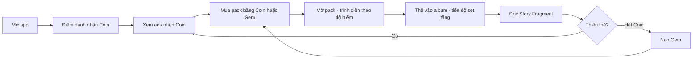

# PRD — ANIMA: Echoes of the Heart
## Product Requirements Document

| Thuộc tính | Giá trị |
|---|---|
| Mã tài liệu | PRD-ANIMA-001 |
| Phiên bản | 0.5 (Draft) — Đấu trường (CR-004); phát hành toàn cầu, 3 ngôn ngữ (CR-003); tài sản số (CR-002) |
| Ngày | 2026-10-06 |
| Phạm vi | Release 1 (MVP), định hướng Release 2–3 |
| Tài liệu liên quan | [Master Document](ANIMA_Master_Document.md), [BRD](BRD_ANIMA.md), [BDD](BDD_ANIMA.md), [Tech Stack](TECH_STACK.md), [Solution Design](SOLUTION_DESIGN.md), [Sprint Plan](SPRINT_PLAN.md), [Prototype](../prototype/index.html) |
| Trạng thái | **DRAFT — chờ Product Owner duyệt** |

### Cách đọc tài liệu này

- **PRD** trả lời: làm sản phẩm gì, cho ai, vì sao, đo thành công bằng gì, phát hành khi nào.
- **BRD** chứa quy tắc nghiệp vụ, trạng thái, phân quyền, dữ liệu. PRD không lặp lại các quy tắc đó mà dẫn chiếu ID (ví dụ BR-PACK-05).
- **BDD** chứa kịch bản kiểm thử chi tiết.
- Những điểm có ký hiệu **[Đề xuất]** là ý kiến của người soạn, chưa được PO duyệt.

---

## 1. Tầm nhìn sản phẩm

> Mỗi lần mở pack là một khoảnh khắc đáng nhớ; mỗi tấm thẻ là một mảnh cảm xúc có câu chuyện riêng.

ANIMA là nền tảng sưu tầm thẻ bài số trên **app mobile và website**, xây trên IP gốc về thế giới nơi cảm xúc con người kết tinh thành sinh thể sống (Anima). Sản phẩm cạnh tranh bằng ba điều:

1. **Mở pack như một màn trình diễn**, với hình, tiếng và rung được dàn dựng theo độ hiếm.
2. **Thẻ có chiều sâu**: mỗi thẻ có một Story Fragment; sưu tầm đủ bộ để ghép lại bí ẩn về The Fracture.
3. **Công bằng với người chơi free**: chơi đều đặn mỗi ngày kiếm được khoảng 1 pack/tuần, tỷ lệ rơi được công khai.
4. **Thẻ là tài sản thật sự của người chơi** (CR-002): mỗi thẻ là duy nhất, số lượng có hạn, kết quả kiểm chứng được; từ R2 người chơi rút được thẻ về ví riêng dưới dạng NFT.

## 2. Vấn đề cần giải quyết

| Đối tượng | Vấn đề | Bằng chứng / nguồn |
|---|---|---|
| Người sưu tầm thẻ | Thẻ vật lý tốn chi phí, dễ hỏng, giao dịch dễ bị lừa | Master Document §1.2; BRD §2.1 |
| Người chơi free | Ít app sưu tầm cho phép tham gia lâu dài mà không trả tiền | BRD P-05 |
| Người yêu câu chuyện | App thẻ bài thường có nội dung mỏng, chủ yếu cho trẻ em | Master Document §7.9 |

**Giả thuyết sản phẩm cần kiểm chứng ở MVP:**

| ID | Giả thuyết | Cách kiểm chứng | Ngưỡng đạt |
|---|---|---|---|
| H-01 | Trải nghiệm mở pack cinematic giữ người dùng quay lại | D7 retention | ≥ 15% ở soft launch; ≥ 20% sau 6 tháng |
| H-02 | Người chơi free chấp nhận xem ads để kiếm pack | % DAU xem ≥ 1 ad/ngày | ≥ 60% |
| H-03 | Story Fragment làm tăng gắn bó | Tỷ lệ người mở ít nhất 1 story trong 7 ngày đầu; so sánh D30 giữa nhóm đọc và không đọc | ≥ 40% đọc; D30 nhóm đọc cao hơn |
| H-04 | Người dùng sẵn sàng trả tiền cho pack | Tỷ lệ trả phí trong 30 ngày | ≥ 3% ở soft launch |
| H-05 | Kinh tế F2P không lỗ | Chi phí thưởng ads / doanh thu ads | ≤ 50% (BR-ECO-04) |

---

## 3. Người dùng mục tiêu

### 3.0. Thị trường mục tiêu (CR-003)

Phát hành toàn cầu theo đợt: Việt Nam (soft launch) → Đông Nam Á, Đài Loan, Hồng Kông → Bắc Mỹ, châu Âu, Úc, Nhật, Hàn. Đề xuất không phát hành ở Trung Quốc đại lục. Chi tiết ở BRD mục 4.5; danh sách cuối cùng chờ PO (Q-45).

Persona dưới đây giữ nguyên; ở thị trường Hoa ngữ, nhóm "Người sưu tầm" và "Nhà đầu tư thẻ" được kỳ vọng lớn hơn vì văn hóa sưu tầm thẻ bài phổ biến.

### 3.1. Persona

| Persona | Mô tả | Nhu cầu chính | Hành vi mong đợi | Release |
|---|---|---|---|---|
| **Linh — Người sưu tầm** (24 tuổi, nhân viên văn phòng) | Từng mua thẻ vật lý; thích hoàn thành bộ | Cảm giác mở thẻ hiếm, tiến độ bộ sưu tập | Nạp tiền định kỳ, mở nhiều pack mỗi tuần | R1 |
| **Minh — Người chơi free** (17 tuổi, học sinh) | Không có thu nhập riêng; có thời gian | Có pack mà không trả tiền | Điểm danh hằng ngày, xem đủ 10 ads | R1 (cần quy định cho người dưới 18 — BRD Q-21) |
| **Mai — Người yêu câu chuyện** (20 tuổi, sinh viên) | Thích lore, fan fantasy | Đọc story, khám phá bí ẩn | Đọc story từng thẻ, chia sẻ lên MXH | R1 |
| **Huy — Nhà đầu tư thẻ** (30 tuổi) | Mua bán thẻ hiếm để kiếm giá trị | Chợ minh bạch, giá tham khảo | Giao dịch, đấu giá | R2 |

### 3.2. Jobs-to-be-done

- *Khi tôi rảnh vài phút*, tôi muốn mở một pack và có cơ hội ra thẻ hiếm, *để thấy hồi hộp và có thứ để khoe*.
- *Khi tôi không muốn tiêu tiền*, tôi muốn có cách đều đặn kiếm pack, *để vẫn tiến bộ trong bộ sưu tập*.
- *Khi tôi có một thẻ mới*, tôi muốn biết câu chuyện của nó, *để thấy tấm thẻ có ý nghĩa hơn một hình ảnh*.
- *Khi tôi có thẻ trùng* (R2), tôi muốn bán nó, *để đổi lấy thẻ tôi còn thiếu*.

---

## 4. Mục tiêu, chỉ số và guardrail

### 4.1. North Star

**[Đề xuất] Số "người sưu tầm tích cực" mỗi tuần** = số người dùng mở ít nhất 3 pack trong tuần. Chỉ số này kết hợp được cả core loop (mở pack), retention (quay lại trong tuần) và kinh tế (có pack để mở, bằng tiền hoặc bằng Coin free).

### 4.2. Chỉ số theo giai đoạn

| Chỉ số | Soft launch (tháng 1–2) | 6 tháng | 12 tháng | Nguồn |
|---|---|---|---|---|
| DAU | 1,000 | 10,000 | — | BO-01 |
| D1 / D7 / D30 | 35% / 15% / 7% | 40% / 20% / 10% | giữ | BO-02 |
| % DAU xem ≥ 1 ad | 50% | 60% | giữ | BO-05 |
| % trả phí / MAU | 3% | 4% | 5% | BO-04 |
| MRR | — | — | $10,000 | BO-03 |
| Crash-free sessions | ≥ 99% | ≥ 99% | ≥ 99% | BO-06 |
| Rating | ≥ 4.3 | ≥ 4.5 | ≥ 4.5 | BO-06 |

Chỉ số soft launch là **[Đề xuất]**; chỉ số 6 và 12 tháng lấy từ BRD.

### 4.3. Guardrail (không được xấu đi khi tối ưu chỉ số chính)

| Guardrail | Ngưỡng |
|---|---|
| Chi phí thưởng ads / doanh thu ads | ≤ 50% mỗi tháng |
| Tỷ lệ hoàn tiền IAP | ≤ 2% doanh thu nạp |
| Khiếu nại về tỷ lệ rơi / tính minh bạch | ≤ 1% ticket hỗ trợ |
| Tài khoản bị phát hiện gian lận | ≤ 5% DAU |
| Tỷ lệ skip animation | Theo dõi; nếu > 70% sau tuần đầu thì xem lại thời lượng animation |
| Tỷ lệ mua pack bị "ăn mòn" bởi Lò rèn (CR-002) | Nếu doanh thu pack/DAU giảm > 15% sau khi mở Lò rèn, xem lại phí rèn |

---

## 5. Nguyên tắc sản phẩm

1. **Kết quả là thật, animation là trình diễn.** Kết quả do server quyết định trước; người chơi skip lúc nào cũng được mà không thiệt (BR-PACK-02, BR-PACK-08).
2. **Minh bạch trước khi trả tiền.** Tỷ lệ rơi, bộ đếm pity và giá luôn xem được trước khi xác nhận mua (BR-PACK-01).
3. **Không bao giờ rút được Gem/Coin, công ty không mua lại thẻ.** Không có tính năng, khuyến mãi hay câu chữ nào hứa giá, hứa lợi nhuận, hay dùng từ "đầu tư", "sinh lời" (BR-ECO-01 sửa theo CR-002).
3b. **Kiểm chứng được, không chỉ hứa.** Người chơi tự tính lại được mọi kết quả mở pack và rèn (BR-PF).
4. **Tôn trọng thời gian người chơi free.** Các mức thưởng phải được đưa ra sao cho chơi đều đặn kiếm khoảng 1 pack/tuần, không bắt xem ads vô hạn (BR-ADS-01).
5. **An toàn cho mọi người.** Có chế độ giảm chuyển động để tắt flash và rung màn hình; không dùng nhịp flash dễ gây hại cho người nhạy cảm ánh sáng (NFR-09).
6. **Câu chuyện là phần thưởng.** Thẻ hiếm hơn mở ra câu chuyện sâu hơn (Master Document §7.8).

---

## 6. Phạm vi Release 1 (MVP)

### 6.1. Core loop

### 6.2. Danh sách tính năng R1

Ưu tiên theo MoSCoW. ID dẫn chiếu sang BRD.

| # | Tính năng | Ưu tiên | Giá trị cho người dùng | Tham chiếu BRD |
|---|---|---|---|---|
| 1 | Đăng ký/đăng nhập email, SĐT, Google, Apple | Must | Vào app nhanh | US-01.1 → US-01.3 |
| 2 | Xác thực SĐT bằng OTP | Must | Bảo vệ tài khoản; điều kiện để giao dịch ở R2 | US-01.4 |
| 3 | Giới hạn 1 tài khoản/thiết bị, chuyển thiết bị | Must | Công bằng, chống farm | US-01.6 |
| 4 | Xóa tài khoản | Must | Quyền riêng tư; yêu cầu bắt buộc của store | US-01.7 |
| 5 | Ví Gem/Coin, lịch sử giao dịch | Must | Biết mình có gì, đã tiêu gì | US-02.1, US-02.3 |
| 6 | Nạp Gem qua IAP | Must | Mua nhanh, an toàn | US-02.2 |
| 7 | Cửa hàng pack, xem tỷ lệ rơi, bộ đếm pity | Must | Minh bạch trước khi mua | US-03.1 → US-03.3 |
| 8 | Mở pack với animation theo độ hiếm (Entry → Summary) | Must | Khoảnh khắc chính của sản phẩm | US-04.1 → US-04.5 |
| 9 | Âm thanh theo layer | Must | Tăng cảm xúc khi mở | US-04.6 |
| 10 | Skip / Fast mode | Must | Tiết kiệm thời gian khi mở nhiều pack | US-04.8 |
| 11 | Album, tiến độ set, tìm kiếm/lọc | Must | Thấy rõ sự tiến bộ | US-05.1 → US-05.3 |
| 12 | Story Fragment | Must | Gắn bó cảm xúc với thẻ | US-05.4 |
| 13 | Xem bộ sưu tập offline | Should | Xem thẻ mọi lúc | US-05.6 |
| 14 | Điểm danh, streak, Streak Freeze | Must | Lý do quay lại mỗi ngày | US-07.1 |
| 15 | Rewarded ads | Must | Kiếm pack miễn phí | US-07.2, US-09.2 |
| 16 | Tutorial với gói chào mừng 5 Anima Common thuộc 5 hệ (CR-004) | Must | Trải nghiệm "aha" ngay phút đầu | Mục 7.1 PRD, BR-NEW-01 |
| 17 | Push notification nhắc điểm danh | Should | Giữ streak | [Đề xuất] |
| 18 | Haptic theo độ hiếm | Should | Tăng cảm giác "juice" | US-04.7 (BRD xếp R2; đề xuất đưa lên R1 nếu kịp) |
| 19 | Chia sẻ ảnh kết quả mở pack | Could | Lan truyền tự nhiên | US-04.10 (BRD xếp R2) |
| 20 | Tiếng Việt, tiếng Anh, tiếng Trung giản thể và phồn thể (CR-003) | Must | Phát hành toàn cầu | NFR-08, BR-I18N |
| 28 | Ma trận tính năng theo quốc gia (CR-003) | Must | Mở được nhiều thị trường mà vẫn tuân thủ luật từng nơi | BR-GEO |
| 21 | Chế độ giảm chuyển động | Must | An toàn, accessibility | NFR-09 |
| 22 | Admin: người dùng, thẻ, pack/tỷ lệ, cấu hình kinh tế, dashboard | Must | Vận hành | EP-10 |
| 23 | **Website người chơi**: đăng nhập, ví, nạp Gem qua cổng thanh toán, cửa hàng, mở pack, bộ sưu tập, story | Must | Dùng trên máy tính; nạp với phí thấp hơn store; chia sẻ link | BRD 4.4, BR-WEB |
| 24 | **Lò rèn**: 2 thẻ + phí (Coin hoặc Gem) → 1 thẻ chưa lật | Must | Không còn thẻ "vô giá trị"; giảm tổng cung | BR-FRG |
| 25 | **Kiểm chứng công bằng** (commit–reveal) | Must | Niềm tin vào tỷ lệ | BR-PF |
| 26 | **Số lượng phát hành và số thứ tự** `#n/N` | Must | Độ hiếm minh bạch | BR-SUP |
| 27 | Quy đổi Gem ↔ Coin hai chiều | Must | Linh hoạt trả phí rèn, mua pack | BR-WAL-05/06 |
| 29 | **Chỉ số chiến đấu trên thẻ** (CR-004): loại thẻ, Cộng hưởng, ATK/DEF/HP, kỹ năng, mạch truyện, công thức Hợp thể; bất biến sau phát hành | Must | Thẻ có giá trị sử dụng, chuẩn bị cho Đấu trường R2 | BR-CARD, US-13.1 |
| 30 | **Nhiệm vụ Tân thủ 7 ngày** (CR-004): 5 pack cơ bản, thẻ gắn chặt tài khoản | Must | Người chơi free đủ 30 lá trong ~5 ngày | BR-NEW-02 → 05, US-13.2 |

### 6.2A. Nền tảng (CR-001)

| Nền tảng | Vai trò trong sản phẩm |
|---|---|
| App mobile (iOS, Android) | Kênh chính: vòng lặp hằng ngày (điểm danh, ads), mở pack đầy đủ, push |
| Website người chơi | Kênh bổ sung: mở pack, bộ sưu tập, nạp Gem qua cổng thanh toán, sau này là chợ giao dịch (R2) vì thao tác mua bán trên màn hình lớn tiện hơn |
| Website admin | Vận hành nội bộ |

Ma trận chi tiết tính năng theo nền tảng ở BRD mục 4.4. Ở R1, điểm danh và rewarded ads chỉ có trên app (BR-WEB-03).

### 6.3. Không làm ở R1

| Hạng mục | Release | Lý do hoãn |
|---|---|---|
| Chợ P2P, đấu giá | R2 | Cần hệ thống chống gian lận và dữ liệu giá; rủi ro RMT cao |
| Nhiệm vụ hàng ngày, referral, thành tựu | R2 | Tập trung vào core loop trước |
| Feed, follow, chat, leaderboard | R2 | Cần lượng người dùng đủ lớn |
| NFT: liên kết ví, rút/nạp thẻ, royalty (CR-002) | R2 | Cần gate pháp lý (BRD Q-41), audit smart contract, KYC |
| Livestream mở pack | R2 | Cần BRD riêng |
| Đấu trường: trận hướng dẫn, PvE Act 1, luyện tập, giao hữu, xây bộ bài (CR-004) | R2 | Cần engine luật dùng chung client/server, mô phỏng cân bằng (Q-51) |
| Đấu trường: xếp hạng theo mùa, cược Arena Point, giải đấu, Draft, xem lại trận (CR-004) | R3 | Cần đủ người chơi để ghép trận, chống thông đồng; Q-57 hỏi có đưa sớm hơn không |
| Battle Pass, AR/3D | R3 | Ngoài MVP |

---

## 7. User journey

### 7.1. Phiên đầu tiên (FTUE) — mục tiêu: mở pack đầu tiên trong vòng 2 phút

| Bước | Người dùng | Sản phẩm | Mục tiêu đo |
|---|---|---|---|
| 1 | Mở app lần đầu | Chọn ngôn ngữ; cảnh mở đầu ngắn về Heart-Song (có thể bỏ qua) | `ftue_started` |
| 2 | Xác nhận độ tuổi | Hỏi ngày sinh (BR-ACC-01) | `age_gate_passed` |
| 3 | Đăng ký | Ưu tiên đăng nhập một chạm Google/Apple | `signup_completed` < 60 giây từ bước 1 |
| 4 | Nhận gói chào mừng | Nhận 100 Coin đăng nhập lần đầu + gói chào mừng 5 Anima Common thuộc 5 hệ khác nhau, gắn chặt tài khoản (BR-NEW-01, 04) | — |
| 5 | Mở gói chào mừng | Hướng dẫn thao tác "vuốt để xé"; full animation, không cho skip ở lần này | `tutorial_pack_opened` < 2 phút từ bước 1 |
| 6 | Xem thẻ và story | Gợi ý đọc Story Fragment thẻ hiếm nhất | `story_read` |
| 7 | Điểm danh ngày 1 | Giới thiệu streak | `checkin_completed` |
| 8 | Hoàn thành tutorial | Nhận 200 Coin | `tutorial_completed` |
| 9 | Gợi ý xác thực SĐT | Giải thích lợi ích (bảo vệ tài khoản, giao dịch ở R2) | `phone_verified` |
| 10 | Giới thiệu nhiệm vụ Tân thủ | Thanh tiến độ "5/30 lá — đủ 30 lá để vào Đấu trường"; nhiệm vụ ngày 1 (BR-NEW-03) | `newbie_quest_day_completed` |
| 11 (R2) | Trận hướng dẫn | Trận có kịch bản với bộ bài mượn, đối thủ là máy; dạy Cộng hưởng, khắc hệ, bẫy, Hợp thể (BR-NEW-06) | `tutorial_battle_completed` |

**Gói chào mừng (CR-004, thay pack tutorial bảo đảm Rare ở v0.4):** 5 Anima Common thuộc 5 hệ khác nhau trong 7 hệ vòng nhân quả, không có thẻ hiếm, không có bài hỗ trợ. Nội dung và quy tắc chọn được công khai như mọi pack khác (BR-PACK-01). Không được ngầm "bơm" tỷ lệ của pack thường cho người mới. Người chơi đủ 30 lá bằng nhiệm vụ Tân thủ (5 pack cơ bản), quảng cáo, điểm danh hoặc mua pack (BR-NEW-02, 03).

### 7.2. Vòng lặp hằng ngày

1. Nhận push nhắc điểm danh (khung giờ người dùng hay mở app).
2. Điểm danh → thấy streak và mốc tiếp theo.
3. Xem ads trong lúc rảnh (tối đa 10 lượt, cooldown 60 giây).
4. Đủ 1,000 Coin → mở pack.
5. Thẻ mới → tiến độ set → đọc story.

### 7.3. Hành trình người trả phí

1. Hết Coin, thấy pack mới hoặc pack giới hạn thời gian.
2. Xem tỷ lệ rơi và bộ đếm pity.
3. Chọn gói Gem → thanh toán qua App Store/Google Play.
4. Gem vào ví ngay sau khi server xác thực (BR-WAL-02) → mua và mở pack.

---

## 8. Yêu cầu chi tiết theo khu vực sản phẩm

Các mục dưới đây mô tả **trải nghiệm cần đạt**. Quy tắc nghiệp vụ nằm ở BRD; bố cục và component do Product Designer quyết định.

### 8.1. Trải nghiệm mở pack

| Yêu cầu | Chi tiết | Tham chiếu |
|---|---|---|
| 6 giai đoạn | Entry → Presentation → Tearing → Reveal → Climax (chỉ khi có Epic+) → Summary | Master Document §4.2, BR-PACK-07 |
| Thời lượng mục tiêu | Pack thường 15–40 giây, pack cao cấp 60–90 giây khi xem đầy đủ | Master Document §4.1 |
| Thứ tự lật | Từ thấp đến cao; thẻ hiếm nhất cuối cùng | BR-PACK-06 |
| Phản ánh độ hiếm | Màu, particle, âm thanh, rung khác nhau cho 6 bậc rarity | Master Document §4.3 |
| Skip | Luôn khả dụng; lần đầu (tutorial) không cho skip | BR-PACK-08 |
| Fast mode | Lật tất cả thẻ cùng lúc, giữ climax ngắn cho Epic+ | US-04.8 |
| Mất mạng giữa chừng | Mở lại app vẫn thấy kết quả pack vừa mở | BR-PACK-02 |
| Giảm chuyển động | Tắt flash, rung màn hình, giảm particle | NFR-09 |
| Hiệu năng | ≥ 60fps trên thiết bị tầm trung; tự giảm hiệu ứng trên máy yếu | NFR-01 |
| Thời gian chờ | Từ lúc bấm mở đến lúc bắt đầu animation < 1 giây | NFR-02 |

**Tiêu chí chấp nhận sản phẩm (ngoài BDD):** trong kiểm thử với 10–15 người dùng trước soft launch, ít nhất 70% mô tả khoảnh khắc ra thẻ Legendary bằng từ ngữ tích cực mạnh ("đã", "phê", "nổi da gà"), và không ai bị chóng mặt hoặc khó chịu khi bật chế độ giảm chuyển động.

### 8.2. Cửa hàng và ví

| Yêu cầu | Chi tiết |
|---|---|
| Danh sách pack | Giá bằng Coin và Gem; nhãn pack mới, pack giới hạn thời gian |
| Thông tin pack | Tỷ lệ rơi theo rarity, số thẻ/pack, bộ đếm pity hiện tại, danh sách thẻ có thể ra |
| Gói Gem **[Đề xuất, chờ PO]** | 100 Gem ($0.99), 550 Gem ($4.99), 1,200 Gem ($9.99), 2,600 Gem ($19.99) |
| Lịch sử | Mọi biến động Gem/Coin kèm lý do và thời gian |
| Thông báo nạp | Báo rõ khi đang chờ xác thực (RECEIPT_PENDING) để người dùng không nạp lại |

### 8.3. Bộ sưu tập và câu chuyện

| Yêu cầu | Chi tiết |
|---|---|
| Album | Theo set; thẻ chưa có hiện dạng ẩn; số bản trùng |
| Tiến độ | "X/Y thẻ" theo set và theo hệ cảm xúc |
| Lọc | Tên, hệ, rarity |
| Story Fragment | Mở khi sở hữu thẻ; độ dài theo rarity (Master Document §7.8) |
| Collection Journal **[Đề xuất]** | Một trang "nhật ký" tổng hợp các story đã mở theo thứ tự câu chuyện của Act 1 |

### 8.4. Điểm danh và quảng cáo

| Yêu cầu | Chi tiết |
|---|---|
| Lịch streak | Hiển thị 7 ngày của chu kỳ hiện tại và mốc kế tiếp (14/30/100) |
| Streak Freeze | Hiện số Freeze đang có; giải thích tự động dùng khi bỏ lỡ |
| Ads | Số lượt còn lại hôm nay, thời gian cooldown, phần thưởng của lượt kế tiếp (gồm bonus lượt thứ 5/10) |
| Không ép xem ads | Không có quảng cáo xen kẽ (interstitial) hay banner ở R1 **[Đề xuất]** |

### 8.5. Nội dung cần có khi phát hành

| Nội dung | Số lượng | Trạng thái |
|---|---|---|
| Set "Awakening" (art + story VI/EN) | 100 thẻ = 80 Anima + 20 bài hỗ trợ, có chỉ số chiến đấu và mạch truyện (BR-CARD-07; BRD CF-06: danh sách hiện chỉ có 96) | Chưa có |
| Pack Definition | Gói chào mừng, pack cơ bản Tân thủ, Standard **[Đề xuất thêm Premium]** | Chưa có |
| Animation theo rarity | 6 bậc | Có spec, chưa có asset |
| Sound | ≥ 20 sound, 5 layer | Có spec, chưa có asset |
| Cảnh mở đầu Heart-Song | 1 (≤ 30 giây, bỏ qua được) | Chưa có |

---

## 9. Kế hoạch đo lường (analytics)

Mọi sự kiện có thuộc tính chung: `account_id`, `device_id` (mobile) hoặc `web_session_id` (web), `app_version`, `platform` (`ios`/`android`/`web`), `country_tier`, `legal_country`, `locale` (`vi`/`en`/`zh-Hans`/`zh-Hant`), `session_id`.

| Sự kiện | Khi nào | Thuộc tính riêng | Dùng cho |
|---|---|---|---|
| `ftue_started` | Mở app lần đầu | `language` | Funnel FTUE |
| `age_gate_passed` / `age_gate_blocked` | Sau bước xác nhận tuổi | `age_band` | Funnel, tuân thủ |
| `signup_completed` | Tạo tài khoản | `method` | Funnel |
| `phone_verified` | OTP thành công | `attempts` | Funnel |
| `tutorial_completed` | Xong tutorial | `duration_sec` | Funnel |
| `store_viewed` | Mở cửa hàng | — | Chuyển đổi |
| `odds_viewed` | Xem tỷ lệ rơi | `pack_definition_id` | Minh bạch |
| `pack_purchased` | Mua pack thành công | `pack_definition_id`, `currency`, `price` | Kinh tế |
| `pack_opened` | Server trả kết quả | `pack_definition_id`, `max_rarity`, `pity_before`, `pity_triggered` | Kinh tế, H-01 |
| `pack_animation_finished` | Hết animation hoặc skip | `skipped`, `skip_at_stage`, `watch_sec`, `reduced_motion` | Tối ưu animation |
| `card_collected` | Mỗi thẻ mới | `card_definition_id`, `rarity`, `is_duplicate` | Bộ sưu tập |
| `set_completed` | Hoàn thành set | `set_id` | Retention |
| `story_read` | Mở Story Fragment | `card_definition_id`, `read_sec` | H-03 |
| `forge_completed` | Rèn thành công (server) | `fee_currency`, `fee_amount`, `input_rarities` | Kinh tế, tổng cung |
| `sealed_card_revealed` | Lật thẻ rèn (server) | `rarity` | Kinh tế |
| `fairness_seed_rotated` / `fairness_verified` | Đổi seed / dùng công cụ kiểm chứng | — | Niềm tin |
| `checkin_completed` | Điểm danh | `streak`, `coin`, `freeze_used` | Retention |
| `streak_broken` | Streak reset | `streak_before` | Retention |
| `ad_requested` / `ad_rewarded` / `ad_failed` | Vòng đời một lượt ads | `network`, `ad_type`, `reward`, `daily_count` | H-02, H-05 |
| `iap_started` / `iap_completed` / `iap_failed` | Vòng đời nạp | `sku`, `price_usd`, `error` | H-04 |
| `share_clicked` | Chia sẻ | `channel`, `content_type` | Lan truyền |
| `newbie_quest_day_completed` | Xong nhóm nhiệm vụ một ngày (server) | `day`, `late` | Funnel Tân thủ, RK-25 |
| `deck_saved` (R2) | Lưu bộ bài hợp lệ | `anima_count`, `support_count`, `elements`, `rarity_mix` | Đấu trường |
| `tutorial_battle_completed` (R2) | Xong trận hướng dẫn | `duration_sec`, `retries` | Funnel |
| `match_started` / `match_finished` (R2) | Vòng đời một trận (server) | `mode`, `arena_id`, `turns`, `duration_sec`, `result`, `end_reason`, `deck_elements` | Cân bằng, độ dài trận 3–5 phút |
| `fusion_performed` (R2) | Hợp thể trong trận | `recipe_id` | Cân bằng |
| `ap_wagered` / `ap_settled` (R3) | Cược Arena Point | `amount`, `result` | Kinh tế AP |

Sự kiện kinh tế (`pack_purchased`, `pack_opened`, `ad_rewarded`, `iap_completed`, `checkin_completed`) phải được ghi **từ server** để số liệu không bị client làm sai.

### Dashboard cần có từ ngày đầu

1. Funnel FTUE (bước 1 → 9 ở mục 7.1).
2. Retention cohort D1/D7/D30.
3. Kinh tế: Coin phát ra và Coin tiêu đi mỗi ngày; chi phí thưởng ads / doanh thu ads; tỷ lệ pity được kích hoạt.
4. Doanh thu: IAP theo gói, ARPPU, tỷ lệ hoàn tiền.
5. Animation: tỷ lệ skip theo giai đoạn và theo rarity.
6. Tân thủ (CR-004): tỷ lệ người mới đủ 30 lá theo ngày 1 → 7.
7. Đấu trường (R2): độ dài trận (mục tiêu trung vị 3–5 phút), tỷ lệ thắng theo hệ, theo sàn, theo lượt đi trước, theo tổng rarity của bộ bài (cảnh báo khi chênh > 5 điểm %).

---

## 10. Kế hoạch phát hành

| Giai đoạn | Thời gian (dự kiến) | Đối tượng | Mục tiêu | Điều kiện chuyển giai đoạn |
|---|---|---|---|---|
| Prototype mở pack | Tháng 1–2 | Nội bộ + 10–15 người dùng thử | Kiểm chứng cảm xúc khi mở pack | Đạt tiêu chí mục 8.1 |
| Closed beta | Tháng 3–4 | 500–1,000 người (TestFlight, Play internal) | Ổn định, kinh tế, FTUE | Crash-free ≥ 99%; không có lỗi tiền; FTUE hoàn thành ≥ 60% |
| Soft launch **[Đề xuất: chỉ Việt Nam]** | Tháng 5–6 | Công khai trên store tại VN | Chỉ số soft launch mục 4.2 | Đạt D7 ≥ 15% và guardrail kinh tế |
| Đợt 1 toàn cầu (CR-003) | Sau soft launch | Đông Nam Á, Đài Loan, Hồng Kông; vi/en/zh-Hans/zh-Hant | Tăng trưởng, kiểm chứng thị trường Hoa ngữ | Đạt chỉ số soft launch; Legal duyệt ma trận từng nước; đủ 4 bản dịch |
| Đợt 2 toàn cầu | Sau đợt 1 | Bắc Mỹ, châu Âu, Úc, Nhật, Hàn | Mở rộng | Legal rà luật loot box, tài sản số, dữ liệu cá nhân từng nước |

Mốc tháng tính từ khi bắt đầu phát triển, khớp với Roadmap MVP 3–6 tháng ở Master Document §8.1.

### 10.1. Launch checklist (điều kiện bắt buộc trước soft launch)

- [ ] Toàn bộ kịch bản BDD có tag `@R1` đạt.
- [ ] Tỷ lệ rơi mọi pack được công khai trong app và qua kiểm định thống kê (SC-PACK-16).
- [ ] Đối soát IAP và ledger chạy hằng ngày, lệch = 0 trong 14 ngày beta.
- [ ] Ý kiến pháp lý về loot box, thanh toán, người dưới 18 tuổi, dữ liệu cá nhân (BRD Q-20, Q-21, Q-24).
- [ ] Chính sách quyền riêng tư, điều khoản sử dụng (gồm cấm mua bán tài khoản/thẻ lấy tiền thật).
- [ ] App qua kiểm duyệt App Store và Google Play.
- [ ] Mô phỏng kinh tế cho thấy chi phí thưởng ads ≤ 50% doanh thu ads ở tỷ lệ người dùng VN dự kiến.
- [ ] Đủ 100 thẻ set "Awakening" với story VI/EN.
- [ ] Chế độ giảm chuyển động được kiểm tra.
- [ ] Quy trình hỗ trợ khách hàng và xử lý gian lận sẵn sàng.
- [ ] Website người chơi: cổng thanh toán chạy production, đối soát hằng ngày lệch = 0, ý kiến Legal về Q-31, Q-33, Q-34.

---

### 10.2. Ràng buộc kỹ thuật ảnh hưởng tới sản phẩm

Công nghệ đã chốt (Master Document mục 9, [TECH_STACK.md](TECH_STACK.md)): Unity cho toàn bộ app, backend .NET; cloud chưa chốt. Hệ quả cho sản phẩm:

| Ràng buộc | Hệ quả |
|---|---|
| Một codebase Unity cho iOS và Android | Hai nền tảng phát hành cùng lúc, cùng tính năng |
| Asset thẻ tải sau qua Addressables | Lần đầu mở một set cần tải thêm; cần màn hình tải có tiến độ |
| Animation chạy trên engine game | Đạt được spec từng frame; các màn nhiều form (ví, lịch sử) cần thiết kế gọn vì làm trên Unity tốn công hơn |
| Screen reader trên Unity cần làm thêm | Ước lượng công sức accessibility riêng khi lập kế hoạch sprint |
| Kết quả do server quyết định | Mở pack cần có mạng; offline chỉ xem bộ sưu tập |

## 11. Phụ thuộc và rủi ro sản phẩm

| # | Rủi ro / phụ thuộc | Ảnh hưởng | Giảm thiểu | Tham chiếu |
|---|---|---|---|---|
| 1 | Asset (art 100 thẻ, animation, sound) chậm | Trễ launch | Bắt đầu sản xuất art song song với code; prototype dùng asset tạm | BRD §17.3 |
| 2 | Thưởng ads lỗ ở Tier 2 | Kinh tế âm | Thưởng theo tier, trần chi phí | BRD CF-04, RK-02 |
| 3 | Bị coi là cờ bạc | Bị gỡ app, phạt | Công khai tỷ lệ, không rút tiền, tư vấn luật | BRD RK-01 |
| 4 | Người dùng skip animation quá nhiều | Mất giá trị khác biệt | Đo `skip_at_stage`, rút ngắn giai đoạn bị skip nhiều | Mục 9 |
| 5 | Người dưới 18 chiếm tỷ lệ lớn ở nhóm free | Ràng buộc pháp lý về thanh toán | Chờ Legal; chuẩn bị luồng đồng ý của người giám hộ | BRD Q-21 |
| 6 | Đấu trường bị cảm nhận là "nạp tiền là thắng" | Mất người chơi free, tranh luận cộng đồng | Khung chỉ số theo chi phí, giới hạn thẻ hiếm/bộ, mô phỏng trước khi mở | BRD RK-22 |
| 7 | Cược Arena Point bị coi là cờ bạc | Pháp lý | AP không mua được, không đổi ra tiền hay vật phẩm có giá; bật theo ma trận quốc gia | BRD BR-PVP-03, 04 |

---

## 12. Quyết định cần PO đưa ra

Ngoài các câu hỏi mở trong BRD mục 16, PRD cần thêm:

| ID | Câu hỏi | Đề xuất |
|---|---|---|
| PQ-01 | North Star là "người sưu tầm tích cực/tuần"? | Có |
| PQ-02 | Pack tutorial có bảng tỷ lệ riêng, bảo đảm ≥ 1 Rare? | **Đã thay bằng gói chào mừng 5 Common (CR-004)** |
| PQ-03 | Soft launch chỉ ở Việt Nam? | Có |
| PQ-04 | Bảng giá gói Gem (mục 8.2)? | Theo đề xuất, cần Finance kiểm tra |
| PQ-05 | Đưa haptic và chia sẻ ảnh lên R1? | Haptic lên R1; chia sẻ để R1 nếu còn thời gian |
| PQ-06 | Không có interstitial/banner ở R1? | Đồng ý |
| PQ-07 | Thêm pack Premium ở launch? | Chờ số liệu beta |
| PQ-08 | Thị trường và thứ tự đợt phát hành (BRD Q-45)? | Theo đề xuất BRD 4.5.2 |
| PQ-09 | Ngôn ngữ hỗ trợ khách hàng và kênh cộng đồng (Discord/Facebook/LINE…) theo thị trường? | vi, en, zh; kênh theo thị trường |

---

*End of Document*
