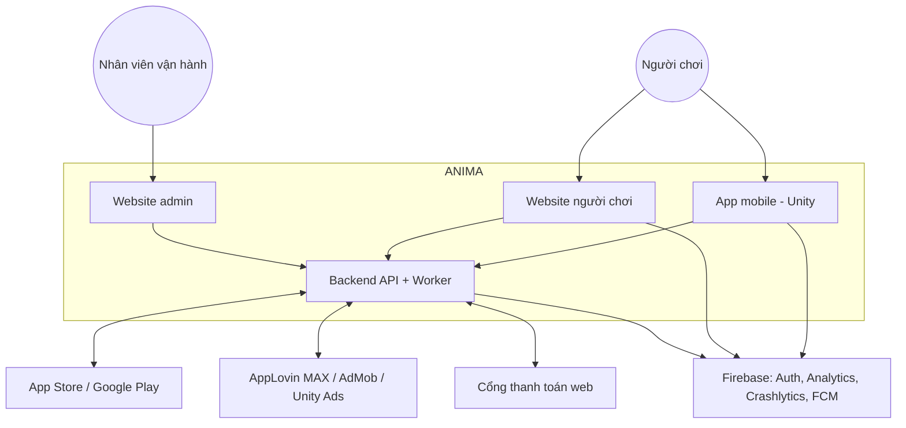
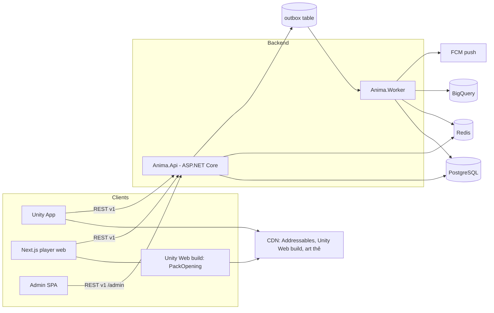
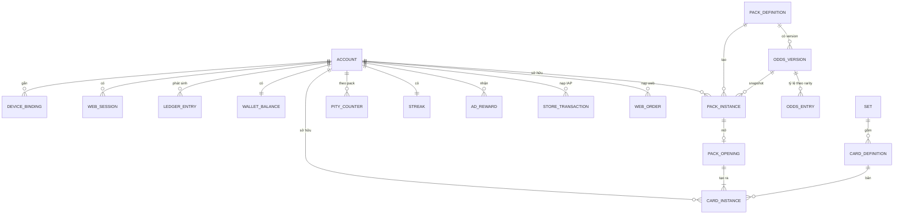
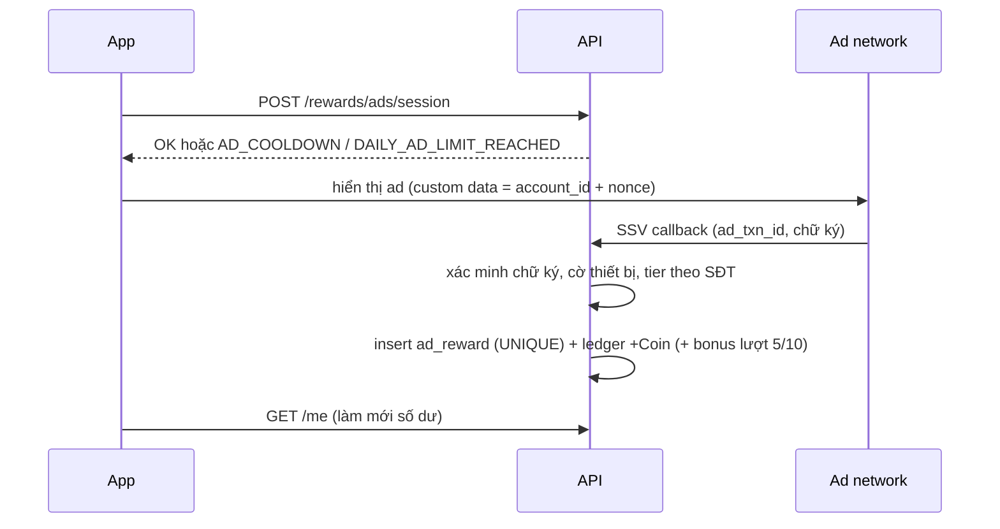
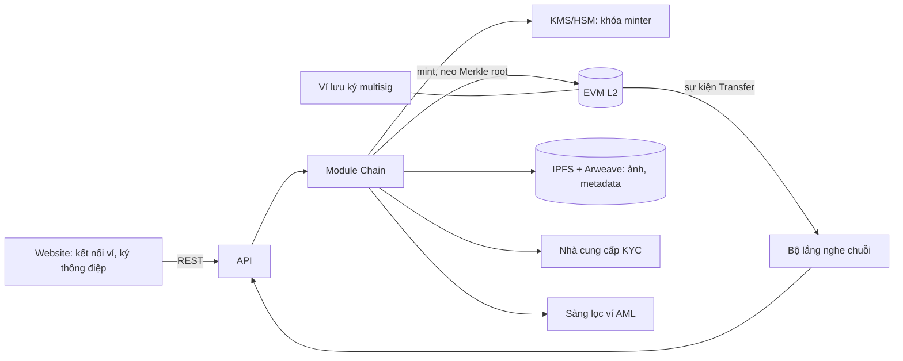
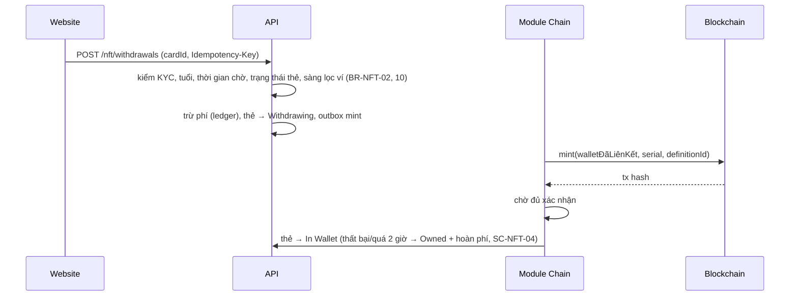

# Solution Design — ANIMA: Echoes of the Heart

| Thuộc tính | Giá trị |
|---|---|
| Mã tài liệu | SAD-ANIMA-001 |
| Phiên bản | 0.4 (Draft) — thêm kiến trúc Đấu trường (CR-004); quốc tế hóa (CR-003); CR-002 |
| Ngày | 2026-10-06 |
| Đầu vào | [BRD](BRD_ANIMA.md) v0.6, [PRD](PRD_ANIMA.md) v0.5, [BDD](BDD_ANIMA.md) v0.5, [Tech Stack](TECH_STACK.md) v0.6 |
| Trạng thái | Chờ Tech Lead review |

Tài liệu mô tả **cách xây** hệ thống. Quy tắc nghiệp vụ nằm ở BRD, lựa chọn công nghệ và lý do nằm ở Tech Stack; ở đây chỉ dẫn chiếu ID.

---

## MỤC LỤC

1. [Phạm vi giải pháp](#1-phạm-vi-giải-pháp)
2. [Kiến trúc tổng thể](#2-kiến-trúc-tổng-thể)
3. [Cấu trúc repository](#3-cấu-trúc-repository)
4. [Backend](#4-backend)
5. [Mô hình dữ liệu](#5-mô-hình-dữ-liệu)
6. [Thiết kế API](#6-thiết-kế-api)
7. [Luồng xử lý chính](#7-luồng-xử-lý-chính)
8. [Thuật toán quay pack](#8-thuật-toán-quay-pack)
9. [App mobile (Unity)](#9-app-mobile-unity)
10. [Website người chơi](#10-website-người-chơi)
11. [Website admin](#11-website-admin)
12. [Bảo mật](#12-bảo-mật)
13. [Quan sát hệ thống](#13-quan-sát-hệ-thống)
14. [Môi trường, CI/CD và Git contract](#14-môi-trường-cicd-và-git-contract)
15. [Chiến lược kiểm thử](#15-chiến-lược-kiểm-thử)
16. [Rủi ro kỹ thuật, spike và ADR](#16-rủi-ro-kỹ-thuật-spike-và-adr)
17. [Blockchain và NFT (CR-002)](#17-blockchain-và-nft-cr-002)
18. [Toàn cầu và đa ngôn ngữ (CR-003)](#18-toàn-cầu-và-đa-ngôn-ngữ-cr-003)

---

## 1. Phạm vi giải pháp

| Thành phần | Người dùng | Release |
|---|---|---|
| App mobile iOS/Android (Unity) | Người chơi | R1 |
| Website người chơi (Next.js + Unity Web) | Người chơi | R1 |
| Website admin (React + Refine) | CS Agent, Content Manager, Economy Manager, Fraud Analyst, Finance Viewer, Super Admin | R1 |
| Backend API + Worker (.NET) | Mọi client, store, ad network, cổng thanh toán | R1 |
| Chợ, đấu giá, cộng đồng (SignalR) | Người chơi | R2 |

Ma trận tính năng theo nền tảng: BRD mục 4.4.

---

## 2. Kiến trúc tổng thể

### 2.1. Context



### 2.2. Container



**Nguyên tắc:** client không bao giờ quyết định số dư, kết quả pack hay phần thưởng (BR-PACK-02). Mọi client gọi cùng một API; khác biệt theo nền tảng do header `X-Client-Platform` và chính sách ở server (BR-WEB-03).

---

## 3. Cấu trúc repository

Monorepo, mỗi thư mục gốc có một owner chính. Đây là cơ sở cho `allowed_files` của từng task trong [SPRINT_PLAN.md](SPRINT_PLAN.md).

```
/
├─ backend/
│  ├─ Anima.sln
│  ├─ Directory.Build.props, Directory.Packages.props
│  ├─ src/
│  │  ├─ Anima.Api/                  # host, routing, auth, middleware
│  │  ├─ Anima.Worker/               # job: đối soát, xuất analytics, outbox
│  │  ├─ Anima.Contracts/            # DTO, mã lỗi, enum — netstandard2.1, dùng chung với Unity
│  │  ├─ Anima.SharedKernel/         # Result, Money, Clock, Idempotency, Outbox
│  │  ├─ Anima.Battle.Rules/         # (R2, CR-004) luật trận tất định — netstandard2.1, dùng chung với Unity
│  │  └─ Modules/
│  │     ├─ Identity/  Wallet/  Catalog/  Gacha/  Collection/
│  │     ├─ Rewards/   Payments/ Fraud/   Admin/  Analytics/
│  │     ├─ Fairness/  Forge/   (R2) Chain/
│  │     └─ (R2) Marketplace/  Social/  Battle/  Decks/  (R3) Arena/
│  └─ tests/
│     ├─ Anima.UnitTests/  Anima.IntegrationTests/  Anima.Bdd/  Anima.ArchTests/
├─ mobile/
│  └─ AnimaUnity/                    # Unity 6 project
│     └─ Assets/Anima/{Core,Net,UI,PackOpening,Collection,Rewards,Wallet}/
├─ web/
│  ├─ pnpm-workspace.yaml, turbo.json
│  ├─ apps/player/                   # Next.js
│  ├─ apps/admin/                    # Vite + Refine
│  └─ packages/{api-client,ui,config}/
├─ infra/
│  ├─ docker-compose.yml             # PostgreSQL, Redis, mock store/gateway cho dev
│  └─ terraform/                     # khi chốt cloud (T-02)
├─ contracts/openapi/anima.v1.yaml   # contract nguồn, sinh client cho web và kiểm tra Unity
├─ chain/                            # (R2) smart contract Solidity + Foundry test, script deploy
├─ docs/   prototype/   .vibe/   .github/workflows/
```

**Ranh giới module:** module chỉ lộ ra `I<Module>Api` (interface) trong project `<Module>.Contracts`; không module nào truy vấn bảng của module khác. Kiểm tra tự động bằng `Anima.ArchTests` (NetArchTest).

---

## 4. Backend

### 4.1. Cấu trúc một module

```
Modules/Gacha/
├─ Gacha.Contracts/     # IGachaApi, DTO nội bộ, integration event
├─ Gacha.Domain/        # entity, value object, quy tắc thuần (không I/O)
├─ Gacha.Application/   # use case (command/query handler), validation
├─ Gacha.Infrastructure/# EF Core DbContext riêng schema "gacha", repository
└─ Gacha.Endpoints/     # minimal API endpoints, mapping DTO
```

- Mỗi module có **schema PostgreSQL riêng** (`identity`, `wallet`, `catalog`, `gacha`, …) và DbContext riêng.
- Giao dịch xuyên module trong một request (ví dụ mua pack: trừ ví + tạo Pack Instance) chạy trong **một transaction PostgreSQL** qua `IUnitOfWork` dùng chung connection. Đây là lợi thế của modular monolith; khi tách service sau này sẽ chuyển sang saga.
- Sự kiện bất đồng bộ (analytics, push, gắn cờ gian lận) ghi vào bảng `outbox` trong cùng transaction; Worker đọc và phát.

### 4.2. Trách nhiệm module

| Module | Trách nhiệm | Rule chính |
|---|---|---|
| Identity | Tài khoản, ngày sinh/đồng ý giám hộ, thiết bị mobile, phiên web, trạng thái + lý do hạn chế, xóa tài khoản | BR-ACC-*, BR-WEB-02 |
| Wallet | Ledger Gem/Coin, số dư, giữ tiền (hold) cho đấu giá R2, đổi Gem→Coin | BR-WAL-*, BR-ECO-01/02 |
| Payments | Xác thực receipt IAP, thông báo hoàn tiền store, đơn nạp web + IPN | BR-WAL-02/04, BR-WEB-04/05/07 |
| Catalog | Mùa, Set, Card Definition, số lượng phát hành, Story, Pack Definition, version tỷ lệ (pack và rèn), maker-checker | BR-ADM-02/03, BR-PACK-01/04, BR-SUP-01/05 |
| Gacha | Mua pack, quay, pity, bản ghi mở pack, chọn thẻ theo số bản còn lại | BR-PACK-*, BR-SUP-03/04 |
| Fairness | Server seed / client seed / nonce, công bố mã băm, công bố seed cũ, công cụ kiểm tra | BR-PF-* |
| Forge | Lò rèn: hủy 2 thẻ, thu phí, tạo và lật thẻ chưa lật | BR-FRG-* |
| Chain (R2) | Liên kết ví, mint, theo dõi nạp, neo Merkle root, KYC/sàng lọc ví | BR-NFT-*, BR-PF-06 |
| Collection | Card Instance, tiến độ set, quyền đọc story | US-05.* |
| Rewards | Điểm danh, streak, Freeze, rewarded ads (SSV), tham số thưởng có version | BR-CHK-*, BR-ADS-*, BR-ECO-03/04 |
| Fraud | Cờ thiết bị (Play Integrity/App Attest), điểm rủi ro, captcha, quy tắc gắn cờ | BR-FRD-* |
| Admin | RBAC admin, audit log, che PII, bồi thường | BR-ADM-01/04 |
| Compliance | Quốc gia pháp lý, ma trận tính năng theo quốc gia, danh sách trừng phạt, tuổi theo quốc gia | BR-GEO-* |
| Analytics | Phát sự kiện server-side ra BigQuery | PRD mục 9 |

### 4.3. Thư viện và quy ước

- Minimal API + endpoint filter; FluentValidation; EF Core + Npgsql; Dapper cho truy vấn ledger.
- `Money` là value object gồm `Currency` (`GEM`/`COIN`) và `long Amount` (đơn vị nguyên, không dùng số thực).
- `IClock` được inject để test các kịch bản thời gian trong BDD.
- `IRandomSource` bọc `RandomNumberGenerator` để test thuật toán quay bằng nguồn có thể điều khiển.

---

## 5. Mô hình dữ liệu

### 5.1. ERD rút gọn (R1)



### 5.2. Bảng then chốt

| Bảng (schema) | Cột chính | Ràng buộc |
|---|---|---|
| `identity.account` | id (uuid), firebase_uid, email_norm, phone_e164, birth_date, guardian_consent_at, status, restriction_reason, timezone, created_at | UNIQUE(email_norm), UNIQUE(phone_e164) khi đã xác thực; timezone cố định khi đăng ký (BR-CHK-01) |
| `identity.device_binding` | device_id, account_id, bound_at, unbound_at | UNIQUE(device_id) với `unbound_at IS NULL` |
| `identity.web_session` | id, account_id, browser_fingerprint, created_at, revoked_at | Tối đa 3 đang hoạt động — kiểm tra trong transaction (BR-WEB-02) |
| `wallet.ledger_entry` | id, account_id, currency, amount (+/−), reason, ref_type, ref_id, idempotency_key, reverses_entry_id, created_at | Chỉ INSERT (quyền DB); UNIQUE(idempotency_key) |
| `wallet.balance` | account_id, currency, amount, version | Cập nhật cùng transaction với ledger; CHECK(amount ≥ 0) cho COIN |
| `payments.store_transaction` | store, store_txn_id, account_id, sku, gem, status, refunded_at | UNIQUE(store, store_txn_id) |
| `payments.web_order` | id, account_id, gateway, gateway_txn_id, sku, gem, amount_vnd, status, ipn_received_at | UNIQUE(gateway, gateway_txn_id) |
| `catalog.odds_version` | id, pack_definition_id, effective_from, status (draft/approved/active/retired), created_by, approved_by | `approved_by ≠ created_by` (BR-ADM-02); không UPDATE khi `active` |
| `gacha.pack_instance` | id, account_id, pack_definition_id, odds_version_id, purchase_ledger_entry_id, status | status ∈ Unopened/Opened/Revoked |
| `gacha.pack_opening` | pack_instance_id (PK), results (jsonb), pity_before, pity_after, pity_triggered, rng_trace, opened_at | PK chống mở hai lần (SC-PACK-13) |
| `gacha.pity_counter` | account_id, pack_definition_id, count | PK(account_id, pack_definition_id) |
| `catalog.edition` | card_definition_id, season_id, max_supply, issued, burned | CHECK(issued ≤ max_supply); `max_supply` khóa khi mùa mở bán; cập nhật `issued` bằng `UPDATE … WHERE issued < max_supply` |
| `fairness.seed` | id, account_id, server_seed (mã hóa), server_seed_hash, client_seed, next_nonce, status (active/revealed), revealed_at | Một seed `active` mỗi tài khoản |
| `forge.forge_record` | id, account_id, input_card_ids[2], fee_currency, fee_amount, sealed_card_id, created_at | Hai thẻ đầu vào cập nhật `Burned` trong cùng transaction |
| `forge.sealed_card` | id, account_id, forge_odds_version_id, status (Sealed/Revealed), result_card_instance_id, seed_id, nonce | |
| `chain.wallet_link` | account_id, address, chain_id, signed_message, linked_at, screening_result | UNIQUE(address) |
| `chain.nft_transfer` | card_instance_id, direction (withdraw/deposit), tx_hash, block, confirmations, status | UNIQUE(tx_hash, log_index) |
| `collection.card_instance` | id, serial, card_definition_id, owner_id, status, soulbound, origin_type, origin_id | status ∈ Owned/Listed/InAuction/Locked |
| `rewards.checkin` | account_id, local_date, streak_after, coin, freeze_used | PK(account_id, local_date) |
| `rewards.ad_reward` | ad_txn_id, network, account_id, local_date, seq_in_day, reward, status | UNIQUE(network, ad_txn_id) |
| `admin.audit_log` | id, actor_id, action, target_type, target_id, before, after, reason, created_at | Chỉ INSERT |
| `shared.idempotency` | key, account_id, endpoint, request_hash, response, created_at | Trả lại response cũ khi trùng key (SC-PACK-05) |
| `shared.outbox` | id, type, payload, created_at, processed_at | |

**PII:** `email_norm`, `phone_e164`, `birth_date` được mã hóa ở tầng ứng dụng (AES-GCM, khóa từ secret manager); lưu thêm hash (HMAC) để tra cứu và kiểm tra trùng.

---

## 6. Thiết kế API

### 6.1. Quy ước

| Hạng mục | Quy ước |
|---|---|
| Kiểu | REST JSON, prefix `/api/v1`, admin dưới `/api/v1/admin` |
| Contract | `contracts/openapi/anima.v1.yaml` là nguồn; CI so sánh với OpenAPI sinh từ code và chặn thay đổi phá vỡ |
| Xác thực người chơi | `Authorization: Bearer <Firebase ID token>`; server xác minh, ánh xạ sang `account_id` |
| Xác thực admin | SSO công ty (OIDC) + MFA; token riêng, không dùng Firebase |
| Nền tảng | `X-Client-Platform: ios|android|web`, `X-App-Version`; mobile gửi thêm `X-Device-Id` và token toàn vẹn thiết bị |
| Idempotency | Header `Idempotency-Key` (UUID) bắt buộc cho mọi lệnh tạo tiền/bản ghi |
| Lỗi | `{ "code": "INSUFFICIENT_BALANCE", "message": "...", "details": {...}, "traceId": "..." }` — `code` lấy từ danh sách mã lỗi trong BDD |
| Thời gian | ISO-8601 UTC; ngày nghiệp vụ (điểm danh, ads) tính theo `account.timezone` |
| Phân trang | Cursor (`?cursor=&limit=`) |

### 6.2. Endpoint R1

| Method | Path | Mục đích | Ghi chú |
|---|---|---|---|
| POST | `/accounts` | Tạo tài khoản sau đăng nhập Firebase lần đầu | Kiểm tra tuổi, thiết bị |
| GET | `/me` | Hồ sơ, trạng thái, số dư, streak | |
| POST | `/me/phone/otp`, `/me/phone/verify` | Xác thực SĐT | BR-ACC-05 |
| POST | `/me/deletion`, DELETE `/me/deletion` | Yêu cầu / hủy xóa tài khoản | |
| POST | `/web-sessions` | Tạo phiên web (OTP nếu trình duyệt mới) | BR-WEB-02 |
| GET | `/wallet/ledger` | Lịch sử | |
| POST | `/payments/iap/verify` | Gửi receipt | Idempotent theo store txn |
| POST | `/payments/web/orders` | Tạo đơn nạp web, trả URL thanh toán | |
| POST | `/webhooks/{store}` , `/webhooks/gateway/{name}` | Thông báo store, IPN cổng | Xác minh chữ ký |
| GET | `/packs`, `/packs/{id}` | Danh sách pack, tỷ lệ version hiện hành, pity | |
| POST | `/packs/{id}/purchase` | Mua pack (kèm `oddsVersionId` đã xem) | ODDS_CHANGED |
| POST | `/pack-instances/{id}/open` | Mở pack, trả kết quả + thứ tự lật + cờ climax | Trả lại kết quả nếu đã mở |
| GET | `/collection`, `/collection/sets/{id}` | Bộ sưu tập, tiến độ | |
| GET | `/cards/{id}/story` | Story Fragment | CARD_NOT_COLLECTED |
| GET | `/fairness/seed` | Mã băm server seed hiện tại, client seed, nonce | Không trả server seed đang dùng |
| POST | `/fairness/seed/rotate` | Đổi seed; trả server seed cũ | BR-PF-04 |
| GET | `/fairness/verify/{openingId}` | Dữ liệu để tự tính lại một lần quay | Công khai sau khi seed đã công bố |
| POST | `/forge` | Rèn 2 thẻ + phí (Coin hoặc Gem) | Idempotent; SC-FRG-* |
| POST | `/forge/sealed/{id}/reveal` | Lật thẻ chưa lật | |
| POST | `/wallet/convert` | Đổi Gem ↔ Coin | BR-WAL-05/06 |
| GET | `/editions?season=` | Số lượng tối đa, đã phát hành, đã hủy | Công khai |
| POST | `/nft/wallets` | Liên kết ví (EIP-4361) | R2, chỉ web |
| POST | `/nft/withdrawals` | Rút thẻ về ví | R2, chỉ web |
| POST | `/rewards/checkin` | Điểm danh | Chỉ mobile |
| POST | `/rewards/freeze` | Mua/nhận Streak Freeze | |
| POST | `/rewards/ads/session` | Xin phiên xem ad (kiểm cooldown, giới hạn) | Chỉ mobile |
| POST | `/webhooks/ads/{network}` | SSV callback | |
| Admin | `/admin/accounts`, `/admin/cards`, `/admin/sets`, `/admin/packs`, `/admin/odds-versions`, `/admin/odds-versions/{id}/approve`, `/admin/economy-params`, `/admin/compensations`, `/admin/audit`, `/admin/reports/*` | Vận hành | RBAC + maker-checker |

---

## 7. Luồng xử lý chính

### 7.1. Mua và mở pack

```mermaid
sequenceDiagram
    participant C as Client (app/web)
    participant API
    participant DB as PostgreSQL
    C->>API: POST /packs/{id}/purchase (oddsVersionId, Idempotency-Key)
    API->>DB: BEGIN; kiểm idempotency; kiểm odds version đang hiệu lực
    API->>DB: ghi ledger −1000 COIN; cập nhật balance (CHECK ≥ 0)
    API->>DB: tạo pack_instance (odds_version_id); outbox pack_purchased; COMMIT
    API-->>C: 201 packInstanceId, balance
    C->>API: POST /pack-instances/{pid}/open
    API->>DB: BEGIN; SELECT pack_instance FOR UPDATE
    alt đã có pack_opening
        API-->>C: 200 kết quả cũ (PACK_ALREADY_OPENED)
    else Unopened
        API->>API: quay theo odds_version + pity (mục 8)
        API->>DB: insert pack_opening, card_instance x5, cập nhật pity, status=Opened; outbox; COMMIT
        API-->>C: 200 thẻ, thứ tự lật, climax, pity mới
    end
    C->>C: phát animation (có thể skip)
```

### 7.2. Nạp IAP và hoàn tiền

```mermaid
sequenceDiagram
    participant App
    participant API
    participant Store as App Store / Google Play
    App->>Store: mua SKU
    Store-->>App: receipt
    App->>API: POST /payments/iap/verify (receipt)
    API->>Store: xác thực receipt
    alt hợp lệ, chưa ghi nhận
        API->>API: ledger +Gem, store_transaction=Completed
        API-->>App: số dư mới
        App->>Store: finish transaction
    else timeout
        API-->>App: RECEIPT_PENDING (job thử lại tới 24h)
    end
    Store->>API: thông báo REFUND (server notification)
    API->>API: ledger −Gem; nếu âm → Restricted(NEGATIVE_GEM)
```

### 7.3. Rewarded ad với SSV



### 7.4. Nạp Gem trên website

```mermaid
sequenceDiagram
    participant W as Website
    participant API
    participant G as Cổng thanh toán
    W->>API: POST /payments/web/orders (sku)
    API-->>W: orderId, paymentUrl
    W->>G: chuyển hướng tới trang thanh toán
    G->>API: IPN (gateway_txn_id, chữ ký)
    API->>API: xác minh chữ ký + đối chiếu số tiền; ledger +Gem (UNIQUE gateway_txn_id)
    G-->>W: chuyển về return URL
    W->>API: GET /payments/web/orders/{id}
    API-->>W: Completed hoặc Chờ xác nhận (không cộng dựa trên return URL)
```

### 7.5. Đăng nhập và gắn thiết bị / phiên web

- **Mobile:** Firebase sign-in → `POST /accounts` hoặc `GET /me` kèm `X-Device-Id`. Server kiểm `device_binding`: thiết bị đang gắn tài khoản khác thì trả DEVICE_BOUND_TO_OTHER_ACCOUNT; tài khoản đổi thiết bị thì kiểm hạn mức 2 lần/30 ngày.
- **Web:** Firebase sign-in → `POST /web-sessions`. Trình duyệt chưa từng dùng với tài khoản Verified thì yêu cầu OTP; phiên thứ 4 làm thu hồi phiên cũ nhất.

---

## 8. Thuật toán quay pack và Lò rèn

### 8.1. Sinh số ngẫu nhiên có thể kiểm chứng (BR-PF)

```
digest   = HMAC-SHA256(key = server_seed, message = "{client_seed}:{nonce}:{slot}")
LIMIT    = floor(2^32 / 1,000,000) × 1,000,000 = 4,294,000,000
for i in 0, 4, 8, … 28:                       # 8 khối 4 byte
    u = uint32_big_endian(digest[i : i+4])
    if u < LIMIT: return u mod 1,000,000      # loại bỏ thiên lệch modulo
nếu cả 8 khối bị loại: dùng message "{client_seed}:{nonce}:{slot}:1" và lặp lại
```

- `slot` là số thứ tự `0..4` cho rarity; giá trị chọn Card Definition dùng message `"{client_seed}:{nonce}:{slot}:c"`.
- Vector kiểm thử chuẩn: SC-PF-01 (server seed `anima-demo-server-seed-001`, client seed `keeper2049`, nonce 1 → 457142, 594361, 140124, 227524, 278885).
- Server seed sinh bằng CSPRNG 32 byte, lưu mã hóa; chỉ mã băm SHA-256 được trả cho client cho tới khi người chơi đổi seed.
- Mỗi lần mở pack hoặc lật thẻ rèn dùng **một** nonce rồi tăng 1; mở pack và đổi seed khóa cùng dòng `fairness.seed` để không trộn seed (SC-PF-05).

### 8.2. Mở pack

1. Lấy `odds_version` từ Pack Instance (snapshot, BR-PACK-04) và seed đang `active` của tài khoản.
2. Với mỗi slot 0..4: tra giá trị quay vào bảng cộng dồn phần triệu để ra rarity.
3. **Pity (BR-PACK-05):** nếu `pity_counter = 49` và không slot nào ra Legendary+, slot có rarity thấp nhất (slot nhỏ nhất nếu bằng nhau) được đổi thành Legendary. **[Cần PO xác nhận — Q-09]**
4. **Chọn thẻ (BR-SUP-03):** với mỗi slot, lấy danh sách Card Definition còn bản của rarity đó, sắp theo `card_definition_id`; chỉ số = giá trị quay `:c` mod số phần tử. Khóa dòng `catalog.edition`, tăng `issued`, gán số thứ tự edition và serial.
5. Nếu một rarity hết sạch giữa chừng (do đồng thời): giao dịch quay lại bước 4 với danh sách mới; nếu rarity đã rỗng hoàn toàn thì tạm ngừng bán pack (BR-SUP-04) và vẫn hoàn tất lần mở bằng rarity thấp hơn gần nhất còn bản, ghi rõ lý do trong bản ghi. **[Cần PO xác nhận cách xử lý này — bổ sung vào Q-39]**
6. Cập nhật pity; sắp thứ tự lật (BR-PACK-06); `climax = max_rarity ≥ Epic`.
7. Ghi bản ghi mở pack: seed_id, nonce, các giá trị quay, danh sách Card Definition đủ điều kiện ở mỗi slot, pity trước/sau. Đây là dữ liệu mà công cụ kiểm chứng công khai dùng để tính lại.

### 8.3. Lò rèn (BR-FRG)

1. Kiểm tra hai thẻ: khác nhau, thuộc người chơi, trạng thái `Owned`, không soulbound (SC-FRG-04).
2. Trong một transaction: khóa hai dòng thẻ (`FOR UPDATE`), trừ phí (ledger), đặt hai thẻ `Burned`, tăng `burned` của edition, tạo `sealed_card`. Thiếu tiền thì rollback toàn bộ (SC-FRG-03).
3. Lật: như 8.2 bước 2 và 4 với **một** slot, dùng `forge_odds_version` và kho số lượng của mùa hiện tại; **không** áp pity hay bất kỳ hệ số nào (BR-FRG-03).

Kiểm định: test thống kê 1,000,000 lượt cho mỗi version tỷ lệ pack và tỷ lệ rèn trong CI (SC-PACK-16, NFR-12).

---

## 9. App mobile (Unity)

| Lớp | Thiết kế |
|---|---|
| Kiến trúc | Scene `Boot` → `Main` (UI Toolkit, điều hướng tab) → `PackOpening` (scene additive) |
| Mã nguồn | `Assets/Anima/Core` (DI, config, clock), `Net` (HTTP client, retry, idempotency key, map mã lỗi), `UI`, `PackOpening`, `Collection`, `Rewards`, `Wallet` |
| Contract | Dùng DLL `Anima.Contracts` (netstandard2.1) build từ backend → không lệch DTO/mã lỗi |
| State | Store đơn giản theo màn hình; nguồn sự thật là server; cache bộ sưu tập mã hóa cho offline |
| PackOpening | `PackOpeningDirector` nhận kết quả server → chọn Timeline theo rarity cao nhất → phát 6 giai đoạn; `Skip()` nhảy tới Summary |
| Chất lượng | `QualityProfile` (Low/Mid/High) chọn theo GPU/RAM: số particle, shake, glow, holo shader |
| Giảm chuyển động | Cờ hệ thống + cài đặt app → tắt flash/shake, giảm particle |
| Asset | Addressables: nhóm theo set; tải trước khi vào PackOpening |
| SDK | Firebase (Auth, Analytics, Crashlytics, Messaging), Unity IAP, AppLovin MAX, Play Integrity/App Attest, FMOD, Nice Vibrations |
| Bản Unity Web | Build riêng chỉ chứa scene PackOpening + asset cần thiết; nhận kết quả qua `SendMessage` từ JavaScript |

---

## 10. Website người chơi

| Hạng mục | Thiết kế |
|---|---|
| Route chính | `/` (trang chủ, streak chỉ xem), `/store`, `/packs/[id]`, `/open/[packInstanceId]`, `/collection`, `/cards/[id]`, `/wallet`, `/wallet/topup`, `/account`; R2: `/u/[handle]` (công khai, SSR), `/market` |
| Render | Trang công khai SSR; trang cần đăng nhập render phía client gọi API |
| Đăng nhập | Firebase Web SDK → `POST /web-sessions`; token giữ trong bộ nhớ + cookie httpOnly cho phiên SSR |
| Mở pack | Component `<PackOpening>`: kiểm tra WebGL2 + bộ nhớ → tải lười bản Unity Web (cache) → gửi kết quả vào Unity; nếu không đạt điều kiện hoặc bật giảm chuyển động → `<LiteReveal>` (CSS 3D flip) |
| Thanh toán | Trang `/wallet/topup` tạo đơn → redirect cổng → trang kết quả hỏi trạng thái từ API |
| Điểm danh/ads | Hiển thị streak; nút điểm danh hướng sang app (BR-WEB-03) |
| i18n | `vi`, `en` (next-intl) |
| Kiểm thử | Playwright e2e cho luồng mua → mở → xem bộ sưu tập |

---

## 11. Website admin

| Hạng mục | Thiết kế |
|---|---|
| Khung | Vite + React + Refine + Ant Design; resource: accounts, cards, sets, packs, odds-versions, economy-params, compensations, audit, reports |
| Đăng nhập | SSO OIDC + MFA; vai trò lấy từ claim, map sang 6 vai trò BRD mục 12.2 |
| Phân quyền | Ẩn/hiện theo quyền ở UI, **thực thi ở backend** bằng policy theo vai trò (SC-ADM-03) |
| Maker-checker | Bản nháp → gửi duyệt → người khác duyệt → hiệu lực theo `effective_from`; UI hiện diff giữa version |
| PII | Mặc định hiển thị che; nút "Xem đầy đủ" chỉ cho Fraud Analyst/Super Admin và ghi audit |
| Truy cập mạng | Chỉ qua VPN công ty hoặc identity-aware proxy |

---

## 12. Bảo mật

| Chủ đề | Biện pháp | Liên quan |
|---|---|---|
| Xác thực | Firebase ID token xác minh mỗi request; admin dùng SSO + MFA | |
| Phân quyền | Policy theo trạng thái tài khoản (SC-PERM-01) và vai trò admin; mặc định từ chối | BRD 12 |
| Toàn vẹn thiết bị | Play Integrity / App Attest; kết quả lưu vào Fraud, ảnh hưởng quyền nhận thưởng | BR-FRD-01 |
| Webhook | Xác minh chữ ký store, ad network, cổng thanh toán; từ chối khi sai; ghi log gian lận | SC-ADS-12, SC-WEB-11 |
| Dữ liệu cá nhân | Mã hóa cột PII, HMAC để tra cứu; che theo vai trò; audit khi xem | BRD 13.1 |
| Secret | Secret manager của cloud; không có secret trong repo; quét bằng gitleaks trong CI | |
| Rate limit | Theo tài khoản, thiết bị, IP cho API kinh tế; captcha web khi đăng nhập/nạp | NFR-16 |
| Mobile | Theo OWASP MASVS: certificate pinning cho API, không lưu token dạng rõ, chống debug cơ bản | |
| Web | CSP chặt (cho phép domain Unity build/CDN), cookie `HttpOnly; Secure; SameSite=Lax`, CSRF token cho thao tác ghi qua cookie | |
| Dữ liệu tiền | Ledger chỉ INSERT ở mức quyền DB; đối soát hằng ngày | NFR-11 |

---

## 13. Quan sát hệ thống

| Loại | Nội dung |
|---|---|
| Log | JSON có `traceId`, `accountId` (đã băm), không ghi PII |
| Trace | OpenTelemetry từ API → DB → Redis → webhook |
| Metric kỹ thuật | p95 latency `/purchase`, `/open`; tỷ lệ lỗi; độ trễ outbox |
| Metric nghiệp vụ | Pack mở/phút theo rarity; Coin phát/tiêu theo nguồn; tỷ lệ pity kích hoạt; SSV thất bại; đơn web chờ xác nhận > 15 phút |
| Cảnh báo | Lỗi API mua/mở > 1% trong 5 phút; lệch ledger ≠ 0; lệch đối soát IAP/cổng; chi phí ads ≥ 45% doanh thu (SC-ECO-05) |
| Client | Crashlytics; sự kiện `pack_animation_finished` để đo FPS/skip |

---

## 14. Môi trường, CI/CD và Git contract

### 14.1. Môi trường

| Môi trường | Mục đích | Dữ liệu |
|---|---|---|
| local | docker-compose PostgreSQL + Redis + mock store/gateway/SSV | Seed giả |
| dev | Tích hợp liên tục từ `main` | Seed giả |
| staging | Kiểm thử QA, sandbox IAP, ad test mode, cổng thanh toán sandbox | Dữ liệu giả, cấu hình như production |
| production | Người dùng thật | Thật |

### 14.2. Git contract

| Hạng mục | Quy ước |
|---|---|
| Mô hình | Trunk-based: `main` luôn deploy được |
| Nhánh | `feat/T###-mo-ta-ngan`, `fix/T###-...`, `chore/T###-...` |
| Commit | Conventional Commits: `feat(gacha): ...`, tham chiếu `T###` |
| Pull request | Bắt buộc review; task `risk_tier=high` cần 2 reviewer, trong đó 1 người không viết code đó |
| CI bắt buộc | Build, test, lint/format, kiểm tra OpenAPI không phá vỡ, gitleaks, ArchTests |
| Merge | Squash merge; xóa nhánh sau merge |
| Release | Tag `vMAJOR.MINOR.PATCH`; backend deploy staging tự động, production cần duyệt |

### 14.3. Lệnh chuẩn (dùng trong `.vibe/project-context.md`)

| Mục đích | Lệnh |
|---|---|
| Hạ tầng local | `docker compose -f infra/docker-compose.yml up -d` |
| Build backend | `dotnet build backend/Anima.sln` |
| Test backend | `dotnet test backend/Anima.sln` |
| Format backend | `dotnet format backend/Anima.sln --verify-no-changes` |
| Web cài đặt | `pnpm -C web install` |
| Web build/test/lint | `pnpm -C web turbo run build test lint` |
| Sinh API client | `pnpm -C web --filter api-client generate` |
| Unity test | GameCI `unity-test-runner` (EditMode + PlayMode) |

---

## 15. Chiến lược kiểm thử

| Tầng | Công cụ | Phạm vi |
|---|---|---|
| Unit | xUnit | Domain thuần: phí, pity, streak, tier thưởng |
| Integration | Testcontainers (PostgreSQL, Redis) | Transaction, ràng buộc UNIQUE, đồng thời |
| BDD | Reqnroll chạy kịch bản trong BDD_ANIMA.md | Mọi kịch bản `@R1` trước release |
| Contract | So OpenAPI; test client sinh từ contract | Web, admin, Unity |
| Kiến trúc | NetArchTest | Ranh giới module |
| Unity | Unity Test Framework | Map kết quả → timeline, skip, quality profile |
| Web e2e | Playwright | Luồng chính trên website người chơi và admin |
| Hiệu năng | k6 | 100,000 CCU (NFR-04), p95 mua/mở pack |
| RNG | Test thống kê | SC-PACK-16 |
| Bảo mật | OWASP ZAP (web), MobSF (app), kiểm tra quyền theo SC-ADM-03 | Trước closed beta |

---

## 16. Rủi ro kỹ thuật, spike và ADR

### 16.1. Rủi ro và spike

| # | Rủi ro | Spike / biện pháp | Sprint |
|---|---|---|---|
| TR-01 | Unity Web quá nặng hoặc lỗi trên Safari iOS | T009: đo dung lượng, thời gian tải, FPS; chế độ rút gọn là phương án dự phòng | S00 |
| TR-02 | Animation không đạt 60fps trên máy tầm trung | Prototype PackOpening sớm, đo trên thiết bị thật | S03 |
| TR-03 | Firebase Phone Auth đắt ở VN | So sánh chi phí với SMS brandname nội địa | S01 |
| TR-04 | Đồng thời tiêu tiền từ app và web | Khóa dòng `balance` + `CHECK`; test SC-WEB-03 | S02 |
| TR-05 | Cổng thanh toán chưa chọn | Lớp adapter + mock để không chặn tiến độ | S06 |
| TR-06 | Unity và .NET dùng chung contract | Build `Anima.Contracts` netstandard2.1 và import vào Unity ở S00 | S00 |
| TR-07 | Lỗi smart contract hoặc lộ khóa ví lưu ký (CR-002) | Dùng OpenZeppelin, audit độc lập trước mainnet, multisig cho quyền admin, KMS/HSM cho khóa minter, giới hạn mint theo giờ | R2 |
| TR-08 | Chọn thẻ theo số bản còn lại khi nhiều người mở đồng thời | Khóa dòng `edition`, test tải tập trung vào thẻ sắp hết bản | S004 |

### 16.2. ADR cần ghi

| ADR | Quyết định | Trạng thái |
|---|---|---|
| ADR-001 | Modular monolith .NET, schema riêng mỗi module | Đề xuất |
| ADR-002 | Ledger append-only + balance cập nhật cùng transaction | Đề xuất |
| ADR-003 | Firebase Auth cho người chơi, SSO cho admin | Đề xuất |
| ADR-004 | Unity Web cho mở pack trên website + LiteReveal | Chờ spike T009 |
| ADR-005 | OpenAPI là nguồn contract; `Anima.Contracts` dùng chung với Unity | Đề xuất |
| ADR-006 | Cloud provider | Hoãn (T-02) |
| ADR-007 | Commit–reveal theo tài khoản (HMAC-SHA256, server/client seed, nonce) | Đề xuất (CR-002) |
| ADR-008 | Thẻ nằm trong cơ sở dữ liệu cho tới khi rút; mint khi rút; neo Merkle root hằng ngày | Đề xuất (CR-002) |
| ADR-009 | Chọn blockchain (EVM L2) và nhà cung cấp KYC, sàng lọc ví | Chờ quyết định (T-09, T-10) |

---

## 17. Blockchain và NFT (CR-002)

Chỉ triển khai ở R2 và chỉ sau gate pháp lý (BR-NFT-01). Phần R1 (commit–reveal, số lượng phát hành, Lò rèn) không cần blockchain.

### 17.1. Nguyên tắc

| Nguyên tắc | Lý do |
|---|---|
| Thẻ nằm trong cơ sở dữ liệu cho tới khi người chơi rút (mint khi rút) | Chơi, rèn, giao dịch trong app không tốn phí gas; chỉ tốn khi rút |
| Hằng ngày neo Merkle root của mọi Card Instance mới và mọi mã băm server seed lên chuỗi (BR-PF-06) | Mọi thẻ, kể cả chưa rút, đều chứng minh được là duy nhất và tồn tại từ ngày nào, chỉ tốn 1 giao dịch/ngày |
| Smart contract là nơi thực thi số lượng tối đa và token ID = serial | Không ai, kể cả công ty, mint vượt giới hạn hay mint trùng |
| Công ty không có quyền chuyển, sửa, hủy token trong ví người chơi | BR-NFT-08 |
| Gem/Coin không lên chuỗi | Giữ kinh tế khép kín, giảm rủi ro pháp lý |

### 17.2. Thành phần



| Thành phần | Thiết kế |
|---|---|
| `AnimaCards` (ERC-721 + ERC-2981) | `maxSupply[definitionId]` đặt một lần trước khi mùa mở bán; `mint(to, serial, definitionId)` chỉ cho role MINTER; royalty mặc định 5%; tạm dừng được mint, **không** tạm dừng được chuyển nhượng |
| `AnimaCommitments` | Hàm `commit(day, merkleRootCards, merkleRootSeeds)` chỉ cho role COMMITTER; chỉ ghi, không sửa |
| Quyền admin contract | Multisig (ví dụ 2/3 người); không có hàm chuyển token của người khác |
| Ví lưu ký | Địa chỉ multisig nhận NFT nạp vào; đốt token khi thẻ đã nạp được đưa vào Lò rèn |
| Module Chain (.NET) | Nethereum: dựng và gửi giao dịch, quản lý nonce, thử lại; outbox cho job mint; idempotent theo serial |
| Bộ lắng nghe | Đọc sự kiện `Transfer` của contract, chờ đủ số xác nhận, ghi `chain.nft_transfer` (UNIQUE tx_hash + log_index — SC-NFT-11) |
| Metadata | JSON theo chuẩn ERC-721 metadata: tên, mô tả, `image: ipfs://CID`, thuộc tính hệ, rarity, mùa, edition `#n/N`; pin trên IPFS, bản sao Arweave |
| Website | wagmi + viem + WalletConnect để kết nối ví; liên kết ví bằng thông điệp chuẩn Sign-In with Ethereum (EIP-4361) |

### 17.3. Luồng rút thẻ về ví



### 17.4. Luồng nạp lại

1. Người chơi chuyển token từ ví đã liên kết tới ví lưu ký.
2. Bộ lắng nghe thấy sự kiện `Transfer(from, vault, tokenId)`, chờ đủ xác nhận.
3. Nếu `from` đã liên kết với tài khoản X: Card Instance (serial = tokenId) chuyển về X, trạng thái `Owned`. Nếu chưa liên kết: giữ "Chờ liên kết" (SC-NFT-10).

### 17.5. Việc cần làm trước khi lên mainnet

- Audit smart contract bởi đơn vị độc lập.
- Chạy toàn bộ luồng trên testnet ít nhất một mùa beta.
- Runbook sự cố: tạm dừng mint, xoay khóa minter, liên lạc người chơi.
- Ý kiến pháp lý (Q-41), chọn chuỗi (T-09), KYC và sàng lọc ví (T-10).

---

## 18. Toàn cầu và đa ngôn ngữ (CR-003)

### 18.1. Module Compliance

| Thành phần | Thiết kế |
|---|---|
| `compliance.legal_country` | Gán khi đăng ký theo BR-GEO-01; đổi chỉ qua API admin có audit |
| `compliance.feature_matrix` | Bảng version hóa: quốc gia × tính năng → bật/tắt + tham số (tuổi tối thiểu, tuổi cần người giám hộ, hạn mức); maker-checker, có trường "Legal duyệt bởi" |
| Policy check | Endpoint filter `[RequiresFeature("forge")]` trên mọi endpoint của tính năng có thể tắt; trả `FEATURE_NOT_AVAILABLE_IN_REGION` |
| Danh sách trừng phạt | Danh sách quốc gia bị chặn trong cấu hình, kiểm tra ở đăng ký, đăng nhập, nạp, rút NFT (BR-GEO-03) |
| Xác suất từng thẻ | API `/packs/{id}` trả thêm xác suất từng Card Definition khi ma trận quốc gia yêu cầu (BR-GEO-05) |

### 18.2. Bản địa hóa

| Lớp | Thiết kế |
|---|---|
| API | Header `Accept-Language`; ngôn ngữ đã chọn lưu ở `identity.account.locale` (BR-I18N-01) |
| Mã lỗi | Server trả `code` cố định; client tra thông điệp theo locale. `message` của server chỉ để debug |
| Nội dung thẻ | `catalog.card_definition_translation(card_definition_id, locale, epithet, story, …)`; kiểm tra đủ 4 locale trước khi mở bán set (SC-I18N-03) |
| Thông báo, email | Template theo locale |
| Unity | Unity Localization; font CJK tải theo locale qua Addressables (NFR-18) |
| Web | next-intl; route có tiền tố locale (`/vi`, `/en`, `/zh-Hans`, `/zh-Hant`) cho trang công khai |
| CI | Kiểm tra khóa dịch thiếu, chuỗi dài vượt giới hạn, ký tự lạ; chụp ảnh màn hình 4 ngôn ngữ trong e2e |

### 18.3. Hạ tầng toàn cầu

- R1: một region chính (đề xuất Singapore) + CDN toàn cầu cho asset và bản Unity Web.
- Đo NFR-17 từ các thị trường đợt 1 bằng synthetic monitoring.
- Region thứ hai và nơi lưu dữ liệu theo luật từng nước: quyết định theo Q-50 (T-12).
- Thời gian: mọi mốc lưu UTC; ngày nghiệp vụ theo múi giờ tài khoản; sự kiện toàn cầu (mùa, pack giới hạn) công bố theo UTC kèm giờ địa phương.

---

## 19. Đấu trường (CR-004)

Luật ở BRD 10.18 → 10.25, kịch bản ở BDD 12D. Phần này mô tả cách xây.

### 19.1. Nguyên tắc

1. **Server quyết định.** Client chỉ gửi ý định (`PlayCard`, `Attack`, `SetTrap`, `Fuse`, `EndTurn`); server kiểm tra, tính kết quả và phát trạng thái mới. Client không bao giờ thấy bài trên tay hoặc bẫy úp của đối thủ.
2. **Một thư viện luật dùng chung.** `Anima.Battle.Rules` (netstandard2.1, C# thuần, không I/O, không `DateTime.Now`, không `Random` hệ thống) chạy giống hệt trên server và trong Unity. Unity dùng nó để dự đoán (hiện số sát thương trước khi xác nhận) và phát lại replay; kết quả thật vẫn lấy từ server.
3. **Tất định.** Trạng thái trận = hàm của (bộ bài hai bên, seed trận, danh sách hành động). Xáo bài và mọi lựa chọn ngẫu nhiên dùng HMAC-DRBG từ seed trận theo cơ chế commit–reveal ở mục 8 (hash seed công bố khi bắt đầu, seed công bố khi kết thúc). Nhờ vậy replay chỉ cần lưu danh sách hành động.
4. **Số nguyên.** Hệ số (1.25, 0.75, +15%…) lưu dưới dạng phần nghìn và tính bằng số nguyên, làm tròn chục theo một quy tắc duy nhất, để server và Unity (IL2CPP, nhiều CPU) cho cùng kết quả.
5. **Dữ liệu thẻ bất biến.** Engine đọc chỉ số từ `catalog.card_definition` theo phiên bản; không có cơ chế sửa chỉ số sau phát hành (BR-CARD-06). Cân bằng bằng `battle.format` và danh sách cấm.

### 19.2. Thành phần

| Thành phần | Vị trí | Vai trò |
|---|---|---|
| `Anima.Battle.Rules` | `backend/src/Anima.Battle.Rules` | Mô hình trạng thái, kiểm tra hành động hợp lệ, tính sát thương, khắc hệ, sàn, Cộng minh, Hợp thể, bẫy, đột tử |
| Module `Battle` | `backend/src/Modules/Battle` | Vòng đời trận, đồng hồ lượt, lưu hành động, kết thúc trận, ghi kết quả |
| Module `Decks` | `backend/src/Modules/Decks` | CRUD bộ bài, kiểm tra hợp lệ (BR-DECK), bộ mặc định |
| Module `Arena` (R3) | `backend/src/Modules/Arena` | Ghép trận, rating Glicko-2, mùa, Arena Point ledger, giải đấu |
| `BattleHub` | SignalR | Kênh realtime: gửi hành động, nhận trạng thái và sự kiện hiển thị |
| Bot | `Battle.Application/Bots` | AI cho tutorial (kịch bản), PvE (theo độ khó), luyện tập |
| Simulation harness | `backend/tools/Anima.Battle.Sim` | Cho máy đấu máy hàng trăm nghìn trận để chỉnh hệ số trước khi phát hành set (Q-51) |
| Unity `Battle` | `mobile/AnimaUnity/Assets/Anima/Battle/` | Bàn đấu, kéo thả, animation sát thương, kết nối hub, replay |

### 19.3. Vòng đời trận

```
Queued ─► Matched ─► DeckSelect (15 s) ─► InProgress ─► Finished
                         │                    │
                         └─ hết giờ: bộ mặc định / hủy ghép   └─ mất kết nối > 60 s: thua (BR-PVP)
```

- Mỗi trận chạy trên **một node** (actor trong bộ nhớ, khóa phân tán bằng Redis theo `match_id`). Mỗi hành động được ghi vào `battle.match_action` trước khi phát trạng thái, nên node chết thì node khác dựng lại trận bằng cách phát lại hành động.
- Đồng hồ lượt do server giữ (20 s + 30 s dự trữ). Hết giờ: server tự `EndTurn`.
- Kết thúc: ghi `battle.match` (kết quả, lý do), phát integration event `MatchFinished`; Arena cập nhật rating và AP trong cùng transaction với ledger.

### 19.4. Dữ liệu

| Bảng | Cột chính | Ghi chú |
|---|---|---|
| `catalog.card_definition` (thêm cột) | `card_type`, `resonance_cost`, `atk`, `def`, `hp`, `skill_id`, `arc_id`, `stats_version` | Bất biến sau phát hành |
| `catalog.fusion_recipe` | `id`, `input_a`, `input_b`, `output_card_definition_id`, `cost` | |
| `catalog.arena` | `id`, `home_element`, `rule_id` | 8 sàn |
| `decks.deck` | `id`, `account_id`, `name`, `is_default`, `format`, `cards jsonb`, `valid_at` | Tối đa 10 bộ |
| `battle.match` | `id`, `mode`, `format`, `arena_id`, `p1`, `p2`, `seed_hash`, `seed`, `status`, `result`, `end_reason`, `rules_version` | `seed` chỉ lộ khi kết thúc |
| `battle.match_action` | `match_id`, `seq`, `actor`, `action jsonb`, `at` | Append-only; replay |
| `arena.rating` (R3) | `account_id`, `season_id`, `format`, `rating`, `rd`, `volatility` | Glicko-2 |
| `arena.ap_ledger` (R3) | `id`, `account_id`, `delta`, `reason`, `match_id`, `idempotency_key` | Append-only như ví; AP tách hẳn khỏi Gem/Coin |
| `rewards.newbie_quest` | `account_id`, `day`, `completed_at`, `claimed_at` | BR-NEW-03 |
| `collection.card_instance` (thêm cột) | `bound_to_account` | Thẻ Tân thủ: chặn niêm yết, rèn, rút NFT (BR-NEW-04) |

### 19.5. API

| Endpoint | Mô tả |
|---|---|
| `GET/POST/PUT/DELETE /v1/decks` | Bộ bài; `POST /v1/decks/{id}:validate` trả danh sách vi phạm theo mã lỗi `DECK_*` |
| `POST /v1/matches` | Tạo trận luyện tập, PvE, giao hữu (mã mời) |
| `POST /v1/arena/queue` (R3) | Vào hàng chờ xếp hạng; `DELETE` để rời |
| `GET /v1/matches/{id}` | Trạng thái (đã che bài đối thủ) hoặc kết quả và seed nếu đã kết thúc |
| `GET /v1/matches/{id}/replay` | Danh sách hành động + seed để phát lại bằng `Anima.Battle.Rules` |
| Hub `/hubs/battle` | `SendAction(matchId, seq, action)` có idempotency theo `seq`; server đẩy `StateDelta`, `Event`, `Clock` |
| `GET /v1/newbie-quest`, `POST /v1/newbie-quest/{day}:claim` | Nhiệm vụ Tân thủ |

### 19.6. Chống gian lận

- Bot farm và thông đồng (R3): phát hiện cặp đấu lặp lại, đầu hàng sớm có hệ thống, chênh rating bất thường; giới hạn số trận cược AP giữa cùng một cặp mỗi ngày; AP không chuyển được giữa tài khoản.
- Client sửa đổi: vô hại vì server tính; chỉ cần rate limit hành động và ngắt kết nối khi `seq` sai lặp lại.
- Độ trễ: mục tiêu p95 < 150 ms từ hành động tới `StateDelta` trong cùng region; trận ghép ưu tiên cùng region.

### 19.7. Kiểm thử

- Unit test thư viện luật cho mọi kịch bản BDD 12D (Reqnroll gọi thẳng `Anima.Battle.Rules`).
- **Golden replay:** bộ replay cố định phải cho đúng trạng thái cuối trên cả .NET server và Unity IL2CPP (iOS, Android) trong CI.
- Property test: HP không âm sau khi xử lý, tổng lá luôn bằng 30, không lộ bài ẩn trong `StateDelta`.
- Mô phỏng cân bằng chạy trước mỗi lần phát hành set; cảnh báo nếu tỷ lệ thắng theo hệ, theo đi trước/đi sau lệch > 5 điểm %.

---

*End of Document*
