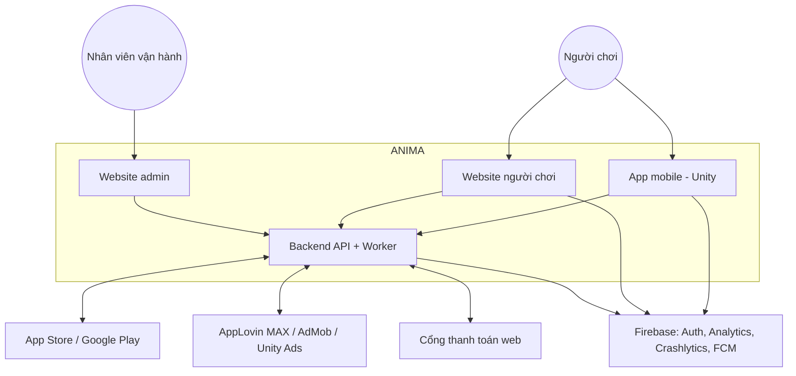
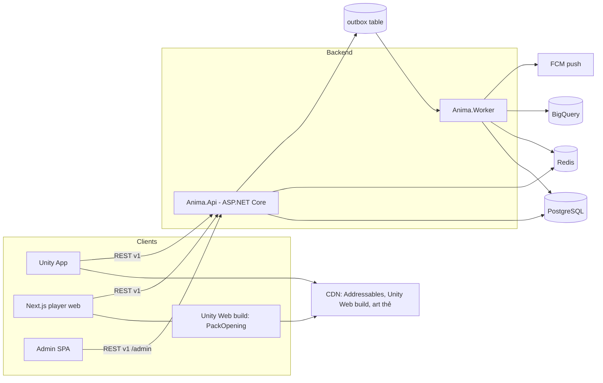
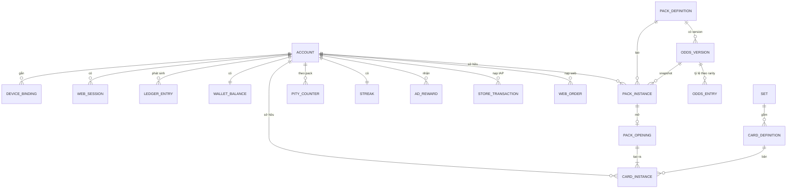
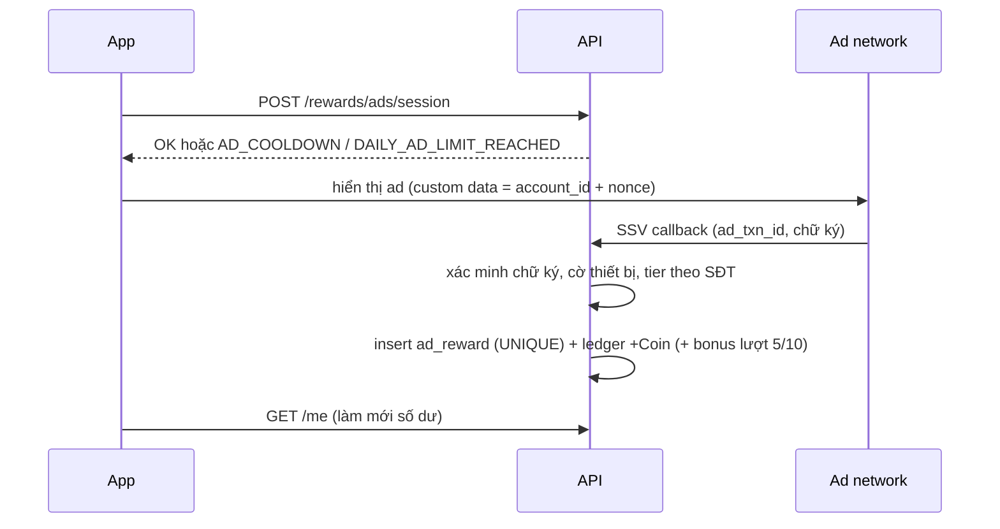

# Solution Design — ANIMA: Echoes of the Heart

| Thuộc tính | Giá trị |
|---|---|
| Mã tài liệu | SAD-ANIMA-001 |
| Phiên bản | 0.1 (Draft) |
| Ngày | 2026-10-06 |
| Đầu vào | [BRD](BRD_ANIMA.md) v0.3, [PRD](PRD_ANIMA.md) v0.2, [BDD](BDD_ANIMA.md) v0.2, [Tech Stack](TECH_STACK.md) v0.3 |
| Trạng thái | Chờ Tech Lead review |

Tài liệu mô tả **cách xây** hệ thống. Quy tắc nghiệp vụ nằm ở BRD, lựa chọn công nghệ và lý do nằm ở Tech Stack; ở đây chỉ dẫn chiếu ID.

---

## MỤC LỤC

1. [Phạm vi giải pháp](#1-phạm-vi-giải-pháp)
2. [Kiến trúc tổng thể](#2-kiến-trúc-tổng-thể)
3. [Cấu trúc repository](#3-cấu-trúc-repository)
4. [Backend](#4-backend)
5. [Mô hình dữ liệu](#5-mô-hình-dữ-liệu)
6. [Thiết kế API](#6-thiết-kế-api)
7. [Luồng xử lý chính](#7-luồng-xử-lý-chính)
8. [Thuật toán quay pack](#8-thuật-toán-quay-pack)
9. [App mobile (Unity)](#9-app-mobile-unity)
10. [Website người chơi](#10-website-người-chơi)
11. [Website admin](#11-website-admin)
12. [Bảo mật](#12-bảo-mật)
13. [Quan sát hệ thống](#13-quan-sát-hệ-thống)
14. [Môi trường, CI/CD và Git contract](#14-môi-trường-cicd-và-git-contract)
15. [Chiến lược kiểm thử](#15-chiến-lược-kiểm-thử)
16. [Rủi ro kỹ thuật, spike và ADR](#16-rủi-ro-kỹ-thuật-spike-và-adr)

---

## 1. Phạm vi giải pháp

| Thành phần | Người dùng | Release |
|---|---|---|
| App mobile iOS/Android (Unity) | Người chơi | R1 |
| Website người chơi (Next.js + Unity Web) | Người chơi | R1 |
| Website admin (React + Refine) | CS Agent, Content Manager, Economy Manager, Fraud Analyst, Finance Viewer, Super Admin | R1 |
| Backend API + Worker (.NET) | Mọi client, store, ad network, cổng thanh toán | R1 |
| Chợ, đấu giá, cộng đồng (SignalR) | Người chơi | R2 |

Ma trận tính năng theo nền tảng: BRD mục 4.4.

---

## 2. Kiến trúc tổng thể

### 2.1. Context



### 2.2. Container



**Nguyên tắc:** client không bao giờ quyết định số dư, kết quả pack hay phần thưởng (BR-PACK-02). Mọi client gọi cùng một API; khác biệt theo nền tảng do header `X-Client-Platform` và chính sách ở server (BR-WEB-03).

---

## 3. Cấu trúc repository

Monorepo, mỗi thư mục gốc có một owner chính. Đây là cơ sở cho `allowed_files` của từng task trong [SPRINT_PLAN.md](SPRINT_PLAN.md).

```
/
├─ backend/
│  ├─ Anima.sln
│  ├─ Directory.Build.props, Directory.Packages.props
│  ├─ src/
│  │  ├─ Anima.Api/                  # host, routing, auth, middleware
│  │  ├─ Anima.Worker/               # job: đối soát, xuất analytics, outbox
│  │  ├─ Anima.Contracts/            # DTO, mã lỗi, enum — netstandard2.1, dùng chung với Unity
│  │  ├─ Anima.SharedKernel/         # Result, Money, Clock, Idempotency, Outbox
│  │  └─ Modules/
│  │     ├─ Identity/  Wallet/  Catalog/  Gacha/  Collection/
│  │     ├─ Rewards/   Payments/ Fraud/   Admin/  Analytics/
│  │     └─ (R2) Marketplace/  Social/
│  └─ tests/
│     ├─ Anima.UnitTests/  Anima.IntegrationTests/  Anima.Bdd/  Anima.ArchTests/
├─ mobile/
│  └─ AnimaUnity/                    # Unity 6 project
│     └─ Assets/Anima/{Core,Net,UI,PackOpening,Collection,Rewards,Wallet}/
├─ web/
│  ├─ pnpm-workspace.yaml, turbo.json
│  ├─ apps/player/                   # Next.js
│  ├─ apps/admin/                    # Vite + Refine
│  └─ packages/{api-client,ui,config}/
├─ infra/
│  ├─ docker-compose.yml             # PostgreSQL, Redis, mock store/gateway cho dev
│  └─ terraform/                     # khi chốt cloud (T-02)
├─ contracts/openapi/anima.v1.yaml   # contract nguồn, sinh client cho web và kiểm tra Unity
├─ docs/   prototype/   .vibe/   .github/workflows/
```

**Ranh giới module:** module chỉ lộ ra `I<Module>Api` (interface) trong project `<Module>.Contracts`; không module nào truy vấn bảng của module khác. Kiểm tra tự động bằng `Anima.ArchTests` (NetArchTest).

---

## 4. Backend

### 4.1. Cấu trúc một module

```
Modules/Gacha/
├─ Gacha.Contracts/     # IGachaApi, DTO nội bộ, integration event
├─ Gacha.Domain/        # entity, value object, quy tắc thuần (không I/O)
├─ Gacha.Application/   # use case (command/query handler), validation
├─ Gacha.Infrastructure/# EF Core DbContext riêng schema "gacha", repository
└─ Gacha.Endpoints/     # minimal API endpoints, mapping DTO
```

- Mỗi module có **schema PostgreSQL riêng** (`identity`, `wallet`, `catalog`, `gacha`, …) và DbContext riêng.
- Giao dịch xuyên module trong một request (ví dụ mua pack: trừ ví + tạo Pack Instance) chạy trong **một transaction PostgreSQL** qua `IUnitOfWork` dùng chung connection. Đây là lợi thế của modular monolith; khi tách service sau này sẽ chuyển sang saga.
- Sự kiện bất đồng bộ (analytics, push, gắn cờ gian lận) ghi vào bảng `outbox` trong cùng transaction; Worker đọc và phát.

### 4.2. Trách nhiệm module

| Module | Trách nhiệm | Rule chính |
|---|---|---|
| Identity | Tài khoản, ngày sinh/đồng ý giám hộ, thiết bị mobile, phiên web, trạng thái + lý do hạn chế, xóa tài khoản | BR-ACC-*, BR-WEB-02 |
| Wallet | Ledger Gem/Coin, số dư, giữ tiền (hold) cho đấu giá R2, đổi Gem→Coin | BR-WAL-*, BR-ECO-01/02 |
| Payments | Xác thực receipt IAP, thông báo hoàn tiền store, đơn nạp web + IPN | BR-WAL-02/04, BR-WEB-04/05/07 |
| Catalog | Set, Card Definition, Story, Pack Definition, version tỷ lệ, maker-checker | BR-ADM-02/03, BR-PACK-01/04 |
| Gacha | Mua pack, quay, pity, bản ghi mở pack | BR-PACK-* |
| Collection | Card Instance, tiến độ set, quyền đọc story | US-05.* |
| Rewards | Điểm danh, streak, Freeze, rewarded ads (SSV), tham số thưởng có version | BR-CHK-*, BR-ADS-*, BR-ECO-03/04 |
| Fraud | Cờ thiết bị (Play Integrity/App Attest), điểm rủi ro, captcha, quy tắc gắn cờ | BR-FRD-* |
| Admin | RBAC admin, audit log, che PII, bồi thường | BR-ADM-01/04 |
| Analytics | Phát sự kiện server-side ra BigQuery | PRD mục 9 |

### 4.3. Thư viện và quy ước

- Minimal API + endpoint filter; FluentValidation; EF Core + Npgsql; Dapper cho truy vấn ledger.
- `Money` là value object gồm `Currency` (`GEM`/`COIN`) và `long Amount` (đơn vị nguyên, không dùng số thực).
- `IClock` được inject để test các kịch bản thời gian trong BDD.
- `IRandomSource` bọc `RandomNumberGenerator` để test thuật toán quay bằng nguồn có thể điều khiển.

---

## 5. Mô hình dữ liệu

### 5.1. ERD rút gọn (R1)



### 5.2. Bảng then chốt

| Bảng (schema) | Cột chính | Ràng buộc |
|---|---|---|
| `identity.account` | id (uuid), firebase_uid, email_norm, phone_e164, birth_date, guardian_consent_at, status, restriction_reason, timezone, created_at | UNIQUE(email_norm), UNIQUE(phone_e164) khi đã xác thực; timezone cố định khi đăng ký (BR-CHK-01) |
| `identity.device_binding` | device_id, account_id, bound_at, unbound_at | UNIQUE(device_id) với `unbound_at IS NULL` |
| `identity.web_session` | id, account_id, browser_fingerprint, created_at, revoked_at | Tối đa 3 đang hoạt động — kiểm tra trong transaction (BR-WEB-02) |
| `wallet.ledger_entry` | id, account_id, currency, amount (+/−), reason, ref_type, ref_id, idempotency_key, reverses_entry_id, created_at | Chỉ INSERT (quyền DB); UNIQUE(idempotency_key) |
| `wallet.balance` | account_id, currency, amount, version | Cập nhật cùng transaction với ledger; CHECK(amount ≥ 0) cho COIN |
| `payments.store_transaction` | store, store_txn_id, account_id, sku, gem, status, refunded_at | UNIQUE(store, store_txn_id) |
| `payments.web_order` | id, account_id, gateway, gateway_txn_id, sku, gem, amount_vnd, status, ipn_received_at | UNIQUE(gateway, gateway_txn_id) |
| `catalog.odds_version` | id, pack_definition_id, effective_from, status (draft/approved/active/retired), created_by, approved_by | `approved_by ≠ created_by` (BR-ADM-02); không UPDATE khi `active` |
| `gacha.pack_instance` | id, account_id, pack_definition_id, odds_version_id, purchase_ledger_entry_id, status | status ∈ Unopened/Opened/Revoked |
| `gacha.pack_opening` | pack_instance_id (PK), results (jsonb), pity_before, pity_after, pity_triggered, rng_trace, opened_at | PK chống mở hai lần (SC-PACK-13) |
| `gacha.pity_counter` | account_id, pack_definition_id, count | PK(account_id, pack_definition_id) |
| `collection.card_instance` | id, serial, card_definition_id, owner_id, status, soulbound, origin_type, origin_id | status ∈ Owned/Listed/InAuction/Locked |
| `rewards.checkin` | account_id, local_date, streak_after, coin, freeze_used | PK(account_id, local_date) |
| `rewards.ad_reward` | ad_txn_id, network, account_id, local_date, seq_in_day, reward, status | UNIQUE(network, ad_txn_id) |
| `admin.audit_log` | id, actor_id, action, target_type, target_id, before, after, reason, created_at | Chỉ INSERT |
| `shared.idempotency` | key, account_id, endpoint, request_hash, response, created_at | Trả lại response cũ khi trùng key (SC-PACK-05) |
| `shared.outbox` | id, type, payload, created_at, processed_at | |

**PII:** `email_norm`, `phone_e164`, `birth_date` được mã hóa ở tầng ứng dụng (AES-GCM, khóa từ secret manager); lưu thêm hash (HMAC) để tra cứu và kiểm tra trùng.

---

## 6. Thiết kế API

### 6.1. Quy ước

| Hạng mục | Quy ước |
|---|---|
| Kiểu | REST JSON, prefix `/api/v1`, admin dưới `/api/v1/admin` |
| Contract | `contracts/openapi/anima.v1.yaml` là nguồn; CI so sánh với OpenAPI sinh từ code và chặn thay đổi phá vỡ |
| Xác thực người chơi | `Authorization: Bearer <Firebase ID token>`; server xác minh, ánh xạ sang `account_id` |
| Xác thực admin | SSO công ty (OIDC) + MFA; token riêng, không dùng Firebase |
| Nền tảng | `X-Client-Platform: ios|android|web`, `X-App-Version`; mobile gửi thêm `X-Device-Id` và token toàn vẹn thiết bị |
| Idempotency | Header `Idempotency-Key` (UUID) bắt buộc cho mọi lệnh tạo tiền/bản ghi |
| Lỗi | `{ "code": "INSUFFICIENT_BALANCE", "message": "...", "details": {...}, "traceId": "..." }` — `code` lấy từ danh sách mã lỗi trong BDD |
| Thời gian | ISO-8601 UTC; ngày nghiệp vụ (điểm danh, ads) tính theo `account.timezone` |
| Phân trang | Cursor (`?cursor=&limit=`) |

### 6.2. Endpoint R1

| Method | Path | Mục đích | Ghi chú |
|---|---|---|---|
| POST | `/accounts` | Tạo tài khoản sau đăng nhập Firebase lần đầu | Kiểm tra tuổi, thiết bị |
| GET | `/me` | Hồ sơ, trạng thái, số dư, streak | |
| POST | `/me/phone/otp`, `/me/phone/verify` | Xác thực SĐT | BR-ACC-05 |
| POST | `/me/deletion`, DELETE `/me/deletion` | Yêu cầu / hủy xóa tài khoản | |
| POST | `/web-sessions` | Tạo phiên web (OTP nếu trình duyệt mới) | BR-WEB-02 |
| GET | `/wallet/ledger` | Lịch sử | |
| POST | `/payments/iap/verify` | Gửi receipt | Idempotent theo store txn |
| POST | `/payments/web/orders` | Tạo đơn nạp web, trả URL thanh toán | |
| POST | `/webhooks/{store}` , `/webhooks/gateway/{name}` | Thông báo store, IPN cổng | Xác minh chữ ký |
| GET | `/packs`, `/packs/{id}` | Danh sách pack, tỷ lệ version hiện hành, pity | |
| POST | `/packs/{id}/purchase` | Mua pack (kèm `oddsVersionId` đã xem) | ODDS_CHANGED |
| POST | `/pack-instances/{id}/open` | Mở pack, trả kết quả + thứ tự lật + cờ climax | Trả lại kết quả nếu đã mở |
| GET | `/collection`, `/collection/sets/{id}` | Bộ sưu tập, tiến độ | |
| GET | `/cards/{id}/story` | Story Fragment | CARD_NOT_COLLECTED |
| POST | `/rewards/checkin` | Điểm danh | Chỉ mobile |
| POST | `/rewards/freeze` | Mua/nhận Streak Freeze | |
| POST | `/rewards/ads/session` | Xin phiên xem ad (kiểm cooldown, giới hạn) | Chỉ mobile |
| POST | `/webhooks/ads/{network}` | SSV callback | |
| Admin | `/admin/accounts`, `/admin/cards`, `/admin/sets`, `/admin/packs`, `/admin/odds-versions`, `/admin/odds-versions/{id}/approve`, `/admin/economy-params`, `/admin/compensations`, `/admin/audit`, `/admin/reports/*` | Vận hành | RBAC + maker-checker |

---

## 7. Luồng xử lý chính

### 7.1. Mua và mở pack

```mermaid
sequenceDiagram
    participant C as Client (app/web)
    participant API
    participant DB as PostgreSQL
    C->>API: POST /packs/{id}/purchase (oddsVersionId, Idempotency-Key)
    API->>DB: BEGIN; kiểm idempotency; kiểm odds version đang hiệu lực
    API->>DB: ghi ledger −1000 COIN; cập nhật balance (CHECK ≥ 0)
    API->>DB: tạo pack_instance (odds_version_id); outbox pack_purchased; COMMIT
    API-->>C: 201 packInstanceId, balance
    C->>API: POST /pack-instances/{pid}/open
    API->>DB: BEGIN; SELECT pack_instance FOR UPDATE
    alt đã có pack_opening
        API-->>C: 200 kết quả cũ (PACK_ALREADY_OPENED)
    else Unopened
        API->>API: quay theo odds_version + pity (mục 8)
        API->>DB: insert pack_opening, card_instance x5, cập nhật pity, status=Opened; outbox; COMMIT
        API-->>C: 200 thẻ, thứ tự lật, climax, pity mới
    end
    C->>C: phát animation (có thể skip)
```

### 7.2. Nạp IAP và hoàn tiền

```mermaid
sequenceDiagram
    participant App
    participant API
    participant Store as App Store / Google Play
    App->>Store: mua SKU
    Store-->>App: receipt
    App->>API: POST /payments/iap/verify (receipt)
    API->>Store: xác thực receipt
    alt hợp lệ, chưa ghi nhận
        API->>API: ledger +Gem, store_transaction=Completed
        API-->>App: số dư mới
        App->>Store: finish transaction
    else timeout
        API-->>App: RECEIPT_PENDING (job thử lại tới 24h)
    end
    Store->>API: thông báo REFUND (server notification)
    API->>API: ledger −Gem; nếu âm → Restricted(NEGATIVE_GEM)
```

### 7.3. Rewarded ad với SSV



### 7.4. Nạp Gem trên website

```mermaid
sequenceDiagram
    participant W as Website
    participant API
    participant G as Cổng thanh toán
    W->>API: POST /payments/web/orders (sku)
    API-->>W: orderId, paymentUrl
    W->>G: chuyển hướng tới trang thanh toán
    G->>API: IPN (gateway_txn_id, chữ ký)
    API->>API: xác minh chữ ký + đối chiếu số tiền; ledger +Gem (UNIQUE gateway_txn_id)
    G-->>W: chuyển về return URL
    W->>API: GET /payments/web/orders/{id}
    API-->>W: Completed hoặc Chờ xác nhận (không cộng dựa trên return URL)
```

### 7.5. Đăng nhập và gắn thiết bị / phiên web

- **Mobile:** Firebase sign-in → `POST /accounts` hoặc `GET /me` kèm `X-Device-Id`. Server kiểm `device_binding`: thiết bị đang gắn tài khoản khác thì trả DEVICE_BOUND_TO_OTHER_ACCOUNT; tài khoản đổi thiết bị thì kiểm hạn mức 2 lần/30 ngày.
- **Web:** Firebase sign-in → `POST /web-sessions`. Trình duyệt chưa từng dùng với tài khoản Verified thì yêu cầu OTP; phiên thứ 4 làm thu hồi phiên cũ nhất.

---

## 8. Thuật toán quay pack

1. Lấy `odds_version` từ Pack Instance (snapshot, BR-PACK-04).
2. Với mỗi slot (5 slot): quay rarity theo trọng số của version (`IRandomSource.NextInt(0, 1_000_000)` so với bảng cộng dồn, đơn vị phần triệu), rồi quay **đều** một Card Definition trong nhóm rarity đó thuộc set của pack.
3. **Pity (BR-PACK-05):** nếu `pity_counter = 49` và cả 5 slot không có Legendary+, quay lại **slot có rarity thấp nhất** trong nhóm Legendary. **[Cần PO xác nhận]** cách thay slot này, bổ sung vào Q-09.
4. Cập nhật pity: có Legendary+ → 0, ngược lại +1.
5. Sắp xếp thứ tự lật theo rarity tăng dần (BR-PACK-06); `climax = max_rarity ≥ Epic` (BR-PACK-07).
6. Ghi `rng_trace` (các giá trị ngẫu nhiên đã dùng) để audit và tái hiện khi có khiếu nại.

Kiểm định: test thống kê 1,000,000 slot cho mỗi version trong CI (SC-PACK-16, NFR-12).

---

## 9. App mobile (Unity)

| Lớp | Thiết kế |
|---|---|
| Kiến trúc | Scene `Boot` → `Main` (UI Toolkit, điều hướng tab) → `PackOpening` (scene additive) |
| Mã nguồn | `Assets/Anima/Core` (DI, config, clock), `Net` (HTTP client, retry, idempotency key, map mã lỗi), `UI`, `PackOpening`, `Collection`, `Rewards`, `Wallet` |
| Contract | Dùng DLL `Anima.Contracts` (netstandard2.1) build từ backend → không lệch DTO/mã lỗi |
| State | Store đơn giản theo màn hình; nguồn sự thật là server; cache bộ sưu tập mã hóa cho offline |
| PackOpening | `PackOpeningDirector` nhận kết quả server → chọn Timeline theo rarity cao nhất → phát 6 giai đoạn; `Skip()` nhảy tới Summary |
| Chất lượng | `QualityProfile` (Low/Mid/High) chọn theo GPU/RAM: số particle, shake, glow, holo shader |
| Giảm chuyển động | Cờ hệ thống + cài đặt app → tắt flash/shake, giảm particle |
| Asset | Addressables: nhóm theo set; tải trước khi vào PackOpening |
| SDK | Firebase (Auth, Analytics, Crashlytics, Messaging), Unity IAP, AppLovin MAX, Play Integrity/App Attest, FMOD, Nice Vibrations |
| Bản Unity Web | Build riêng chỉ chứa scene PackOpening + asset cần thiết; nhận kết quả qua `SendMessage` từ JavaScript |

---

## 10. Website người chơi

| Hạng mục | Thiết kế |
|---|---|
| Route chính | `/` (trang chủ, streak chỉ xem), `/store`, `/packs/[id]`, `/open/[packInstanceId]`, `/collection`, `/cards/[id]`, `/wallet`, `/wallet/topup`, `/account`; R2: `/u/[handle]` (công khai, SSR), `/market` |
| Render | Trang công khai SSR; trang cần đăng nhập render phía client gọi API |
| Đăng nhập | Firebase Web SDK → `POST /web-sessions`; token giữ trong bộ nhớ + cookie httpOnly cho phiên SSR |
| Mở pack | Component `<PackOpening>`: kiểm tra WebGL2 + bộ nhớ → tải lười bản Unity Web (cache) → gửi kết quả vào Unity; nếu không đạt điều kiện hoặc bật giảm chuyển động → `<LiteReveal>` (CSS 3D flip) |
| Thanh toán | Trang `/wallet/topup` tạo đơn → redirect cổng → trang kết quả hỏi trạng thái từ API |
| Điểm danh/ads | Hiển thị streak; nút điểm danh hướng sang app (BR-WEB-03) |
| i18n | `vi`, `en` (next-intl) |
| Kiểm thử | Playwright e2e cho luồng mua → mở → xem bộ sưu tập |

---

## 11. Website admin

| Hạng mục | Thiết kế |
|---|---|
| Khung | Vite + React + Refine + Ant Design; resource: accounts, cards, sets, packs, odds-versions, economy-params, compensations, audit, reports |
| Đăng nhập | SSO OIDC + MFA; vai trò lấy từ claim, map sang 6 vai trò BRD mục 12.2 |
| Phân quyền | Ẩn/hiện theo quyền ở UI, **thực thi ở backend** bằng policy theo vai trò (SC-ADM-03) |
| Maker-checker | Bản nháp → gửi duyệt → người khác duyệt → hiệu lực theo `effective_from`; UI hiện diff giữa version |
| PII | Mặc định hiển thị che; nút "Xem đầy đủ" chỉ cho Fraud Analyst/Super Admin và ghi audit |
| Truy cập mạng | Chỉ qua VPN công ty hoặc identity-aware proxy |

---

## 12. Bảo mật

| Chủ đề | Biện pháp | Liên quan |
|---|---|---|
| Xác thực | Firebase ID token xác minh mỗi request; admin dùng SSO + MFA | |
| Phân quyền | Policy theo trạng thái tài khoản (SC-PERM-01) và vai trò admin; mặc định từ chối | BRD 12 |
| Toàn vẹn thiết bị | Play Integrity / App Attest; kết quả lưu vào Fraud, ảnh hưởng quyền nhận thưởng | BR-FRD-01 |
| Webhook | Xác minh chữ ký store, ad network, cổng thanh toán; từ chối khi sai; ghi log gian lận | SC-ADS-12, SC-WEB-11 |
| Dữ liệu cá nhân | Mã hóa cột PII, HMAC để tra cứu; che theo vai trò; audit khi xem | BRD 13.1 |
| Secret | Secret manager của cloud; không có secret trong repo; quét bằng gitleaks trong CI | |
| Rate limit | Theo tài khoản, thiết bị, IP cho API kinh tế; captcha web khi đăng nhập/nạp | NFR-16 |
| Mobile | Theo OWASP MASVS: certificate pinning cho API, không lưu token dạng rõ, chống debug cơ bản | |
| Web | CSP chặt (cho phép domain Unity build/CDN), cookie `HttpOnly; Secure; SameSite=Lax`, CSRF token cho thao tác ghi qua cookie | |
| Dữ liệu tiền | Ledger chỉ INSERT ở mức quyền DB; đối soát hằng ngày | NFR-11 |

---

## 13. Quan sát hệ thống

| Loại | Nội dung |
|---|---|
| Log | JSON có `traceId`, `accountId` (đã băm), không ghi PII |
| Trace | OpenTelemetry từ API → DB → Redis → webhook |
| Metric kỹ thuật | p95 latency `/purchase`, `/open`; tỷ lệ lỗi; độ trễ outbox |
| Metric nghiệp vụ | Pack mở/phút theo rarity; Coin phát/tiêu theo nguồn; tỷ lệ pity kích hoạt; SSV thất bại; đơn web chờ xác nhận > 15 phút |
| Cảnh báo | Lỗi API mua/mở > 1% trong 5 phút; lệch ledger ≠ 0; lệch đối soát IAP/cổng; chi phí ads ≥ 45% doanh thu (SC-ECO-05) |
| Client | Crashlytics; sự kiện `pack_animation_finished` để đo FPS/skip |

---

## 14. Môi trường, CI/CD và Git contract

### 14.1. Môi trường

| Môi trường | Mục đích | Dữ liệu |
|---|---|---|
| local | docker-compose PostgreSQL + Redis + mock store/gateway/SSV | Seed giả |
| dev | Tích hợp liên tục từ `main` | Seed giả |
| staging | Kiểm thử QA, sandbox IAP, ad test mode, cổng thanh toán sandbox | Dữ liệu giả, cấu hình như production |
| production | Người dùng thật | Thật |

### 14.2. Git contract

| Hạng mục | Quy ước |
|---|---|
| Mô hình | Trunk-based: `main` luôn deploy được |
| Nhánh | `feat/T###-mo-ta-ngan`, `fix/T###-...`, `chore/T###-...` |
| Commit | Conventional Commits: `feat(gacha): ...`, tham chiếu `T###` |
| Pull request | Bắt buộc review; task `risk_tier=high` cần 2 reviewer, trong đó 1 người không viết code đó |
| CI bắt buộc | Build, test, lint/format, kiểm tra OpenAPI không phá vỡ, gitleaks, ArchTests |
| Merge | Squash merge; xóa nhánh sau merge |
| Release | Tag `vMAJOR.MINOR.PATCH`; backend deploy staging tự động, production cần duyệt |

### 14.3. Lệnh chuẩn (dùng trong `.vibe/project-context.md`)

| Mục đích | Lệnh |
|---|---|
| Hạ tầng local | `docker compose -f infra/docker-compose.yml up -d` |
| Build backend | `dotnet build backend/Anima.sln` |
| Test backend | `dotnet test backend/Anima.sln` |
| Format backend | `dotnet format backend/Anima.sln --verify-no-changes` |
| Web cài đặt | `pnpm -C web install` |
| Web build/test/lint | `pnpm -C web turbo run build test lint` |
| Sinh API client | `pnpm -C web --filter api-client generate` |
| Unity test | GameCI `unity-test-runner` (EditMode + PlayMode) |

---

## 15. Chiến lược kiểm thử

| Tầng | Công cụ | Phạm vi |
|---|---|---|
| Unit | xUnit | Domain thuần: phí, pity, streak, tier thưởng |
| Integration | Testcontainers (PostgreSQL, Redis) | Transaction, ràng buộc UNIQUE, đồng thời |
| BDD | Reqnroll chạy kịch bản trong BDD_ANIMA.md | Mọi kịch bản `@R1` trước release |
| Contract | So OpenAPI; test client sinh từ contract | Web, admin, Unity |
| Kiến trúc | NetArchTest | Ranh giới module |
| Unity | Unity Test Framework | Map kết quả → timeline, skip, quality profile |
| Web e2e | Playwright | Luồng chính trên website người chơi và admin |
| Hiệu năng | k6 | 100,000 CCU (NFR-04), p95 mua/mở pack |
| RNG | Test thống kê | SC-PACK-16 |
| Bảo mật | OWASP ZAP (web), MobSF (app), kiểm tra quyền theo SC-ADM-03 | Trước closed beta |

---

## 16. Rủi ro kỹ thuật, spike và ADR

### 16.1. Rủi ro và spike

| # | Rủi ro | Spike / biện pháp | Sprint |
|---|---|---|---|
| TR-01 | Unity Web quá nặng hoặc lỗi trên Safari iOS | T009: đo dung lượng, thời gian tải, FPS; chế độ rút gọn là phương án dự phòng | S00 |
| TR-02 | Animation không đạt 60fps trên máy tầm trung | Prototype PackOpening sớm, đo trên thiết bị thật | S03 |
| TR-03 | Firebase Phone Auth đắt ở VN | So sánh chi phí với SMS brandname nội địa | S01 |
| TR-04 | Đồng thời tiêu tiền từ app và web | Khóa dòng `balance` + `CHECK`; test SC-WEB-03 | S02 |
| TR-05 | Cổng thanh toán chưa chọn | Lớp adapter + mock để không chặn tiến độ | S06 |
| TR-06 | Unity và .NET dùng chung contract | Build `Anima.Contracts` netstandard2.1 và import vào Unity ở S00 | S00 |

### 16.2. ADR cần ghi

| ADR | Quyết định | Trạng thái |
|---|---|---|
| ADR-001 | Modular monolith .NET, schema riêng mỗi module | Đề xuất |
| ADR-002 | Ledger append-only + balance cập nhật cùng transaction | Đề xuất |
| ADR-003 | Firebase Auth cho người chơi, SSO cho admin | Đề xuất |
| ADR-004 | Unity Web cho mở pack trên website + LiteReveal | Chờ spike T009 |
| ADR-005 | OpenAPI là nguồn contract; `Anima.Contracts` dùng chung với Unity | Đề xuất |
| ADR-006 | Cloud provider | Hoãn (T-02) |

---

*End of Document*
