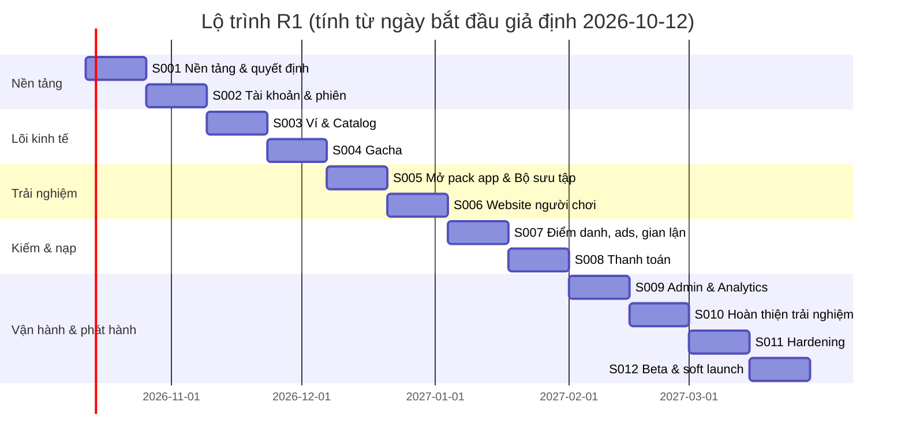
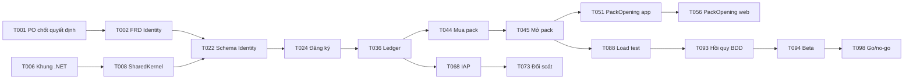

# Sprint Plan — ANIMA: Echoes of the Heart

| Thuộc tính | Giá trị |
|---|---|
| Mã tài liệu | PLAN-ANIMA-001 |
| Phiên bản | 0.1 (Draft) |
| Ngày | 2026-10-06 |
| Đầu vào | [PRD](PRD_ANIMA.md) v0.2, [BRD](BRD_ANIMA.md) v0.3, [BDD](BDD_ANIMA.md) v0.2, [Solution Design](SOLUTION_DESIGN.md) v0.1, [Tech Stack](TECH_STACK.md) v0.3 |
| Nguồn dữ liệu task | [`.vibe/backlog.json`](../.vibe/backlog.json) — bảng ở mục 8 được sinh bằng `python3 tools/render_sprint_plan.py` |
| Trạng thái | **Chưa qua gate Intake** — chờ PO định danh và duyệt phạm vi (BRD Q-01, Q-03) |

---

## 1. Tóm tắt

- **12 sprint × 2 tuần = 24 tuần** từ lúc bắt đầu tới quyết định soft launch, khớp mốc MVP 3–6 tháng (Master Document §8.1) ở cận trên.
- **111 task** (T001 → T112, thêm 13 task theo CR-002; ID T106 bỏ trống, không dùng lại). Sprint S001 và S002 đã tách tới mức task 1–4 giờ; S003 → S012 ở mức story 0.5–5 ngày, sẽ được tách thành task nhỏ khi lập kế hoạch từng sprint (ID mới, không dùng lại ID cũ).
- Mỗi sprint là một **lát cắt dọc chạy được**: backend + client + QA cho cùng một nhóm rule.
- **Phân tích đi trước một sprint:** FRD và wireframe của sprint N được làm trong sprint N−1, để khi sprint N bắt đầu, task code đã đủ DoR.

Ngày bắt đầu 2026-10-12 chỉ để vẽ lộ trình; ngày thật tính từ khi qua gate Intake.

---

## 2. Đội ngũ và năng lực

| Vai trò | Người | Năng lực/sprint (ngày công) |
|---|---|---|
| Backend .NET | 2 | 20 |
| Unity developer | 2 | 20 |
| Technical artist | 1 | 10 |
| Frontend web (người chơi + admin) | 2 | 20 |
| DevOps | 0.5 | 5 |
| QA | 1 | 10 |
| BA | 1 (có thể kiêm PO support) | 10 |
| Product Designer | 1 | 10 |

Kế hoạch dùng khoảng 50–70% năng lực mỗi lane cho task đã liệt kê; phần còn lại dành cho review, sửa lỗi và task tách thêm khi lập sprint.

### Lane chạy song song

| Lane | Sprint chính |
|---|---|
| Backend | S002 → S004, S007 → S009 |
| Unity | S001 (khung), S004 → S005, S007 → S008, S010 |
| Web người chơi | S001 (khung), S002, S004, S006, S008 |
| Web admin | S002, S003, S009 |
| BA + Designer | Đi trước một sprint: FRD/wireframe của S(N) làm ở S(N−1) |
| QA | Cuối mỗi sprint + S011 hồi quy toàn bộ |

---

## 3. Đường găng (critical path)

**Rủi ro lịch:** T001 (PO chốt quyết định) chặn FRD, mà FRD lại chặn mọi task code có `risk_tier=high`. Nếu T001 trễ, S002 trễ theo.

---

## 4. Quy trình sprint

| Sự kiện | Thời điểm | Đầu ra |
|---|---|---|
| Sprint planning | Ngày 1 | Tách story thành task 1–4 giờ; xác nhận DoR từng task |
| Daily | Hằng ngày, 15 phút | Cập nhật trạng thái task trong `.vibe/` |
| Backlog refinement | Giữa sprint | BA/Designer trình FRD/wireframe cho sprint sau |
| Demo | Ngày 10 | Demo trên staging với PO |
| Retro | Ngày 10 | Bài học ngắn ghi vào `.vibe/route-log.jsonl` |

---

## 5. Definition of Ready / Definition of Done

### 5.1. DoR (task code)

- [ ] Có source requirement ID (BR/US/SC) và kịch bản BDD tương ứng.
- [ ] Task `risk_tier=high`: FRD có field table và ma trận quyền đã duyệt.
- [ ] Task có UI: wireframe/handoff đã duyệt (hoặc ghi `design=not_required` kèm lý do).
- [ ] Contract API đã có trong `contracts/openapi/anima.v1.yaml`.
- [ ] Phụ thuộc đã `DONE`; `allowed_files` không trùng task khác đang chạy.
- [ ] Biện pháp bảo mật và dữ liệu đã ghi (phân loại dữ liệu, authN/authZ, audit).

### 5.2. DoD (task code)

- [ ] Build, test, lint, format, ArchTests, kiểm tra contract đều xanh trong CI.
- [ ] Kịch bản BDD liên quan chạy tự động và đạt.
- [ ] Review đạt; `risk_tier=high` có 2 reviewer, trong đó 1 người không viết code đó.
- [ ] Log, metric cần thiết đã có; không log PII.
- [ ] Deploy staging thành công; QA xác nhận.
- [ ] Tài liệu/contract cập nhật nếu có thay đổi.

### 5.3. Risk tier

| Tier | Áp dụng | Gate |
|---|---|---|
| `low` | Khung dự án, CI, spike, tài liệu kỹ thuật | Nới gate business/analysis (ghi lý do) |
| `standard` | Màn hình, tính năng không chạm tiền/quyền | Đủ gate |
| `high` | Tiền, ledger, thanh toán, quyền, danh tính, PII, RNG | Đủ gate + review độc lập + test bảo mật |

### 5.4. Trạng thái task

`BACKLOG → ANALYSIS → READY_FOR_PLANNING → READY_FOR_DEV → IN_PROGRESS → CODE_REVIEW → READY_FOR_QA → QA_FAILED | QA_PASSED → READY_FOR_RELEASE → DEPLOYED → VERIFIED → DONE`; cho phép `BLOCKED`, `CANCELLED` kèm lý do. Task analysis/design kết thúc ở `READY_FOR_PLANNING`.

---

## 6. Trạng thái gate hiện tại

| Gate | Trạng thái | Bằng chứng còn thiếu |
|---|---|---|
| Intake (PO duyệt mục tiêu, phạm vi, business owner) | ✘ Chưa qua | Q-01 (ai là PO), Q-03 (phạm vi MVP) |
| Analysis Ready | ✘ Chưa qua | BRD mục 18.2; FRD chưa có |
| Design | ✘ Chưa bắt đầu | Prototype HTML là input tham khảo, chưa phải handoff |
| Technical planning | ⚠ Bản nháp | Solution Design chờ Tech Lead review |

Task được phép bắt đầu ngay khi chưa qua Intake: các task kỹ thuật của S001 (T005–T019) và T003 (design system), vì không phụ thuộc quyết định nghiệp vụ. Task không có phụ thuộc, bắt đầu được ngay: T001, T003, T005, T009, T018. T001 là task ưu tiên số một.

---

## 7. Thay đổi phạm vi đã ghi nhận

| CR | Nội dung | Ảnh hưởng |
|---|---|---|
| [CR-001](../.vibe/changes/CR-001.json) | Người chơi dùng được cả website (ngoài app mobile); admin là website | BRD v0.3 (mục 4.4, BR-WEB), PRD v0.2, BDD mục 12A, Tech Stack 2.4, thêm sprint S006 và các task web |
| [CR-002](../.vibe/changes/CR-002.json) | Tài sản số: số lượng phát hành, commit–reveal, Lò rèn, quy đổi Gem ↔ Coin (R1); NFT (R2, sau gate pháp lý) | BRD v0.4, BDD v0.3, SAD v0.2 (mục 8, 17), Tech Stack 5.1, Master 2.4/5.7; thêm T099 → T112 và epic R2-E8 → E11 |

---

## 8. Chi tiết sprint và task

<!-- BEGIN GENERATED -->

### S001 — Nền tảng dự án & chốt quyết định (Tuần 1–2)

**Mục tiêu:** Repo, khung backend/Unity/web chạy được, CI xanh; PO chốt các câu hỏi chặn R1; FRD Identity sẵn sàng.

**Điều kiện kết thúc sprint:** CI xanh trên `main` với khung 3 client + backend; DEC-001 có quyết định PO; FRD-01 và wireframe Identity được duyệt; báo cáo spike Unity Web.

| ID | Task | Workstream | Owner skill | Phụ thuộc | Nguồn | Tiêu chí chấp nhận | Risk | Ước lượng | Loại |
|---|---|---|---|---|---|---|---|---|---|
| T001 | Workshop PO chốt câu hỏi chặn R1 | analysis | senior-business-analyst | — | BRD Q-01,Q-03,Q-04,Q-07,Q-08,Q-09,Q-31,Q-32,Q-35; BRD CF-01,CF-04,CF-06; PRD PQ-01..PQ-07 | Mỗi câu hỏi có quyết định hoặc ngày hẹn quyết | standard | 4h | task |
| T002 | FRD Identity: đăng ký, đăng nhập, tuổi, OTP, phiên web, xóa tài khoản | analysis | senior-business-analyst | T001 | EP-01; BR-ACC-01..05; BR-WEB-02 | Đạt FRD coverage checklist | high | 4h | task |
| T003 | Design system: token màu rarity, typography, component cơ bản | design | product-designer | — | Master §4.3; prototype/ | Đủ token rarity 6 bậc; tương phản AA | standard | 4h | task |
| T004 | User flow + wireframe Identity (app + web) | design | product-designer | T002, T003 | FRD-01 | Phủ mọi trạng thái và mã lỗi của FRD-01 | standard | 4h | task |
| T005 | Khung monorepo: thư mục, .editorconfig, .gitignore, CODEOWNERS, hướng dẫn dev | devops | ship-and-operate | — | SAD §3 | Clone mới và đọc CONTRIBUTING là chạy được | low | 2h | task |
| T006 | Khung solution .NET: Api, Worker, SharedKernel, Contracts (netstandard2.1), test projects | backend | build-full-stack | T005 | SAD §3, §4 | `dotnet build` và `dotnet test` xanh | low | 3h | task |
| T007 | docker-compose: PostgreSQL 17, Redis, healthcheck | devops | ship-and-operate | T005 | SAD §14.1 | `docker compose up` healthy | low | 1h | task |
| T008 | SharedKernel: Result/Error, Money, IClock, IRandomSource, idempotency, outbox | backend | build-full-stack | T006, T007 | SAD §4.3, §5.2; BR-WAL-02 | Unit test Money không cho số âm sai, idempotency trả lại response cũ | standard | 4h | task |
| T009 | Spike: Unity Web cho PackOpening (dung lượng, tải, FPS trên Chrome, Safari iOS, Android) | spike | build-full-stack | — | TR-01; T-07; BR-WEB-06 | Có số đo trên ≥ 3 trình duyệt/thiết bị | low | 4h | task |
| T010 | Khung Unity 6 LTS: URP, asmdef, scene Boot, import Anima.Contracts | mobile | build-full-stack | T006 | SAD §9; TR-06 | Build Android dev chạy được; dùng được DTO từ Anima.Contracts | low | 4h | task |
| T011 | Khung web: pnpm + Turborepo, apps/player (Next.js), apps/admin (Vite + Refine), packages/ui, packages/config | web-player | build-full-stack | T005 | SAD §10, §11 | `pnpm -C web turbo run build lint test` xanh | low | 4h | task |
| T012 | Pipeline contract: OpenAPI v1 baseline, kiểm tra breaking change, sinh packages/api-client | backend | build-full-stack | T006, T011 | SAD §6.1; ADR-005 | CI đỏ khi xóa field khỏi contract | standard | 3h | task |
| T013 | GitHub Actions: backend, web, gitleaks | devops | ship-and-operate | T006, T011 | SAD §14.2 | PR mẫu chạy đủ job | low | 3h | task |
| T014 | GameCI: build + test Unity trên CI | devops | ship-and-operate | T010 | TECH_STACK §6.1 | Job xanh với license secret | low | 3h | task |
| T015 | ArchTests ranh giới module + module mẫu Health | backend | build-full-stack | T006 | SAD §3, §4.1 | ArchTests đỏ khi module truy cập DbContext module khác | low | 3h | task |
| T016 | Quan sát cơ bản: log JSON, OpenTelemetry, /healthz /readyz | backend | build-full-stack | T006 | SAD §13 | Trace có traceId xuyên request | low | 2h | task |
| T017 | Reqnroll: project Anima.Bdd chạy 1 kịch bản mẫu | quality | assure-software-quality | T006 | SAD §15; BDD §16 | Kịch bản mẫu chạy trong CI | low | 3h | task |
| T018 | Ghi ADR-001 → ADR-005 | release | ship-and-operate | — | SAD §16.2 | Tech Lead duyệt | low | 2h | task |
| T019 | Điền và kiểm chứng lệnh thật vào .vibe/project-context.md | devops | ship-and-operate | T013 | SAD §14.3 | Mọi lệnh trong mục Commands đã chạy thành công | low | 1h | task |

### S002 — Tài khoản, xác thực, phiên đa nền tảng (Tuần 3–4)

**Mục tiêu:** Người chơi đăng ký/đăng nhập trên app và web, xác thực SĐT, gắn thiết bị, phiên web; admin đăng nhập SSO và xem danh sách tài khoản.

**Điều kiện kết thúc sprint:** Kịch bản SC-ACC-*, SC-PERM-01, SC-WEB-04→06 đạt trên staging.

| ID | Task | Workstream | Owner skill | Phụ thuộc | Nguồn | Tiêu chí chấp nhận | Risk | Ước lượng | Loại |
|---|---|---|---|---|---|---|---|---|---|
| T020 | FRD Ví/lịch sử + Catalog admin (chuẩn bị S003) | analysis | senior-business-analyst | T001 | EP-02; EP-10; BR-WAL-*; BR-ADM-* | Đạt FRD coverage checklist | high | 4h | task |
| T021 | Wireframe Ví, Cửa hàng, Chi tiết pack (app + web) | design | product-designer | T020, T003 | FRD-02; PRD 8.2 | Tỷ lệ rơi và pity hiện trước nút mua | standard | 4h | task |
| T022 | Schema Identity: account, device_binding, web_session; mã hóa PII + HMAC | backend | build-full-stack | T008, T002 | SAD §5.2; BRD 13.1 | UNIQUE email/SĐT trên giá trị chuẩn hóa | high | 4h | task |
| T023 | Xác minh Firebase ID token, map account, header nền tảng | backend | build-full-stack | T022 | SAD §6.1 | Token sai/hết hạn → 401 | high | 3h | task |
| T024 | POST /accounts: tuổi, email/SĐT duy nhất | backend | build-full-stack | T023 | BR-ACC-01; BR-ACC-02 | SC-ACC-01→07 đạt | high | 4h | task |
| T025 | Gắn thiết bị và hạn mức chuyển thiết bị | backend | build-full-stack | T024 | BR-ACC-03 | SC-ACC-08→11 đạt | high | 4h | task |
| T026 | OTP xác thực SĐT (adapter nhà cung cấp) | backend | build-full-stack | T024 | BR-ACC-05; TR-03 | SC-ACC-12→16 đạt | high | 4h | task |
| T027 | Phiên web: tối đa 3, OTP trình duyệt mới | backend | build-full-stack | T024, T026 | BR-WEB-02 | SC-WEB-04→06 đạt | high | 4h | task |
| T028 | Vòng đời tài khoản, xóa sau 30 ngày, policy quyền theo trạng thái | backend | build-full-stack | T024 | BRD 8.1; SC-PERM-01 | SC-ACC-17→21, SC-PERM-01 (phần đã có module) đạt | high | 4h | task |
| T029 | App: Firebase Auth (Google, Apple, email) + Net client + /me | mobile | build-full-stack | T010, T024 | SAD §9 | Đăng nhập Google/Apple trên thiết bị thật | standard | 4h | task |
| T030 | App: màn tuổi, đăng ký, OTP theo wireframe | mobile | build-full-stack | T029, T026, T004 | FRD-01 | Hiển thị đúng mọi mã lỗi FRD-01 | standard | 4h | task |
| T031 | Web: đăng nhập Firebase, phiên web, OTP trình duyệt mới | web-player | build-full-stack | T011, T027 | BR-WEB-02 | SC-WEB-05 qua giao diện | standard | 4h | task |
| T032 | Web: trang tài khoản (hồ sơ, xác thực SĐT, xóa tài khoản) | web-player | build-full-stack | T031, T028 | US-01.4; US-01.7 | Yêu cầu/hủy xóa tài khoản hoạt động | standard | 3h | task |
| T033 | Admin: SSO + map vai trò + danh sách tài khoản (PII che) | web-admin | build-full-stack | T011, T022 | BRD 12.2; SC-ADM-07 | CS Agent thấy SĐT dạng 090****123 | high | 4h | task |
| T034 | QA Identity trên staging | quality | assure-software-quality | T024, T025, T026, T027, T028 | SC-ACC-*; SC-PERM-01; SC-WEB-04..06 | QA_PASSED hoặc danh sách defect | high | 4h | task |
| T035 | Môi trường staging tạm (container trên 1 VM) chờ chốt cloud | devops | ship-and-operate | T013 | T-02; SAD §14.1 | Deploy tự động từ main | low | 4h | task |

### S003 — Ví/Ledger & Catalog (Tuần 5–6)

**Mục tiêu:** Ledger bất biến, số dư, lịch sử; admin quản lý set, thẻ, story, pack, version tỷ lệ với maker-checker.

**Điều kiện kết thúc sprint:** SC-WAL-03→05, SC-ADM-01/02/08/09/13/14 đạt; seed set Awakening (tạm) có trong staging.

| ID | Task | Workstream | Owner skill | Phụ thuộc | Nguồn | Tiêu chí chấp nhận | Risk | Ước lượng | Loại |
|---|---|---|---|---|---|---|---|---|---|
| T036 | Wallet: ledger append-only, balance, lịch sử | backend | build-full-stack | T008, T020 | BR-WAL-01; BR-WAL-03 | SC-WAL-03→05 | high | 3d | story (tách khi lập sprint) |
| T037 | Catalog: set, thẻ, story, pack, version tỷ lệ, maker-checker | backend | build-full-stack | T020 | BR-ADM-02; BR-ADM-03; BR-PACK-01 | SC-ADM-01/02/08/09/13/14 | high | 3d | story (tách khi lập sprint) |
| T038 | Admin: màn Catalog + trình sửa tỷ lệ có diff và duyệt | web-admin | build-full-stack | T037, T033 | US-10.2; US-10.3 | Luồng tạo → gửi duyệt → duyệt | standard | 3d | story (tách khi lập sprint) |
| T039 | Audit log dùng chung | backend | build-full-stack | T008 | BR-ADM-01 | SC-ADM-04, SC-ADM-05 | high | 1d | story (tách khi lập sprint) |
| T040 | FRD Gacha (cửa hàng, chi tiết pack, mở pack) + Collection | analysis | senior-business-analyst | T001 | EP-03; EP-04; EP-05 | Đạt FRD checklist | high | 1d | story (tách khi lập sprint) |
| T041 | Storyboard mở pack + màn Collection (handoff) | design | product-designer | T040 | Master §4; FRD-03 | Handoff 6 giai đoạn x 6 rarity | standard | 2d | story (tách khi lập sprint) |
| T042 | Dữ liệu seed set Awakening (bản tạm 100 thẻ) | content | senior-business-analyst | T037 | Master §7.8; CF-06 | Đủ 100 Card Definition có story tạm | low | 1d | story (tách khi lập sprint) |
| T043 | QA Wallet + Catalog | quality | assure-software-quality | T036, T037, T038 | SC-WAL-03..05; SC-ADM-* | Test report | high | 1d | story (tách khi lập sprint) |
| T099 | FRD Lò rèn, kiểm chứng công bằng, quy đổi Gem ↔ Coin, số lượng phát hành | analysis | senior-business-analyst | T001 | CR-002; BR-FRG-*; BR-PF-*; BR-SUP-*; BR-WAL-05/06 | Đạt FRD checklist | high | 1d | story (tách khi lập sprint) |

### S004 — Gacha: mua và mở pack (server + cửa hàng) (Tuần 7–8)

**Mục tiêu:** Mua pack idempotent, quay theo version, pity, bộ sưu tập; cửa hàng trên app và web.

**Điều kiện kết thúc sprint:** SC-PACK-*, SC-COL-01→05 đạt; test thống kê RNG chạy trong CI.

| ID | Task | Workstream | Owner skill | Phụ thuộc | Nguồn | Tiêu chí chấp nhận | Risk | Ước lượng | Loại |
|---|---|---|---|---|---|---|---|---|---|
| T044 | Mua pack: idempotency, kiểm version tỷ lệ | backend | build-full-stack | T036, T037 | BR-PACK-01; BR-PACK-04; US-03.1 | SC-PACK-05/06/07/10/11/14/15/17 | high | 2d | story (tách khi lập sprint) |
| T045 | Mở pack: thuật toán quay, pity, rng_trace, test thống kê | backend | build-full-stack | T044, T100, T101 | BR-PACK-02..09; SAD §8 | SC-PACK-01→04/08/09/12/13/16/18→24 | high | 3d | story (tách khi lập sprint) |
| T046 | Collection API: tiến độ set, quyền đọc story | backend | build-full-stack | T045 | US-05.2; US-05.4 | SC-COL-01→05 | standard | 2d | story (tách khi lập sprint) |
| T047 | App: cửa hàng, chi tiết pack (tỷ lệ, pity), mua | mobile | build-full-stack | T044, T021 | US-03.* | Mua pack trên thiết bị | standard | 2d | story (tách khi lập sprint) |
| T048 | Web: cửa hàng, chi tiết pack, mua | web-player | build-full-stack | T044, T021 | US-03.* | SC-WEB-01 | standard | 2d | story (tách khi lập sprint) |
| T049 | FRD Rewards (điểm danh, ads) + Payments (IAP, web) | analysis | senior-business-analyst | T001 | EP-07; EP-09; BR-WEB-04 | Đạt FRD checklist | high | 1d | story (tách khi lập sprint) |
| T050 | QA Gacha gồm test đồng thời | quality | assure-software-quality | T045, T046 | SC-PACK-*; SC-WEB-02/03 | Test report; SC-PF-01 khớp vector chuẩn | high | 2d | story (tách khi lập sprint) |
| T112 | Handoff UX Lò rèn + màn kiểm chứng công bằng (app + web) | design | product-designer | T099 | US-11.1..11.5 | Handoff đủ trạng thái và mã lỗi | standard | 2d | story (tách khi lập sprint) |
| T100 | Số lượng phát hành: edition, chọn thẻ theo số bản còn lại, ngừng bán khi hết | backend | build-full-stack | T037 | BR-SUP-01..06 | SC-SUP-01→04 | high | 2d | story (tách khi lập sprint) |
| T101 | Module Fairness: seed, HMAC-SHA256, đổi seed, API kiểm chứng | backend | build-full-stack | T008 | BR-PF-01..05; SAD 8.1 | SC-PF-01→05 (vector chuẩn khớp) | high | 2d | story (tách khi lập sprint) |
| T110 | Xin ý kiến pháp lý cho mô hình NFT (Q-41) và chọn pháp nhân | release | ship-and-operate | T001 | CR-002; RK-13 | Có văn bản ý kiến pháp lý | high | 1d | story (tách khi lập sprint) |

### S005 — Trình diễn mở pack trên app & Bộ sưu tập (Tuần 9–10)

**Mục tiêu:** Animation 6 giai đoạn bản 1 theo rarity, skip/fast mode, album, story, xem offline.

**Điều kiện kết thúc sprint:** Đạt 60fps trên thiết bị tầm trung chuẩn; SC-COL-06 đạt.

| ID | Task | Workstream | Owner skill | Phụ thuộc | Nguồn | Tiêu chí chấp nhận | Risk | Ước lượng | Loại |
|---|---|---|---|---|---|---|---|---|---|
| T051 | App: PackOpeningDirector + timeline v1 theo rarity + skip/fast | mobile | build-full-stack | T045, T041 | US-04.1..04.5; US-04.8 | SC-PACK-21/22/23 qua giao diện | standard | 4d | story (tách khi lập sprint) |
| T052 | App: album, lọc, chi tiết thẻ, story, cache offline | mobile | build-full-stack | T046, T041 | US-05.*; NFR-10 | SC-COL-06 | standard | 3d | story (tách khi lập sprint) |
| T053 | App: quality profile + giảm chuyển động | mobile | build-full-stack | T051 | NFR-01; NFR-09 | Tắt flash/shake khi bật giảm chuyển động | standard | 1d | story (tách khi lập sprint) |
| T054 | Wireframe Điểm danh, Ads, Nạp Gem (app + web) | design | product-designer | T049 | FRD-07; FRD-08 | Handoff | standard | 2d | story (tách khi lập sprint) |
| T055 | QA hiệu năng trên ma trận thiết bị | quality | assure-software-quality | T051, T053 | NFR-01; NFR-02 | Báo cáo FPS, thời gian chờ | standard | 1d | story (tách khi lập sprint) |
| T102 | Module Forge: rèn 2 → 1, thu phí Coin/Gem, lật thẻ chưa lật | backend | build-full-stack | T045, T101, T100 | BR-FRG-01..07 | SC-FRG-01→09 | high | 3d | story (tách khi lập sprint) |
| T103 | Quy đổi Gem ↔ Coin hai chiều + hạn mức | backend | build-full-stack | T036 | BR-WAL-05; BR-WAL-06 | SC-WAL-16→23 | high | 1d | story (tách khi lập sprint) |

### S006 — Website người chơi (Tuần 11–12)

**Mục tiêu:** Mở pack trên web bằng Unity Web + chế độ rút gọn; bộ sưu tập và story trên web.

**Điều kiện kết thúc sprint:** SC-WEB-01→03, SC-WEB-12 đạt; e2e Playwright xanh.

| ID | Task | Workstream | Owner skill | Phụ thuộc | Nguồn | Tiêu chí chấp nhận | Risk | Ước lượng | Loại |
|---|---|---|---|---|---|---|---|---|---|
| T056 | Web: nhúng Unity Web PackOpening + bridge + LiteReveal | web-player | build-full-stack | T009, T051 | BR-WEB-06; ADR-004 | SC-WEB-12 | standard | 4d | story (tách khi lập sprint) |
| T057 | Web: bộ sưu tập, chi tiết thẻ, story (vi/en) | web-player | build-full-stack | T046 | US-05.* | Hiển thị đúng tiến độ set | standard | 2d | story (tách khi lập sprint) |
| T058 | Pipeline build Unity Web + đẩy lên CDN | devops | ship-and-operate | T014, T056 | TECH_STACK §6.1 | Build tự động khi đổi PackOpening | low | 1d | story (tách khi lập sprint) |
| T059 | E2E Playwright: mua → mở → xem bộ sưu tập trên web | quality | assure-software-quality | T048, T056, T057 | PRD 7.3 | E2E xanh trong CI | standard | 1d | story (tách khi lập sprint) |
| T060 | QA đa nền tảng app ↔ web | quality | assure-software-quality | T048, T057 | SC-WEB-01..03 | Test report | high | 1d | story (tách khi lập sprint) |
| T104 | App: màn Lò rèn + hiệu ứng lật thẻ rèn | mobile | build-full-stack | T102, T051, T112 | US-11.1; US-11.2 | Rèn và lật trên thiết bị | standard | 2d | story (tách khi lập sprint) |
| T107 | App: màn kiểm chứng công bằng (mã băm seed, đổi seed, xem số thứ tự thẻ) | mobile | build-full-stack | T101, T112 | US-11.3; US-11.4 | Hiển thị đúng dữ liệu SC-PF-02/03 | standard | 1d | story (tách khi lập sprint) |
| T105 | Web: Lò rèn, kiểm chứng công bằng (công cụ tự tính lại), quy đổi | web-player | build-full-stack | T102, T101, T103, T112 | US-11.1..11.5 | Công cụ kiểm chứng tính đúng vector SC-PF-01 | standard | 2d | story (tách khi lập sprint) |
| T109 | QA Lò rèn, kiểm chứng, số lượng phát hành, quy đổi | quality | assure-software-quality | T102, T101, T100, T103 | SC-FRG-*; SC-PF-*; SC-SUP-*; SC-WAL-16..23 | Test report | high | 2d | story (tách khi lập sprint) |

### S007 — Điểm danh, quảng cáo, chống gian lận (Tuần 13–14)

**Mục tiêu:** Streak, Freeze, mốc thưởng; rewarded ads với SSV; kiểm tra toàn vẹn thiết bị; tham số kinh tế có version và trần chi phí.

**Điều kiện kết thúc sprint:** SC-CHK-*, SC-ADS-*, SC-FRD-01/02, SC-ECO-03→05, SC-WEB-07 đạt.

| ID | Task | Workstream | Owner skill | Phụ thuộc | Nguồn | Tiêu chí chấp nhận | Risk | Ước lượng | Loại |
|---|---|---|---|---|---|---|---|---|---|
| T061 | Điểm danh, streak, Freeze, mốc thưởng | backend | build-full-stack | T036, T049 | BR-CHK-* | SC-CHK-* | high | 3d | story (tách khi lập sprint) |
| T062 | Ads: phiên xem, SSV webhook, bonus, tier | backend | build-full-stack | T036, T049 | BR-ADS-*; BR-FRD-02 | SC-ADS-* | high | 3d | story (tách khi lập sprint) |
| T063 | Fraud: Play Integrity/App Attest, cờ thiết bị, captcha | backend | build-full-stack | T025 | BR-FRD-01; BR-FRD-03 | SC-FRD-01, SC-FRD-02 | high | 2d | story (tách khi lập sprint) |
| T064 | Tham số kinh tế có version + job trần chi phí ads | backend | build-full-stack | T037 | BR-ECO-03; BR-ECO-04 | SC-ECO-03→05 | high | 2d | story (tách khi lập sprint) |
| T065 | App: màn điểm danh, lịch streak, Freeze; tích hợp AppLovin MAX | mobile | build-full-stack | T061, T062, T054 | US-07.1; US-07.2 | Điểm danh và xem ad trên thiết bị | standard | 3d | story (tách khi lập sprint) |
| T066 | Chính sách nền tảng: chặn kiếm Coin từ phiên web | backend | build-full-stack | T061, T062 | BR-WEB-03 | SC-WEB-07 | standard | 0.5d | story (tách khi lập sprint) |
| T067 | QA Rewards + Fraud | quality | assure-software-quality | T061, T062, T063, T064 | SC-CHK-*; SC-ADS-*; SC-FRD-* | Test report | high | 2d | story (tách khi lập sprint) |

### S008 — Thanh toán: IAP, cổng web, hoàn tiền (Tuần 15–16)

**Mục tiêu:** Nạp Gem qua IAP và cổng web, xử lý hoàn tiền, đối soát hằng ngày.

**Điều kiện kết thúc sprint:** SC-WAL-01/02/06→15, SC-WEB-08→11, SC-PACK-25, SC-ACC-04 đạt trên sandbox; đối soát lệch = 0.

| ID | Task | Workstream | Owner skill | Phụ thuộc | Nguồn | Tiêu chí chấp nhận | Risk | Ước lượng | Loại |
|---|---|---|---|---|---|---|---|---|---|
| T068 | IAP: xác thực App Store/Google Play, trạng thái chờ và thử lại | backend | build-full-stack | T036, T049 | BR-WAL-02 | SC-WAL-01/06→09 | high | 3d | story (tách khi lập sprint) |
| T069 | Thông báo hoàn tiền store + hạn chế NEGATIVE_GEM | backend | build-full-stack | T068 | BR-WAL-04 | SC-WAL-02/10→15, SC-PACK-25 | high | 2d | story (tách khi lập sprint) |
| T070 | Cổng thanh toán web: adapter, đơn nạp, IPN, điều kiện tuổi | backend | build-full-stack | T036, T049 | BR-WEB-04; BR-WEB-07 | SC-WEB-08→11, SC-ACC-04 | high | 3d | story (tách khi lập sprint) |
| T071 | App: luồng mua Unity IAP + trạng thái chờ | mobile | build-full-stack | T068, T054 | US-02.2 | Mua sandbox thành công | standard | 2d | story (tách khi lập sprint) |
| T072 | Web: trang nạp Gem + trang kết quả | web-player | build-full-stack | T070, T054 | BR-WEB-04 | Không cộng Gem dựa trên return URL | standard | 2d | story (tách khi lập sprint) |
| T073 | Đối soát hằng ngày IAP + cổng web + kiểm ledger | backend | build-full-stack | T068, T070 | NFR-11 | Báo lệch về 0 trên sandbox | high | 2d | story (tách khi lập sprint) |
| T074 | QA thanh toán trên sandbox | quality | assure-software-quality | T068, T069, T070, T071, T072 | SC-WAL-*; SC-WEB-08..11 | Test report | high | 2d | story (tách khi lập sprint) |

### S009 — Admin vận hành & Analytics (Tuần 17–18)

**Mục tiêu:** Quản lý tài khoản, bồi thường, tham số kinh tế; sự kiện analytics và dashboard.

**Điều kiện kết thúc sprint:** SC-ACC-19, SC-ADM-03/06/07/10→12 đạt; 5 dashboard của PRD mục 9 có số liệu staging.

| ID | Task | Workstream | Owner skill | Phụ thuộc | Nguồn | Tiêu chí chấp nhận | Risk | Ước lượng | Loại |
|---|---|---|---|---|---|---|---|---|---|
| T075 | Admin: hạn chế/ban/gỡ ban, xem PII có audit | web-admin | build-full-stack | T033, T039 | US-10.1; SC-ACC-19 | SC-ACC-19, SC-ADM-06/07 | high | 2d | story (tách khi lập sprint) |
| T076 | Admin: bồi thường Coin maker-checker | web-admin | build-full-stack | T039 | BR-ADM-04 | SC-ADM-10→12 | high | 1d | story (tách khi lập sprint) |
| T077 | Admin: màn tham số kinh tế + duyệt | web-admin | build-full-stack | T064 | US-10.6 | Thay đổi có hiệu lực theo thời điểm | standard | 1d | story (tách khi lập sprint) |
| T078 | Analytics server-side: outbox → BigQuery | backend | build-full-stack | T008 | PRD §9 | Sự kiện kinh tế ghi từ server | standard | 2d | story (tách khi lập sprint) |
| T079 | Sự kiện analytics trên app và web | mobile | build-full-stack | T078 | PRD §9 | Đủ sự kiện client PRD §9 | standard | 1d | story (tách khi lập sprint) |
| T080 | 5 dashboard (FTUE, retention, kinh tế, doanh thu, animation) | devops | ship-and-operate | T078, T079 | PRD §9 | Dashboard có số liệu staging | standard | 2d | story (tách khi lập sprint) |
| T081 | Test phân quyền admin toàn bộ ma trận | quality | assure-software-quality | T075, T076, T077 | SC-ADM-03; BRD 12.2 | SC-ADM-03 đạt | high | 1d | story (tách khi lập sprint) |
| T108 | Admin: quản lý mùa, số lượng phát hành, tỷ lệ rèn, phí rèn/quy đổi | web-admin | build-full-stack | T100, T102 | US-10.7; BR-SUP-01; BR-ADM-02 | Maker-checker cho mùa và tham số rèn | high | 2d | story (tách khi lập sprint) |

### S010 — Hoàn thiện trải nghiệm (Tuần 19–20)

**Mục tiêu:** Cinematic Legendary/Secret, âm thanh, rung, FTUE, đa ngôn ngữ, accessibility, push.

**Điều kiện kết thúc sprint:** Kiểm thử người dùng đạt tiêu chí PRD 8.1; FTUE < 2 phút.

| ID | Task | Workstream | Owner skill | Phụ thuộc | Nguồn | Tiêu chí chấp nhận | Risk | Ước lượng | Loại |
|---|---|---|---|---|---|---|---|---|---|
| T082 | Cinematic Legendary/Secret theo timeline từng frame | mobile | build-full-stack | T051 | Master §4.5 | Khớp 5 peak moment | standard | 4d | story (tách khi lập sprint) |
| T083 | Âm thanh FMOD 5 layer + haptic | mobile | build-full-stack | T051 | Master §4.6, §4.7 | Sidechain khi DING/BOOM | standard | 3d | story (tách khi lập sprint) |
| T084 | FTUE + pack tutorial | mobile | build-full-stack | T051, T061 | PRD 7.1; PQ-02 | Mở pack đầu tiên < 2 phút | standard | 2d | story (tách khi lập sprint) |
| T085 | Đa ngôn ngữ vi/en toàn bộ client | web-player | build-full-stack | T057, T065 | NFR-08 | Không còn chuỗi cứng | standard | 1d | story (tách khi lập sprint) |
| T086 | Accessibility: screen reader, cỡ chữ, giảm chuyển động | mobile | build-full-stack | T053 | NFR-09 | Đi qua luồng chính bằng screen reader | standard | 2d | story (tách khi lập sprint) |
| T087 | Push nhắc điểm danh | backend | build-full-stack | T061 | PRD 6.2 #17 | Không gửi khi đã điểm danh | standard | 1d | story (tách khi lập sprint) |

### S011 — Hardening (Tuần 21–22)

**Mục tiêu:** Tải 100k CCU, bảo mật, quan sát, backup, hồi quy BDD toàn bộ R1.

**Điều kiện kết thúc sprint:** k6 đạt NFR-04; không còn lỗi bảo mật mức cao; mọi kịch bản `@R1` đạt.

| ID | Task | Workstream | Owner skill | Phụ thuộc | Nguồn | Tiêu chí chấp nhận | Risk | Ước lượng | Loại |
|---|---|---|---|---|---|---|---|---|---|
| T088 | Load test k6 100k CCU | quality | assure-software-quality | T045, T062 | NFR-04 | Đạt NFR-04 | high | 2d | story (tách khi lập sprint) |
| T089 | Đánh giá bảo mật: ZAP, MobSF, authz | quality | assure-software-quality | T074, T081 | SAD §12 | Không còn lỗi mức cao | high | 3d | story (tách khi lập sprint) |
| T090 | Dashboard giám sát + cảnh báo | devops | ship-and-operate | T016 | SAD §13 | Đủ cảnh báo SAD §13 | standard | 2d | story (tách khi lập sprint) |
| T091 | Diễn tập backup/restore (cần chốt cloud) | devops | ship-and-operate | T035 | NFR-13; T-02 | Đạt RPO/RTO | high | 1d | story (tách khi lập sprint) |
| T092 | Kiểm định thống kê RNG mọi version tỷ lệ trong CI | quality | assure-software-quality | T045 | NFR-12 | SC-PACK-16 | high | 1d | story (tách khi lập sprint) |
| T093 | Hồi quy toàn bộ BDD @R1 | quality | assure-software-quality | T088 | BDD | Mọi kịch bản @R1 đạt | high | 2d | story (tách khi lập sprint) |
| T111 | Spike: chọn chuỗi (T-09), prototype contract ERC-721 + ERC-2981 trên testnet | spike | build-full-stack | T110 | T-09; SAD 17 | Mint/nạp thử trên testnet; báo cáo phí | low | 3d | story (tách khi lập sprint) |

### S012 — Closed beta & sẵn sàng soft launch (Tuần 23–24)

**Mục tiêu:** Phát hành beta, nộp store, pháp lý, sửa lỗi, quyết định go/no-go.

**Điều kiện kết thúc sprint:** Đủ launch checklist PRD 10.1.

| ID | Task | Workstream | Owner skill | Phụ thuộc | Nguồn | Tiêu chí chấp nhận | Risk | Ước lượng | Loại |
|---|---|---|---|---|---|---|---|---|---|
| T094 | Phát hành closed beta (TestFlight, Play internal, web beta) | release | ship-and-operate | T093 | PRD 10 | 500–1,000 người dùng beta | standard | 2d | story (tách khi lập sprint) |
| T095 | Hồ sơ store: ảnh, mô tả, nhãn quyền riêng tư, độ tuổi, công khai tỷ lệ | release | ship-and-operate | T094 | RK-05 | Store chấp thuận | standard | 2d | story (tách khi lập sprint) |
| T096 | Checklist pháp lý (Q-20, Q-21, Q-24, Q-31, Q-33, Q-34) | release | ship-and-operate | T001 | PRD 10.1 | Legal ký xác nhận | high | 1d | story (tách khi lập sprint) |
| T097 | Sửa lỗi beta (buffer) | backend | build-full-stack | T094 | PRD 10 | Không còn lỗi chặn | standard | 5d | story (tách khi lập sprint) |
| T098 | Họp go/no-go soft launch | release | ship-and-operate | T095, T096, T097 | PRD 10.1 | Đủ launch checklist | standard | 0.5d | story (tách khi lập sprint) |

### Release 2 — epic chờ tách task

| ID | Epic | Tham chiếu |
|---|---|---|
| R2-E1 | Chợ P2P giá cố định | EP-06, BR-MKT-01..06, BR-MKT-11 |
| R2-E2 | Đấu giá + SignalR | BR-MKT-07..10 |
| R2-E3 | Profile công khai (SSR trên web) | US-05.5 |
| R2-E4 | Nhiệm vụ hằng ngày, referral, thành tựu | US-07.3..07.5, BR-REF-* |
| R2-E5 | Feed, follow, chat, leaderboard | EP-08 |
| R2-E6 | Đổi Gem → Coin | BR-WAL-05 |
| R2-E7 | Điểm danh/ads trên web (nếu PO duyệt Q-32) | BR-WEB-03 |
| R2-E8 | Smart contract AnimaCards + AnimaCommitments, audit độc lập | BR-NFT-06..08, BR-PF-06, SAD 17 |
| R2-E9 | Liên kết ví (EIP-4361), KYC, sàng lọc ví | BR-NFT-02, 03, 10 |
| R2-E10 | Rút thẻ (mint), nạp lại (indexer), tạm dừng khẩn cấp | BR-NFT-02..05, SC-NFT-* |
| R2-E11 | Neo Merkle root hằng ngày lên chuỗi | BR-PF-06 |

<!-- END GENERATED -->

---

## 9. Cách cập nhật kế hoạch

1. Sửa `.vibe/backlog.json` (thêm task với ID mới, đổi trạng thái, phụ thuộc).
2. Chạy `python3 tools/render_sprint_plan.py`: script kiểm tra ID trùng, phụ thuộc không tồn tại hoặc nằm ở sprint sau, cảnh báo task cùng sprint có thể trùng file; rồi sinh lại mục 8.
3. Commit cả hai file.

---

*End of Document*
