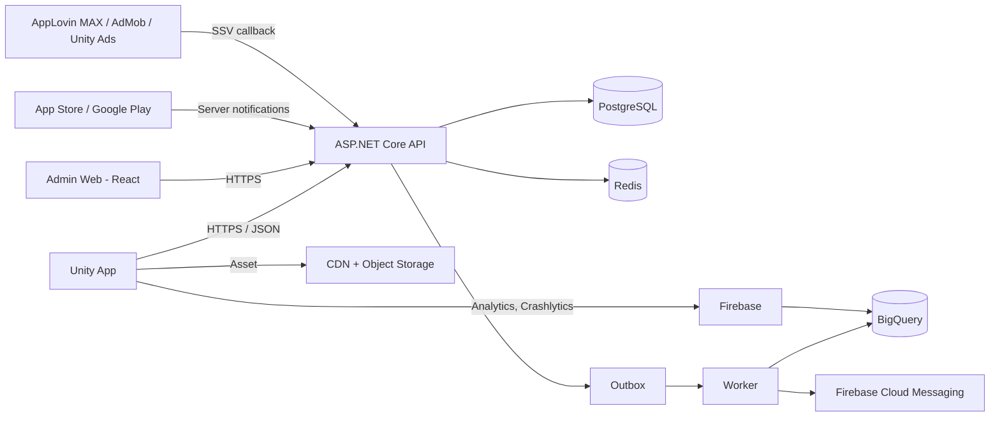

# Đề xuất Tech Stack — ANIMA: Echoes of the Heart

| Thuộc tính | Giá trị |
|---|---|
| Mã tài liệu | TECH-ANIMA-001 |
| Phiên bản | 0.4 — thêm blockchain/NFT cho R2 (CR-002) |
| Ngày | 2026-10-06 |
| Đầu vào | [Master Document](ANIMA_Master_Document.md) v1.1, [BRD](BRD_ANIMA.md) v0.2, [PRD](PRD_ANIMA.md) v0.1 |
| Tóm tắt trong | Master Document mục 9 |
| Trạng thái | Đã chốt client và backend; cloud chưa chốt |

---

## Quyết định đã chốt

| Ngày | Quyết định | Ghi chú |
|---|---|---|
| 2026-10-06 | **Unity cho toàn bộ app** (iOS và Android), không kết hợp Flutter/React Native | T-00 |
| 2026-10-06 | **Backend dùng .NET** (ASP.NET Core, .NET 10 LTS) | T-01 |
| 2026-10-06 | **Cloud chưa chốt**, quyết định sau | T-02, T-03 vẫn mở |
| 2026-10-06 | **Người chơi dùng được cả website** ngoài app mobile (CR-001) | Thêm mục 2.4 |
| 2026-10-06 | **Thẻ là NFT khi rút về ví; commit–reveal; Lò rèn** (CR-002) | Thêm mục 5.1; NFT ở R2 sau gate pháp lý |

Vì chưa chốt cloud, backend được thiết kế **không phụ thuộc nhà cung cấp cloud**: chạy trong container, dùng PostgreSQL và Redis chuẩn, đo lường bằng OpenTelemetry, hạ tầng viết bằng Terraform. Các dịch vụ cloud ở mục 6 chỉ là phương án tham khảo.

## 1. Tóm tắt khuyến nghị

| Lớp | Lựa chọn | Lý do chính |
|---|---|---|
| App mobile | **Unity 6 LTS (C#), URP**, một codebase cho iOS và Android | Mở pack cinematic là giá trị cốt lõi; đã có lộ trình AR/3D và game đối kháng |
| Animation mở pack | Timeline + Cinemachine + DOTween Pro + Shuriken Particle System + Shader Graph | Đạt spec từng frame ở Master Document §4.5 |
| Backend | **ASP.NET Core trên .NET 10 LTS (C#)**, kiến trúc modular monolith | Cùng ngôn ngữ với Unity, dùng chung contract; hiệu năng cao; kiểu dữ liệu chặt cho tiền |
| Cơ sở dữ liệu | **PostgreSQL 17** (ledger, thẻ, chợ) + **Redis** (cooldown, rate limit, leaderboard, realtime) | Giao dịch ACID cho tiền và chuyển thẻ |
| Realtime | SignalR (Redis backplane) | Đấu giá, chat, feed ở R2 |
| Website người chơi | **Next.js + TypeScript**; mở pack bằng bản **Unity Web** nhúng, có chế độ rút gọn | Dùng lại asset/timeline mở pack của app; SSR cho link chia sẻ bộ sưu tập |
| Admin web | React + TypeScript + Vite + Refine + Ant Design | Nhiều màn CRUD, dựng nhanh |
| Frontend monorepo | pnpm workspace + Turborepo: `apps/player`, `apps/admin`, `packages/api-client` (sinh từ OpenAPI), `packages/ui` | Dùng chung client API và design token |
| Thanh toán web | Cổng thanh toán qua lớp adapter (VNPay/MoMo/ZaloPay/Stripe — chờ Q-31) | Chỉ cộng Gem khi nhận IPN đã xác thực |
| Xác thực | Firebase Authentication (email, SĐT OTP, Google, Apple, Facebook) | Có sẵn OTP và social login; backend tự quản lý tài khoản và trạng thái |
| Thanh toán | Unity IAP + xác thực server với App Store Server API và Google Play Developer API | Chống gian lận receipt, idempotency theo transaction ID |
| Quảng cáo | AppLovin MAX (mediation) với AdMob và Unity Ads là network con; bật SSV | Mediation bidding, có callback xác nhận server-side |
| Chống gian lận thiết bị | Play Integrity API (Android), App Attest/DeviceCheck (iOS) | Phát hiện root, emulator, app bị sửa |
| Hạ tầng | **Chưa chốt.** Phương án tham khảo: GCP hoặc AWS, region Singapore (mục 6) | Backend chạy container, chuyển cloud được |
| Analytics | Firebase Analytics → BigQuery | Miễn phí ở quy mô MVP; phân tích cohort, retention, kinh tế |
| Giám sát | Firebase Crashlytics (app), OpenTelemetry → công cụ giám sát của cloud được chọn (backend), Sentry (lỗi backend và admin) | Đo NFR crash rate, uptime, cảnh báo |
| CI/CD | GitHub Actions + GameCI (build Unity) + fastlane (đẩy lên store) | Cùng nơi với repo hiện tại |

---

## 2. App mobile

### 2.1. Vì sao chọn Unity thay vì Flutter/React Native

| Tiêu chí | Unity | Flutter / React Native |
|---|---|---|
| Animation 3D lật thẻ, slow-mo, zoom camera, screen shake | Có sẵn (Timeline, Cinemachine Impulse, `Time.timeScale`) | Phải tự làm hoặc nhúng engine khác |
| Particle 200–300 hạt, shader holographic | Shuriken + Shader Graph, chạy GPU | Hạn chế, tốn công tối ưu |
| AR/3D (R3), game đối kháng (R3) | AR Foundation; vốn là game engine | Phải viết lại hoặc nhúng Unity |
| Màn hình nhiều form (ví, chợ, chat) | Kém tiện hơn, dùng UI Toolkit | Mạnh |
| Screen reader (NFR-09) | Có API Accessibility từ Unity 2023.2, cần làm thêm | Hỗ trợ tốt sẵn |
| Kích thước app (NFR-07 < 200MB) | Đạt được với Addressables tải asset sau | Nhỏ hơn |

Trải nghiệm mở pack là điểm khác biệt, còn các màn form chỉ phụ trợ, nên Unity lợi hơn. Không khuyến nghị kiểu kết hợp Flutter + nhúng Unity: phải duy trì hai runtime, khó debug và app nặng hơn.

### 2.2. Thành phần trong app

| Nhu cầu | Công cụ | Ghi chú |
|---|---|---|
| Render | URP (Universal Render Pipeline) | Có profile chất lượng thấp/trung/cao cho fallback máy yếu |
| UI | UI Toolkit | Bind dữ liệu, style kiểu CSS |
| Timeline mở pack | Unity Timeline + DOTween Pro | Mỗi rarity một Timeline asset; Designer chỉnh không cần code |
| Camera zoom, shake | Cinemachine (Impulse) | Tắt shake khi bật chế độ giảm chuyển động |
| Particle | Shuriken Particle System + object pooling | Không dùng VFX Graph vì cần compute shader, máy Android yếu không hỗ trợ |
| Hiệu ứng thẻ holo/foil | Shader Graph | Có bản tắt cho máy yếu |
| Âm thanh | FMOD Studio (5 layer, sidechain) | Master Document §4.6 đã gợi ý; kiểm tra điều kiện license miễn phí cho studio nhỏ |
| Haptic | Nice Vibrations | Bọc Core Haptics (iOS) và Vibrator/VibrationEffect (Android) |
| Asset theo set thẻ | Addressables + CDN | Giữ bản cài < 200MB; tải art set khi cần |
| Đa ngôn ngữ | Unity Localization | Tiếng Việt, tiếng Anh, gồm Story Fragment |
| Gọi API | HttpClient + contract C# dùng chung với backend | Sinh client từ OpenAPI |
| Cache offline | Lưu JSON mã hóa ở persistent storage | Chỉ xem bộ sưu tập (NFR-10) |
| Quay video chia sẻ (R2) | Plugin ghi màn hình gốc của nền tảng | FR-21 |

### 2.3. Nguyên tắc client

- Client **không bao giờ** quyết định kết quả pack, số dư hay phần thưởng. Client nhận kết quả từ server rồi phát animation (BR-PACK-02).
- Preload toàn bộ asset của lần mở pack trước giai đoạn 0 (Master Document §4.4).
- Chọn profile chất lượng theo GPU/RAM khi khởi động; người dùng chỉnh lại được.

### 2.4. Website người chơi (CR-001)

| Nhu cầu | Giải pháp | Ghi chú |
|---|---|---|
| Framework | Next.js (App Router) + TypeScript | Trang công khai (profile, bộ sưu tập chia sẻ) render phía server cho xem trước link và SEO |
| Đăng nhập | Firebase Authentication Web SDK | Cùng tài khoản với app |
| Gọi API | `packages/api-client` sinh từ OpenAPI của backend | Một nguồn contract cho app, web, admin |
| Mở pack | Bản build Unity Web của riêng scene PackOpening, nhúng qua `react-unity-webgl`, tải lười khi người chơi mở pack lần đầu và được cache | Cùng Timeline/asset với app; cần đo dung lượng tải (mục tiêu < 25MB nén) |
| Chế độ rút gọn | Hiệu ứng lật thẻ bằng CSS/Canvas khi không có WebGL2, máy yếu hoặc bật giảm chuyển động | BR-WEB-06 |
| Thanh toán | Trang thanh toán của cổng (redirect/hosted) + webhook IPN về backend | Không lưu thông tin thẻ; BR-WEB-04 |
| Chống bot | Cloudflare Turnstile hoặc reCAPTCHA cho đăng nhập/nạp; rate limit | Web không có kiểm tra toàn vẹn thiết bị |
| Responsive | Desktop và trình duyệt mobile | |

**Rủi ro kỹ thuật:** Unity Web trên trình duyệt mobile có giới hạn bộ nhớ, đặc biệt Safari iOS. Spike ở Sprint 0 (T009) phải đo dung lượng, thời gian tải và FPS trước khi chốt; nếu không đạt, website dùng chế độ rút gọn làm mặc định trên trình duyệt mobile.

---

## 3. Backend

### 3.1. Vì sao chọn .NET thay vì Node.js/Go

Master Document §8.3 gợi ý Node.js hoặc Go. Đề xuất đổi sang .NET vì:

1. **Cùng ngôn ngữ C# với Unity.** Dùng chung một thư viện contract (DTO, mã lỗi nghiệp vụ, enum rarity, công thức phí) giữa app và server, tránh lệch logic.
2. **Kiểu `decimal` và hệ thống kiểu chặt** giúp các phép tính tiền, phí, làm tròn (BR-MKT-05) ít lỗi.
3. **Hiệu năng ASP.NET Core** đáp ứng 100,000 CCU (NFR-04) với số máy chủ hợp lý.
4. **SignalR có sẵn** cho realtime ở R2.
5. Có `RandomNumberGenerator` (CSPRNG) chuẩn cho NFR-12.

Nên chọn Go hoặc Node.js nếu đội backend hiện có đã thạo một trong hai và không ai biết C#: năng lực đội quan trọng hơn lợi thế dùng chung contract.

### 3.2. Kiến trúc: modular monolith

Một service triển khai, chia module rõ ranh giới. Chưa cần microservices ở giai đoạn MVP với đội nhỏ.

| Module | Trách nhiệm | BRD |
|---|---|---|
| Identity | Tài khoản, thiết bị, trạng thái, xác thực SĐT | EP-01, BR-ACC |
| Wallet | Ledger, nạp IAP, hoàn tiền, đổi Gem→Coin | EP-02, BR-WAL |
| Catalog | Card Definition, set, Pack Definition, version drop rate | EP-10, BR-ADM |
| Gacha | Mua pack, quay kết quả, pity | EP-03/04, BR-PACK |
| Collection | Card Instance, album, tiến độ set | EP-05 |
| Rewards | Điểm danh, ads, nhiệm vụ, referral | EP-07, BR-CHK/ADS/REF |
| Marketplace | Niêm yết, mua, đấu giá, escrow, phí (R2) | EP-06, BR-MKT |
| Social | Feed, follow, chat, leaderboard (R2) | EP-08 |
| Fraud | Chấm điểm thiết bị, quy tắc gắn cờ | BR-FRD |
| Admin | API cho admin web, audit log, maker-checker | EP-10 |

Module chỉ gọi nhau qua interface nội bộ, không truy cập trực tiếp bảng của module khác. Sau này module nào cần scale riêng (thường là Gacha hoặc Marketplace) thì tách ra service riêng.

### 3.3. Thư viện backend

| Nhu cầu | Thư viện |
|---|---|
| Truy cập dữ liệu | EF Core + Npgsql; Dapper cho truy vấn ledger nặng |
| Migration | EF Core Migrations |
| Validation | FluentValidation |
| Tài liệu API, sinh client | OpenAPI (Microsoft.AspNetCore.OpenApi) + NSwag |
| Background job, outbox | Worker service + bảng outbox trong PostgreSQL |
| Realtime (R2) | SignalR + Redis backplane |
| Rate limit | ASP.NET Core Rate Limiting + Redis |
| Đo lường | OpenTelemetry .NET |

---

## 4. Dữ liệu

### 4.1. PostgreSQL — nguồn sự thật

| Yêu cầu BRD | Cách đáp ứng |
|---|---|
| Ledger bất biến (BR-WAL-01) | Bảng `ledger_entries` chỉ INSERT; quyền DB không cho UPDATE/DELETE; số dư là bảng tổng hợp cập nhật trong cùng transaction |
| Không trừ tiền 2 lần (US-03.1) | Ràng buộc UNIQUE trên `idempotency_key` |
| Receipt/SSV không cộng 2 lần (BR-WAL-02, BR-ADS-04) | UNIQUE trên `store_transaction_id`, `ad_transaction_id` |
| Hai người mua cùng một thẻ (SC-MKT-02) | `SELECT ... FOR UPDATE` trên listing, hoặc UPDATE có điều kiện `status = 'Active'` |
| Snapshot drop rate (BR-PACK-04) | Pack Instance lưu `drop_rate_version_id`; bảng version chỉ thêm, không sửa |
| Audit log (BR-ADM-01) | Bảng append-only, tách schema, quyền ghi riêng |
| Ledger khớp số dư (NFR-11) | Job đối soát hằng ngày, cảnh báo khi lệch khác 0 |

### 4.2. Redis — dữ liệu tạm

- Cooldown ads 60 giây, đếm lượt ads/ngày (bản chính vẫn ghi ở PostgreSQL).
- Rate limit API kinh tế (NFR-16).
- Leaderboard bằng sorted set (R2).
- SignalR backplane, cache catalog thẻ.

### 4.3. Analytics

Firebase Analytics xuất sang BigQuery hằng ngày; worker đẩy thêm sự kiện nghiệp vụ từ server (mở pack, giao dịch, thưởng). Dùng cho dashboard Finance (US-09.5), theo dõi tỷ lệ chi phí thưởng/doanh thu ads (BR-ECO-04) và retention (BO-02). Dashboard dùng Looker Studio ở MVP.

---

## 5. Tích hợp bên ngoài

| Tích hợp | Công cụ | Điểm cần lưu ý |
|---|---|---|
| Đăng nhập | Firebase Authentication | iOS bắt buộc có Sign in with Apple nếu có social login khác; backend xác thực Firebase ID token rồi ánh xạ sang tài khoản nội bộ |
| OTP SMS | Firebase Phone Auth | Nếu chi phí SMS tại VN cao, thay bằng nhà cung cấp SMS brandname trong nước |
| IAP | Unity IAP; App Store Server API + App Store Server Notifications V2; Google Play Developer API + Real-time Developer Notifications | Thông báo hoàn tiền dùng cho BR-WAL-04 |
| Quảng cáo | AppLovin MAX SDK; AdMob, Unity Ads làm network con | Bật server-side verification; mức thưởng do server quyết định, không lấy từ client |
| Toàn vẹn thiết bị | Play Integrity API, App Attest/DeviceCheck | Kết quả đưa vào module Fraud (BR-FRD-01) |
| Push notification | Firebase Cloud Messaging | Nhắc điểm danh, đấu giá sắp kết thúc |
| Chia sẻ | Share sheet gốc của iOS/Android | FR-21 |

### 5.1. Blockchain và NFT (CR-002, R2)

| Nhu cầu | Đề xuất | Ghi chú |
|---|---|---|
| Chuỗi | Một EVM L2 phí thấp: **Polygon PoS** hoặc **Base** (T-09) | Ví phổ biến hỗ trợ sẵn; phí mint thấp |
| Smart contract | Solidity + OpenZeppelin (ERC-721, ERC-2981, AccessControl, Pausable) | Audit độc lập trước mainnet |
| Công cụ contract | Foundry (test, fuzz, deploy script) | Thư mục `chain/` |
| Backend gọi chuỗi | Nethereum (.NET) | Cùng ngôn ngữ backend |
| Khóa ký giao dịch | KMS/HSM của cloud được chọn; admin contract dùng multisig (Safe) | Không để private key trong code hay biến môi trường thường |
| Lưu ảnh, metadata | IPFS qua dịch vụ pin + bản sao Arweave | BR-NFT-07 |
| Kết nối ví trên web | wagmi + viem + WalletConnect; Sign-In with Ethereum (EIP-4361) | Chỉ website (BR-NFT-01) |
| KYC | Nhà cung cấp KYC có hỗ trợ giấy tờ Việt Nam (T-10) | ANIMA chỉ lưu kết quả, không lưu ảnh giấy tờ |
| Sàng lọc ví AML | Dịch vụ sàng lọc địa chỉ ví (T-10) | BR-NFT-10 |
| Commit–reveal | HMAC-SHA256 trong .NET (R1), không cần chuỗi; neo Merkle root lên chuỗi ở R2 | SAD mục 8.1 |

---

## 6. Hạ tầng và vận hành

> **Chưa chốt cloud.** Bảng dưới liệt kê dịch vụ tương đương trên GCP và AWS để so sánh khi quyết định. Code backend không gọi trực tiếp dịch vụ riêng của cloud, trừ lớp lưu file và secret được bọc qua interface.

| Thành phần | Yêu cầu | GCP | AWS |
|---|---|---|---|
| API | Container tự scale, hỗ trợ WebSocket, tối thiểu 2 instance | Cloud Run | ECS Fargate + ALB |
| Worker | Job định kỳ: đối soát, kết thúc đấu giá, xuất analytics | Cloud Run Jobs + Cloud Scheduler | ECS Scheduled Tasks / EventBridge |
| PostgreSQL | HA, phục hồi theo thời điểm, RPO ≤ 5 phút, RTO ≤ 1 giờ (NFR-13) | Cloud SQL for PostgreSQL | RDS for PostgreSQL / Aurora |
| Redis | Managed | Memorystore | ElastiCache |
| Asset | Object storage + CDN cho Addressables | Cloud Storage + Cloud CDN | S3 + CloudFront |
| Website người chơi | Next.js cần server render; bản Unity Web là file tĩnh | Cloud Run + Cloud CDN | ECS Fargate + CloudFront |
| Admin web | Host tĩnh, chỉ truy cập nội bộ | Firebase Hosting + IAP | S3 + CloudFront + SSO |
| Secret | Khóa store, khóa SSV, chuỗi kết nối DB | Secret Manager | Secrets Manager |
| WAF, chống DDoS | | Cloud Armor | AWS WAF + Shield |
| Analytics kho dữ liệu | Nhận dữ liệu Firebase Analytics | BigQuery (export có sẵn) | Cần pipeline xuất từ BigQuery hoặc đổi sang công cụ analytics khác |
| Giám sát | Nhận OpenTelemetry | Cloud Monitoring / Cloud Trace | CloudWatch / X-Ray |

Tiêu chí gợi ý khi chọn: chi phí ước tính ở 10,000 DAU, kinh nghiệm của đội DevOps, tín dụng khởi nghiệp nhận được, và yêu cầu lưu dữ liệu trong nước (T-03). Firebase (đăng nhập, analytics, Crashlytics, push) dùng được với cả hai cloud.

| Môi trường | dev, staging, production tách project | Staging dùng sandbox IAP và ad test mode |

**Lưu ý pháp lý:** quy định về lưu trữ dữ liệu người dùng tại Việt Nam có thể yêu cầu đặt một phần dữ liệu trong nước. Cần Legal xác nhận trước khi chốt region Singapore. Câu hỏi này bổ sung vào BRD Q-24.

### 6.1. CI/CD

| Luồng | Công cụ |
|---|---|
| Backend: build, test, scan, deploy | GitHub Actions → container registry → dịch vụ chạy container của cloud được chọn (staging tự động, production cần duyệt) |
| App: build iOS/Android | GitHub Actions + GameCI (cần license Unity); runner macOS cho iOS |
| Đẩy lên store | fastlane → TestFlight, Google Play Internal Testing |
| Website người chơi | GitHub Actions → container Next.js; bản Unity Web build bằng GameCI rồi đẩy lên CDN |
| Admin web | GitHub Actions → host tĩnh của cloud được chọn |
| Hạ tầng | Terraform |

### 6.2. Kiểm thử

| Loại | Công cụ |
|---|---|
| Unit backend | xUnit |
| Integration với DB thật | Testcontainers (PostgreSQL, Redis) |
| Kịch bản BDD trong BRD | Reqnroll (Gherkin cho .NET) |
| Unit/Play mode Unity | Unity Test Framework |
| Hiệu năng animation | Unity Profiler + thiết bị thật theo danh sách chuẩn (Q-27) |
| Tải 100k CCU | k6 |
| Thống kê RNG (NFR-12) | Bài test mô phỏng ≥ 1 triệu lượt quay mỗi version drop rate, chạy trong CI |

---

## 7. Ánh xạ tới NFR

| NFR | Đáp ứng bởi |
|---|---|
| NFR-01 60/120fps | URP + profile chất lượng + pooling particle |
| NFR-02 khởi động < 3s, mở pack < 1s | Addressables, preload, API mở pack chỉ đọc/ghi vài bảng |
| NFR-03 bảo mật | TLS, mã hóa DB managed, dịch vụ quản lý secret, mã hóa cột PII |
| NFR-04 100k CCU | Container auto-scale, Redis, đo bằng k6 |
| NFR-05 99.9% | PostgreSQL HA, API nhiều instance |
| NFR-06 iOS 14+, Android 8+ | Kiểm tra mức hỗ trợ tối thiểu của Unity 6 trước khi chốt (có thể phải nâng iOS tối thiểu) |
| NFR-07 < 200MB | Addressables tải art sau |
| NFR-09 accessibility | Unity Accessibility API + chế độ giảm chuyển động |
| NFR-10 offline | Cache bộ sưu tập mã hóa |
| NFR-11 ledger | Ràng buộc DB + job đối soát |
| NFR-12 RNG | CSPRNG + test thống kê trong CI |
| NFR-14 observability | OpenTelemetry, cảnh báo trên công cụ giám sát của cloud, Crashlytics |

---

## 8. Triển khai theo release

| Thành phần | R1 (MVP) | R2 | R3 |
|---|---|---|---|
| Unity app: tài khoản, ví, pack, bộ sưu tập, điểm danh, ads | ✔ | | |
| Backend modules: Identity, Wallet, Catalog, Gacha, Collection, Rewards, Fraud, Admin | ✔ | | |
| Website người chơi | ✔ (không có điểm danh/ads) | Chợ, đấu giá, profile công khai | |
| Admin web | ✔ | Tranh chấp chợ | |
| Marketplace, đấu giá, SignalR | | ✔ | |
| Social, chat, leaderboard | | ✔ | |
| Battle Pass, AR Foundation, game đối kháng | | | ✔ |

## 9. Đội ngũ tối thiểu cho R1

| Vai trò | Số lượng | Kỹ năng chính |
|---|---|---|
| Unity developer | 2 | C#, UI Toolkit, Timeline, tối ưu mobile |
| Technical artist | 1 | Shader Graph, particle, Timeline |
| Backend developer | 2 | .NET, PostgreSQL, tích hợp IAP/ads |
| Frontend web (website người chơi + admin) | 2 | React, Next.js, TypeScript, nhúng Unity Web |
| DevOps | 1 (bán thời gian) | Cloud được chọn, Terraform, CI cho Unity |
| QA | 1 | Thiết bị thật, kiểm thử kinh tế |

## 10. Điểm cần quyết định

| # | Quyết định | Đề xuất | Người quyết | Trạng thái |
|---|---|---|---|---|
| T-00 | App: Unity toàn bộ hay kết hợp | Unity toàn bộ | PO | **Đã chốt: Unity** (2026-10-06) |
| T-01 | Ngôn ngữ backend: .NET hay Node.js/Go | .NET, trừ khi đội hiện có mạnh Go/Node | Tech Lead | **Đã chốt: .NET** (2026-10-06) |
| T-02 | Cloud: GCP hay AWS | GCP (đi cùng Firebase, BigQuery) | Tech Lead + Finance | Hoãn, quyết định sau |
| T-03 | Region dữ liệu: Singapore hay trong nước | Chờ Legal | Legal | Mở |
| T-04 | Mediation: AppLovin MAX, Unity LevelPlay hay AdMob | AppLovin MAX; thử A/B eCPM sau launch | PO | Mở |
| T-05 | Phiên bản iOS tối thiểu | Theo yêu cầu tối thiểu của Unity 6 | Mobile Lead | Mở |
| T-06 | Mua license Unity/FMOD/DOTween Pro | Kiểm tra điều kiện theo doanh thu dự kiến | PO + Finance | Mở |
| T-07 | Mở pack trên web: Unity Web hay làm lại bằng công nghệ web | Unity Web + chế độ rút gọn; chốt sau spike T009 | Tech Lead | Mở |
| T-08 | Cổng thanh toán web | Chờ Q-31 | PO + Finance | Mở |
| T-09 | Blockchain cho NFT | Polygon PoS hoặc Base; chốt sau gate pháp lý | Tech Lead + PO | Mở |
| T-10 | Nhà cung cấp KYC và sàng lọc ví | So sánh chi phí, hỗ trợ giấy tờ VN | PO + Legal | Mở |

---

*End of Document*
