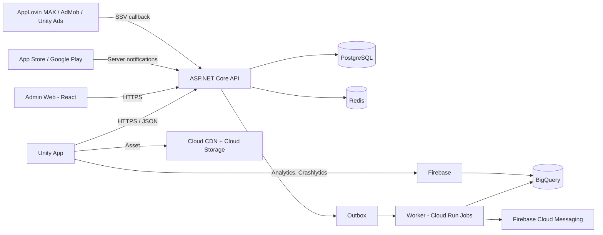

# Đề xuất Tech Stack — ANIMA: Echoes of the Heart

| Thuộc tính | Giá trị |
|---|---|
| Mã tài liệu | TECH-ANIMA-001 |
| Phiên bản | 0.1 (Đề xuất) |
| Ngày | 2026-10-06 |
| Đầu vào | [Master Document](ANIMA_Master_Document.md) v1.0, [BRD](BRD_ANIMA.md) v0.1 |
| Trạng thái | Chờ Tech Lead và PO xác nhận |

---

## 1. Tóm tắt khuyến nghị

| Lớp | Lựa chọn | Lý do chính |
|---|---|---|
| App mobile | **Unity 6 LTS (C#), URP**, một codebase cho iOS và Android | Mở pack cinematic là giá trị cốt lõi; đã có lộ trình AR/3D và game đối kháng |
| Animation mở pack | Timeline + Cinemachine + DOTween Pro + Shuriken Particle System + Shader Graph | Đạt spec từng frame ở Master Document §4.5 |
| Backend | **ASP.NET Core trên .NET 10 LTS (C#)**, kiến trúc modular monolith | Cùng ngôn ngữ với Unity, dùng chung contract; hiệu năng cao; kiểu dữ liệu chặt cho tiền |
| Cơ sở dữ liệu | **PostgreSQL 17** (ledger, thẻ, chợ) + **Redis** (cooldown, rate limit, leaderboard, realtime) | Giao dịch ACID cho tiền và chuyển thẻ |
| Realtime | SignalR (Redis backplane) | Đấu giá, chat, feed ở R2 |
| Admin web | React + TypeScript + Vite + Refine + Ant Design | Nhiều màn CRUD, dựng nhanh |
| Xác thực | Firebase Authentication (email, SĐT OTP, Google, Apple, Facebook) | Có sẵn OTP và social login; backend tự quản lý tài khoản và trạng thái |
| Thanh toán | Unity IAP + xác thực server với App Store Server API và Google Play Developer API | Chống gian lận receipt, idempotency theo transaction ID |
| Quảng cáo | AppLovin MAX (mediation) với AdMob và Unity Ads là network con; bật SSV | Mediation bidding, có callback xác nhận server-side |
| Chống gian lận thiết bị | Play Integrity API (Android), App Attest/DeviceCheck (iOS) | Phát hiện root, emulator, app bị sửa |
| Hạ tầng | **Google Cloud, region asia-southeast1 (Singapore)**: Cloud Run, Cloud SQL, Memorystore, Cloud Storage + Cloud CDN | Gần người dùng VN; tích hợp sẵn Firebase và BigQuery |
| Analytics | Firebase Analytics → BigQuery | Miễn phí ở quy mô MVP; phân tích cohort, retention, kinh tế |
| Giám sát | Firebase Crashlytics (app), OpenTelemetry → Cloud Monitoring/Cloud Trace (backend), Sentry (lỗi backend và admin) | Đo NFR crash rate, uptime, cảnh báo |
| CI/CD | GitHub Actions + GameCI (build Unity) + fastlane (đẩy lên store) | Cùng nơi với repo hiện tại |

---

## 2. App mobile

### 2.1. Vì sao chọn Unity thay vì Flutter/React Native

| Tiêu chí | Unity | Flutter / React Native |
|---|---|---|
| Animation 3D lật thẻ, slow-mo, zoom camera, screen shake | Có sẵn (Timeline, Cinemachine Impulse, `Time.timeScale`) | Phải tự làm hoặc nhúng engine khác |
| Particle 200–300 hạt, shader holographic | Shuriken + Shader Graph, chạy GPU | Hạn chế, tốn công tối ưu |
| AR/3D (R3), game đối kháng (R3) | AR Foundation; vốn là game engine | Phải viết lại hoặc nhúng Unity |
| Màn hình nhiều form (ví, chợ, chat) | Kém tiện hơn, dùng UI Toolkit | Mạnh |
| Screen reader (NFR-09) | Có API Accessibility từ Unity 2023.2, cần làm thêm | Hỗ trợ tốt sẵn |
| Kích thước app (NFR-07 < 200MB) | Đạt được với Addressables tải asset sau | Nhỏ hơn |

Trải nghiệm mở pack là điểm khác biệt, còn các màn form chỉ phụ trợ, nên Unity lợi hơn. Không khuyến nghị kiểu kết hợp Flutter + nhúng Unity: phải duy trì hai runtime, khó debug và app nặng hơn.

### 2.2. Thành phần trong app

| Nhu cầu | Công cụ | Ghi chú |
|---|---|---|
| Render | URP (Universal Render Pipeline) | Có profile chất lượng thấp/trung/cao cho fallback máy yếu |
| UI | UI Toolkit | Bind dữ liệu, style kiểu CSS |
| Timeline mở pack | Unity Timeline + DOTween Pro | Mỗi rarity một Timeline asset; Designer chỉnh không cần code |
| Camera zoom, shake | Cinemachine (Impulse) | Tắt shake khi bật chế độ giảm chuyển động |
| Particle | Shuriken Particle System + object pooling | Không dùng VFX Graph vì cần compute shader, máy Android yếu không hỗ trợ |
| Hiệu ứng thẻ holo/foil | Shader Graph | Có bản tắt cho máy yếu |
| Âm thanh | FMOD Studio (5 layer, sidechain) | Master Document §4.6 đã gợi ý; kiểm tra điều kiện license miễn phí cho studio nhỏ |
| Haptic | Nice Vibrations | Bọc Core Haptics (iOS) và Vibrator/VibrationEffect (Android) |
| Asset theo set thẻ | Addressables + CDN | Giữ bản cài < 200MB; tải art set khi cần |
| Đa ngôn ngữ | Unity Localization | Tiếng Việt, tiếng Anh, gồm Story Fragment |
| Gọi API | HttpClient + contract C# dùng chung với backend | Sinh client từ OpenAPI |
| Cache offline | Lưu JSON mã hóa ở persistent storage | Chỉ xem bộ sưu tập (NFR-10) |
| Quay video chia sẻ (R2) | Plugin ghi màn hình gốc của nền tảng | FR-21 |

### 2.3. Nguyên tắc client

- Client **không bao giờ** quyết định kết quả pack, số dư hay phần thưởng. Client nhận kết quả từ server rồi phát animation (BR-PACK-02).
- Preload toàn bộ asset của lần mở pack trước giai đoạn 0 (Master Document §4.4).
- Chọn profile chất lượng theo GPU/RAM khi khởi động; người dùng chỉnh lại được.

---

## 3. Backend

### 3.1. Vì sao chọn .NET thay vì Node.js/Go

Master Document §8.3 gợi ý Node.js hoặc Go. Đề xuất đổi sang .NET vì:

1. **Cùng ngôn ngữ C# với Unity.** Dùng chung một thư viện contract (DTO, mã lỗi nghiệp vụ, enum rarity, công thức phí) giữa app và server, tránh lệch logic.
2. **Kiểu `decimal` và hệ thống kiểu chặt** giúp các phép tính tiền, phí, làm tròn (BR-MKT-05) ít lỗi.
3. **Hiệu năng ASP.NET Core** đáp ứng 100,000 CCU (NFR-04) với số máy chủ hợp lý.
4. **SignalR có sẵn** cho realtime ở R2.
5. Có `RandomNumberGenerator` (CSPRNG) chuẩn cho NFR-12.

Nên chọn Go hoặc Node.js nếu đội backend hiện có đã thạo một trong hai và không ai biết C#: năng lực đội quan trọng hơn lợi thế dùng chung contract.

### 3.2. Kiến trúc: modular monolith

Một service triển khai, chia module rõ ranh giới. Chưa cần microservices ở giai đoạn MVP với đội nhỏ.

| Module | Trách nhiệm | BRD |
|---|---|---|
| Identity | Tài khoản, thiết bị, trạng thái, xác thực SĐT | EP-01, BR-ACC |
| Wallet | Ledger, nạp IAP, hoàn tiền, đổi Gem→Coin | EP-02, BR-WAL |
| Catalog | Card Definition, set, Pack Definition, version drop rate | EP-10, BR-ADM |
| Gacha | Mua pack, quay kết quả, pity | EP-03/04, BR-PACK |
| Collection | Card Instance, album, tiến độ set | EP-05 |
| Rewards | Điểm danh, ads, nhiệm vụ, referral | EP-07, BR-CHK/ADS/REF |
| Marketplace | Niêm yết, mua, đấu giá, escrow, phí (R2) | EP-06, BR-MKT |
| Social | Feed, follow, chat, leaderboard (R2) | EP-08 |
| Fraud | Chấm điểm thiết bị, quy tắc gắn cờ | BR-FRD |
| Admin | API cho admin web, audit log, maker-checker | EP-10 |

Module chỉ gọi nhau qua interface nội bộ, không truy cập trực tiếp bảng của module khác. Sau này module nào cần scale riêng (thường là Gacha hoặc Marketplace) thì tách ra service riêng.

### 3.3. Thư viện backend

| Nhu cầu | Thư viện |
|---|---|
| Truy cập dữ liệu | EF Core + Npgsql; Dapper cho truy vấn ledger nặng |
| Migration | EF Core Migrations |
| Validation | FluentValidation |
| Tài liệu API, sinh client | OpenAPI (Microsoft.AspNetCore.OpenApi) + NSwag |
| Background job, outbox | Worker service + bảng outbox trong PostgreSQL |
| Realtime (R2) | SignalR + Redis backplane |
| Rate limit | ASP.NET Core Rate Limiting + Redis |
| Đo lường | OpenTelemetry .NET |

---

## 4. Dữ liệu

### 4.1. PostgreSQL — nguồn sự thật

| Yêu cầu BRD | Cách đáp ứng |
|---|---|
| Ledger bất biến (BR-WAL-01) | Bảng `ledger_entries` chỉ INSERT; quyền DB không cho UPDATE/DELETE; số dư là bảng tổng hợp cập nhật trong cùng transaction |
| Không trừ tiền 2 lần (US-03.1) | Ràng buộc UNIQUE trên `idempotency_key` |
| Receipt/SSV không cộng 2 lần (BR-WAL-02, BR-ADS-04) | UNIQUE trên `store_transaction_id`, `ad_transaction_id` |
| Hai người mua cùng một thẻ (SC-MKT-02) | `SELECT ... FOR UPDATE` trên listing, hoặc UPDATE có điều kiện `status = 'Active'` |
| Snapshot drop rate (BR-PACK-04) | Pack Instance lưu `drop_rate_version_id`; bảng version chỉ thêm, không sửa |
| Audit log (BR-ADM-01) | Bảng append-only, tách schema, quyền ghi riêng |
| Ledger khớp số dư (NFR-11) | Job đối soát hằng ngày, cảnh báo khi lệch khác 0 |

### 4.2. Redis — dữ liệu tạm

- Cooldown ads 60 giây, đếm lượt ads/ngày (bản chính vẫn ghi ở PostgreSQL).
- Rate limit API kinh tế (NFR-16).
- Leaderboard bằng sorted set (R2).
- SignalR backplane, cache catalog thẻ.

### 4.3. Analytics

Firebase Analytics xuất sang BigQuery hằng ngày; worker đẩy thêm sự kiện nghiệp vụ từ server (mở pack, giao dịch, thưởng). Dùng cho dashboard Finance (US-09.5), theo dõi tỷ lệ chi phí thưởng/doanh thu ads (BR-ECO-04) và retention (BO-02). Dashboard dùng Looker Studio ở MVP.

---

## 5. Tích hợp bên ngoài

| Tích hợp | Công cụ | Điểm cần lưu ý |
|---|---|---|
| Đăng nhập | Firebase Authentication | iOS bắt buộc có Sign in with Apple nếu có social login khác; backend xác thực Firebase ID token rồi ánh xạ sang tài khoản nội bộ |
| OTP SMS | Firebase Phone Auth | Nếu chi phí SMS tại VN cao, thay bằng nhà cung cấp SMS brandname trong nước |
| IAP | Unity IAP; App Store Server API + App Store Server Notifications V2; Google Play Developer API + Real-time Developer Notifications | Thông báo hoàn tiền dùng cho BR-WAL-04 |
| Quảng cáo | AppLovin MAX SDK; AdMob, Unity Ads làm network con | Bật server-side verification; mức thưởng do server quyết định, không lấy từ client |
| Toàn vẹn thiết bị | Play Integrity API, App Attest/DeviceCheck | Kết quả đưa vào module Fraud (BR-FRD-01) |
| Push notification | Firebase Cloud Messaging | Nhắc điểm danh, đấu giá sắp kết thúc |
| Chia sẻ | Share sheet gốc của iOS/Android | FR-21 |

---

## 6. Hạ tầng và vận hành

| Thành phần | Dịch vụ GCP | Ghi chú |
|---|---|---|
| API | Cloud Run (tự scale, hỗ trợ WebSocket) | Tối thiểu 2 instance để đạt 99.9% |
| Worker | Cloud Run Jobs / Cloud Scheduler | Đối soát, kết thúc đấu giá, xuất BigQuery |
| PostgreSQL | Cloud SQL for PostgreSQL, High Availability, PITR | Hướng tới RPO ≤ 5 phút, RTO ≤ 1 giờ (NFR-13) |
| Redis | Memorystore for Redis | |
| Asset | Cloud Storage + Cloud CDN | Addressables của Unity |
| Admin web | Firebase Hosting | Truy cập qua Identity-Aware Proxy hoặc SSO công ty |
| Secret | Secret Manager | Khóa store, khóa SSV, chuỗi kết nối DB |
| WAF, chống DDoS | Cloud Armor | |
| Môi trường | dev, staging, production tách project | Staging dùng sandbox IAP và ad test mode |

**Lưu ý pháp lý:** quy định về lưu trữ dữ liệu người dùng tại Việt Nam có thể yêu cầu đặt một phần dữ liệu trong nước. Cần Legal xác nhận trước khi chốt region Singapore. Câu hỏi này bổ sung vào BRD Q-24.

### 6.1. CI/CD

| Luồng | Công cụ |
|---|---|
| Backend: build, test, scan, deploy | GitHub Actions → Artifact Registry → Cloud Run (staging tự động, production cần duyệt) |
| App: build iOS/Android | GitHub Actions + GameCI (cần license Unity); runner macOS cho iOS |
| Đẩy lên store | fastlane → TestFlight, Google Play Internal Testing |
| Admin web | GitHub Actions → Firebase Hosting |
| Hạ tầng | Terraform |

### 6.2. Kiểm thử

| Loại | Công cụ |
|---|---|
| Unit backend | xUnit |
| Integration với DB thật | Testcontainers (PostgreSQL, Redis) |
| Kịch bản BDD trong BRD | Reqnroll (Gherkin cho .NET) |
| Unit/Play mode Unity | Unity Test Framework |
| Hiệu năng animation | Unity Profiler + thiết bị thật theo danh sách chuẩn (Q-27) |
| Tải 100k CCU | k6 |
| Thống kê RNG (NFR-12) | Bài test mô phỏng ≥ 1 triệu lượt quay mỗi version drop rate, chạy trong CI |

---

## 7. Ánh xạ tới NFR

| NFR | Đáp ứng bởi |
|---|---|
| NFR-01 60/120fps | URP + profile chất lượng + pooling particle |
| NFR-02 khởi động < 3s, mở pack < 1s | Addressables, preload, API mở pack chỉ đọc/ghi vài bảng |
| NFR-03 bảo mật | TLS, mã hóa Cloud SQL, Secret Manager, mã hóa cột PII |
| NFR-04 100k CCU | Cloud Run auto-scale, Redis, đo bằng k6 |
| NFR-05 99.9% | Cloud SQL HA, Cloud Run nhiều instance |
| NFR-06 iOS 14+, Android 8+ | Kiểm tra mức hỗ trợ tối thiểu của Unity 6 trước khi chốt (có thể phải nâng iOS tối thiểu) |
| NFR-07 < 200MB | Addressables tải art sau |
| NFR-09 accessibility | Unity Accessibility API + chế độ giảm chuyển động |
| NFR-10 offline | Cache bộ sưu tập mã hóa |
| NFR-11 ledger | Ràng buộc DB + job đối soát |
| NFR-12 RNG | CSPRNG + test thống kê trong CI |
| NFR-14 observability | OpenTelemetry, Cloud Monitoring alert, Crashlytics |

---

## 8. Triển khai theo release

| Thành phần | R1 (MVP) | R2 | R3 |
|---|---|---|---|
| Unity app: tài khoản, ví, pack, bộ sưu tập, điểm danh, ads | ✔ | | |
| Backend modules: Identity, Wallet, Catalog, Gacha, Collection, Rewards, Fraud, Admin | ✔ | | |
| Admin web | ✔ | Tranh chấp chợ | |
| Marketplace, đấu giá, SignalR | | ✔ | |
| Social, chat, leaderboard | | ✔ | |
| Battle Pass, AR Foundation, game đối kháng | | | ✔ |

## 9. Đội ngũ tối thiểu cho R1

| Vai trò | Số lượng | Kỹ năng chính |
|---|---|---|
| Unity developer | 2 | C#, UI Toolkit, Timeline, tối ưu mobile |
| Technical artist | 1 | Shader Graph, particle, Timeline |
| Backend developer | 2 | .NET, PostgreSQL, tích hợp IAP/ads |
| Frontend (admin web) | 1 (bán thời gian) | React, TypeScript |
| DevOps | 1 (bán thời gian) | GCP, Terraform, CI cho Unity |
| QA | 1 | Thiết bị thật, kiểm thử kinh tế |

## 10. Điểm cần quyết định

| # | Quyết định | Đề xuất | Người quyết |
|---|---|---|---|
| T-01 | Ngôn ngữ backend: .NET hay Node.js/Go | .NET, trừ khi đội hiện có mạnh Go/Node | Tech Lead |
| T-02 | Cloud: GCP hay AWS | GCP (đi cùng Firebase, BigQuery) | Tech Lead + Finance |
| T-03 | Region dữ liệu: Singapore hay trong nước | Chờ Legal | Legal |
| T-04 | Mediation: AppLovin MAX, Unity LevelPlay hay AdMob | AppLovin MAX; thử A/B eCPM sau launch | PO |
| T-05 | Phiên bản iOS tối thiểu | Theo yêu cầu tối thiểu của Unity 6 | Mobile Lead |
| T-06 | Mua license Unity/FMOD/DOTween Pro | Kiểm tra điều kiện theo doanh thu dự kiến | PO + Finance |

---

*End of Document*
